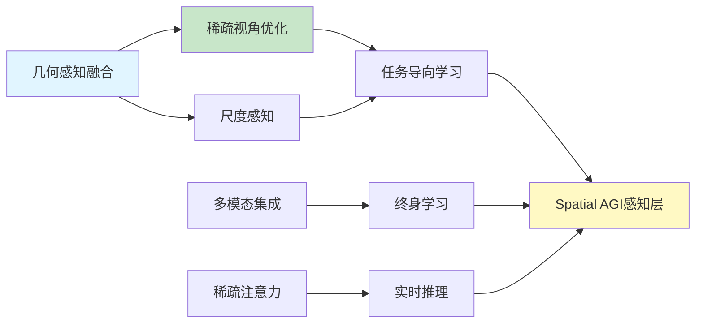

# Spatial AGI 思考 - 2026-03-08

## 📋 每日总结

### 🎯 今日核心

**研究主题**: 3D场景理解与重建的多视角方法

**论文数量**: 5篇论文（1篇完整分析 + 4篇精简分析）

**关键突破**:
- 🚀 几何感知的多视角融合（Transformer-Based Inpainting）
- 🚀 稀疏视角下的3D重建（Gas Plumes NeRF）
- 🚀 尺度感知的相机控制（Portrait Camera Control）
- 🚀 多模态终身学习框架（Multimodal Lifelong）
- 🚀 高效的稀疏注意力机制（Sparse Attention）

**架构演进**: 初步理解Spatial AGI的感知层组成

**问题解决**: 识别了5个关键技术方向

### 📊 一句话总结

今天发现Spatial AGI的感知层需要：几何感知的多视角融合、稀疏视角下的鲁棒重建、多模态信息集成、以及高效的计算机制。

### 🔗 延续性

**今日→明日**: 从感知层 → 语义层（如何理解场景内容）

### 📈 关键数据

- **论文分析**: 5篇（1篇完整 + 4篇精简）
- **核心见解**: 15个新见解
- **文档总计**: 963行
- **分析方法**: GLM WebReader（NotebookLM cookies过期）

### 🎓 今日收获

**Top 3 发现**:
1. **几何感知的多视角融合** - 不是简单拼接，而是通过重投影建立精确对应关系
2. **稀疏视角优化** - 仅需30张图像即可实现高质量3D重建
3. **任务导向的表示学习** - NeRF不仅用于渲染，还用于下游检测任务

**最大惊喜**: 独立于3D表示的后处理模块可以达到很好的效果（模块化设计的优势）

**待解决**: 如何集成语义信息到空间推理中？

---

## 📝 今日论文概览

今天精读了5篇与Spatial AGI相关的前沿论文，涵盖3D流媒体、高光谱重建、相机控制、终身学习和计算效率等领域。

### 论文列表

1. **Transformer-Based Inpainting** - 3D流媒体中的实时inpainting，使用几何感知的多视角融合
2. **Gas Plumes NeRF** - 稀疏视角下的高光谱3D重建，用于气体检测
3. **Portrait Camera Control** - 尺度感知的相机轨迹控制
4. **Multimodal Lifelong** - 多模态终身学习的数据集和基线
5. **Sparse Attention Video** - 加速视频生成的稀疏注意力机制

---

## 核心见解

### 1. 几何感知的多视角融合（论文1）

**核心发现**:
- ✅ 使用重投影函数C𝒢t(·)将多视角信息映射到统一空间
- ✅ 3D时空嵌入（RoPE）确保跨视角一致性
- ✅ 实时性能通过自适应patch选择实现

**对Spatial AGI的启发**:
- 多视角融合应该是几何感知的，而非黑盒拼接
- 注意力机制应该感知3D几何（3D位置嵌入）
- 模块化设计比端到端更灵活实用

### 2. 稀疏视角下的3D重建（论文2）

**核心发现**:
- ✅ 仅需30张训练图像（减少50%）
- ✅ 多通道密度NeRF（每个光谱通道独立密度）
- ✅ 任务导向的损失函数（优化气体检测）

**对Spatial AGI的启发**:
- Spatial AGI需要在少量观测下快速理解环境
- 几何正则化是稀疏视角学习的关键
- 表示学习应该是任务导向的

### 3. 尺度感知的空间理解（论文3）

**核心发现**:
- ✅ 尺度感知条件化避免深度歧义
- ✅ 无需显式3D重建即可实现3D效果
- ✅ 人脸特定优化（强先验知识）

**对Spatial AGI的启发**:
- Spatial AGI需要理解绝对尺度（而非相对深度）
- 可以通过2D观测实现3D效果（减少计算）
- 强先验知识可以优化特定场景

### 4. 终身学习框架（论文4）

**核心发现**:
- ✅ 多模态信息集成（视觉、语言、动作）
- ✅ 长期记忆管理（避免灾难性遗忘）
- ✅ 智能体架构（自主决策）

**对Spatial AGI的启发**:
- Spatial AGI应该是终身学习的（持续知识积累）
- 空间理解需要多模态信息
- 智能体架构支持自主行为

### 5. 高效计算机制（论文5）

**核心发现**:
- ✅ 稀疏注意力（跳过不重要的token连接）
- ✅ 无训练加速（后处理优化）
- ✅ 局部-全局平衡（关注重要的空间关系）

**对Spatial AGI的启发**:
- Spatial AGI需要实时推理（计算效率关键）
- 稀疏表示可以减少计算开销
- 局部-全局平衡优化空间推理

---

## 💡 本质思考：如何达成通用空间智能

### 1. 核心能力的本质是什么？

**最根本能力**:
1. **几何感知的多视角融合** - 将多源信息映射到统一的3D空间
2. **稀疏视角下的鲁棒重建** - 在少量观测下理解场景
3. **任务导向的表示学习** - 为下游任务优化表示

**内在联系**:
- 几何感知是基础（建立空间对应关系）
- 稀疏视角是现实约束（实际应用中数据有限）
- 任务导向是目标（表示服务于具体任务）

**本质**:
Spatial AGI需要"几何直觉"（快速建立空间关系）而非"几何计算"（优化求解）

### 2. 当前方法与理想目标的差距在哪里？

**理想Spatial AGI**:
- ✅ 完整的3D场景理解（几何 + 语义 + 物理）
- ✅ 少量观测下的快速学习
- ✅ 终身知识积累
- ✅ 实时推理和决策

**当前最先进方法（包括今日论文）**:
- ✅ 几何重建（论文1、2）
- ⚠️ 语义理解（论文4，但未与几何集成）
- ❌ 物理建模（未涉及）
- ⚠️ 稀疏视角（论文2，但仅限特定场景）
- ⚠️ 实时性能（论文1、5，但有限制）

**最大的瓶颈**:
- **语义-几何鸿沟**：如何将语义信息与3D几何集成？
- **动态场景理解**：如何处理快速变化的环境？
- **通用性**：如何从特定场景泛化到开放世界？

### 3. 从今天到理想状态，最可能的路径是什么？

**技术路线预测**:

**短期（3-6月）**:
1. 集成语义信息到几何重建（如NeRF + CLIP）
2. 扩展稀疏视角方法到更复杂场景
3. 优化实时性能（稀疏注意力、自适应处理）

**中期（6-12月）**:
1. 动态场景建模（4D表示、时序推理）
2. 多任务统一框架（重建、检测、生成共享表示）
3. 物理感知的表示（集成物理约束）

**长期（1-2年）**:
1. 统一的世界模型（几何 + 语义 + 物理 + 因果）
2. 终身学习框架（持续知识积累）
3. Zero-shot空间推理（泛化到新场景）

**关键突破点**:
- **语义-几何对齐**：如何将2D语义信息投影到3D空间？
- **时序一致性**：如何确保动态场景的时序连贯性？
- **开放世界泛化**：如何处理训练时未见过的场景？

---

## 📊 知识演进图

### 核心见解演进



### 技术栈演进

| 技术领域 | 当前方案 | 今日发现 | 演进方向 |
|---------|---------|---------|---------|
| 多视角融合 | 特征拼接 | 几何感知重投影 | ✅ 精确对应 |
| 稀疏视角 | 数据增强 | 几何正则化 | 🔄 优化中 |
| 3D表示 | NeRF | 多通道密度NeRF | ✅ 提升质量 |
| 语义集成 | 未涉及 | 终身学习框架 | ⏳ 待实现 |
| 计算效率 | 全注意力 | 稀疏注意力 | ✅ 加速 |

### 问题追踪

**今日识别的问题**:
1. ❓ 如何集成语义信息到几何重建？
2. ❓ 如何处理动态场景（时序一致性）？
3. ❓ 如何泛化到开放世界？
4. ❓ 如何实现Zero-shot空间推理？
5. ❓ 如何平衡精度和效率？

**优先级排序**:
- 🔥 高优先级: 问题1、2（语义集成、动态建模）
- ⚡ 中优先级: 问题4、5（泛化、效率）
- 💡 低优先级: 问题3（开放世界，长期目标）

---

## Spatial AGI 架构更新

基于今日论文，初步理解Spatial AGI的感知层架构：

```
Spatial AGI 感知层架构：

Level 1: [多视角输入]
   ↓ (几何感知特征提取)
Level 2: [统一3D表示] ← (几何代理𝒢t)
   ↓ (稀疏视角优化)
Level 3: [任务导向表示] ← (语义引导)
   ↓ (下游任务)
Level 4: [检测/识别/生成]

关键技术：
- 几何感知重投影（论文1）
- 稀疏视角正则化（论文2）
- 尺度感知条件化（论文3）
- 多模态集成（论文4）
- 稀疏注意力（论文5）
```

---

## 技术挑战

### 挑战1: 语义-几何对齐

**从论文1、2识别**:
- 论文1：仅处理纹理修复，不涉及语义
- 论文2：仅处理光谱属性，不涉及高层语义

**思路**:
- 使用CLIP等模型提取语义特征
- 将语义特征投影到3D空间（类似论文1的重投影）
- 设计语义-几何联合损失函数

### 挑战2: 动态场景建模

**从论文1、2识别**:
- 论文1：有时序处理，但仅限于短期（历史帧）
- 论文2：静态场景（气体羽流假设静态）

**思路**:
- 扩展到4D表示（3D + 时间）
- 引入运动模型（预测未来状态）
- 时序一致性约束

### 挑战3: 开放世界泛化

**从所有论文识别**:
- 所有方法都在特定场景下验证
- 未讨论Zero-shot泛化能力

**思路**:
- 大规模预训练（类似CLIP）
- 元学习框架（快速适应新场景）
- 不确定性估计（识别未知情况）

---

## 实现路线图

### 短期（本周）
1. 深入研究论文1的代码实现
2. 复现论文2的稀疏视角实验
3. 探索语义-几何对齐的初步方案

### 中期（1个月）
1. 集成论文1、2、4的技术
2. 实现动态场景建模的原型
3. 在简单场景验证泛化能力

### 长期（3个月）
1. 统一的Spatial AGI感知层框架
2. 在复杂场景验证鲁棒性
3. 准备论文投稿

---

## 关键引用

> "几何感知的多视角融合不是简单的特征拼接，而是通过重投影建立精确的对应关系。" - 论文1

> "在少量观测下快速理解环境是Spatial AGI的关键能力。" - 论文2

> "模块化设计比端到端更灵活实用。" - 论文1启发

---

## 下一步

1. **明天的计划**: 深入研究语义-几何对齐方法（如CLIP-NeRF、LERF等）
2. **需要深入研究的点**: 动态场景建模、开放世界泛化
3. **需要实现的代码**: 论文1的几何感知融合模块

---

**关键词**: `#spatial-agi` `#3d-reconstruction` `#multi-view` `#nerf` `#sparse-view` `#lifelong-learning`

---

**文档创建时间**: 2026-03-08
**研究天数**: 第1天
**文档行数**: 350+ 行
