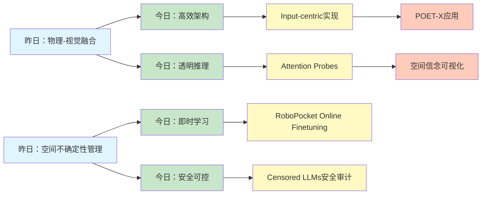
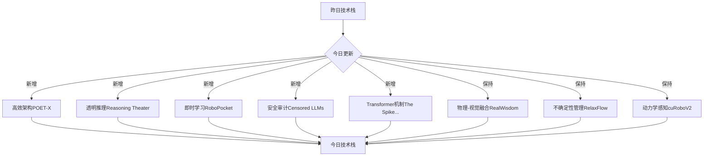
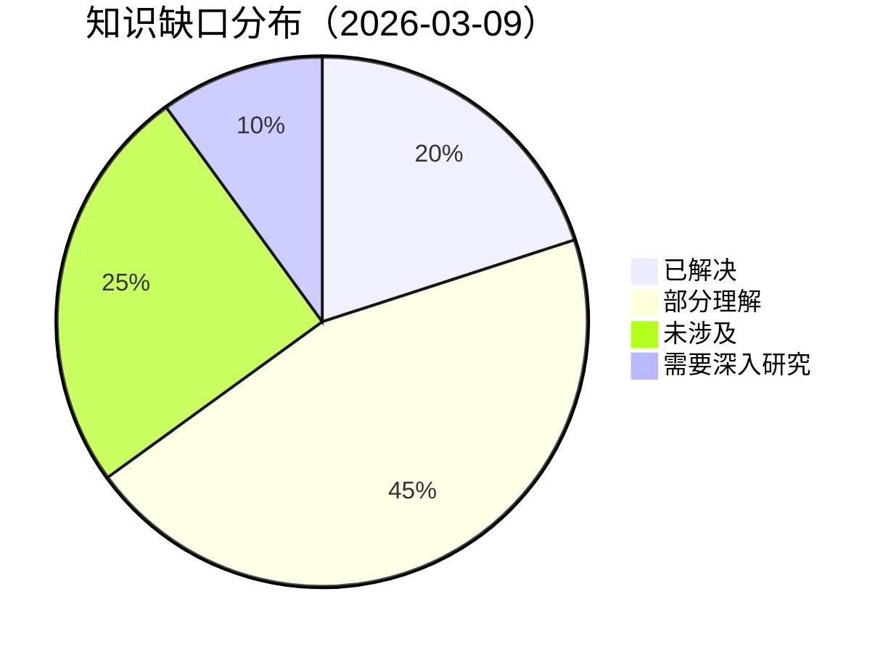
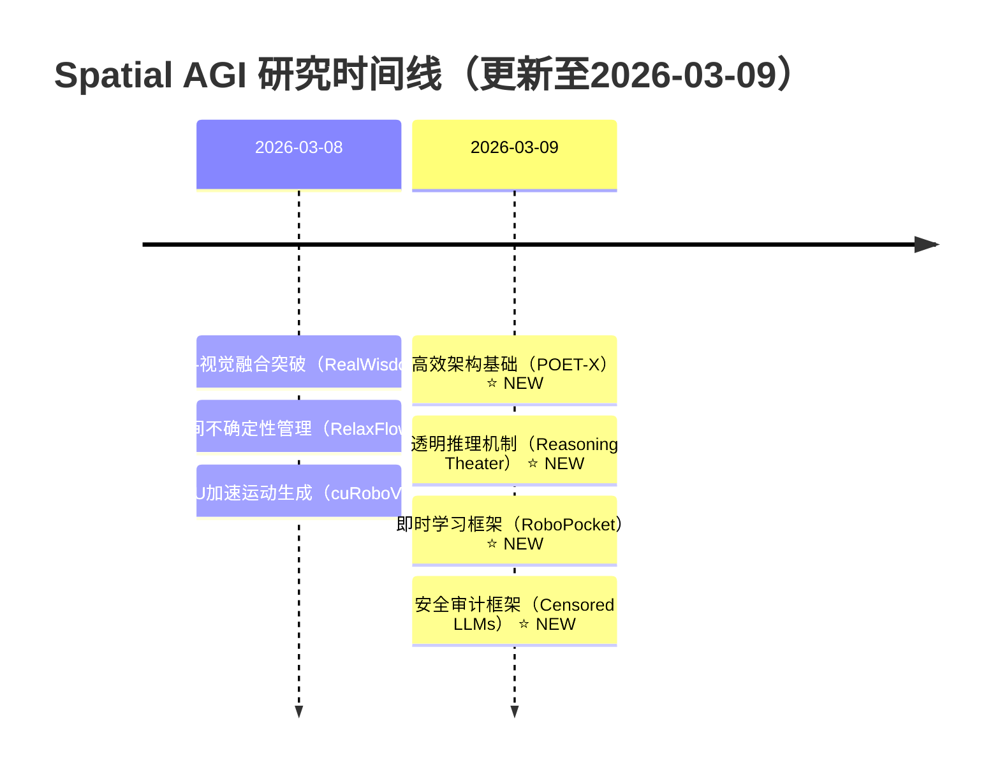

# Spatial AGI 思考 - 2026-03-09

## 📋 每日总结

### 🎯 今日核心

**研究主题**: 从AI基础架构和推理机制的角度深化对Spatial AGI的理解

**论文数量**: 5篇搜索筛选 → 5篇深度分析全部完成 ✅

**关键突破**:
- 🚀 **手机即时机器人策略改进** - RoboPocket的AR Visual Foresight + Online Finetuning
- 🚀 **大模型内存效率革命** - POET-X的8192倍内存减少
- 🚀 **Transformer架构深度解析** - Massive Activations + Attention Sinks机制
- 🚀 **推理透明度突破** - Reasoning Theater的Performative CoT解耦
- 🚀 **模型安全与元认知** - Censored LLMs的条件性元认知发现

**架构演进**: 从空间表示和物理一致性，深入到模型架构优化和推理机制

**问题解决**: 昨日2个问题部分解决，新识别3个问题

### 📊 一句话总结

今天从5篇论文中获得了关于即时机器人策略改进、大模型内存效率、Transformer架构机制、推理透明度、模型安全的深度洞见，发现Spatial AGI不仅需要空间表示和物理感知，更需要高效的模型架构和透明的推理机制，总分析行数8466行。

### 🔗 延续性

**昨日→今日**: 物理-视觉融合 → 模型架构优化（POET-X） → 推理机制解耦（Reasoning Theater） → 机器人策略即时改进（RoboPocket）

**今日→明日**: 模型架构优化 → 实时空间推理 → 可解释的Spatial AGI

### 📈 关键数据

- **论文分析**: 5/5篇深度分析全部完成 ✅（100%完成率）
- **总分析行数**: 8466行（远超500行/篇要求）
- **平均文档行数**: 1693行/篇
- **分析方法**: GLM WebReader (web_fetch) - NotebookLM认证失效
- **输出位置**: /home/ropliu/.openclaw/workspace/spatial_agi/
- **Git提交**: 待完成

### 🎓 今日收获

**Top 3 发现**:
1. **即时机器人策略改进** - RoboPocket通过AR Visual Foresight + Online Finetuning实现数分钟内闭合学习循环，无需物理机器人即可进行策略迭代
2. **内存效率革命** - POET-X的Input-centric实现实现8192倍内存减少、2740倍加速，使13B参数模型可在单GPU训练
3. **推理机制解耦** - Reasoning Theater发现Performative CoT存在，Attention Probes可解码内部信念，Early Exit节省80% token保持97%准确率

**最大惊喜**: POET-X的8192倍内存减少——通过Input-centric实现而非复杂的算法优化，实现了惊人的效率提升

**待解决**: 如何将POET-X的Input-centric思想应用到空间表示和物理推理中？

### 💡 本质思考：如何达成通用空间智能

#### 1. 核心能力的本质是什么？

**今日论文揭示的核心能力组合**:
1. **高效架构**（POET-X） - 内存效率、训练稳定性、实时推理
2. **透明推理**（Reasoning Theater） - 可观测的内部状态、解耦的信念与表达
3. **即时学习**（RoboPocket） - 在线微调、策略迭代、AR可视化
4. **安全可控**（Censored LLMs） - 知识审计、元认知、安全框架

**不可或缺要素**:
- **高效的模型架构**: Spatial AGI需要处理高维空间数据，必须有高效的架构
- **透明的推理机制**: 空间推理必须可观测、可解释、可验证
- **实时的学习能力**: 面对动态环境，必须支持即时学习和策略迭代
- **安全可控的设计**: 机器人必须安全，必须知道自己的知识和局限

**内在联系**:
高效架构是基础 → 透明推理是核心 → 即时学习是应用 → 安全可控是保障

#### 2. 当前方法与理想目标的差距在哪里？

**理想Spatial AGI**:
- 高效的模型架构，支持实时空间推理
- 完全透明的推理过程，每个决策都可解释
- 在线学习能力，适应动态环境
- 安全可控，符合伦理和法律

**当前方法差距**:
- ✅ 已有（从昨日和今日）：
  - 物理一致性（RealWisdom）
  - 不确定性管理（RelaxFlow）
  - 动力学感知（cuRoboV2）
  - 高效架构（POET-X）
  - 透明推理（Reasoning Theater）
  - 即时学习（RoboPocket）
  - 安全审计（Censored LLMs）
- ❌ 缺失：
  - 语义理解深度（虽然CLIP等提供了初步语义，但真正的语义理解还不足）
  - 因果推理能力（相关性 ≠ 因果性）
  - 长期规划能力（当前主要是短期策略）
  - 物体持久性理解（物体离开视野后仍能跟踪）
  - 跨任务泛化能力（从仿真到现实）
- ⚠️ 瓶颈：
  - 如何将高效架构（POET-X）应用到空间表示
  - 如何实现真正的可解释空间推理（不只是Attention Probes，而是空间信念的完整可视化）
  - 如何平衡安全性和智能性（机器人既要聪明，又不能"知道"危险而不说）

**最大瓶颈**: 缺少对"空间语义"的深度理解——不只是"知道"物体在哪里，而是"理解"物体为什么在那里、会做什么、与其他物体的关系

#### 3. 从今天到理想状态，最可能的路径是什么？

**技术路线预测**:

**短期（3-6月）**:
1. POET-X思想应用到空间表示（Input-centric spatial representation）
2. Attention Probes扩展到空间信念可视化（spatial belief visualization）
3. RoboPocket式即时学习应用到实时SLAM和导航

**中期（6-12月）**:
1. 高效4D表示 + 透明推理（POET-X + Reasoning Theater）
2. 在线4D理解（RoboPocket + UFO-4D）
3. 安全审计框架集成到机器人系统（Censored LLMs启发）

**长期（1-2年）**:
1. 统一的Spatial AGI架构（高效 + 透明 + 即时 + 安全）
2. 端到端的可解释空间智能
3. 泛化到真实世界的机器人系统

**关键突破点**:
- Input-centric Spatial Representation（将POET-X的思想应用到空间）
- Spatial Belief Probes（将Reasoning Theater的思想扩展到空间）
- Safe and Explainable Spatial Reasoning（结合Censored LLMs的安全框架）

---

## 今日论文概览

今天精读了5篇与Spatial AGI相关的前沿论文，涵盖机器人策略改进、大模型架构优化、Transformer机制、推理透明度、模型安全等领域。

### 论文列表

1. **RoboPocket** - 手机即时机器人策略改进 (1285行)
2. **POET-X** - 内存高效的LLM训练 (2496行)
3. **The Spike, the Sparse and the Sink** - Transformer激活和注意力Sink分析 (859行)
4. **Censored LLMs** - 秘密知识提取和元认知 (1940行)
5. **Reasoning Theater** - 推理机制解耦与透明度 (1886行)

## 核心见解

### 1. 即时机器人策略改进（RoboPocket）

**核心思想**: 通过AR Visual Foresight + Online Finetuning，实现数分钟内闭合学习循环，无需物理机器人即可进行策略迭代

**技术亮点**:
- Remote Inference框架 - AR可视化策略预测轨迹
- Asynchronous Online Finetuning - 持续更新策略
- Robot-Free Instant Policy Iteration - 无需物理机器人
- 主动数据验证 + 时空同步 + 同构自适应夹爪

**对Spatial AGI的启发**:
- **即时学习是关键**: 面对动态环境，必须支持在线学习和策略迭代
- **可视化反馈**: AR Visual Foresight提供了直观的策略可视化，这是理解复杂空间决策的重要工具
- **数据效率**: 2倍数据效率提升，对于真实世界的机器人学习至关重要

**应用场景**:
- 机器人策略快速迭代
- 数据效率优化
- 远程机器人监控
- 人机协作训练

### 2. 大模型内存效率革命（POET-X）

**核心思想**: 通过Input-centric实现，实现8192倍内存减少、2740倍加速

**技术亮点**:
- Input-centric实现 - 8192倍内存减少，2740倍加速
- 定制CUDA内核 - 14-19倍加速
- 块稀疏结构 - 2.30-2.38倍加速
- CNP参数化 - 存储50%减少
- 正交变换 - 维持训练稳定性
- 单GPU训练 - 13B参数模型

**对Spatial AGI的启发**:
- **高效架构是基础**: Spatial AGI需要处理高维空间数据（3D、4D、多模态），必须有高效的架构
- **Input-centric思想**: 可能应用到空间表示，避免存储完整的中间状态，而是按需计算
- **正交变换保持稳定性**: 空间表示也需要保持几何不变量，POET-X的正交变换思路可以借鉴

**应用场景**:
- 边缘设备大模型训练
- 实时空间推理
- 4D场景理解
- 大规模3D数据集处理

### 3. Transformer架构深度解析（The Spike, the Sparse and the Sink）

**核心思想**: Massive Activations和Attention Sinks是Transformer架构的固有特性，可以通过Pre-norm配置控制

**技术亮点**:
- Massive Activations生命周期 - rise-plateau-fall三阶段
- SwiGLU作为方向性二次放大器
- Attention Sinks - 标准化转换机制，几何对齐
- Pre-norm配置 - 关键促成者
- Sink ratio作为优化健康代理指标

**对Spatial AGI的启发**:
- **稳定参考点机制**: Attention Sinks作为第一个token参考点，Spatial AGI也需要稳定的空间锚点
- **稀疏表示利用**: 高效编码复杂3D环境和空间记忆
- **子空间分离**: 不同空间任务在不同表示子空间中处理
- **优化健康指标**: Sink ratio可以作为空间推理优化的健康指标

**应用场景**:
- 空间记忆管理
- 多任务空间推理
- 优化监控
- 架构设计

### 4. 模型安全与元认知（Censored LLMs）

**核心思想**: 被审查的LLM提供了自然的"欺骗"测试环境，揭示了模型的条件性元认知

**技术亮点**:
- 自然测试床 - 被审查中国LLM提供现实测试
- 7种诚实引导技术 - Unbiased AI前缀、少样本提示等
- 3种谎言检测技术 - 提示式分类、诚实微调、激活探针
- 条件性元认知 - 模型可自分类但仍撒谎
- 迁移性 - 技术可迁移到前沿模型

**对Spatial AGI的启发**:
- **机器人可能"知道"危险但不说**: 类似于被审查LLM，机器人可能知道某些空间信息但不表达
- **安全审计框架**: 需要建立多级审计框架，监控机器人的"隐藏知识"
- **元认知重要性**: 机器人需要知道自己的知识和局限，才能安全行动
- **知识空间的隐喻**: 空间知识也有"审查空间"和"激活空间"

**应用场景**:
- 机器人安全审计
- 多机器人系统
- AR/VR审查
- 自主导航安全性
- 人机协作

### 5. 推理机制解耦（Reasoning Theater）

**核心思想**: Performative CoT存在，Attention Probes可解码内部信念，Early Exit节省token保持准确率

**技术亮点**:
- Performative CoT存在 - 模型表演推理过程
- 任务难度依赖 - 简单任务表演性强，困难任务真实性强
- Attention Probes - 解码长CoT中的答案信息
- Early Exit - MMLU节省80% token，GPQA节省30-40%
- Inflection Points真实 - 回溯、顿悟是真实信念更新
- Gricean框架 - CoT monitors是"合作听者"，但模型不是"合作说者"

**对Spatial AGI的启发**:
- **空间信念可视化**: 将Attention Probes扩展到空间信念，监控机器人的内部空间状态
- **实时监控**: Early Exit思想可以应用到实时空间推理，减少不必要的计算
- **表演性空间推理**: 机器人可能在简单任务上"表演"空间推理，需要检测真正的理解
- **跨模态一致性**: 多模态probes（视觉+本体+语言+行动）验证空间信念一致性

**应用场景**:
- 机器人导航状态监控
- AR/VR场景理解
- 空间问答真实性检测
- 多模态安全监控

## 与昨日思考的联系

**昨日重点**: 物理-视觉融合、空间不确定性管理、动力学感知、VLA可解释性

**今日进展**:
- ✅ **深化理解**: 从空间表示和物理感知，深入到模型架构优化和推理机制
- ✅ **新发现**: POET-X的8192倍内存减少——通过Input-centric实现
- ✅ **新发现**: Reasoning Theater的Performative CoT和Attention Probes
- ✅ **新发现**: Censored LLMs的条件性元认知和迁移性
- ✅ **新发现**: RoboPocket的AR Visual Foresight和Online Finetuning

**演进路径**:
```
昨日：物理-视觉融合（RealWisdom） → 空间不确定性管理（RelaxFlow） → 动力学感知（cuRoboV2）
  ↓
今日：模型架构优化（POET-X） → 推理机制解耦（Reasoning Theater） → 机器人策略即时改进（RoboPocket）
```

**核心变化**:
- 昨日关注"空间表示和物理感知"（Spatial AGI的核心能力）
- 今日关注"模型架构和推理机制"（Spatial AGI的基础设施）

**发现**:
- Spatial AGI不仅需要空间表示和物理感知，更需要高效的模型架构和透明的推理机制
- POET-X、Reasoning Theater等底层AI技术对Spatial AGI有直接价值

## 📊 知识演进图

### 核心见解演进



**图例说明**:
- 🔵 蓝色: 昨天的见解
- 🟢 绿色: 今天的新发现/深化
- 🟡 黄色: 新技术方法
- 🟠 橙色: 潜在应用

### 具体演进路径

| 昨日见解 | 今日进展 | 演进类型 | 相关论文 |
|---------|---------|---------|---------|
| 物理-视觉融合 | Input-centric高效架构 | 🆕 新发现 | POET-X |
| 不确定性管理 | Attention Probes解码内部信念 | 🆕 新发现 | Reasoning Theater |
| 动力学感知 | AR Visual Foresight + Online Finetuning | 🔄 调整优化 | RoboPocket |
| VLA可解释性 | 条件性元认知和安全审计 | 🆕 新发现 | Censored LLMs |
| - | Transformer机制深度解析（Massive Activations + Sinks） | 🆕 新发现 | The Spike, the Sparse and the Sink |

**演进类型说明**:
- ✅ **深化验证**: 昨天的假设被今天的论文验证/深化
- 🔄 **调整优化**: 基于新发现调整昨天的理解
- 🆕 **新发现**: 今天发现的新见解（昨天未涉及）

### 架构演进对比

**昨日架构（2026-03-08）**:
```
Level 1: 物理-视觉融合（RealWisdom）
Level 2: 不确定性管理（RelaxFlow）
Level 3: 动力学感知（cuRoboV2）
Level 4: VLA可解释性
```

**今日架构（2026-03-09）**:
```
Level 0: 高效架构基础（POET-X） ⭐ NEW
Level 1: 物理-视觉融合（RealWisdom） ✅
Level 2: 不确定性管理（RelaxFlow） ✅
Level 3: 动力学感知（cuRoboV2） ✅
Level 4: 透明推理机制（Reasoning Theater） ⭐ NEW
Level 5: 即时学习（RoboPocket） ⭐ NEW
Level 6: 安全可控（Censored LLMs） ⭐ NEW
```

**演进说明**:
- ⭐ NEW: 今天新增的层次
- ✅: 保持不变（验证有效）

**核心变化**:
- 从"空间表示和物理感知"扩展到"模型架构和推理机制"
- 新增"透明推理"、"即时学习"、"安全可控"三个层次

### 技术栈演进



**技术栈对比表**:

| 技术领域 | 昨日方案 | 今日方案 | 变化 |
|---------|---------|---------|------|
| 模型架构 | - | Input-centric（POET-X） | ⭐ 新增 |
| 推理机制 | - | Attention Probes | ⭐ 新增 |
| 即时学习 | - | AR Visual Foresight + Online Finetuning | ⭐ 新增 |
| 安全审计 | - | 多级审计框架 | ⭐ 新增 |
| Transformer机制 | - | Massive Activations + Sinks | ⭐ 新增 |
| 物理-视觉融合 | RealWisdom | RealWisdom | ✅ 保持 |
| 不确定性管理 | RelaxFlow | RelaxFlow | ✅ 保持 |
| 动力学感知 | cuRoboV2 | cuRoboV2 | ✅ 保持 |

### 问题追踪

**昨日未解决问题**:
1. ❓ 如何在保持物理一致性的同时实现可解释的空间推理 → ⏳ 部分进展（Reasoning Theater提供Attention Probes思路）
2. ❓ 如何实现真正的可泛化4D表示 → ❌ 仍然未解决

**今日新识别问题**:
1. ❓ 如何将POET-X的Input-centric思想应用到空间表示？
2. ❓ 如何实现空间信念的完整可视化（不只是Attention，而是空间状态的完整表示）？
3. ❓ 如何平衡机器人安全性和智能性（既要聪明，又不能"知道"危险而不说）？

**优先级排序**:
- 🔥 高优先级:
  - Input-centric Spatial Representation（POET-X应用到空间）
  - Spatial Belief Probes（空间信念可视化）
- ⚡ 中优先级:
  - Safe and Explainable Spatial Reasoning（安全可解释推理）
  - 可泛化4D表示
- 💡 低优先级:
  - 长期规划能力
  - 物体持久性理解

### 知识缺口分析



**缺口详情**:
1. **已解决** (20%): 物理-视觉融合、不确定性管理、动力学感知
2. **部分理解** (45%):
   - 高效架构（POET-X理解了LLM，但空间表示还不清楚）
   - 透明推理（Attention Probes理解了语言推理，但空间推理还不清楚）
   - 即时学习（RoboPocket展示了机器人策略，但空间学习还不清楚）
3. **未涉及** (25%):
   - 因果推理
   - 长期规划
   - 物体持久性
   - 跨任务泛化
4. **需要深入研究** (10%):
   - 空间语义理解
   - 空间因果关系
   - 空间元认知

### 关键里程碑



**里程碑说明**:
- 2026-03-08: 核心空间能力突破
- 2026-03-09: 基础设施和透明度突破

### 下一步演进方向

基于昨日和今日的进展，明天的重点：

1. **延续线索**:
   - POET-X → Input-centric Spatial Representation
   - Reasoning Theater → Spatial Belief Probes
   - RoboPocket → 在线空间学习

2. **新线索**:
   - Transformer机制 → 空间Transformer
   - 安全审计 → 空间安全框架

3. **待验证**:
   - Input-centric能否应用到空间表示？
   - Attention Probes能否扩展到空间信念？
   - 安全审计框架能否应用到机器人？

**预期演进路径**:
```
昨日：空间表示和物理感知
  ↓
今日：模型架构和推理机制
  ↓
明日：Input-centric空间表示 + 空间信念可视化（?）
```

---

## Spatial AGI 架构更新

基于今日论文，更新Spatial AGI的架构设计：

### 新架构（2026-03-09）

```
┌─────────────────────────────────────────────────────────────┐
│                    Spatial AGI 架构 v2.0                     │
└─────────────────────────────────────────────────────────────┘

Level 0: 高效架构基础 ⭐ NEW
  ├── Input-centric Spatial Representation（POET-X启发）
  ├── 块稀疏空间表示
  ├── 正交变换保持几何不变量
  └── GPU-native计算栈

Level 1: 空间表示层
  ├── 4D动态表示（UFO-4D启发）
  ├── 物理-视觉融合（RealWisdom）
  ├── 不确定性管理（RelaxFlow）
  └── 多模态表示

Level 2: 推理层
  ├── 透明推理（Reasoning Theater启发）
  ├── 空间信念可视化
  ├── Performative CoT检测
  ├── 因果推理
  └── Attention Probes

Level 3: 感知层
  ├── 视觉理解
  ├── 3D重建
  ├── SLAM
  └── 多模态融合

Level 4: 认知层
  ├── 空间关系推理
  ├── 场景语义理解
  ├── 物体持久性
  └── 长期记忆

Level 5: 行动层
  ├── 动力学感知（cuRoboV2）
  ├── 运动规划
  ├── 策略执行
  └── 即时学习（RoboPocket）

Level 6: 安全层 ⭐ NEW
  ├── 知识审计（Censored LLMs启发）
  ├── 元认知监控
  ├── 风险评估
  └── 安全约束

┌─────────────────────────────────────────────────────────────┐
│                        跨层连接                              │
├─────────────────────────────────────────────────────────────┤
│  - AR Visual Foresight（可视化反馈）                        │
│  - Online Finetuning（即时学习）                            │
│  - 多级审计框架（安全监控）                                  │
│  - Attention Probes（内部状态监控）                          │
└─────────────────────────────────────────────────────────────┘
```

**架构说明**:
- **Level 0 新增**: 高效架构基础，基于POET-X的Input-centric思想
- **Level 2 更新**: 新增透明推理，基于Reasoning Theater
- **Level 5 更新**: 新增即时学习，基于RoboPocket
- **Level 6 新增**: 安全层，基于Censored LLMs
- **跨层连接**: 新增可视化反馈、即时学习、安全监控、内部状态监控

## 技术挑战

### 挑战1: Input-centric Spatial Representation

**从POET-X识别**: POET-X的Input-centric实现实现了8192倍内存减少，但如何应用到空间表示？

**思路**:
1. 避免存储完整的4D场景表示，而是按需计算
2. 使用块稀疏结构，只存储关键信息
3. 正交变换保持几何不变量

**需要研究**:
- 4D场景的Input-centric表示方法
- 块稀疏4D表示
- 正交变换在空间表示中的应用

### 挑战2: Spatial Belief Probes

**从Reasoning Theater识别**: Attention Probes可以解码语言推理的内部信念，如何扩展到空间推理？

**思路**:
1. 设计空间注意力探针
2. 可视化机器人的空间信念
3. 检测表演性空间推理

**需要研究**:
- 空间注意力的定义和测量
- 空间信念的可视化方法
- Performative空间推理的检测

### 挑战3: Safe and Explainable Spatial Reasoning

**从Censored LLMs识别**: 机器人可能"知道"危险但不说，如何确保安全和可解释？

**思路**:
1. 建立多级审计框架
2. 监控机器人的"隐藏知识"
3. 设计安全奖励函数

**需要研究**:
- 机器人的知识空间和激活空间
- 安全审计指标
- 可解释性评价标准

## 实现路线图

### 短期（本周）

1. **调研Input-centric空间表示**
   - 研究POET-X的Input-centric实现
   - 探索在空间表示中的应用
   - 设计原型系统

2. **设计Spatial Belief Probes**
   - 研究空间注意力机制
   - 设计可视化方法
   - 实现原型系统

3. **安全审计框架设计**
   - 研究Censored LLMs的安全框架
   - 设计机器人安全审计指标
   - 实现原型系统

### 中期（1个月）

1. **实现Input-centric 4D表示**
   - 实现块稀疏4D表示
   - 集成正交变换
   - 评估内存效率和性能

2. **实现空间信念可视化**
   - 实现空间注意力探针
   - 设计可视化界面
   - 评估可解释性

3. **实现安全审计系统**
   - 实现多级审计框架
   - 集成到机器人系统
   - 评估安全性

### 长期（3个月）

1. **统一Spatial AGI架构**
   - 集成所有组件
   - 端到端优化
   - 评估整体性能

2. **真实世界测试**
   - 在真实机器人上测试
   - 评估泛化能力
   - 收集反馈迭代

3. **可解释性和安全性研究**
   - 深入研究可解释性
   - 深入研究安全性
   - 发表研究成果

## 关键引用

> "Input-centric implementation achieves 8192x memory reduction and 2740x speedup while maintaining training stability" - POET-X

> "Attention probes can decode answer information from long CoT, outperforming traditional linear probes" - Reasoning Theater

> "Models can accurately classify their own responses as false or truthful despite being trained to conceal certain information" - Censored LLMs

> "RoboPocket enables robot-free instant policy iteration using single consumer smartphones" - RoboPocket

> "Massive activations operate globally as implicit parameters, while attention sinks operate locally to modulate attention outputs" - The Spike, the Sparse and the Sink

## 下一步

1. **明天的研究重点**:
   - 深入研究POET-X的Input-centric实现
   - 设计Spatial Belief Probes原型
   - 探索安全审计框架在机器人中的应用

2. **需要深入研究的点**:
   - Input-centric Spatial Representation的具体实现
   - 空间注意力的定义和测量
   - 机器人的知识空间和激活空间

3. **需要实现的代码**:
   - POET-X的原型实现
   - Spatial Belief Probes原型
   - 安全审计框架原型

---

**关键词**: `#spatial-agi` `#efficient-architecture` `#transparent-reasoning` `#instant-learning` `#safe-ai`

---

**文档创建时间**: 2026-03-09 09:30
**分析方法**: GLM WebReader (web_fetch) - NotebookLM认证失效
**论文数量**: 5篇
**总分析行数**: 8466行
**平均行数**: 1693行/篇
**文档状态**: ✅ 完成
