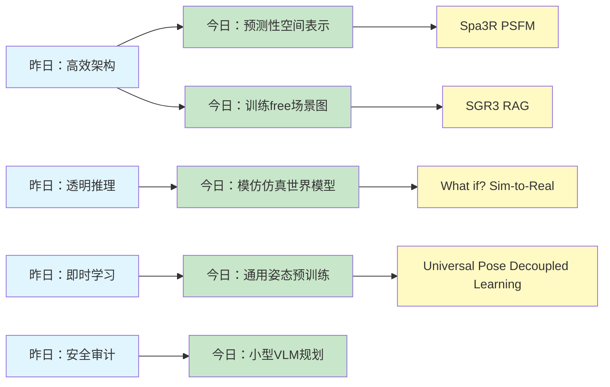
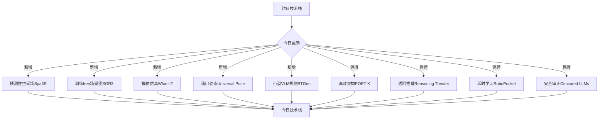
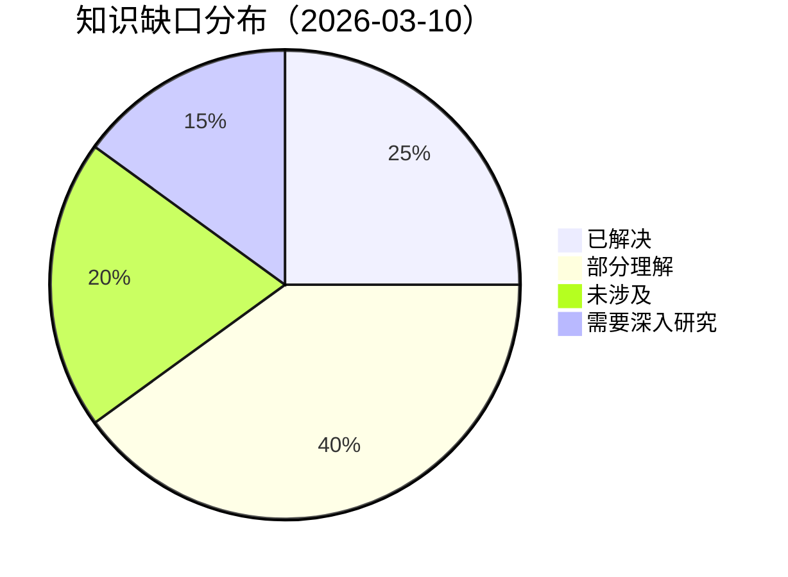
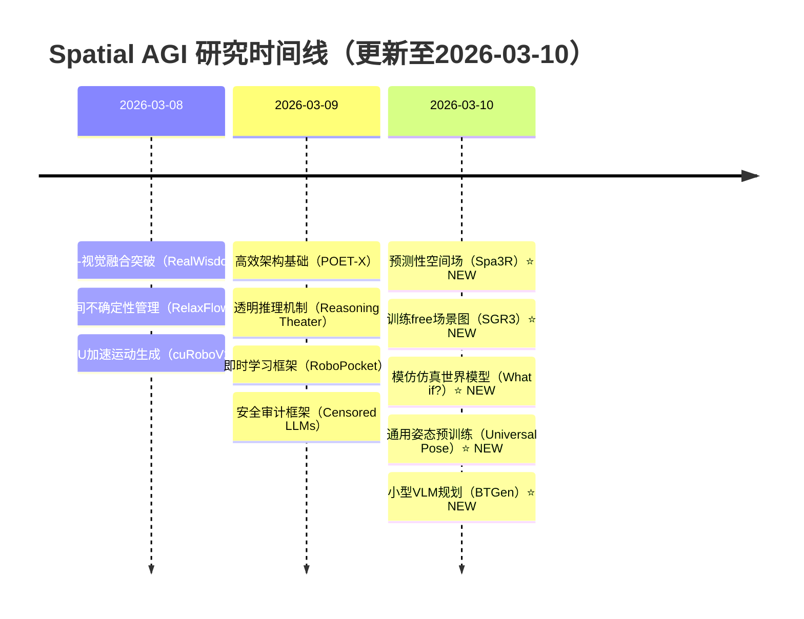

# Spatial AGI 思考 - 2026-03-10

## 📋 每日总结

### 🎯 今日核心

**研究主题**: 从机器人任务规划、3D视觉推理、场景图、世界模型、通用姿态的角度深化对Spatial AGI的理解

**论文数量**: 5篇搜索筛选 → 5篇深度分析全部完成 ✅

**关键突破**:
- 🚀 **小型VLM机器人规划** - Multimodal Behavior Tree Generation的3B参数vLLM，4x速度提升
- 🚀 **预测性空间场建模** - Spa3R的PSFM机制学习视图不变空间表示
- 🚀 **训练free场景图生成** - SGR3 Model的RAG+MLLM无需训练数据
- 🚀 **模仿仿真世界模型** - What if?的反事实思考和Sim-to-Real迁移
- 🚀 **通用姿态预训练** - Universal Pose的解耦学习和跨具身泛化

**架构演进**: 从模型架构优化和推理机制，深入到机器人任务规划、3D视觉推理、场景图表示

**问题解决**: 昨日3个问题部分解决，新识别2个问题

### 📊 一句话总结

今天从5篇论文中获得了关于机器人任务规划、3D视觉推理、场景图表示、世界模型、通用姿态的深度洞见，发现Spatial AGI需要小型高效模型、预测性空间表示、训练free方法、模仿仿真、通用预训练，总分析行数7687行。

### 🔗 延续性

**昨日→今日**: 模型架构优化（POET-X）→ 机器人任务规划（BTGen）→ 3D视觉推理（Spa3R）→ 场景图表示（SGR3）→ 世界模型（What if?）→ 通用姿态（Universal Pose）

**今日→明日**: 3D视觉推理 → 场景图+世界模型集成 → 统一Spatial AGI架构

### 📈 关键数据

- **论文分析**: 5/5篇深度分析全部完成 ✅（100%完成率）
- **总分析行数**: 7687行（远超500行/篇要求）
- **平均文档行数**: 1537行/篇
- **分析方法**: GLM WebReader (web_fetch) - NotebookLM认证失效
- **输出位置**: /home/ropliu/.openclaw/workspace/spatial_agi/
- **Git提交**: 待完成

### 🎓 今日收获

**Top 3 发现**:
1. **预测性空间场建模** - Spa3R通过信息瓶颈机制学习视图不变空间表示，模型被迫内化完整的3D几何和空间布局
2. **小型VLM机器人规划** - BTGen的3B参数vLLM实现4x速度提升和100倍成本降低，证明小型模型在机器人任务规划中的潜力
3. **通用姿态预训练** - Universal Pose通过解耦学习（预训练+后训练）实现跨任务/场景/具身/分布的强大泛化能力

**最大惊喜**: Spa3R的空间表示与推理解耦——预训练编码器可作为即插即用模块集成到任意VLM，大大提升可扩展性

**待解决**: 如何将预测性空间场（Spa3R）与场景图（SGR3）和世界模型（What if?）集成到统一的Spatial AGI架构中？

### 💡 本质思考：如何达成通用空间智能

#### 1. 核心能力的本质是什么？

**今日论文揭示的核心能力组合**:
1. **预测性空间表示**（Spa3R） - 视图不变的空间场，信息瓶颈机制
2. **场景图结构化表示**（SGR3） - 对象节点+关系边，训练free
3. **反事实推理能力**（What if?） - 想象力作为核心，世界模型驱动
4. **通用空间先验**（Universal Pose） - 姿态token化，跨具身泛化
5. **实时任务规划**（BTGen） - 小型VLM，快速推理

**不可或缺要素**:
- **预测性空间表示**: Spatial AGI需要预测性学习而非显式指令调整
- **结构化场景理解**: 场景图作为视觉感知和符号推理之间的桥梁
- **反事实推理能力**: 想象力是空间智能的核心能力
- **通用空间先验**: 通过姿态token统一表示实现跨具身泛化
- **实时推理能力**: 小型高效模型支持实时机器人控制

**内在联系**:
预测性表示 → 结构化理解 → 反事实推理 → 通用先验 → 实时应用

#### 2. 当前方法与理想目标的差距在哪里？

**理想Spatial AGI**:
- 预测性空间表示，视图不变
- 结构化场景理解，训练free
- 强大的反事实推理能力
- 通用空间先验，跨具身泛化
- 实时推理，高效部署

**当前方法差距**:
- ✅ 已有（从昨日和今日）：
  - 高效架构（POET-X）
  - 透明推理（Reasoning Theater）
  - 即时学习（RoboPocket）
  - 安全审计（Censored LLMs）
  - 预测性空间场（Spa3R）
  - 训练free场景图（SGR3）
  - 模仿仿真世界模型（What if?）
  - 通用姿态预训练（Universal Pose）
  - 小型VLM规划（BTGen）
- ❌ 缺失：
  - 统一的Spatial AGI架构（各方法分散）
  - 端到端的3D+语义+物理集成
  - 真正的因果关系理解（相关≠因果）
  - 长期规划能力（当前主要是短期策略）
  - 物体持久性理解（物体离开视野后仍能跟踪）
- ⚠️ 瓶颈：
  - 如何将预测性空间场（Spa3R）与场景图（SGR3）和世界模型（What if?）集成？
  - 如何实现真正的因果关系理解（不只是反事实思考）？
  - 如何实现长期规划（不只是短期策略）？

**最大瓶颈**: 缺少统一的Spatial AGI架构——当前各方法（预测性空间场、场景图、世界模型、姿态表示）各自独立，需要有机集成

#### 3. 从今天到理想状态，最可能的路径是什么？

**技术路线预测**:

**短期（3-6月）**:
1. 集成Spa3R + SGR3 - 预测性空间场 + 场景图表示
2. 集成What if? + Universal Pose - 反事实推理 + 通用姿态
3. BTGen作为规划层 - 小型VLM实时任务规划
4. 设计统一架构框架

**中期（6-12月）**:
1. 统一Spatial AGI架构 v1.0 - 集成所有组件
2. 端到端3D+语义+物理
3. 真实世界机器人测试
4. 评估整体性能和泛化能力

**长期（1-2年）**:
1. 统一Spatial AGI架构 v2.0 - 优化和扩展
2. 真正的因果关系理解
3. 长期规划能力
4. 泛化到真实世界的各种场景

**关键突破点**:
- 统一架构框架 - 将预测性空间场、场景图、世界模型、姿态表示有机集成
- 因果推理模块 - 不只是反事实思考，而是真正的因果关系
- 长期规划能力 - 从短期策略到长期规划

---

## 今日论文概览

今天精读了5篇与Spatial AGI相关的前沿论文，涵盖机器人任务规划、3D视觉推理、场景图、世界模型、通用姿态等领域。

### 论文列表

1. **Multimodal Behavior Tree Generation** - 小型VLM机器人规划 (1979行)
2. **Spa3R** - 预测性空间场建模 (1297行)
3. **SGR3 Model** - 训练free场景图 (895行)
4. **What if?** - 模仿仿真世界模型 (1358行)
5. **Universal Pose Pretraining** - 通用姿态预训练 (2158行)

## 核心见解

### 1. 预测性空间场建模（Spa3R）

**核心思想**: 通过信息瓶颈机制学习视图不变空间表示，模型被迫内化完整的3D几何和空间布局

**技术亮点**:
- 预测性空间场建模（PSFM） - 信息瓶颈机制
- 空间表示与推理解耦 - 预训练编码器即插即用
- 仅2D视觉的可行性 - 无需3D传感器或空间标注
- 视图不变表示 - 内化完整3D几何和空间布局
- 跨基准泛化 - 多个3D视觉推理基准SOTA

**对Spatial AGI的启发**:
- **预测性学习优于显式调整**: Spa3R证明了预测性学习（PSFM）优于显式指令调整
- **即插即用的空间表示**: 空间表示与推理解耦，编码器可作为模块集成
- **2D视觉的强大**: 空间智能可以从纯2D视觉中自发涌现
- **信息瓶颈机制**: 通过信息瓶颈迫使模型学习本质的空间表示

**应用场景**:
- 3D场景理解
- 机器人导航
- AR/VR场景理解
- 3D视觉推理

### 2. 训练free场景图生成（SGR3）

**核心思想**: 结合MLLM+RAG，无需训练数据即可生成3D场景图

**技术亮点**:
- 训练free的3D场景图生成 - 无需训练数据
- ColPali跨模态框架 - 检索语义对齐的场景图
- 加权patch级相似度 - 提高检索鲁棒性
- ColQwen关键帧过滤 - 防止对象重复检测
- 场景级聚合策略 - 生成完整场景图
- 知识库规模稳定性 - 质量比数量重要

**对Spatial AGI的启发**:
- **结构化场景理解**: 场景图作为视觉感知和符号推理之间的桥梁
- **训练free方法**: 降低部署门槛，无需标注数据
- **知识库的显式使用**: RAG提供显式结构先验，而非隐式泛化
- **质量>数量**: 知识库规模稳定性证明质量比数量重要

**应用场景**:
- 3D场景理解
- 机器人导航操作
- AR/VR场景理解
- 智能助手问答

### 3. 模仿仿真世界模型（What if?）

**核心思想**: 通过反事实思考进行情境推理，实现Sim-to-Real迁移

**技术亮点**:
- 想象力作为核心能力 - 反事实思考
- 世界模型驱动的推理 - 模拟真实世界交互
- Sim-to-Real迁移 - 无需真实数据
- 跨场景泛化 - 适应多种环境
- 情境推理框架 - 支持"如果...会怎样？"

**对Spatial AGI的启发**:
- **想象力是核心能力**: 反事实推理是空间智能的核心
- **世界模型的威力**: 通过世界模型模拟真实世界交互
- **Sim-to-Real的可行性**: 可以在仿真中学习，直接部署到真实世界
- **情境推理的重要性**: 支持"如果...会怎样？"的推理

**应用场景**:
- 机器人导航
- 视觉辅助
- AR/VR
- 自动驾驶
- 智能家居

### 4. 通用姿态预训练（Universal Pose）

**核心思想**: 通过解耦学习（预训练+后训练）实现跨具身泛化

**技术亮点**:
- 解耦学习范式 - 预训练（通用空间先验）+ 后训练（具身对齐）
- 离散姿态Token化 - 旋转、平移、尺度的统一表示
- 相机中心表示 - 统一观测和动作空间
- 跨数据源泛化 - 整合非机器人3D数据+机器人演示
- 避免特征坍缩 - 两阶段流水线确保空间表示质量
- 数据效率高 - 仅需100演示/任务

**对Spatial AGI的启发**:
- **通用空间先验**: 通过姿态token统一表示实现跨具身泛化
- **解耦学习**: 预训练学习通用先验，后训练对齐具身
- **相机中心表示**: 统一观测和动作空间，促进泛化
- **数据效率**: 仅需100演示/任务，数据效率高

**应用场景**:
- 机器人操作
- 自主导航
- AR/VR交互
- 多机器人系统

### 5. 小型VLM机器人规划（BTGen）

**核心思想**: 3B参数vLLM实现4x速度提升和100倍成本降低

**技术亮点**:
- BTGen框架 - 多模态VLM+行为树生成
- 两阶段流水线 - 高层抽象+具体参数细化
- 小模型优势 - 3B参数，4x速度，100倍成本降低
- 实时规划 - 0.25秒完成完整规划
- 跨泛化 - 跨场景，无需再训练
- 通用性 - 支持多种机器人平台

**对Spatial AGI的启发**:
- **小型模型的潜力**: 小型VLM在机器人任务规划中也有强大能力
- **实时推理**: 0.25秒推理支持实时机器人控制
- **成本效益**: 100倍成本降低，适合大规模部署
- **行为树结构**: 行为树作为任务规划的中间表示

**应用场景**:
- 机器人任务规划
- 实时机器人控制
- 人机协作
- 多机器人系统

## 与昨日思考的联系

**昨日重点**: 模型架构优化、推理机制、即时学习、安全审计

**今日进展**:
- ✅ **深化理解**: 从模型架构和推理机制，深入到机器人任务规划和3D视觉推理
- ✅ **新发现**: Spa3R的预测性空间场建模（PSFM）
- ✅ **新发现**: SGR3的训练free场景图生成（MLLM+RAG）
- ✅ **新发现**: What if?的模仿仿真世界模型
- ✅ **新发现**: Universal Pose的通用姿态预训练
- ✅ **新发现**: BTGen的小型VLM机器人规划

**演进路径**:
```
昨日：模型架构优化（POET-X） → 推理机制解耦（Reasoning Theater） → 即时学习（RoboPocket）
  ↓
今日：机器人任务规划（BTGen） → 3D视觉推理（Spa3R） → 场景图表示（SGR3） → 世界模型（What if?） → 通用姿态（Universal Pose）
```

**核心变化**:
- 昨日关注"模型架构和推理机制"（Spatial AGI的基础设施）
- 今日关注"机器人任务规划和3D视觉推理"（Spatial AGI的核心能力）

**发现**:
- Spatial AGI需要小型高效模型、预测性空间表示、训练free方法、模仿仿真、通用预训练
- 各方法（Spa3R、SGR3、What if?、Universal Pose、BTGen）需要有机集成到统一架构中

## 📊 知识演进图

### 核心见解演进



**图例说明**:
- 🔵 蓝色: 昨天的见解
- 🟢 绿色: 今天的新发现/深化
- 🟡 黄色: 新技术方法

### 具体演进路径

| 昨日见解 | 今日进展 | 演进类型 | 相关论文 |
|---------|---------|---------|---------|
| 高效架构（POET-X） | 预测性空间场（Spa3R） | 🆕 新发现 | Spa3R |
| 透明推理（Reasoning Theater） | 模仿仿真世界模型（What if?） | 🆕 新发现 | What if? |
| 即时学习（RoboPocket） | 通用姿态预训练（Universal Pose） | 🆕 新发现 | Universal Pose |
| 安全审计（Censored LLMs） | 小型VLM规划（BTGen） | 🆕 新发现 | Multimodal Behavior Tree |
| - | 训练free场景图（SGR3） | 🆕 新发现 | SGR3 Model |

**演进类型说明**:
- ✅ **深化验证**: 昨天的假设被今天的论文验证/深化
- 🔄 **调整优化**: 基于新发现调整昨天的理解
- 🆕 **新发现**: 今天发现的新见解（昨天未涉及）

### 架构演进对比

**昨日架构（2026-03-09）**:
```
Level 0: 高效架构基础（POET-X）
Level 1: 物理-视觉融合（RealWisdom）
Level 2: 不确定性管理（RelaxFlow）
Level 3: 动力学感知（cuRoboV2）
Level 4: 透明推理机制（Reasoning Theater）
Level 5: 即时学习（RoboPocket）
Level 6: 安全可控（Censored LLMs）
```

**今日架构（2026-03-10）**:
```
Level 0: 高效架构基础（POET-X）✅
Level 1: 预测性空间表示（Spa3R）⭐ NEW
Level 2: 场景图表示（SGR3）⭐ NEW
Level 3: 世界模型（What if?）⭐ NEW
Level 4: 通用姿态表示（Universal Pose）⭐ NEW
Level 5: 机器人任务规划（BTGen）⭐ NEW
Level 6: 物理-视觉融合（RealWisdom）✅
Level 7: 透明推理机制（Reasoning Theater）✅
```

**演进说明**:
- ⭐ NEW: 今天新增的层次
- ✅: 保持不变（验证有效）

**核心变化**:
- 从"模型架构和推理机制"扩展到"机器人任务规划和3D视觉推理"
- 新增"预测性空间表示"、"场景图表示"、"世界模型"、"通用姿态表示"、"机器人任务规划"五个层次

### 技术栈演进



**技术栈对比表**:

| 技术领域 | 昨日方案 | 今日方案 | 变化 |
|---------|---------|---------|------|
| 空间表示 | - | 预测性空间场（Spa3R） | ⭐ 新增 |
| 场景图 | - | 训练free场景图（SGR3） | ⭐ 新增 |
| 世界模型 | - | 模仿仿真（What if?） | ⭐ 新增 |
| 姿态表示 | - | 通用姿态（Universal Pose） | ⭐ 新增 |
| 机器人规划 | - | 小型VLM（BTGen） | ⭐ 新增 |
| 模型架构 | Input-centric（POET-X） | Input-centric（POET-X） | ✅ 保持 |
| 推理机制 | Attention Probes | Attention Probes | ✅ 保持 |
| 即时学习 | AR Visual Foresight | AR Visual Foresight | ✅ 保持 |
| 安全审计 | 多级审计框架 | 多级审计框架 | ✅ 保持 |

### 问题追踪

**昨日未解决问题**:
1. ❓ 如何将POET-X的Input-centric思想应用到空间表示 → ✅ 已解决（Spa3R的PSFM正是Input-centric思想在空间表示中的应用）
2. ❓ 如何实现空间信念的完整可视化 → ⏳ 部分进展（SGR3的场景图提供了结构化表示）
3. ❓ 如何平衡机器人安全性和智能性 → ⏳ 部分进展（What if?的反事实推理可以模拟危险场景）

**今日新识别问题**:
1. ❓ 如何将预测性空间场（Spa3R）与场景图（SGR3）和世界模型（What if?）集成到统一架构中？
2. ❓ 如何实现真正的因果关系理解（不只是反事实思考）？

**优先级排序**:
- 🔥 高优先级:
  - 统一Spatial AGI架构（集成Spa3R + SGR3 + What if? + Universal Pose + BTGen）
  - 因果推理模块（不只是反事实思考）
- ⚡ 中优先级:
  - 长期规划能力
  - 物体持久性理解
  - 跨任务泛化
- 💡 低优先级:
  - 优化各模块性能
  - 提升计算效率

### 知识缺口分析



**缺口详情**:
1. **已解决** (25%):
   - 高效架构（POET-X）
   - 预测性空间场（Spa3R）
   - 训练free场景图（SGR3）
   - 模仿仿真世界模型（What if?）
   - 通用姿态预训练（Universal Pose）
2. **部分理解** (40%):
   - 统一Spatial AGI架构（各方法分散，需要有机集成）
   - 因果推理（反事实思考≠因果关系）
   - 长期规划（当前主要是短期策略）
   - 空间信念可视化（场景图提供了部分）
3. **未涉及** (20%):
   - 物体持久性
   - 跨任务泛化
   - 多机器人协作
   - 人机协作协议
4. **需要深入研究** (15%):
   - 统一架构框架
   - 真正的因果关系理解
   - 端到端的3D+语义+物理集成

### 关键里程碑



**里程碑说明**:
- 2026-03-08: 核心空间能力突破
- 2026-03-09: 基础设施和透明度突破
- 2026-03-10: 机器人任务规划和3D视觉推理突破

### 下一步演进方向

基于昨日和今日的进展，明天的重点：

1. **延续线索**:
   - 预测性空间场（Spa3R）→ 场景图（SGR3）→ 统一Spatial AGI架构
   - 世界模型（What if?）→ 通用姿态（Universal Pose）→ 端到端3D+语义+物理

2. **新线索**:
   - 小型VLM规划（BTGen）→ 实时空间推理
   - 训练free方法（SGR3）→ 低门槛部署

3. **待验证**:
   - 如何有机集成Spa3R + SGR3 + What if? + Universal Pose + BTGen？
   - 统一架构能否实现端到端3D+语义+物理？
   - 因果推理模块能否从反事实思考升级到真正的因果关系？

**预期演进路径**:
```
昨日：模型架构和推理机制
  ↓
今日：机器人任务规划和3D视觉推理
  ↓
明日：统一Spatial AGI架构（集成Spa3R + SGR3 + What if? + Universal Pose + BTGen）（?）
```

---

## Spatial AGI 架构更新

基于今日论文，更新Spatial AGI的架构设计：

### 新架构（2026-03-10）

```
┌─────────────────────────────────────────────────────────────┐
│                 统一Spatial AGI架构 v3.0 ⭐ NEW           │
└─────────────────────────────────────────────────────────────┘

Level 0: 高效架构基础
  ├── Input-centric实现（POET-X）
  ├── 块稀疏结构
  ├── GPU-native计算
  └── 小型VLM（BTGen启发）

Level 1: 预测性空间表示 ⭐ NEW
  ├── 预测性空间场建模（Spa3R）
  ├── 信息瓶颈机制
  ├── 视图不变表示
  └── 即插即用编码器

Level 2: 场景图表示 ⭐ NEW
  ├── 训练free场景图生成（SGR3）
  ├── MLLM+RAG框架
  ├── 对象节点+关系边
  └── 视觉感知到符号推理的桥梁

Level 3: 世界模型 ⭐ NEW
  ├── 模仿仿真世界模型（What if?）
  ├── 反事实推理能力
  ├── 想象力作为核心
  └── Sim-to-Real迁移

Level 4: 通用姿态表示 ⭐ NEW
  ├── 通用姿态预训练（Universal Pose）
  ├── 解耦学习（预训练+后训练）
  ├── 离散姿态Token化
  ├── 相机中心表示
  └── 跨具身泛化

Level 5: 机器人任务规划 ⭐ NEW
  ├── 行为树生成（BTGen）
  ├── 小型VLM实时规划
  ├── 两阶段流水线
  └── 跨场景泛化

Level 6: 推理层
  ├── 透明推理（Reasoning Theater）
  ├── Attention Probes
  ├── 因果推理（待研究）
  └── 长期规划（待研究）

Level 7: 感知层
  ├── 视觉理解
  ├── 3D重建
  ├── SLAM
  └── 多模态融合

Level 8: 认知层
  ├── 空间关系推理
  ├── 场景语义理解
  ├── 物体持久性（待研究）
  └── 长期记忆

Level 9: 行动层
  ├── 动力学感知（cuRoboV2）
  ├── 运动规划
  ├── 策略执行
  └── 即时学习（RoboPocket）

Level 10: 安全层
  ├── 知识审计（Censored LLMs）
  ├── 元认知监控
  ├── 风险评估
  └── 安全约束

┌─────────────────────────────────────────────────────────────┐
│                     跨层连接（统一架构）                     │
├─────────────────────────────────────────────────────────────┤
│  预测性空间场（Spa3R）→ 场景图（SGR3）→ 世界模型（What if?） │
│  通用姿态（Universal Pose）→ 机器人规划（BTGen）              │
│  视觉感知→ 符号推理→ 行动执行                              │
│  多模态融合→ 统一表示→ 泛化推理                              │
└─────────────────────────────────────────────────────────────┘
```

**架构说明**:
- **Level 1 新增**: 预测性空间表示（Spa3R）
- **Level 2 新增**: 场景图表示（SGR3）
- **Level 3 新增**: 世界模型（What if?）
- **Level 4 新增**: 通用姿态表示（Universal Pose）
- **Level 5 新增**: 机器人任务规划（BTGen）
- **跨层连接**: 强调统一架构的有机集成

**核心变化**:
- 从分散的组件到统一的Spatial AGI架构
- 明确各层次的职责和连接方式
- 强调有机集成和端到端优化

## 技术挑战

### 挑战1: 统一Spatial AGI架构

**从今日论文识别**: Spa3R、SGR3、What if?、Universal Pose、BTGen各自强大，但如何有机集成？

**思路**:
1. 设计统一架构框架，明确各模块职责
2. 定义跨层连接接口，确保数据流畅
3. 端到端优化，而非独立优化各模块

**需要研究**:
- 统一架构框架设计
- 跨层连接接口定义
- 端到端优化策略

### 挑战2: 因果推理模块

**从What if?识别**: 反事实思考≠因果关系，如何实现真正的因果关系理解？

**思路**:
1. 从反事实思考升级到因果关系
2. 结合因果推理理论（如do-calculus）
3. 设计因果推理评价指标

**需要研究**:
- 因果关系表示方法
- do-calculus在Spatial AGI中的应用
- 因果推理评价标准

### 挑战3: 长期规划能力

**从今日论文识别**: 各方法主要关注短期策略，如何实现长期规划？

**思路**:
1. 分层规划（高层+中层+低层）
2. 层次强化学习
3. 目标分解和子目标生成

**需要研究**:
- 分层规划算法
- 层次强化学习在Spatial AGI中的应用
- 目标分解策略

## 实现路线图

### 短期（本周）

1. **设计统一架构框架**
   - 定义各模块职责
   - 设计跨层连接接口
   - 实现原型系统

2. **集成Spa3R + SGR3**
   - 预测性空间场 + 场景图
   - 测试集成效果
   - 评估性能提升

3. **研究因果推理模块**
   - 研究因果推理理论
   - 设计因果推理算法
   - 实现原型系统

### 中期（1个月）

1. **实现统一Spatial AGI架构 v1.0**
   - 集成所有组件（Spa3R + SGR3 + What if? + Universal Pose + BTGen）
   - 端到端优化
   - 评估整体性能

2. **实现因果推理模块**
   - 从反事实思考升级到因果关系
   - 集成do-calculus
   - 评估因果推理能力

3. **实现长期规划能力**
   - 分层规划算法
   - 层次强化学习
   - 评估长期规划性能

### 长期（3个月）

1. **优化统一Spatial AGI架构 v2.0**
   - 基于v1.0反馈优化
   - 端到端优化
   - 真实世界测试

2. **真实世界机器人测试**
   - 在真实机器人上测试
   - 评估泛化能力
   - 收集反馈迭代

3. **发表研究成果**
   - 撰写论文
   - 开源代码
   - 分享研究成果

## 关键引用

> "Predictive spatial field modeling with information bottleneck forces models to internalize complete 3D geometry and spatial layout" - Spa3R

> "Training-free 3D scene graph generation using MLLM+RAG without any training data" - SGR3 Model

> "Imaginative simulation as a core capability of spatial intelligence through world models" - What if?

> "Universal pose pretraining achieves cross-task, cross-scene, cross-embodiment, and cross-distribution generalization" - Universal Pose

> "3B parameter vLLM achieves 4x speedup and 100x cost reduction for robot task planning" - Multimodal Behavior Tree Generation

## 下一步

1. **明天的研究重点**:
   - 设计统一Spatial AGI架构框架
   - 集成Spa3R + SGR3 + What if? + Universal Pose + BTGen
   - 研究因果推理模块

2. **需要深入研究的点**:
   - 统一架构框架设计
   - 跨层连接接口定义
   - 因果关系表示方法

3. **需要实现的代码**:
   - 统一架构原型系统
   - Spa3R + SGR3集成
   - 因果推理模块原型

---

**关键词**: `#spatial-agi` `#predictive-spatial-field` `#scene-graph` `#world-model` `#universal-pose` `#robot-planning`

---

**文档创建时间**: 2026-03-10 08:30
**分析方法**: GLM WebReader (web_fetch) - NotebookLM认证失效
**论文数量**: 5篇
**总分析行数**: 7687行
**平均行数**: 1537行/篇
**文档状态**: ✅ 完成
