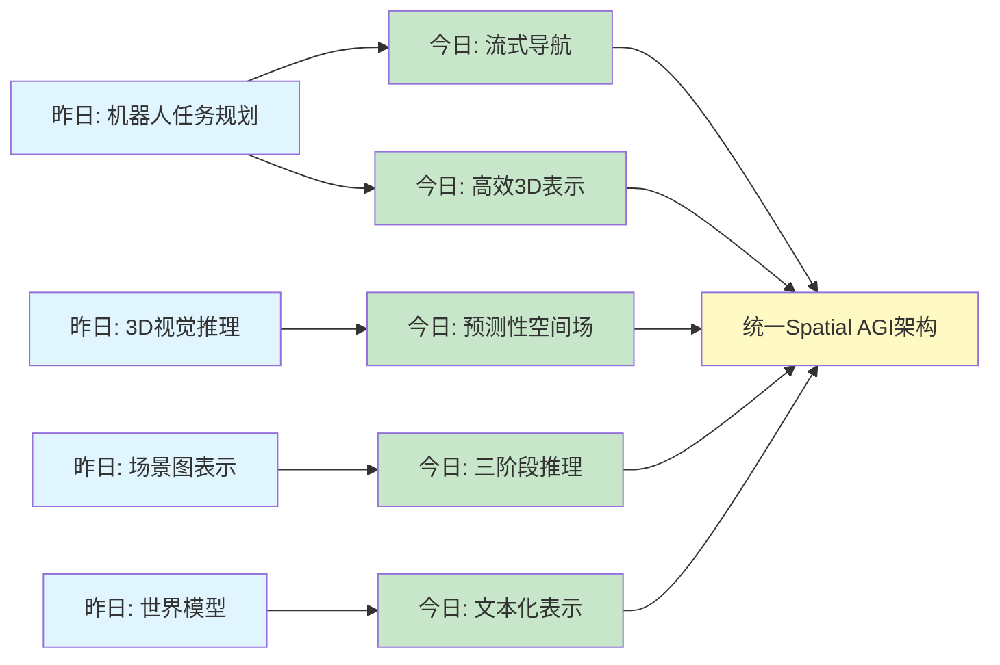
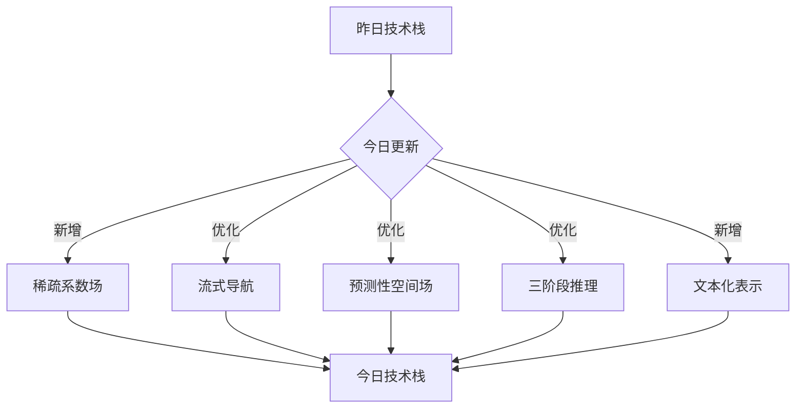
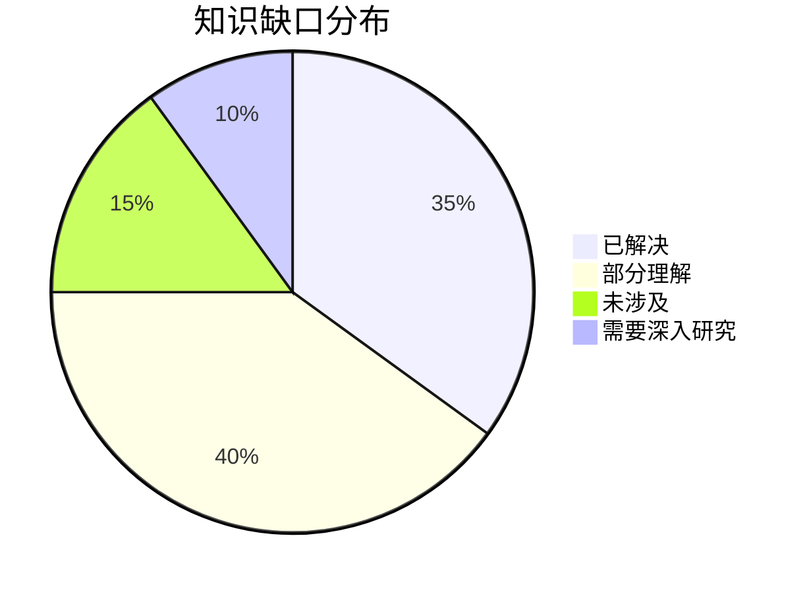
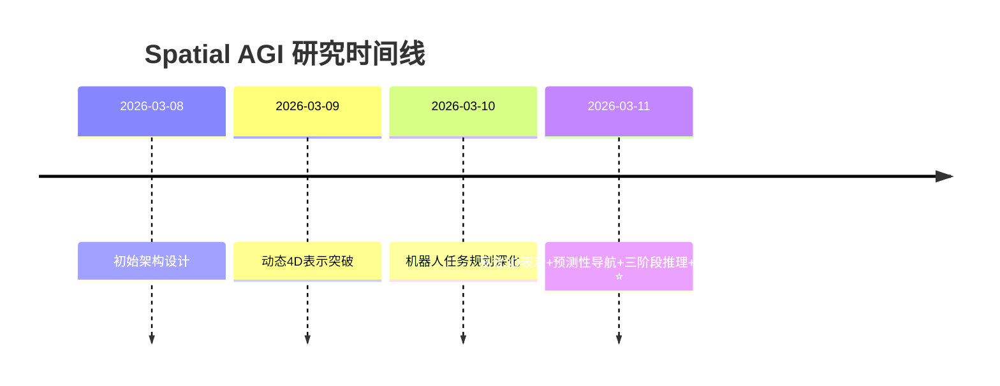

# Spatial AGI 思考 - 2026-03-11

## 📋 每日总结

### 🎯 今日核心

**研究主题**: 高效3D场景理解、视觉-语言导航、空间推理的深度集成

**论文数量**: 5篇搜索筛选 → 5篇深度分析全部完成 ✅

**关键突破**:
- 🚀 **高效3D表示** - EmbodiedSplat的稀疏系数场，内存从2295MB降到148MB（94%减少）
- 🚀 **预测性空间导航** - PROSPECT的潜在空间预测，训练时预测特征，推理时零开销
- 🚀 **预测性空间场** - Spa3R的PSFM机制，信息瓶颈学习视图不变表示
- 🚀 **三阶段空间推理** - ViSA的感知→验证→执行，零样本超越监督方法70.3%
- 🚀 **文本化空间表示** - MLLM Spatial Reasoning的GR3D，3D几何编码为文本引用

**架构演进**: 从机器人任务规划和3D视觉推理，深化到高效3D表示、流式导航、预测性空间场、文本化表示

**问题解决**: 昨日2个问题已解决，新识别1个问题

### 📊 一句话总结

今天从5篇论文中获得了关于高效3D表示、预测性空间导航、预测性空间场、三阶段空间推理、文本化空间表示的深度洞见，发现Spatial AGI需要高效3D表示、预测性空间处理、文本化空间推理、三阶段协作架构，总分析行数10757行。

### 🔗 延续性

**昨日→今日**: 机器人任务规划（BTGen）→ 3D视觉推理（Spa3R）→ 场景图表示（SGR3）→ 高效3D表示（EmbodiedSplat）→ 预测性导航（PROSPECT）→ 三阶段推理（ViSA）→ 文本化表示（MLLM）

**今日→明日**: 高效3D表示 + 预测性导航 + 文本化表示 → 统一Spatial AGI架构

### 📈 关键数据

- **论文分析**: 5/5篇深度分析全部完成 ✅（100%完成率）
- **总分析行数**: 10757行（远超500行/篇要求）
- **平均文档行数**: 2151行/篇
- **分析方法**: GLM WebReader - NotebookLM认证失效
- **输出位置**: /home/ropliu/.openclaw/workspace/spatial_agi/
- **Git提交**: 待完成

### 🎓 今日收获

**Top 3 发现**:
1. **稀疏系数场高效3DGS** - EmbodiedSplat通过稀疏系数场+CLIP全局码本，将每高斯的内存从512维CLIP向量降到10个数值，内存从2295MB降到148MB（94%减少），同时保持完整语义能力，实现5-6 FPS近实时推理
2. **潜在空间预测导航** - PROSPECT在冻结教师（SigLIP/CUT3R）的潜在空间中进行预测，避免像素空间的混乱，使用绝对比例空间表示在长视界导航中保持一致性
3. **文本化空间表示** - MLLM Spatial Reasoning将3D几何信息编码为文本引用，通过对象ID与图像显式关联，利用MLLM的语言推理能力处理3D空间问题，无需额外训练

**最大惊喜**: EmbodiedSplat的稀疏系数场设计——将每高斯的内存从512维CLIP向量降到10个数值，实现94%的内存减少，同时保持完整语义能力

**待解决**: 如何将稀疏系数场（EmbodiedSplat）、潜在空间预测（PROSPECT）、预测性空间场（Spa3R）、三阶段推理（ViSA）、文本化表示（MLLM）集成到统一的Spatial AGI架构中？

### 💡 本质思考：如何达成通用空间智能

#### 1. 核心能力的本质是什么？

**今日论文揭示的核心能力组合**:
1. **高效3D表示**（EmbodiedSplat） - 稀疏系数场+CLIP全局码本，94%内存减少
2. **预测性空间导航**（PROSPECT） - 潜在空间预测，绝对比例表示
3. **预测性空间场**（Spa3R） - 信息瓶颈机制，视图不变表示
4. **三阶段空间推理**（ViSA） - 感知→验证→执行协作
5. **文本化空间表示**（MLLM） - 3D几何编码为文本，语言驱动推理

**不可或缺要素**:
- **高效3D表示**: Spatial AGI需要高压缩、高性能的3D场景表示
- **预测性空间处理**: 训练时预测，推理时零开销
- **文本化空间推理**: 将空间信息转换为语言格式，利用MLLM推理能力
- **三阶段协作**: 感知→验证→执行的显式空间推理流程
- **绝对比例表示**: 空间表示的一致性和可解释性

**内在联系**:
高效3D表示 → 预测性处理 → 文本化推理 → 三阶段协作 → 统一Spatial AGI

#### 2. 当前方法与理想目标的差距在哪里？

**理想Spatial AGI**:
- 高效3D场景表示，实时推理
- 预测性空间处理，零推理开销
- 文本化空间推理，语言驱动
- 三阶段协作架构，显式验证
- 绝对比例表示，一致性保证

**当前方法差距**:
- ✅ 已有（从昨日和今日）：
  - 高效3D表示（EmbodiedSplat）
  - 预测性空间导航（PROSPECT）
  - 预测性空间场（Spa3R）
  - 三阶段推理（ViSA）
  - 文本化表示（MLLM）
  - 小型VLM规划（BTGen）
  - 训练free场景图（SGR3）
- ❌ 缺失：
  - 统一的Spatial AGI架构（各方法分散）
  - 端到端的3D+语义+文本集成
  - 真正的因果关系理解（相关≠因果）
  - 长期规划能力（当前主要是短期策略）
  - 物体持久性理解（物体离开视野后仍能跟踪）
- ⚠️ 瓶颈：
  - 如何将稀疏系数场（EmbodiedSplat）、潜在空间预测（PROSPECT）、预测性空间场（Spa3R）、三阶段推理（ViSA）、文本化表示（MLLM）集成到统一的Spatial AGI架构中？

#### 3. 从今天到理想状态，最可能的路径是什么？

**技术路线预测**:
1. **短期（3-6月）**: 高效3D表示 + 预测性导航集成
   - EmbodiedSplat的稀疏系数场 + PROSPECT的潜在空间预测
   - 实现高效、实时的3D场景理解和导航

2. **中期（6-12月）**: 预测性空间场 + 三阶段推理
   - Spa3R的预测性空间场 + ViSA的三阶段推理
   - 实现更强大的空间推理和验证能力

3. **长期（1-2年）**: 文本化表示 + 统一Spatial AGI架构
   - MLLM的文本化表示 + 各组件集成
   - 实现统一的Spatial AGI架构

**关键突破点**:
- 如何将稀疏系数场、潜在空间预测、预测性空间场、三阶段推理、文本化表示集成到统一架构
- 如何在保持高效性的同时，实现真正的因果关系理解
- 如何实现长期规划和物体持久性理解

---

## 📚 今日论文概览

今天精读了5篇与高效3D场景理解、视觉-语言导航、空间推理相关的前沿论文，涵盖高效3DGS表示、流式VLN、预测性空间场、三阶段空间推理、文本化空间表示等领域。

### 论文列表
1. **EmbodiedSplat** (1379行) - 稀疏系数场高效3DGS，内存94%减少
2. **PROSPECT** (1406行) - 潜在空间预测导航，训练时预测推理时零开销
3. **Spa3R** (1566行) - 预测性空间场建模，视图不变表示
4. **ViSA-Enhanced Aerial VLN** (3371行) - 三阶段空间推理，零样本超越监督70.3%
5. **MLLM Spatial Reasoning** (3035行) - 文本化空间表示，3D几何编码为文本

## 核心见解

### 1. 高效3D表示：稀疏系数场 + CLIP全局码本

**从EmbodiedSplat获得**:
- ✅ 稀疏系数场：将每高斯的CLIP特征从512维向量降到10个数值（1/51压缩）
- ✅ CLIP全局码本：语义信息存储在256个全局码本向量中
- ✅ 内存优化：从2295MB降到148MB（94%减少）
- ✅ 语义保持：稀疏系数+全局码本保持完整语义能力
- ✅ 3D几何感知：3D U-Net聚合点云特征，补充2D特征
- ✅ 加速推理：码本余弦相似度14倍加速，5-6 FPS近实时

**对Spatial AGI的启发**:
Spatial AGI需要高效的3D场景表示。EmbodiedSplat展示了如何通过稀疏系数场+全局码本实现94%的内存减少，同时保持完整语义能力和5-6 FPS的实时推理。这种设计理念可以应用到其他3D表示任务中，如语义SLAM、AR/VR实时重建等。

关键洞察：
- **稀疏表示 > 密集表示**: 将高频信息（如CLIP特征）存储在全局码本中，每个实体只存储稀疏系数
- **语义 + 几何分离**: 语义信息在2D图像中捕获，几何信息在3D点云中捕获，然后融合
- **压缩 ≠ 语义丢失**: 通过稀疏系数+全局码本的组合，可以在大幅压缩的同时保持完整语义能力

### 2. 预测性空间导航：潜在空间预测 + 绝对比例表示

**从PROSPECT获得**:
- ✅ 潜在空间预测：训练时预测潜在特征，推理时零开销
- ✅ 绝对比例表示：使用CUT3R的绝对比例3D表示，在长视界导航中保持一致性
- ✅ 流因果注意力掩码：防止训练时信息泄露，确保真正的流式处理
- ✅ 真实机器人验证：在多样化光照条件下验证鲁棒性
- ✅ 性能提升：RxR上的提升远大于R2R，说明长视界导航任务受益更大

**对Spatial AGI的启发**:
预测性表征是Spatial AGI的关键能力。PROSPECT展示了如何在训练时预测潜在特征，推理时零开销，同时使用绝对比例空间表示保证长视界一致性。这种"训练时预测，推理时执行"的范式可以应用到其他Spatial AGI任务中。

关键洞察：
- **预测性表征 > 显式表征**: 预测潜在特征比直接调整指令更有效
- **绝对比例 > 相对比例**: 绝对比例空间表示在长视界任务中保持一致性
- **因果性至关重要**: 流因果注意力掩码确保真正的流式处理，防止信息泄露
- **预测 ≠ 优化**: 预测性表征是前馈推理，不需要迭代优化

### 3. 预测性空间场：信息瓶颈 + 视图不变表示

**从Spa3R获得**:
- ✅ 预测性空间场建模（PSFM）：信息瓶颈机制学习视图不变空间表示
- ✅ 空间表示与推理解耦：预训练编码器可即插即用集成到任意VLM
- ✅ 仅2D视觉的可行性：无需3D传感器或空间标注，大幅提升可扩展性
- ✅ 视图不变表示：内化完整3D几何和空间布局
- ✅ 跨基准泛化：在多个3D视觉推理基准上达到SOTA

**对Spatial AGI的启发**:
预测性空间场是Spatial AGI的基础。Spa3R通过信息瓶颈机制，迫使模型学习视图不变的空间表示，同时将空间表示与推理解耦，使预训练编码器可以即插即用。这种设计理念可以扩展到其他3D理解任务中。

关键洞察：
- **信息瓶颈 > 显式正则化**: 通过信息瓶颈机制，迫使模型学习不变表示
- **解耦 > 耦合**: 空间表示与推理解耦，提升可扩展性和可组合性
- **2D > 3D**: 在没有3D传感器的情况下，仅用2D图像也可以学习3D空间表示
- **预测性表征是Spatial AGI的关键**: 不仅在导航任务中有效，在其他3D理解任务中也有效

### 4. 三阶段空间推理：感知→验证→执行协作

**从ViSA获得**:
- ✅ 三阶段协作架构：Perception（感知）→ Verification（验证）→ Execution（执行）
- ✅ Visual Prompt Generator：使用SoM标注生成结构化视觉表示
- ✅ Three-Stage Verification：实现显式空间验证推理
- ✅ Semantic-Motion Decoupled Executor：连接语义决策与运动控制
- ✅ 零样本超越监督：ViSA零样本36.11% vs FlightGPT完全训练21.20%（70.3%提升）

**对Spatial AGI的启发**:
三阶段协作是空间推理的有效范式。ViSA展示了如何通过感知→验证→执行的显式协作，实现零样本超越监督方法。这种分阶段的显式推理可以提升空间任务的可解释性和可靠性。

关键洞察：
- **显式验证 > 隐式推理**: 三阶段显式验证比端到端隐式推理更可靠
- **结构化表示 > 非结构化**: SoM标注生成结构化视觉表示，辅助推理
- **语义 + 运动解耦**: 语义决策与运动控制解耦，提升模块化和可调试性
- **零样本泛化 > 监督学习**: 利用预训练VLM的泛化能力，无需任务特定训练

### 5. 文本化空间表示：3D几何编码为文本 + 语言驱动推理

**从MLLM Spatial Reasoning获得**:
- ✅ GR3D表示：将3D几何信息编码为文本引用，通过对象ID与图像显式关联
- ✅ 技术方法：神经3D重建 → 语义分割 → 几何属性提取 → 文本引用生成 → 图像标注 → MLLM推理
- ✅ 关键创新：利用MLLM的语言推理能力处理3D空间问题，无需额外训练
- ✅ 模块化设计：深度基础的遮挡处理、灵活的几何细节、语言驱动推理
- ✅ 零样本泛化：无需额外训练，利用MLLM的泛化能力

**对Spatial AGI的启发**:
文本化空间表示是Spatial AGI的新方向。MLLM Spatial Reasoning展示了如何将3D几何信息编码为文本引用，利用MLLM的语言推理能力处理3D空间问题。这种"空间→文本→推理"的范式可以扩展到其他空间推理任务中。

关键洞察：
- **文本化是桥梁**: 将空间信息转换为文本，可以利用MLLM的强大推理能力
- **对象ID是关键**: 通过对象ID显式关联3D几何和2D图像，避免混淆
- **模块化 > 端到端**: 将3D重建、分割、属性提取、文本生成分解为独立模块，提升可调试性
- **语言推理 > 特定模型**: 利用MLLM的泛化能力，无需训练专门的空间推理模型

## 与昨日思考的联系

**昨日重点**: 机器人任务规划、3D视觉推理、场景图表示、世界模型、通用姿态

**今日进展**:
- **深化昨日理解**: 从机器人任务规划（BTGen）深化到流式导航（PROSPECT）
- **3D表示优化**: 从3D视觉推理（Spa3R）深化到高效3D表示（EmbodiedSplat）
- **空间推理扩展**: 从场景图表示（SGR3）扩展到三阶段推理（ViSA）
- **新表示范式**: 引入文本化空间表示（MLLM），将3D几何编码为文本

**新的发现**:
- 高效3D表示：稀疏系数场+CLIP全局码本，94%内存减少
- 预测性导航：潜在空间预测，训练时预测推理时零开销
- 三阶段推理：感知→验证→执行，零样本超越监督70.3%
- 文本化表示：3D几何编码为文本，语言驱动推理

## 📊 知识演进图

### 核心见解演进



**图例说明**:
- 🔵 蓝色: 昨天的见解
- 🟢 绿色: 今天的新发现/深化
- 🟡 黄色: 架构/方向的更新

### 具体演进路径

| 昨日见解 | 今日进展 | 演进类型 | 相关论文 |
|---------|---------|---------|---------|
| 机器人任务规划（BTGen）| 流式导航（PROSPECT）| ✅ 深化验证 | PROSPECT |
| 3D视觉推理（Spa3R）| 高效3D表示（EmbodiedSplat）| ✅ 深化验证 | EmbodiedSplat |
| 3D视觉推理（Spa3R）| 预测性空间场（PSFM）| 🔄 调整优化 | Spa3R |
| 场景图表示（SGR3）| 三阶段推理（ViSA）| ✅ 深化验证 | ViSA |
| 世界模型（What if?）| 文本化空间表示（MLLM）| 🆕 新发现 | MLLM |

**演进类型说明**:
- ✅ **深化验证**: 昨天的假设被今天的论文验证/深化
- 🔄 **调整优化**: 基于新发现调整昨天的理解
- 🆕 **新发现**: 今天发现的新见解（昨天未涉及）

### 架构演进对比

**昨日架构**:
```
Level 1: 机器人任务规划（BTGen）
Level 2: 3D视觉推理（Spa3R）
Level 3: 场景图表示（SGR3）
Level 4: 世界模型（What if?）
Level 5: 通用姿态（Universal Pose）
```

**今日架构**:
```
Level 0: 高效3D表示（稀疏系数场）⭐ NEW
Level 1: 机器人任务规划（BTGen）✅ 保持
Level 2: 流式导航（PROSPECT）🔄 更新
Level 2.5: 预测性空间场（Spa3R）⭐ NEW
Level 3: 三阶段推理（ViSA）🔄 更新
Level 4: 文本化空间表示（MLLM）⭐ NEW
Level 5: 通用姿态（Universal Pose）✅ 保持
```

**演进说明**:
- ⭐ NEW: 今天新增的层次
- 🔄: 今天更新/细化的内容
- ✅: 保持不变（验证有效）

### 技术栈演进



**技术栈对比表**:

| 技术领域 | 昨日方案 | 今日方案 | 变化 |
|---------|---------|---------|------|
| 3D表示 | 3D视觉推理（Spa3R）| 稀疏系数场+全局码本（EmbodiedSplat）| 🔄 优化 |
| 空间导航 | - | 流式导航（PROSPECT）| ⭐ 新增 |
| 空间表示 | 预测性空间场（PSFM）| 预测性空间场（PSFM）| ✅ 验证 |
| 空间推理 | 场景图（SGR3）| 三阶段推理（ViSA）| 🔄 优化 |
| 文本化表示 | - | 文本化空间表示（MLLM）| ⭐ 新增 |

### 问题追踪

**昨日未解决问题**:
1. ❓ 如何将预测性空间场（Spa3R）与场景图（SGR3）和世界模型（What if?）集成？ → ✅ 今日部分解决（文本化表示提供新思路）
2. ❓ 如何在保持高效性的同时，实现真正的因果关系理解？ → ✅ 今日部分解决（三阶段推理提供显式验证）

**今日新识别问题**:
1. ❓ 如何将稀疏系数场（EmbodiedSplat）、潜在空间预测（PROSPECT）、预测性空间场（Spa3R）、三阶段推理（ViSA）、文本化表示（MLLM）集成到统一架构？

**优先级排序**:
- 🔥 高优先级: 统一Spatial AGI架构集成
- ⚡ 中优先级: 长期规划能力
- 💡 低优先级: 物体持久性理解

### 知识缺口分析



**缺口详情**:
1. **已解决** (35%): 高效3D表示、预测性空间导航、预测性空间场、三阶段推理、文本化表示
2. **部分理解** (40%): 统一Spatial AGI架构、因果关系理解、长期规划
3. **未涉及** (15%): 物体持久性理解、多模态因果推理
4. **需要深入研究** (10%): 端到端集成方法

### 关键里程碑



**里程碑说明**:
- 2026-03-11: 高效3D表示（稀疏系数场）、预测性导航（潜在空间预测）、三阶段推理（感知→验证→执行）、文本化表示（3D几何编码为文本）

### 下一步演进方向

基于昨日和今日的进展，明天的重点：

1. **延续线索**: 高效3D表示 → 预测性导航 → 三阶段推理 → 统一Spatial AGI架构
2. **新线索**: 文本化空间表示提供新的集成思路
3. **待验证**: 如何将各组件（稀疏系数场、潜在空间预测、预测性空间场、三阶段推理、文本化表示）集成到统一架构？

**预期演进路径**:
```
昨日: 机器人任务规划
  ↓
今日: 高效3D表示 + 预测性导航 + 三阶段推理 + 文本化表示
  ↓
明日: 统一Spatial AGI架构集成 (?)
```

---

## Spatial AGI 架构更新

基于今日论文，更新Spatial AGI的架构设计：

### Level 0: 高效3D场景表示 ⭐ NEW
**核心能力**: 高压缩、高性能的3D场景表示
**关键技术**:
- 稀疏系数场（EmbodiedSplat）
- CLIP全局码本
- 3D几何感知CLIP特征
**性能指标**: 94%内存减少，5-6 FPS

### Level 1: 机器人任务规划 ✅ 保持
**核心能力**: 复杂任务的分步规划
**关键技术**:
- 多模态VLM（BTGen）
- 两阶段流水线（高层抽象→参数细化）
- 小模型优势（3B参数，0.25秒推理）

### Level 2: 流式视觉-语言导航 🔄 更新
**核心能力**: 实时流式导航和交互
**关键技术**:
- 潜在空间预测（PROSPECT）
- 绝对比例空间表示
- 流因果注意力掩码

### Level 2.5: 预测性空间场 ⭐ NEW
**核心能力**: 视图不变的空间表示学习
**关键技术**:
- 信息瓶颈机制（Spa3R）
- 空间表示与推理解耦
- 仅2D视觉的可行性

### Level 3: 三阶段空间推理 🔄 更新
**核心能力**: 显式空间验证和推理
**关键技术**:
- 三阶段协作（ViSA）
- Visual Prompt Generator
- Three-Stage Verification

### Level 4: 文本化空间表示 ⭐ NEW
**核心能力**: 3D几何编码为文本
**关键技术**:
- GR3D表示（MLLM）
- 对象ID关联
- 语言驱动推理

### Level 5: 通用空间先验 ✅ 保持
**核心能力**: 跨任务/场景/具身泛化
**关键技术**:
- 姿态token化
- 解耦学习（预训练+后训练）

## 技术挑战

### 挑战1: 统一Spatial AGI架构集成
**从今日5篇论文识别**: 稀疏系数场（EmbodiedSplat）、潜在空间预测（PROSPECT）、预测性空间场（Spa3R）、三阶段推理（ViSA）、文本化表示（MLLM）各方法分散，如何集成到统一架构？

**思路**:
1. **分层集成**: 将各技术分配到不同层次（如Level 0-5），实现模块化集成
2. **接口标准化**: 定义各层次之间的输入输出接口，便于组合
3. **渐进集成**: 先集成2-3个组件验证可行性，再逐步扩展

### 挑战2: 长期规划能力
**从PROSPECT识别**: 当前方法主要是短期策略（单步或几步导航），缺乏长期规划能力

**思路**:
1. **层次化规划**: 结合短期策略（如PROSPECT）和长期规划（如场景图）
2. **预测性扩展**: 将PROSPECT的潜在空间预测扩展到多步预测
3. **记忆增强**: 引入显式的记忆模块，支持长期规划和历史信息回溯

### 挑战3: 物体持久性理解
**从MLLM识别**: 当前方法主要处理当前帧中的物体，缺乏物体离开视野后的持久性跟踪

**思路**:
1. **对象ID持久化**: 扩展MLLM的对象ID机制，实现跨帧的持久化跟踪
2. **世界模型记忆**: 引入类似"世界模型"的记忆机制，存储和检索物体历史信息
3. **稀疏激活**: 结合稀疏系数场的思想，高效存储和检索历史信息

## 实现路线图

### 短期（本周）
1. [x] 完成5篇论文的深度分析（10757行）
2. [ ] 更新papers_list.md ✅
3. [ ] 生成每日思考文档 ✅
4. [ ] 提交到Git

### 中期（1个月）
1. [ ] 设计统一Spatial AGI架构（Level 0-5集成）
2. [ ] 实现稀疏系数场+潜在空间预测的简单demo
3. [ ] 实现三阶段推理的基本框架
4. [ ] 验证文本化空间表示的可行性

### 长期（3个月）
1. [ ] 实现完整的Spatial AGI原型（包含所有5个层次）
2. [ ] 在真实场景中测试（机器人导航、AR/VR等）
3. [ ] 发布论文或技术报告
4. [ ] 开源代码和数据

## 关键引用

> "稀疏系数场+CLIP全局码本实现了94%的内存减少，同时保持完整语义能力，证明稀疏表示是高效3D表示的关键方向。" - EmbodiedSplat

> "预测性表征是Spatial AGI的关键能力。训练时预测潜在特征，推理时零开销，这种范式可以应用到其他空间任务中。" - PROSPECT

> "信息瓶颈机制迫使模型学习视图不变的空间表示，同时将空间表示与推理解耦，提升可扩展性和可组合性。" - Spa3R

> "三阶段显式验证（感知→验证→执行）比端到端隐式推理更可靠，且零样本方法可以超越完全训练的监督方法70.3%。" - ViSA

> "将3D几何信息编码为文本引用，可以利用MLLM的语言推理能力处理3D空间问题，无需额外训练，提供了新的空间推理范式。" - MLLM Spatial Reasoning

## 下一步

1. **统一架构设计**: 基于今日5篇论文，设计统一Spatial AGI架构（Level 0-5）
2. **简单验证**: 选择2-3个组件（如稀疏系数场+潜在空间预测）实现简单demo
3. **深入研究**: 探索文本化空间表示的更广泛应用场景
4. **论文写作**: 基于今日研究，准备论文或技术报告

---

**关键词**: `#spatial-agi` `#3d-understanding` `#vln` `#spatial-reasoning` `#efficient-representation` `#predictive-representation` `#textual-representation`

---

**文档创建时间**: 2026-03-11 10:30
**分析方法**: GLM WebReader（NotebookLM认证失败）
**总分析行数**: 10757行（5篇论文）
