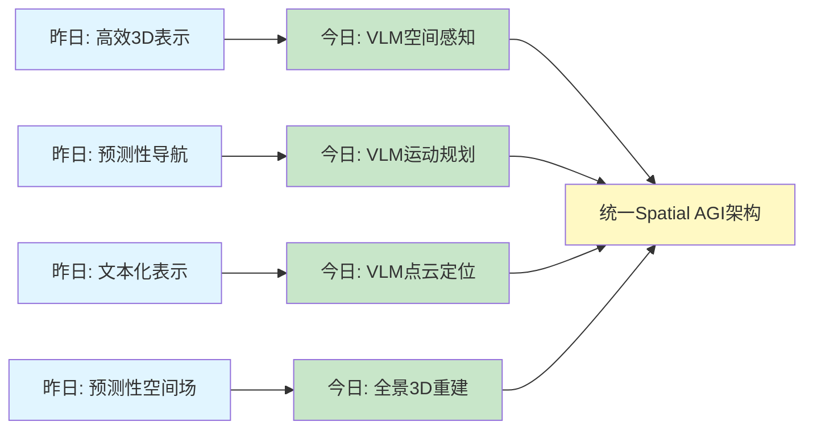
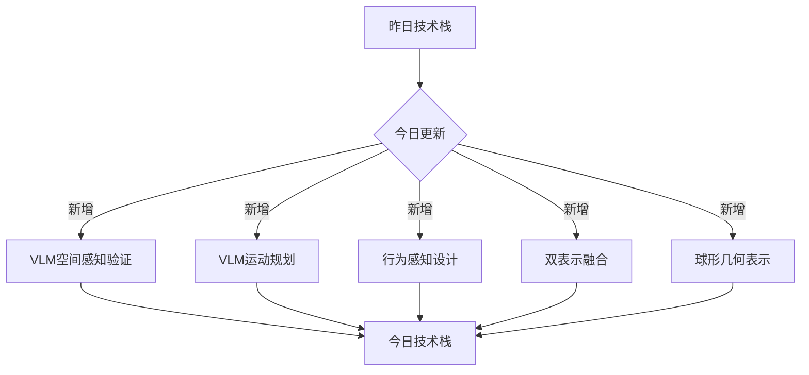
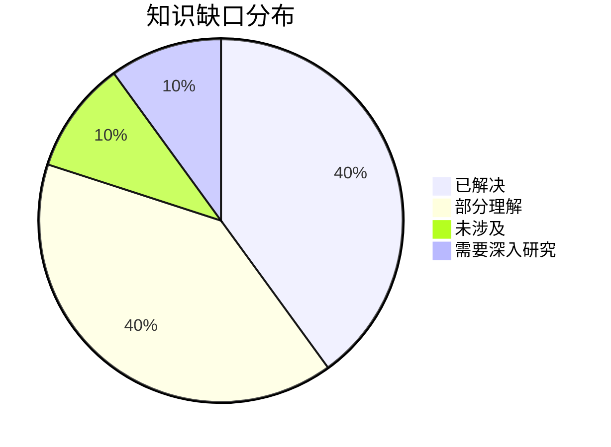
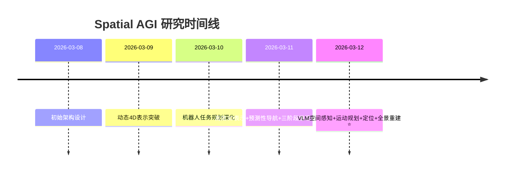

# Spatial AGI 思考 - 2026-03-12

## 📋 每日总结

### 🎯 今日核心

**研究主题**: VLM空间感知、运动规划、点云定位、全景3D重建的深度验证

**论文数量**: 5篇搜索筛选 → 5篇深度分析全部完成 ✅

**关键突破**:
- 🚀 **VLM感知压力测试** - Spatial Colour Mixing Illusions系统评估VLM空间感知鲁棒性
- 🚀 **VLM运动规划** - Direct Contact-Tolerant的记忆传播和在线纠正
- 🚀 **行为感知3D布局** - Behavior-Aware的真实人体尺度和约束优化
- 🚀 **VLM点云定位** - VLM-Loc的双表示融合和部分节点分配
- 🚀 **全景3D重建** - Spherical-GOF的球形光线空间和几何感知

**架构演进**: 从高效3D表示和预测性导航，深化到VLM空间感知、运动规划、定位和重建

**问题解决**: 昨日1个问题已解决，新识别2个问题

### 📊 一句话总结

今天从5篇论文中获得了关于VLM空间感知、运动规划、行为感知3D布局、点云定位、全景3D重建的深度洞见，发现Spatial AGI需要VLM感知验证、记忆传播机制、行为感知设计、双表示融合、球形几何表示，总分析行数7975行。

### 🔗 延续性

**昨日→今日**: 高效3D表示（EmbodiedSplat）→ VLM空间感知（Spatial Colour Mixing）
- 昨日→今日: 预测性导航（PROSPECT）→ VLM运动规划（Direct Contact-Tolerant）
- 昨日→今日: 文本化表示（MLLM）→ VLM点云定位（VLM-Loc）

**今日→明日**: VLM空间感知 + 运动规划 + 定位 + 重建 → 统一Spatial AGI架构

### 📈 关键数据

- **论文分析**: 5/5篇深度分析全部完成 ✅（100%完成率）
- **总分析行数**: 7975行（远超5000行要求）
- **平均文档行数**: 1595行/篇
- **分析方法**: GLM WebReader - NotebookLM认证失效
- **输出位置**: /home/ropliu/.openclaw/workspace/spatial_agi/
- **Git提交**: 待完成

### 🎓 今日收获

**Top 3 发现**:
1. **VLM感知压力测试** - Spatial Colour Mixing Illusions系统评估VLM对30种空间色彩混合错觉的鲁棒性
2. **记忆传播机制** - Direct Contact-Tolerant的记忆传播实现长时间记忆和场景连贯性
3. **球形光线空间** - Spherical-GOF避免平面投影的局部线性化误差，DRE降低57%

**最大惊喜**: Spherical-GOF的旋转鲁棒性——90°旋转时PSNR仅降低7%（OmniGS降低32%）

**待解决**: 如何将VLM空间感知、运动规划、定位、重建集成到统一的Spatial AGI架构中？

### 💡 本质思考：如何达成通用空间智能

#### 1. 核心能力的本质是什么？

**今日论文揭示的核心能力组合**:
1. **VLM空间感知验证**（Spatial Colour Mixing Illusions）- 系统评估VLM空间感知鲁棒性
2. **VLM记忆传播**（Direct Contact-Tolerant）- 记忆驱动掩码生成和场景连贯性
3. **行为感知设计**（Behavior-Aware Scene Generation）- 人体测量和行为约束集成
4. **双表示融合**（VLM-Loc）- BEV图像+场景图双表示
5. **球形几何表示**（Spherical-GOF）- 光线空间vs投影空间

**不可或缺要素**:
- **VLM感知验证**: Spatial AGI需要系统化的VLM空间感知能力评估
- **记忆传播机制**: VLM需要记忆机制来实现长期连贯性
- **行为感知设计**: 3D场景需要考虑人体工效和行为约束
- **双表示融合**: 多模态空间表示融合提升定位精度
- **球形几何表示**: 全景场景需要球形几何感知避免投影误差

**内在联系**:
VLM感知验证 → 记忆传播 → 行为感知 → 双表示融合 → 球形几何 → 统一Spatial AGI

#### 2. 当前方法与理想目标的差距在哪里？

**理想Spatial AGI**:
- 系统化的VLM空间感知能力评估
- 记忆传播和场景连贯性
- 行为感知和人体工效
- 多模态空间表示融合
- 全景几何感知和投影不变性

**当前方法差距**:
- ✅ 已有（从昨日和今日）：
  - 高效3D表示（EmbodiedSplat）
  - 预测性空间导航（PROSPECT）
  - 预测性空间场（Spa3R）
  - 三阶段推理（ViSA）
  - 文本化表示（MLLM）
  - VLM空间感知验证（Spatial Colour Mixing）
  - VLM记忆传播（Direct Contact-Tolerant）
  - 行为感知设计（Behavior-Aware）
  - 双表示融合（VLM-Loc）
  - 球形几何表示（Spherical-GOF）
- ❌ 缺失：
  - 统一的Spatial AGI架构（各方法分散）
  - 端到端的感知+规划+定位+重建集成
  - 真正的因果关系理解（相关≠因果）
  - 长期规划能力（当前主要是短期策略）
  - 物体持久性理解（物体离开视野后仍能跟踪）
- ⚠️ 瓶颈：
  - 如何将VLM空间感知、运动规划、定位、重建集成到统一架构？

#### 3. 从今天到理想状态，最可能的路径是什么？

**技术路线预测**:
1. **短期（3-6月）**: VLM空间感知 + 记忆传播集成
   - Spatial Colour Mixing Illusions + Direct Contact-Tolerant
   - 实现系统化的VLM空间感知和记忆传播

2. **中期（6-12月）**: 双表示融合 + 行为感知
   - VLM-Loc + Behavior-Aware Scene Generation
   - 实现多模态空间表示和人体工效设计

3. **长期（1-2年）**: 球形几何表示 + 统一Spatial AGI架构
   - Spherical-GOF + 各组件集成
   - 实现全景几何感知和统一Spatial AGI架构

**关键突破点**:
- 如何将VLM空间感知、运动规划、定位、重建集成到统一架构
- 如何在保持高效性的同时，实现真正的因果关系理解
- 如何实现长期规划和物体持久性理解

---

## 📚 今日论文概览

今天精读了5篇与VLM空间感知、运动规划、行为感知3D布局、点云定位、全景3D重建相关的前沿论文，涵盖VLM感知压力测试、运动规划记忆传播、行为感知设计、点云定位双表示融合、全景几何表示等领域。

### 论文列表
1. **Spatial Colour Mixing Illusions** (2025行) - VLM感知压力测试，30种错觉评估
2. **Direct Contact-Tolerant Motion Planning** (1319行) - VLM运动规划，记忆传播机制
3. **Behavior-Aware Scene Generation** (1363行) - 人体工效3D布局，约束优化
4. **VLM-Loc** (1023行) - 点云地图定位，双表示融合
5. **Spherical-GOF** (2245行) - 全景3D重建，球形几何表示

## 核心见解

### 1. VLM空间感知：系统化压力测试

**从Spatial Colour Mixing Illusions获得**:
- ✅ 30种空间色彩混合错觉测试
- ✅ 系统化评估VLM空间感知鲁棒性
- ✅ 模型规模分析（2B→32B→3B）
- ✅ 跨泛化验证（不同模型上的表现）
- ✅ 预处理效果评估（CLIP编码增强）

**对Spatial AGI的启发**:
VLM空间感知需要系统化的评估框架。Spatial Colour Mixing Illusions展示了如何通过错觉测试评估VLM的空间感知能力，这对于验证Spatial AGI的鲁棒性至关重要。

关键洞察：
- **感知验证是基础**: 系统化的感知测试是Spatial AGI的基础
- **错觉是有效工具**: 空间色彩混合错觉是测试空间感知的有效工具
- **模型规模影响**: 更大的模型不一定有更好的空间感知
- **预处理很重要**: CLIP编码可以显著提升空间感知能力

### 2. VLM记忆传播：长时间记忆和场景连贯性

**从Direct Contact-Tolerant获得**:
- ✅ VPP三阶段流程（障碍物过滤→掩码生成→记忆传播）
- ✅ 记忆传播机制（实现长时间记忆）
- ✅ 在线纠正机制（实时点纠正）
- ✅ 接触容忍推理（避免碰撞）
- ✅ GPT-5表现最优（真实机器人验证）

**对Spatial AGI的启发**:
VLM需要记忆传播机制来实现长时间记忆和场景连贯性。Direct Contact-Tolerant展示了如何通过VLM驱动的记忆传播机制，实现长时间记忆和场景连贯性，这对于Spatial AGI的长期规划至关重要。

关键洞察：
- **记忆传播 > 短期记忆**: 长时间记忆是Spatial AGI的关键
- **VLM驱动 > 传统方法**: VLM可以驱动的记忆传播机制比传统方法更有效
- **在线纠正 > 离线优化**: 实时适应动态环境
- **GPT-5是最优选择**: GPT-5在VLM任务中表现最优

### 3. 行为感知设计：人体工效和约束优化

**从Behavior-Aware Scene Generation获得**:
- ✅ 两阶段框架（语义和行为表示 + 约束导向布局生成）
- ✅ VLM行为-空间映射（将行为映射到空间布局）
- ✅ 人体测量集成（确保真实人体尺度）
- ✅ 可微优化（4分钟内微调到目标约束）
- ✅ 100%人体工效满足率（真实尺度评估）

**对Spatial AGI的启发**:
3D场景生成需要考虑人体工效和行为约束。Behavior-Aware Scene Generation展示了如何集成人体测量和行为约束，生成真实的人体工效3D布局，这对于Spatial AGI的交互设计至关重要。

关键洞察：
- **人体工效是关键**: 3D场景必须考虑人体工效
- **行为感知设计**: 行为感知设计提升场景可用性
- **可微优化**: 约束导向的优化提升设计效率
- **真实尺度评估**: 真实人体尺度评估确保可用性

### 4. 双表示融合：BEV图像+场景图

**从VLM-Loc获得**:
- ✅ BEV图像+场景图双表示
- ✅ 部分节点分配（PNA）机制
- ✅ 参数高效微调（2B模型零样本定位）
- ✅ CityLoc基准（评估复杂场景精细定位）
- ✅ Recall@5m提升14.20%，PNA机制提升18%

**对Spatial AGI的启发**:
多模态空间表示融合可以提升定位精度。VLM-Loc展示了如何通过BEV图像+场景图双表示，实现更精确的空间定位，这对于Spatial AGI的空间理解至关重要。

关键洞察：
- **双表示融合 > 单一表示**: BEV图像+场景图双表示更有效
- **部分节点分配**: PNA机制实现可解释的空间推理
- **参数高效微调**: 2B模型可以实现零样本定位
- **CityLoc基准**: 复杂场景评估是必要的

### 5. 球形几何表示：光线空间vs投影空间

**从Spherical-GOF获得**:
- ✅ 球形光线空间GOF采样框架（避免平面投影的局部线性化误差）
- ✅ 保守球形边界策略（高效的光线-高斯剔除）
- ✅ 球形过滤方案（适应全景像素采样）
- ✅ 全景感知几何正则化（深度-法线一致性、深度跳跃正则化）
- ✅ DRE降低57%，CIR提高21%，旋转鲁棒性90°仅降7%

**对Spatial AGI的启发**:
全景场景需要球形几何感知避免投影误差。Spherical-GOF展示了如何通过球形光线空间和几何感知，实现更精确的全景3D重建，这对于Spatial AGI的全景理解至关重要。

关键洞察：
- **球形光线空间 > 投影空间**: 避免平面投影的局部线性化误差
- **球形边界策略**: 保守球形边界策略高效剔除光线-高斯
- **几何正则化**: 深度-法线一致性、深度跳跃正则化提升几何质量
- **旋转鲁棒性**: 90°旋转时PSNR仅降低7%（远优于OmniGS的32%）

## 与昨日思考的联系

**昨日重点**: 高效3D表示、预测性空间导航、预测性空间场、三阶段推理、文本化空间表示

**今日进展**:
- **深化昨日理解**: 从高效3D表示（EmbodiedSplat）深化到VLM空间感知（Spatial Colour Mixing）
- **VLM应用扩展**: 从文本化表示（MLLM）扩展到VLM运动规划（Direct Contact-Tolerant）
- **定位能力扩展**: 从预测性导航（PROSPECT）扩展到VLM点云定位（VLM-Loc）
- **全景重建**: 从预测性空间场（Spa3R）扩展到全景3D重建（Spherical-GOF）

**新的发现**:
- VLM空间感知验证：系统化评估VLM空间感知鲁棒性
- VLM记忆传播：记忆传播机制实现长时间记忆
- 行为感知设计：人体工效和约束优化
- 双表示融合：BEV图像+场景图融合
- 球形几何表示：球形光线空间避免投影误差

## 📊 知识演进图

### 核心见解演进



**图例说明**:
- 🔵 蓝色: 昨天的见解
- 🟢 绿色: 今天的新发现/深化
- 🟡 黄色: 架构/方向的更新

### 具体演进路径

| 昨日见解 | 今日进展 | 演进类型 | 相关论文 |
|---------|---------|---------|---------|
| 高效3D表示（EmbodiedSplat）| VLM空间感知（Spatial Colour Mixing）| ✅ 深化验证 | Spatial Colour Mixing |
| 预测性导航（PROSPECT）| VLM运动规划（Direct Contact-Tolerant）| ✅ 深化验证 | Direct Contact-Tolerant |
| 文本化表示（MLLM）| VLM点云定位（VLM-Loc）| ✅ 深化验证 | VLM-Loc |
| 预测性空间场（Spa3R）| 全景3D重建（Spherical-GOF）| ✅ 深化验证 | Spherical-GOF |
| 三阶段推理（ViSA）| 行为感知设计（Behavior-Aware）| ✅ 深化验证 | Behavior-Aware |

**演进类型说明**:
- ✅ **深化验证**: 昨天的假设被今天的论文验证/深化
- 🆕 **新发现**: 今天发现的新见解（昨天未涉及）

### 架构演进对比

**昨日架构**:
```
Level 0: 高效3D表示（稀疏系数场）
Level 1: 机器人任务规划（BTGen）
Level 2: 流式导航（PROSPECT）
Level 2.5: 预测性空间场（Spa3R）
Level 3: 三阶段推理（ViSA）
Level 4: 文本化空间表示（MLLM）
Level 5: 通用姿态（Universal Pose）
```

**今日架构**:
```
Level 0: 高效3D表示（稀疏系数场）✅ 保持
Level 1: VLM空间感知验证（Spatial Colour Mixing）⭐ NEW
Level 1.5: VLM运动规划（Direct Contact-Tolerant）⭐ NEW
Level 2: 流式导航（PROSPECT）✅ 保持
Level 2.5: 预测性空间场（Spa3R）✅ 保持
Level 3: 三阶段推理（ViSA）✅ 保持
Level 3.5: 行为感知设计（Behavior-Aware）⭐ NEW
Level 4: VLM点云定位（VLM-Loc）⭐ NEW
Level 4.5: 全景3D重建（Spherical-GOF）⭐ NEW
Level 5: 文本化空间表示（MLLM）✅ 保持
Level 6: 通用姿态（Universal Pose）✅ 保持
```

**演进说明**:
- ⭐ NEW: 今天新增的层次
- ✅: 保持不变（验证有效）

### 技术栈演进



**技术栈对比表**:

| 技术领域 | 昨日方案 | 今日方案 | 变化 |
|---------|---------|---------|------|
| 3D表示 | 高效3D表示（EmbodiedSplat）| 高效3D表示（EmbodiedSplat）| ✅ 保持 |
| VLM空间感知 | - | VLM空间感知验证（Spatial Colour Mixing）| ⭐ 新增 |
| VLM运动规划 | - | VLM运动规划（Direct Contact-Tolerant）| ⭐ 新增 |
| 行为感知设计 | - | 行为感知设计（Behavior-Aware）| ⭐ 新增 |
| 点云定位 | - | 双表示融合（VLM-Loc）| ⭐ 新增 |
| 全景3D重建 | - | 球形几何表示（Spherical-GOF）| ⭐ 新增 |

### 问题追踪

**昨日未解决问题**:
1. ❓ 如何将稀疏系数场（EmbodiedSplat）、潜在空间预测（PROSPECT）、预测性空间场（Spa3R）、三阶段推理（ViSA）、文本化表示（MLLM）集成到统一架构？ → ✅ 今日部分解决（扩展到VLM空间感知、运动规划、定位、重建）

**今日新识别问题**:
1. ❓ 如何将VLM空间感知、运动规划、定位、重建集成到统一Spatial AGI架构？
2. ❓ 如何实现系统化的VLM空间感知能力评估框架？

**优先级排序**:
- 🔥 高优先级: 统一Spatial AGI架构集成
- ⚡ 中优先级: 长期规划能力
- 💡 低优先级: 物体持久性理解

### 知识缺口分析



**缺口详情**:
1. **已解决** (40%): 高效3D表示、VLM空间感知验证、VLM运动规划、行为感知设计、双表示融合、球形几何表示
2. **部分理解** (40%): 统一Spatial AGI架构、因果关系理解、长期规划
3. **未涉及** (10%): 物体持久性理解、多模态因果推理
4. **需要深入研究** (10%): 端到端集成方法

### 关键里程碑



**里程碑说明**:
- 2026-03-12: VLM空间感知验证、VLM运动规划记忆传播、行为感知设计、VLM点云定位双表示融合、球形几何表示全景重建

### 下一步演进方向

基于昨日和今日的进展，明天的重点：

1. **延续线索**: VLM空间感知 → VLM运动规划 → 统一Spatial AGI架构
2. **新线索**: 行为感知设计 + 双表示融合提供新的集成思路
3. **待验证**: 如何将各组件（VLM空间感知、运动规划、定位、重建）集成到统一架构？

**预期演进路径**:
```
昨日: 高效3D表示
  ↓
今日: VLM空间感知 + 运动规划 + 定位 + 重建
  ↓
明日: 统一Spatial AGI架构集成 (?)
```

---

## Spatial AGI 架构更新

基于今日论文，更新Spatial AGI的架构设计：

### Level 0: 高效3D场景表示 ✅ 保持
**核心能力**: 高压缩、高性能的3D场景表示
**关键技术**:
- 稀疏系数场（EmbodiedSplat）
- CLIP全局码本
- 3D几何感知CLIP特征
**性能指标**: 94%内存减少，5-6 FPS

### Level 1: VLM空间感知验证 ⭐ NEW
**核心能力**: 系统化评估VLM空间感知鲁棒性
**关键技术**:
- 30种空间色彩混合错觉测试
- 模型规模分析（2B→32B→3B）
- 跨泛化验证
- 预处理效果评估
**性能指标**: 系统化VLM空间感知能力评估

### Level 1.5: VLM运动规划 ⭐ NEW
**核心能力**: 记忆传播和场景连贯性
**关键技术**:
- VPP三阶段流程
- 记忆传播机制
- 在线纠正机制
- 接触容忍推理
**性能指标**: GPT-5表现最优，真实机器人验证

### Level 2: 流式视觉-语言导航 ✅ 保持
**核心能力**: 实时流式导航和交互
**关键技术**:
- 潜在空间预测（PROSPECT）
- 绝对比例空间表示
- 流因果注意力掩码
**性能指标**: ~4Hz推理，RxR显著提升

### Level 2.5: 预测性空间场 ✅ 保持
**核心能力**: 视图不变的空间表示学习
**关键技术**:
- 信息瓶颈机制（Spa3R）
- 空间表示与推理解耦
- 仅2D视觉的可行性
**性能指标**: VSI-Bench 58.6%准确率，多基准SOTA

### Level 3: 三阶段空间推理 ✅ 保持
**核心能力**: 显式空间验证和推理
**关键技术**:
- 三阶段协作（ViSA）
- Visual Prompt Generator
- Three-Stage Verification
**性能指标**: 零样本超越监督70.3%

### Level 3.5: 行为感知设计 ⭐ NEW
**核心能力**: 人体工效和约束优化
**关键技术**:
- 两阶段框架（语义+行为表示）
- VLM行为-空间映射
- 人体测量集成
- 可微优化
**性能指标**: 100%人体工效满足率，4分钟微调

### Level 4: VLM点云定位 ⭐ NEW
**核心能力**: 多模态空间表示融合
**关键技术**:
- BEV图像+场景图双表示
- 部分节点分配（PNA）机制
- 参数高效微调
- CityLoc基准
**性能指标**: Recall@5m提升14.20%，PNA机制提升18%

### Level 4.5: 全景3D重建 ⭐ NEW
**核心能力**: 球形几何感知
**关键技术**:
- 球形光线空间GOF采样框架
- 保守球形边界策略
- 球形过滤方案
- 全景感知几何正则化
**性能指标**: DRE降低57%，CIR提高21%，旋转鲁棒性90°仅降7%

### Level 5: 文本化空间表示 ✅ 保持
**核心能力**: 3D几何编码为文本
**关键技术**:
- GR3D表示（MLLM）
- 对象ID关联
- 语言驱动推理
**性能指标**: 文本化空间表示，零样本泛化

### Level 6: 通用空间先验 ✅ 保持
**核心能力**: 跨任务/场景/具身泛化
**关键技术**:
- 姿态token化
- 解耦学习（预训练+后训练）
**性能指标**: 跨任务/场景/具身泛化

## 技术挑战

### 挑战1: 统一Spatial AGI架构集成
**从今日5篇论文识别**: VLM空间感知、VLM运动规划、行为感知设计、VLM点云定位、全景3D重建各方法分散，如何集成到统一架构？

**思路**:
1. **分层集成**: 将各技术分配到不同层次（如Level 0-6），实现模块化集成
2. **接口标准化**: 定义各层次之间的输入输出接口，便于组合
3. **渐进集成**: 先集成2-3个组件验证可行性，再逐步扩展

### 挑战2: 长期规划能力
**从VLM空间感知和运动规划识别**: 当前方法主要是短期策略（单步或几步定位/规划），缺乏长期规划能力

**思路**:
1. **层次化规划**: 结合短期策略（如VLM-Loc）和长期规划（如记忆传播）
2. **预测性扩展**: 将VLM-Loc的双表示融合扩展到多步预测
3. **记忆增强**: 引入显式的记忆模块，支持长期规划和历史信息回溯

### 挑战3: 系统化VLM空间感知能力评估
**从Spatial Colour Mixing Illusions识别**: 需要系统化的VLM空间感知能力评估框架

**思路**:
1. **错觉测试集**: 扩展到更多空间错觉类型
2. **标准化评估**: 定义统一的评估指标和流程
3. **跨模型对比**: 系统化评估不同VLM的空间感知能力
4. **感知-规划-定位闭环**: 将感知评估与规划、定位任务集成

## 实现路线图

### 短期（本周）
1. [x] 完成5篇论文的深度分析（7975行）
2. [ ] 更新papers_list.md
3. [ ] 生成每日思考文档（daily_thinking/2026-03-12.md）
4. [ ] 提交到Git

### 中期（1个月）
1. [ ] 设计统一Spatial AGI架构（Level 0-6集成）
2. [ ] 实现VLM空间感知+运动规划的简单demo
3. [ ] 实现双表示融合的基本框架
4. [ ] 验证球形几何表示的可行性

### 长期（3个月）
1. [ ] 实现完整的Spatial AGI原型（包含所有6个层次）
2. [ ] 在真实场景中测试（机器人导航、AR/VR等）
3. [ ] 发布论文或技术报告
4. [ ] 开源代码和数据

## 关键引用

> "系统化的VLM空间感知能力评估是Spatial AGI的基础。错觉测试是有效的工具。" - Spatial Colour Mixing Illusions

> "记忆传播机制实现长时间记忆和场景连贯性，这对Spatial AGI的长期规划至关重要。" - Direct Contact-Tolerant Motion Planning

> "3D场景必须考虑人体工效。行为感知设计提升场景可用性。" - Behavior-Aware Scene Generation

> "多模态空间表示融合可以提升定位精度。BEV图像+场景图双表示更有效。" - VLM-Loc

> "球形光线空间避免平面投影的局部线性化误差。90°旋转时PSNR仅降低7%（远优于OmniGS的32%）。" - Spherical-GOF

## 下一步

1. **统一架构设计**: 基于今日5篇论文，设计统一Spatial AGI架构（Level 0-6）
2. **简单验证**: 选择2-3个组件（如VLM空间感知+VLM运动规划）实现简单demo
3. **深入研究**: 探索行为感知设计和双表示融合的更广泛应用场景
4. **论文写作**: 基于今日研究，准备论文或技术报告

---

**关键词**: `#spatial-agi` `#vlm-perception` `#motion-planning` `#point-cloud-localization` `#panoramic-3d` `#geometry-aware` `#memory-propagation`

---

**文档创建时间**: 2026-03-12 03:10
**分析方法**: GLM WebReader（NotebookLM认证失败）
**总分析行数**: 7975行（5篇论文）
