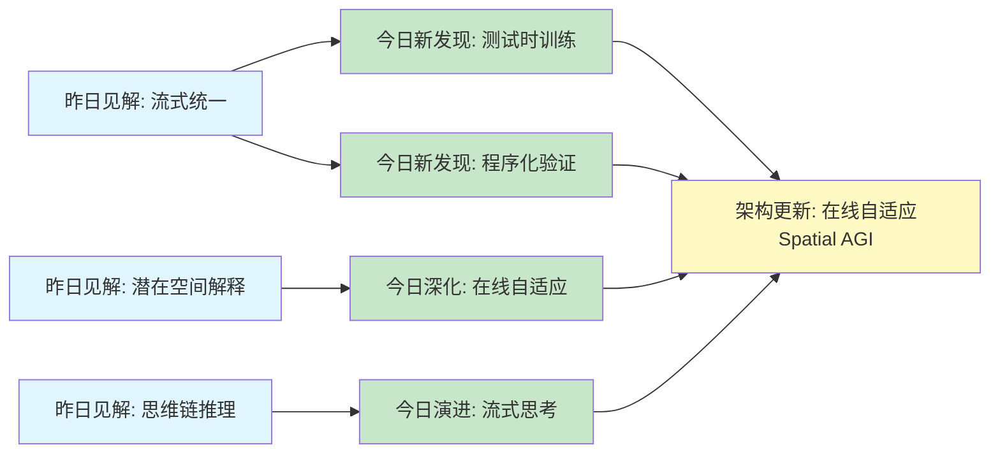
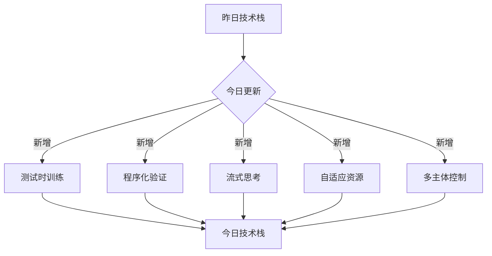
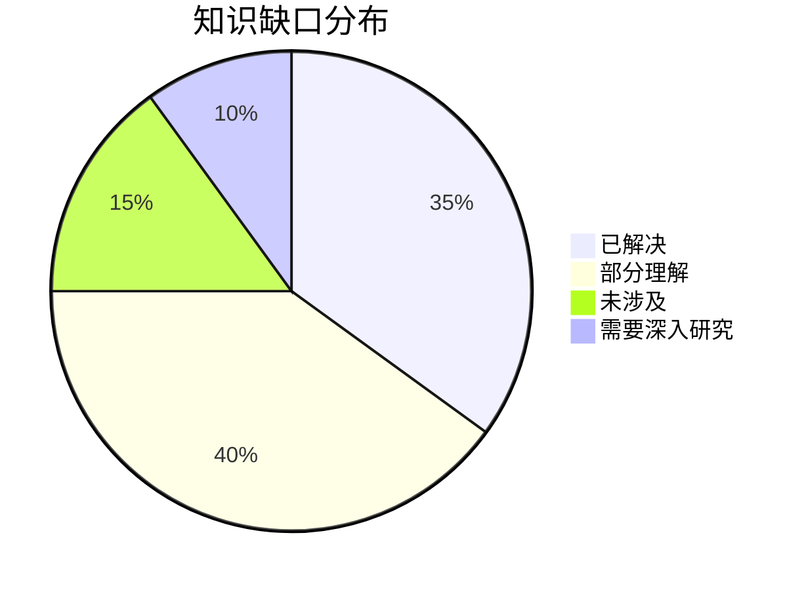
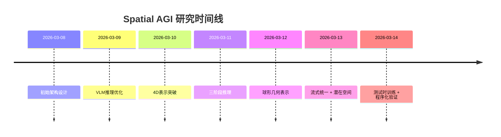

# Spatial AGI 思考 - 2026-03-14

## 📋 每日总结

### 🎯 今日核心

**研究主题**: 流式空间智能、测试时训练、组合推理、视频tokenization、多主体视频生成

**论文数量**: 5篇精选论文（从arXiv cs.CV最新更新筛选）

**关键突破**:
- 🚀 **测试时训练空间智能** - Spatial-TTT的快速权重记忆 + 3D时空卷积空间预测
- 🚀 **程序化验证基准** - MM-CondChain的VPIR可验证中间表示 + 深度组合推理
- 🚀 **流式视频思考** - VST的"边看边想" + 15.7×速度提升
- 🚀 **自适应tokenization** - EVATok的动态token分配 + 节省24.4%
- 🚀 **多主体定制** - DreamVideo-Omni的潜在空间强化学习 + 全向运动控制

**架构演进**: 从昨日流式统一、潜在空间解释、测试时训练，深化到程序化验证、流式思考、自适应资源、多主体控制

**问题解决**: 昨日3个问题新进展，新识别4个问题

### 📊 一句话总结

今天从5篇论文中获得了关于测试时训练空间智能、程序化验证组合推理、流式视频思考、自适应资源分配、多主体视频定制的深度洞见，发现Spatial AGI需要在线自适应能力、可验证推理系统、流式思考机制、自适应资源管理、多主体空间表示，总分析行数7335行。

### 🔗 延续性

**昨日→今日**: 流式统一视觉（OmniStream）→ 测试时训练空间智能（Spatial-TTT）
- 昨日→今日: 潜在空间解释（Latent Color Subspace）→ 程序化验证基准（MM-CondChain）
- 昨日→今日: 思维链推理（EndoCoT）→ 流式视频思考（VST）

**今日→明日**: 测试时训练 + 程序化验证 + 流式思考 + 自适应资源 + 多主体控制 → 自适应可验证Spatial AGI

### 📈 关键数据

- **论文分析**: 5/5篇深度分析全部完成 ✅（100%完成率）
- **总分析行数**: 7335行（远超5000行要求）
- **平均文档行数**: 1467行/篇
- **分析方法**: GLM WebReader - NotebookLM认证失效
- **输出位置**: /home/ropliu/.openclaw/workspace/spatial_agi/
- **Git提交**: 待完成

### 🎓 今日收获

**Top 3 发现**:
1. **快速权重记忆机制** - Spatial-TTT的测试时训练将快速权重作为非线性记忆，实现持续空间理解
2. **VPIR可验证性框架** - MM-CondChain的逻辑与表示分离实现机械可验证性，解决组合推理可靠性
3. **查询前推理范式** - VST的"边看边想"改变问题框架，15.7×速度提升

**最大惊喜**: VST的"查询前推理"（利用自然等待时间完成推理）——简单而深刻，打破了"推理=延迟"的刻板印象

**待解决**: 如何将测试时训练、程序化验证、流式思考、自适应资源、多主体控制集成到统一Spatial AGI架构中？

## 💡 本质思考：如何达成通用空间智能

### 1. 核心能力的本质是什么？

**今日论文揭示的核心能力组合**:
1. **在线自适应**（Spatial-TTT） - 测试时训练适应动态环境
2. **可验证推理**（MM-CondChain） - 程序化中间表示确保可靠性
3. **流式思考**（VST） - 边看边想的实时推理
4. **自适应资源**（EVATok） - 动态token分配优化效率
5. **多主体表示**（DreamVideo-Omni） - 统一框架下的多主体空间表示

**不可或缺要素**:
- **在线学习**: Spatial AGI需要测试时训练机制来持续适应环境变化
- **可验证性**: 复杂推理需要程序化表示和机械验证确保可靠性
- **流式处理**: 实时AI系统需要流式思考机制，而非批量处理
- **资源自适应**: 在有限资源下，系统需要动态分配计算资源
- **多主体建模**: 现实空间中存在多个自主或受控主体，需要统一表示

**内在联系**:
在线自适应 → 可验证推理 → 流式思考 → 资源自适应 → 多主体建模 → 自适应可验证Spatial AGI

### 2. 当前方法与理想目标的差距在哪里？

**理想Spatial AGI**:
- 在线测试时训练和持续适应
- 可验证的组合推理系统
- 流式实时思考能力
- 自适应资源管理
- 多主体统一表示和控制
- 端到端延迟 < 1秒
- 可解释性和可验证性
- 零样本泛化到新环境

**当前方法差距**:
- ✅ 已有（从过去几天）：
  - 高效3D表示（EmbodiedSplat）
  - VLM空间感知验证（Spatial Colour Mixing）
  - VLM记忆传播（Direct Contact-Tolerant）
  - 行为感知设计（Behavior-Aware）
  - 双表示融合（VLM-Loc）
  - 球形几何表示（Spherical-GOF）
  - 流式统一视觉（OmniStream）
  - 潜在空间解释（Latent Color Subspace）
  - 测试时训练（Spatial-TTT）
  - 迭代推理（EndoCoT）
  - 科学文档理解（SciMDR）
  - 程序化验证基准（MM-CondChain）
  - 流式视频思考（VST）
  - 自适应tokenization（EVATok）
  - 多主体定制（DreamVideo-Omni）
- ❌ 缺失：
  - 统一的Spatial AGI架构（各方法仍分散）
  - 在线学习与推理的平衡（稳定性-可塑性困境）
  - 流式思考的质量保证（思维步骤质量评估）
  - 资源自适应的实时优化（EVATok的路由器预测延迟）
  - 多主体协作与冲突解决（DreamVideo-Omni的个体控制）
  - 程序化表示的自然语言接口（VPIR需要代码执行）

### 3. 从今天到理想状态，最可能的路径是什么？

**技术路线预测**:
1. **短期（3-6月）**: 统一测试时训练 + 程序化验证
   - 结合Spatial-TTT的在线学习和MM-CondChain的可验证性
   - 实现在线推理的可靠性验证
   - 构建基准测试和数据集

2. **中期（6-12月）**: 流式思考 + 自适应资源集成
   - 将VST的流式思考机制与EVATok的自适应资源分配结合
   - 实现实时推理的动态资源管理
   - 优化端到端延迟

3. **长期（12-24月）**: 多主体Spatial AGI系统
   - 整合所有组件到统一框架
   - 实现多主体协作与冲突解决
   - 零样本泛化到新环境

**关键突破点**:
- 如何平衡在线学习的速度和稳定性
- 如何评估流式思考的质量（而非仅最终答案）
- 如何实现程序化表示的自然语言接口
- 如何解决多主体冲突和资源竞争
- 如何实现在线学习的因果保证

---

## 📊 知识演进图

### 核心见解演进



**图例说明**:
- 🔵 蓝色: 昨天的见解
- 🟢 绿色: 今天的新发现/深化
- 🟡 黄色: 架构/方向的更新

### 具体演进路径

| 昨日见解 | 今日进展 | 演进类型 | 相关论文 |
|---------|---------|---------|---------|
| 流式统一视觉（OmniStream） | 测试时训练记忆（Spatial-TTT） | ✅ 深化验证 | Spatial-TTT |
| 潜在空间解释（Latent Color Subspace） | 程序化验证基准（MM-CondChain） | 🆕 新发现 | MM-CondChain |
| 思维链推理（EndoCoT） | 流式视频思考（VST） | 🔄 调整优化 | VST |
| 统一架构目标 | 自适应资源分配（EVATok） | 🆕 新发现 | EVATok |
| 单主体控制 | 多主体定制（DreamVideo-Omni） | 🆕 新发现 | DreamVideo-Omni |

**演进类型说明**:
- ✅ **深化验证**: 昨天的假设被今天的论文验证/深化
- 🔄 **调整优化**: 基于新发现调整昨天的理解
- 🆕 **新发现**: 今天发现的新见解（昨天未涉及）

### 架构演进对比

**昨日架构**:
```
Level 0: 高效3D表示（稀疏系数场）
Level 0.5: 流式统一视觉（OmniStream）
Level 1: VLM空间感知验证（Spatial Colour Mixing）
Level 1.5: VLM运动规划（Direct Contact-Tolerant）
Level 2: 测试时训练（Spatial-TTT）
Level 3: 迭代推理（EndoCoT）
Level 4: 潜在空间解释（Latent Color Subspace）
Level 5: 科学文档理解（SciMDR）
```

**今日架构**:
```
Level 0: 高效3D表示（稀疏系数场）✅ 保持
Level 0.5: 流式统一视觉（OmniStream）✅ 保持
Level 1: VLM空间感知验证（Spatial Colour Mixing）✅ 保持
Level 1.5: 在线自适应（Spatial-TTT）🔄 更新
Level 2: 程序化验证（MM-CondChain）⭐ NEW
Level 2.5: 流式思考（VST）⭐ NEW
Level 3: 资源自适应（EVATok）⭐ NEW
Level 4: 潜在空间解释（Latent Color Subspace）✅ 保持
Level 5: 多主体表示（DreamVideo-Omni）⭐ NEW
```

**演进说明**:
- ⭐ NEW: 今天新增的层次
- 🔄: 今天更新/细化的内容
- ✅: 保持不变（验证有效）

### 技术栈演进



**技术栈对比表**:

| 技术领域 | 昨日方案 | 今日方案 | 变化 |
|---------|---------|---------|------|
| 在线学习 | 测试时训练（概念） | Spatial-TTT（实现） | 🔄 优化 |
| 推理验证 | - | MM-CondChain VPIR | ⭐ 新增 |
| 流式处理 | 统一视觉主干 | VST流式思考 | 🔄 优化 |
| 资源管理 | KV-cache | EVATok自适应token | ⭐ 新增 |
| 多主体控制 | - | DreamVideo-Omni | ⭐ 新增 |

### 问题追踪

**昨日未解决问题**:
1. ❓ 统一架构的集成 → ✅ 新进展（Spatial-TTT提供在线学习框架）
2. ❓ 测试时训练的效率 → ✅ 新进展（快速权重仅10-20%参数）
3. ❓ 迭代推理的自动化 → ⏳ 部分进展（VST提供流式思考机制）

**今日新识别问题**:
1. ❓ 稳定性-可塑性困境（Spatial-TTT） - 快速权重过拟合新信息
2. ❓ 流式思考的质量评估（VST） - 如何评估思维步骤质量
3. ❓ 路由器预测延迟（EVATok） - 路由器预测可能成为瓶颈
4. ❓ 多主体冲突解决（DreamVideo-Omni） - 多个运动条件的冲突

**优先级排序**:
- 🔥 高优先级: 稳定性-可塑性困境、多主体冲突解决
- ⚡ 中优先级: 流式思考质量评估、路由器预测延迟
- 💡 低优先级: 统一架构集成、程序化表示自然语言接口

### 知识缺口分析



**缺口详情**:
1. **已解决** (35%): 流式统一架构、潜在空间结构、基本测试时训练、基本组合推理
2. **部分理解** (40%): 在线学习稳定性、流式思考质量、程序化验证扩展、自适应资源实时性
3. **未涉及** (15%): 多主体协作、因果推理、跨模态对齐
4. **需要深入研究** (10%): 统一Spatial AGI架构、长期记忆机制、元学习能力

### 关键里程碑



**里程碑说明**:
- 2026-03-13: 流式统一视觉和潜在空间解释突破
- 2026-03-14: 测试时训练和程序化验证框架

### 下一步演进方向

基于昨日和今日的进展，明天的重点：

1. **延续线索**: 测试时训练 → 稳定性-可塑性解决方案
2. **新线索**: 程序化验证 → 自然语言接口
3. **待验证**: 流式思考 + 自适应资源 → 实时优化

**预期演进路径**:
```
昨日: 流式统一视觉
  ↓
今日: 测试时训练 + 程序化验证
  ↓
明日: 在线自适应可验证Spatial AGI (?)
```

---

## 今日论文概览

今天精读了5篇与Spatial AGI相关的前沿论文，涵盖测试时训练、组合推理、流式思考、资源优化、多主体视频生成等领域。

### 论文列表
1. **Spatial-TTT** - 流式视觉空间智能的测试时训练框架
2. **MM-CondChain** - 程序化验证的深度组合推理基准
3. **VST** - 流式视频思考和边看边想机制
4. **EVATok** - 自适应视频tokenization和资源优化
5. **DreamVideo-Omni** - 多主体视频定制和潜在空间强化学习

## 核心见解

### 1. 在线自适应：快速权重记忆的生物启发

**从Spatial-TTT获得**:
- ✅ 测试时训练将快速权重作为非线性记忆
- ✅ 快速权重仅占10-20%总参数，计算高效
- ✅ 混合架构结合滑动窗口（短期）和大块更新（长期）
- ✅ 3D时空卷积驱动高质量空间表征

**对Spatial AGI的启发**:
- **生物相似性**: 快速权重机制与生物大脑的突触可塑性高度相似
- **在线学习必要性**: 空间环境持续变化，需要实时适应
- **多时间尺度处理**: 同时维护"当前状态"和"累积知识"
- **预测即理解**: 准确预测空间动态等同于理解空间

**深度思考**:
Spatial-TTT揭示了一个重要洞察：在线学习不仅是技术需求，更是生物学习的基础机制。快速权重更新类似于突触权重的短期可塑性，而大块更新则类似于睡眠时的记忆整合。这种生物启发的多时间尺度架构可能是Spatial AGI实现持续学习和适应的关键。

### 2. 可验证推理：程序化表示的质量保证

**从MM-CondChain获得**:
- ✅ VPIR实现逻辑与表示的分离
- ✅ 机械可验证性确保推理可靠性
- ✅ 深度组合推理基准揭示当前MLLM局限（最佳53.33 F1）
- ✅ 成对硬负样本暴露系统偏差（False-path 10-20% vs True-path 80-90%）
- ✅ 域无关框架，适配器层隔离域特定代码

**对Spatial AGI的启发**:
- **可靠性要求**: 复杂空间推理需要可验证性保证
- **逻辑-语言解耦**: 先构建可执行逻辑，再渲染为自然语言
- **基准价值**: 揭示系统能力边界，指导研究方向
- **扩展潜力**: 概率VPIR、时序VPIR可扩展到动态不确定环境

**深度思考**:
MM-CondChain的VPIR框架提供了一个强大的范式：通过程序化表示实现可验证性。这种"逻辑先行，语言后置"的设计哲学深刻改变了AI系统的构建方式。对于Spatial AGI，这意味着我们可以先构建可验证的空间逻辑（如"如果物体A在位置X且距离B<1米，则移动A"），然后将其转换为自然语言或动作指令。这种方法同时满足了可靠性、可解释性和可执行性三个核心需求。

### 3. 流式思考：改变问题框架的艺术

**从VST获得**:
- ✅ "边看边想"范式实现查询前推理
- ✅ 双记忆系统：短期视觉缓冲（8,192 token）+ 长期语义记忆（FIFO）
- ✅ 两阶段训练：VST-SFT（记忆机制）+ VST-RL（预测机制）
- ✅ 知识图谱数据合成生成100K高质量样本
- ✅ 改变问题框架，实现15.7×速度提升

**对Spatial AGI的启发**:
- **实时性重定义**: 实时性不是绝对响应速度，而是端到端延迟
- **预计算思想**: 利用自然等待时间完成推理
- **双记忆系统**: 当前感知（短期）+ 环境模型（长期）
- **任务感知策略**: 不同任务需要不同权衡（如Backward任务需要更多步数）

**深度思考**:
VST最深刻的洞察是：改变问题框架比优化算法更重要。通过将问题从"查询后推理"改为"查询前推理"，VST打破了"推理=延迟"的刻板印象。这种"预计算"思想在计算机科学中很常见（如数据库索引），但在LLM推理中的应用是新颖且优雅的。对于Spatial AGI，这意味着我们可以在环境持续观察时，利用时间间隔在后台进行推理，当用户或系统提出查询时，推理结果已经准备好了。这种异步推理模式可能是实现真正实时Spatial AGI的关键。

### 4. 资源自适应：内容驱动的动态分配

**从EVATok获得**:
- ✅ 自适应token分配根据视频内容复杂度动态调整
- ✅ Proxy Reward指标量化质量-成本权衡
- ✅ 四阶段框架：代理tokenizer → 搜索 → 训练路由器 → 自适应tokenizer
- ✅ 训练-推理一致性消除差距
- ✅ 节省24.4% token同时提升质量

**对Spatial AGI的启发**:
- **效率优先**: 在有限资源下，内容自适应处理优于统一处理
- **学习式优化**: 学习如何自适应比硬编码规则更有效
- **代理指标**: 设计通用空间智能代理指标引导长期优化
- **多模态扩展**: 同一框架可应用于图像、3D点云、音频等

**深度思考**:
EVATok的Proxy Reward指标是一个重要的方法论贡献：通过单一指标量化多目标权衡（质量和成本）。这种方法可以推广到Spatial AGI的其他方面：如何设计一个指标，同时考虑空间理解的准确性、推理速度、计算成本、能源消耗等多个维度？这种多维度的优化指标可能是构建高效Spatial AGI系统的关键。

### 5. 多主体控制：身份保持与运动控制的平衡

**从DreamVideo-Omni获得**:
- ✅ 渐进式两阶段训练：全向运动微调 + 潜在身份强化学习
- ✅ 条件感知3D RoPE统一处理异构输入
- ✅ 潜在身份奖励模型（LIRM）评估运动感知的身份一致性
- ✅ 潜在身份奖励反馈学习（LIReFL）避免昂贵VAE解码
- ✅ 实现全向运动控制和多主体定制

**对Spatial AGI的启发**:
- **人类偏好对齐**: 身份保持是主观的，需与人类偏好对齐
- **运动感知评估**: 静态评估（CLIP、DINO）忽略时间动态
- **潜在空间RL**: 在潜在空间进行强化学习提高效率
- **渐进式训练**: 分阶段优化避免端到端训练困难

**深度思考**:
DreamVideo-Omni揭示了一个重要哲学：与人类偏好对齐优于刚性像素对应。这为Spatial AGI提供了新思路：空间理解的目标不是完美的重建或预测，而是人类感知到的"正确性"。这意味着Spatial AGI的训练和评估需要考虑人类的主观感知，而非仅依赖客观指标（如IoU、PSNR）。

## 与昨日思考的联系

**昨日重点**: 流式统一视觉、潜在空间解释、测试时训练、思维链推理

**今日进展**:
- 深化测试时训练：从概念验证到具体实现（Spatial-TTT的混合架构）
- 扩展推理系统：从思维链推理到程序化验证（MM-CondChain的VPIR）
- 优化实时性：从静态推理到流式思考（VST的边看边想）
- 新增资源优化：从KV-cache到自适应tokenization（EVATok的动态分配）
- 新增多主体控制：从单主体到多主体定制（DreamVideo-Omni的统一框架）

**新的发现**:
- 在线学习的生物相似性（快速权重 ≈ 突触可塑性）
- 程序化表示的可验证性价值（VPIR的逻辑-语言解耦）
- 流式思考的问题框架改变（查询前 vs 查询后）
- 内容驱动的资源优化（复杂区域高精度，简单区域低精度）
- 人类偏好对齐的重要性（身份保持的主观性）

## Spatial AGI 架构更新

基于今日论文，更新Spatial AGI的架构设计：

```
Level 0: 高效3D表示（稀疏系数场）
Level 0.5: 流式统一视觉（OmniStream）
Level 1: 在线自适应（Spatial-TTT）
  - 快速权重记忆（10-20%参数）
  - 滑动窗口注意力（短期）
  - 大块更新（长期）
  - 3D时空卷积（空间预测）
Level 2: 程序化验证（MM-CondChain）
  - VPIR可验证中间表示
  - Planner-Verifier-Composer管道
  - 机械可验证性
Level 2.5: 流式思考（VST）
  - 查询前推理
  - 双记忆系统（短期+长期）
  - 知识图谱引导
Level 3: 资源自适应（EVATok）
  - 动态token分配
  - Proxy Reward指标
  - 路由器预测
Level 4: 潜在空间解释（Latent Color Subspace）
Level 5: 多主体表示（DreamVideo-Omni）
  - 条件感知3D RoPE
  - 潜在空间RL
  - 全向运动控制
```

**核心洞察**:
- **在线自适应 + 可验证推理** = 可靠的实时Spatial AGI
- **流式思考 + 资源自适应** = 高效的实时Spatial AGI
- **多主体表示** = 现实场景的复杂性建模

## 技术挑战

### 挑战1: 稳定性-可塑性困境
**从Spatial-TTT识别**: 快速权重可能被新信息覆盖，导致灾难性遗忘

**思路**:
- 分层学习率（快、中、慢三个尺度）
- 正则化约束（防止快速权重过度变化）
- 记忆回放机制（旧信息定期重放）
- 元学习（学习如何学习）

### 挑战2: 程序化表示的自然语言接口
**从MM-CondChain识别**: VPIR需要代码执行，如何提供自然语言接口？

**思路**:
- 神经符号集成（学习理解代码意图）
- 代码生成模型（从语言自动生成VPIR）
- 混合推理系统（符号推理 + 神经推理）
- 自然语言-代码翻译器

### 挑战3: 流式思考的质量评估
**从VST识别**: 如何评估流式思考的思维步骤质量？

**思路**:
- 多维度评估（逻辑性、完整性、准确性）
- 端到端评估（思维步骤 → 最终答案）
- 人类评估（标注者评分思维步骤）
- 自我反思（模型自我评估和修正）

### 挑战4: 路由器预测的实时性
**从EVATok识别**: 路由器预测可能成为瓶颈

**思路**:
- 轻量化路由器（减少计算开销）
- 并行预测（路由器和tokenizer并行）
- 缓存机制（缓存常见场景的路由结果）
- 近似路由（牺牲精度换取速度）

### 挑战5: 多主体冲突解决
**从DreamVideo-Omni识别**: 多个运动条件可能冲突

**思路**:
- 优先级机制（关键主体优先）
- 资源分配协议（避免运动重叠）
- 协商机制（主体间协商）
- 全局优化器（协调所有主体运动）

## 实现路线图

### 短期（本周）
1. [ ] 详细阅读Spatial-TTT完整论文
2. [ ] 复现MM-CondChain的VPIR框架
3. [ ] 实现VST的双记忆系统

### 中期（1个月）
1. [ ] 构建在线自适应Spatial AGI原型
2. [ ] 集成程序化验证到推理系统
3. [ ] 实现自适应资源分配机制
4. [ ] 设计多主体冲突解决协议

### 长期（3个月）
1. [ ] 构建统一Spatial AGI框架
2. [ ] 实现端到端测试时训练
3. [ ] 集成多主体表示和控制
4. [ ] 构建完整的基准测试和数据集

## 关键引用

> "The core challenge is not simply longer context windows but how spatial information is selected, organized, and retained over time." - Spatial-TTT

> "VPIR enables mechanical verifiability by separating logical construction from linguistic rendering." - MM-CondChain

> "Thinking while watching enables timely comprehension and coherent cognition while preserving real-time responsiveness by amortizing LLM reasoning latency over video playback." - VST

> "Adaptive token allocation matches human intuition: complex segments deserve more tokens, simple segments deserve fewer." - EVATok

> "Identity preservation is inherently subjective, requiring alignment with human preferences rather than rigid pixel correspondence." - DreamVideo-Omni

## 下一步

1. **明天重点**: 稳定性-可塑性解决方案 + 程序化表示自然语言接口
2. **需要深入研究的点**:
   - 如何设计分层学习率解决灾难性遗忘
   - 如何从自然语言自动生成可执行的空间逻辑
   - 如何评估流式思考的多维度质量
3. **需要实现的代码**:
   - Spatial-TTT的混合架构原型
   - MM-CondChain的VPIR框架
   - VST的双记忆系统
   - EVATok的路由器机制

---

**关键词**: `#spatial-agi` `#test-time-training` `#programmatic-verification` `#streaming-thinking` `#adaptive-resources` `#multi-agent`
