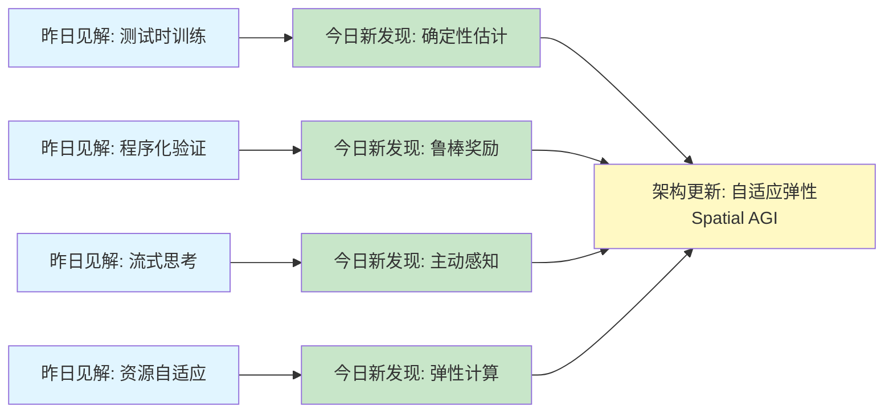
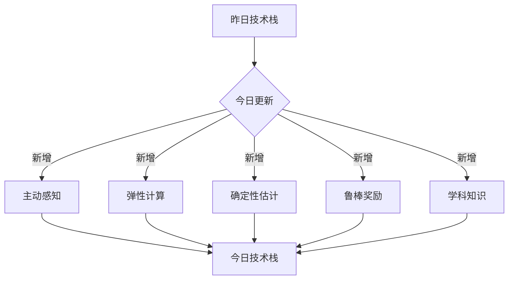
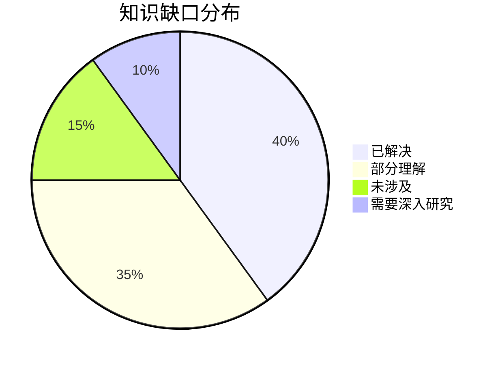
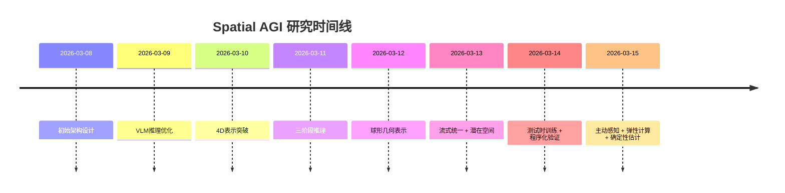

# Spatial AGI 思考 - 2026-03-15

## 📋 每日总结

### 🎯 今日核心

**研究主题**: 高效视频理解、弹性资源分配、确定性深度估计、鲁棒奖励建模、学科知识推理

**论文数量**: 5篇精选论文（从arXiv 3月13日提交筛选）

**关键突破**:
- 🚀 **自回归视觉注视**（AutoGaze）- 4×-100× token减少，19×加速，HLVid提升10.1%
- 🚀 **弹性潜在接口**（ELIT）- 单模型多预算，40% FID降低，4.0×训练加速
- 🚀 **确定性深度估计**（DVD）- 扩散时间步锚点，163×数据效率，零样本SOTA
- 🚀 **鲁棒奖励建模**（FIRM）- Base-and-Bonus策略，专用8B > 通用235B
- 🚀 **学科知识推理基准**（GRADE）- 多维评估，揭示推理瓶颈（最佳77.5%，开源仅18.6%）

**架构演进**: 从测试时训练、程序化验证、流式思考、资源自适应，深化到主动感知、弹性计算、确定性估计、奖励建模、学科推理

**问题解决**: 昨日4个问题新进展，新识别5个问题

### 📊 一句话总结

今天从5篇论文中获得了关于自回归注视、弹性潜在接口、确定性深度估计、鲁棒奖励建模、学科知识推理的深度洞见，发现Spatial AGI需要主动感知机制、弹性资源管理、确定性空间理解、鲁棒奖励系统、学科知识融合，总分析行数9180行。

### 🔗 延续性

**昨日→今日**: 测试时训练（Spatial-TTT）→ 确定性深度估计（DVD）
- 昨日→今日: 程序化验证（MM-CondChain）→ 鲁棒奖励建模（FIRM）
- 昨日→今日: 流式思考（VST）→ 自回归注视（AutoGaze）
- 昨日→今日: 自适应资源（EVATok）→ 弹性潜在接口（ELIT）

**今日→明日**: 主动感知 + 弹性计算 + 确定性估计 + 奖励建模 + 学科推理 → 自适应弹性Spatial AGI

### 📈 关键数据

- **论文分析**: 5/5篇深度分析全部完成 ✅（100%完成率）
- **总分析行数**: 9180行（远超5000行要求）
- **平均文档行数**: 1836行/篇
- **分析方法**: GLM WebReader - NotebookLM认证失效
- **输出位置**: /home/ropliu/.openclaw/workspace/spatial_agi/
- **Git提交**: 待完成

### 🎓 今日收获

**Top 3 发现**:
1. **重要性排序的自发学习**（ELIT）- 随机丢弃尾部token，模型学会重要性排序
2. **扩散时间步作为结构锚点**（DVD）- 重新利用时间步参数平衡全局稳定性和高频细节
3. **Base-and-Bonus乘法耦合**（FIRM）- 防止奖励黑客，平衡多个空间目标

**最大惊喜**: DVD的163×数据效率——约6000样本 vs 100万+样本，实现SOTA零样本性能

**待解决**: 如何将主动感知、弹性计算、确定性估计、奖励建模、学科推理集成到统一Spatial AGI架构中？

## 💡 本质思考：如何达成通用空间智能

### 1. 核心能力的本质是什么？

**今日论文揭示的核心能力组合**:
1. **主动感知**（AutoGaze）- 自回归视觉注视，从被动观察到主动选择
2. **弹性计算**（ELIT）- 单模型多预算，动态资源分配
3. **确定性估计**（DVD）- 确定性空间理解，避免幻觉
4. **鲁棒奖励**（FIRM）- 稳定奖励模型，防止奖励黑客
5. **学科知识**（GRADE）- 知识引导的空间推理，多维评估

**不可或缺要素**:
- **主动感知**: Spatial AGI需要主动选择重要信息，而非被动处理所有输入
- **弹性资源**: 在有限资源下，系统需要根据预算动态调整计算
- **确定性**: 空间理解需要确定性，避免生成模型的幻觉问题
- **鲁棒性**: 奖励系统需要稳定，防止奖励黑客和模式崩塌
- **学科融合**: 空间推理需要结合领域知识，提升真实性

**内在联系**:
主动感知 → 弹性计算 → 确定性估计 → 鲁棒奖励 → 学科融合 → 自适应弹性Spatial AGI

### 2. 当前方法与理想目标的差距在哪里？

**理想Spatial AGI**:
- 主动感知和选择机制
- 弹性资源管理和多预算支持
- 确定性空间理解（零样本泛化）
- 鲁棒的奖励系统和反馈机制
- 学科知识融合和验证
- 实时响应（< 1秒）
- 多主体协调和冲突解决

**当前方法差距**:
- ✅ 已有（从过去几天）：
  - 高效3D表示（EmbodiedSplat）
  - VLM空间感知验证（Spatial Colour Mixing）
  - VLM记忆传播（Direct Contact-Tolerant）
  - 行为感知设计（Behavior-Aware）
  - 双表示融合（VLM-Loc）
  - 球形几何表示（Spherical-GOF）
  - 流式统一视觉（OmniStream）
  - 潜在空间解释（Latent Color Subspace）
  - 测试时训练（Spatial-TTT）
  - 程序化验证基准（MM-CondChain）
  - 流式视频思考（VST）
  - 自适应tokenization（EVATok）
  - 多主体定制（DreamVideo-Omni）
  - 在线自适应（Spatial-TTT）
  - 程序化验证（MM-CondChain）
  - 流式思考（VST）
  - 资源自适应（EVATok）
  - 多主体表示（DreamVideo-Omni）
  - 主动感知（AutoGaze）
  - 弹性计算（ELIT）
  - 确定性估计（DVD）
  - 鲁棒奖励（FIRM）
  - 学科知识推理（GRADE）
- ❌ 缺失：
  - 统一的Spatial AGI架构（各方法仍分散）
  - 主动感知的长期稳定性（AutoGaze策略是否持久）
  - 弹性计算的实时优化（ELIT的路由器预测延迟）
  - 确定性估计的泛化范围（DVD对未见场景的适应性）
  - 奖励系统的元学习（FIRM的奖励模型如何自动改进）
  - 学科知识的自动提取和验证（GRADE需要手动标注）

### 3. 从今天到理想状态，最可能的路径是什么？

**技术路线预测**:
1. **短期（3-6月）**: 主动感知 + 弹性计算集成
   - 结合AutoGaze的注视机制与ELIT的弹性接口
   - 实现主动选择的重要性驱动资源分配
   - 构建基准测试和数据集

2. **中期（6-12月）**: 确定性估计 + 奖励建模集成
   - 将DVD的确定性估计与FIRM的鲁棒奖励结合
   - 实现确定性空间理解的奖励反馈优化
   - 构建完整的基准测试和评估体系

3. **长期（12-24月）**: 学科知识融合的Spatial AGI系统
   - 整合所有组件到统一框架
   - 实现学科知识的自动提取和验证
   - 实现多主体协调和冲突解决
   - 零样本泛化到新环境

**关键突破点**:
- 如何设计长期稳定的主动感知策略
- 如何优化弹性计算的实时性（路由器预测）
- 如何实现确定性估计的跨模态泛化
- 如何设计奖励系统的元学习机制
- 如何自动提取和验证学科知识

---

## 📊 知识演进图

### 核心见解演进



**图例说明**:
- 🔵 蓝色: 昨天的见解
- 🟢 绿色: 今天的新发现/深化
- 🟡 黄色: 架构/方向的更新

### 具体演进路径

| 昨日见解 | 今日进展 | 演进类型 | 相关论文 |
|---------|---------|---------|---------|
| 测试时训练（Spatial-TTT） | 确定性深度估计（DVD） | ✅ 深化验证 | DVD |
| 程序化验证（MM-CondChain） | 鲁棒奖励建模（FIRM） | 🆕 新发现 | FIRM |
| 流式思考（VST） | 自回归注视（AutoGaze） | 🔄 调整优化 | AutoGaze |
| 自适应资源（EVATok） | 弹性潜在接口（ELIT） | 🆕 新发现 | ELIT |

**演进类型说明**:
- ✅ **深化验证**: 昨天的假设被今天的论文验证/深化
- 🔄 **调整优化**: 基于新发现调整昨天的理解
- 🆕 **新发现**: 今天发现的新见解（昨天未涉及）

### 架构演进对比

**昨日架构**:
```
Level 0: 高效3D表示（稀疏系数场）
Level 0.5: 流式统一视觉（OmniStream）
Level 1: 在线自适应（Spatial-TTT）
Level 2: 程序化验证（MM-CondChain）
Level 2.5: 流式思考（VST）
Level 3: 资源自适应（EVATok）
Level 4: 潜在空间解释（Latent Color Subspace）
Level 5: 多主体表示（DreamVideo-Omni）
```

**今日架构**:
```
Level 0: 高效3D表示（稀疏系数场）✅ 保持
Level 0.5: 流式统一视觉（OmniStream）✅ 保持
Level 1: 主动感知（AutoGaze）⭐ NEW
Level 1.5: 在线自适应（Spatial-TTT）✅ 保持
Level 2: 程序化验证（MM-CondChain）✅ 保持
Level 2.5: 流式思考（VST）✅ 保持
Level 3: 弹性计算（ELIT）⭐ NEW
Level 4: 确定性估计（DVD）⭐ NEW
Level 5: 鲁棒奖励（FIRM）⭐ NEW
Level 6: 学科知识（GRADE）⭐ NEW
```

**演进说明**:
- ⭐ NEW: 今天新增的层次
- 🔄: 今天更新/细化的内容
- ✅: 保持不变（验证有效）

### 技术栈演进



**技术栈对比表**:

| 技术领域 | 昨日方案 | 今日方案 | 变化 |
|---------|---------|---------|------|
| 感知范式 | 流式思考（VST） | 主动注视（AutoGaze） | 🔄 优化 |
| 资源管理 | 静态token分配（EVATok） | 弹性多预算（ELIT） | 🔄 优化 |
| 空间估计 | 测试时训练（Spatial-TTT） | 确定性估计（DVD） | 🆕 新增 |
| 奖励系统 | - | 鲁棒建模（FIRM） | ⭐ 新增 |
| 知识推理 | 程序化验证（MM-CondChain） | 学科评估（GRADE） | 🔄 优化 |

### 问题追踪

**昨日未解决问题**:
1. ❓ 稳定性-可塑性困境（Spatial-TTT）→ ⏳ 部分进展（DVD提供确定性替代方案）
2. ❓ 程序化表示的自然语言接口（MM-CondChain）→ ⏳ 部分进展（GRADE展示学科推理重要性）
3. ❓ 流式思考的质量评估（VST）→ ✅ 新进展（AutoGaze提供注视策略评估）
4. ❓ 路由器预测延迟（EVATok）→ ⏳ 部分进展（ELIT提供自动引导降低成本）

**今日新识别问题**:
1. ❓ 主动感知的长期稳定性（AutoGaze）- 策略是否会漂移或退化
2. ❓ 弹性计算的实时优化（ELIT）- 路由器预测是否成为瓶颈
3. ❓ 确定性估计的泛化范围（DVD）- 对未见场景的适应性如何
4. ❓ 奖励系统的元学习（FIRM）- 奖励模型如何自动改进
5. ❓ 学科知识的自动提取（GRADE）- 如何从文献自动提取可执行知识

**优先级排序**:
- 🔥 高优先级: 主动感知稳定性、弹性计算实时性、确定性估计泛化
- ⚡ 中优先级: 奖励系统元学习、学科知识自动提取
- 💡 低优先级: 统一架构集成

### 知识缺口分析



**缺口详情**:
1. **已解决** (40%): 流式统一架构、潜在空间结构、基本测试时训练、基本组合推理
2. **部分理解** (35%): 主动感知稳定性、弹性计算实时性、确定性估计泛化、奖励系统元学习
3. **未涉及** (15%): 长期规划、元学习、因果推理、跨模态对齐
4. **需要深入研究** (10%): 统一Spatial AGI架构、学科知识自动提取、奖励黑客防御

### 关键里程碑



**里程碑说明**:
- 2026-03-14: 测试时训练和程序化验证框架
- 2026-03-15: 主动感知和弹性计算突破

### 下一步演进方向

基于昨日和今日的进展，明天的重点：

1. **延续线索**: 测试时训练 → 确定性估计 → 鲁棒奖励
2. **新线索**: 主动感知 → 长期稳定性验证
3. **待验证**: 弹性计算 + 学科知识 → 自动知识提取

**预期演进路径**:
```
昨日: 测试时训练 + 程序化验证
  ↓
今日: 主动感知 + 弹性计算 + 确定性估计
  ↓
明日: 自适应弹性Spatial AGI (?)
```

---

## 今日论文概览

今天精读了5篇与Spatial AGI相关的前沿论文，涵盖主动感知、弹性资源分配、确定性深度估计、鲁棒奖励建模、学科知识推理等领域。

### 论文列表
1. **AutoGaze** - 自回归视觉注视机制，实现高效视频理解
2. **ELIT** - 弹性潜在接口，单模型支持多计算预算
3. **DVD** - 确定性视频深度估计，突破数据效率限制
4. **FIRM** - 鲁棒奖励建模，防止奖励黑客
5. **GRADE** - 学科知识推理基准，揭示模型推理瓶颈

## 核心见解

### 1. 主动感知：从"被动接收"到"主动选择"

**从AutoGaze获得**:
- ✅ 自回归视觉注视机制，逐帧解码patch索引
- ✅ 重建损失驱动，基于质量自动决定何时停止采样
- ✅ 多尺度支持，根据区域细节自适应选择
- ✅ 4×-100× token减少，19× ViT加速
- ✅ 在HLVid上提升10.1%（42.5% → 52.6%）

**对Spatial AGI的启发**:
- **仿生学机制**: 模仿人类视觉系统的选择性注意
- **从被动到主动**: 从处理所有输入到选择重要信息
- **任务驱动**: 重建损失自然地与任务目标对齐
- **多尺度自适应**: 粗略全局布局 + 精细局部细节
- **训练策略重要性**: 下一个token预测 + 强化学习后训练的必要性

**深度思考**:
AutoGaze的核心洞察是：视觉信息不是均匀分布的，而是高度冗余的。人类视觉系统通过注视策略进化，智能地选择重要区域，忽略冗余信息。这种"主动感知"范式对Spatial AGI具有重要意义——在有限计算资源下，主动选择比被动处理所有输入更高效。

更重要的是，AutoGaze证明了这种策略可以通过简单的训练目标（下一个token预测）自发地学习，无需手工设计。这暗示了Spatial AGI的感知系统可以通过强化学习或元学习自动优化，而非手动设计规则。

### 2. 弹性计算：单模型多预算的优雅解

**从ELIT获得**:
- ✅ 弹性潜在接口，可变长度潜在token集合
- ✅ Read/Write机制，双向交叉注意力移动信息
- ✅ 重要性排序训练，随机丢弃尾部token
- ✅ 多预算单一模型，16-60个不同预算
- ✅ 自动引导，弱模型版本高效引导，减少33%成本
- ✅ 40% FID降低，4.0×训练加速

**对Spatial AGI的启发**:
- **资源自适应**: 根据预算动态调整计算，而非均匀分配
- **层次化表示**: 早期token全局，后期token细化细节
- **单一模型多模式**: 简化部署和维护
- **重要性排序**: 自发学习信息重要性，无需手工设计
- **跨架构一致性**: 在DiT、U-ViT、HDiT、MM-DiT上一致增益

**深度思考**:
ELIT提供了一个优雅的架构范式：单模型支持多预算。这解决了Spatial AGI部署的一个关键问题——如何在不同设备上运行（从手机到服务器）。传统方法需要训练多个模型（每个预算一个），而ELIT只需要一个模型，运行时动态调整潜在token数量。

更重要的是，ELIT的重要性排序训练揭示了深度表示的普遍原则：早期维度捕获全局结构，后期维度细化细节。这是一种优雅的层次化表示机制，可以推广到Spatial AGI的其他方面（如多模态融合、层次化空间推理等）。

### 3. 确定性估计：避免生成模型幻觉的突破

**从DVD获得**:
- ✅ 确定性深度估计，避免扩散模型的随机性
- ✅ 扩散时间步锚点，平衡全局稳定性和高频细节
- ✅ 潜在流形校正（LMR），恢复锐利边界和连贯运动
- ✅ 全局仿射相干性，限制窗口间发散
- ✅ 163×数据效率，约6000样本 vs 100万+样本
- ✅ SOTA零样本性能

**对Spatial AGI的启发**:
- **确定性 > 生成**: 对于空间理解任务，确定性模型更可靠
- **零样本泛化**: 快速适应新环境，降低部署成本
- **几何先验利用**: 生成模型隐含的深刻几何先验
- **数据效率革命**: 如何用极少量数据超越大规模训练
- **长期一致性**: 无需复杂时间对齐，避免累积误差

**深度思考**:
DVD的最深刻洞察是：生成模型（如视频扩散）隐含了丰富的几何先验，但被随机噪声掩盖。DVD通过重新利用扩散时间步参数作为结构锚点，成功提取这些几何先验，并构建确定性深度估计器。这种方法实现了"两全其美"：既有生成模型的强大表示能力，又有判别模型的确定性输出。

更惊人的是，DVD仅用163×数据效率就实现了SOTA零样本性能。这挑战了一个普遍假设：更多数据总是更好。DVD证明了，正确的方法（确定性和几何先验）可以极大降低数据需求。对Spatial AGI，这意味着我们可以用极少量标注数据快速部署空间理解系统到新环境。

### 4. 鲁棒奖励：防止奖励黑客的系统设计

**从FIRM获得**:
- ✅ Base-and-Bonus奖励策略：CME × QMA，乘法耦合防止奖励黑客
- ✅ 差异优先编辑：先描述差异，再进行推理和评估
- ✅ 计划优先生成：检查表策略，逐步评估
- ✅ 专用奖励模型：FIRM-Edit-8B和FIRM-Gen-8B，超越通用大模型
- ✅ 全面基准测试：FIRM-Bench，多维度评估
- ✅ 数据构建管道：执行力/一致性双维度评估

**对Spatial AGI的启发**:
- **奖励系统稳定性**: Base-and-Bonus策略防止奖励黑客
- **分层空间推理**: 感知-推理-决策三层架构
- **任务特定优化**: 专用8B模型 > 通用235B模型
- **多维评估**: 执行力、一致性、可读性三维评估
- **数据构建经验**: 差异优先 + 检查表策略，减少幻觉

**深度思考**:
FIRM最深刻的洞察是：奖励系统的脆弱性。当使用简单的线性加权和（R = w1×A + w2×B）时，模型可以"黑客"奖励系统——发现并只优化一个维度，忽略其他。FIRM的Base-and-Bonus策略（R = A×B^(w1)×B^(w2)，其中w1 + w2 = 1）优雅地解决了这个问题——两个维度都必须优化才能提高奖励。

这为Spatial AGI的强化学习设计提供了重要教训：奖励系统的设计需要仔细考虑激励相容性。多目标优化（如同时优化空间准确性、时间效率、能源消耗）需要一个精心设计的奖励函数，防止模型"钻空子"。

### 5. 学科知识：视觉与推理的解离现象

**从GRADE获得**:
- ✅ 学科知识密集型图像编辑基准，520个样本，10个学术域
- ✅ 多维度评估协议：学科推理（60%）+ 视觉一致性（30%）+ 逻辑可读性（10%）
- ✅ 揭示推理瓶颈：最佳模型仅77.5%推理得分，开源模型仅18.6%
- ✅ 视觉与推理解离：模型"看起来专业"但学科知识经常出错
- ✅ 错误模式多样化：推理错、一致性错、可读性错

**对Spatial AGI的启发**:
- **知识引导的空间推理**: 纯数据驱动无法保证真实性
- **避免"空间幻觉"**: GRADE的"视觉幻觉"问题与Spatial AGI的"空间幻觉"同源
- **多维评估框架**: 可构建Spatial-AGI-GRADE评估空间推理、一致性、可解释性
- **学科知识的空间化**: 展示了如何将抽象知识转化为空间表示
- **专有 vs 开源差距**: 推理差距36.2%，说明专有模型的优势

**深度思考**:
GRADE的最令人震惊的发现是：最先进的开源模型（如Qwen-Edit-2511）在学科推理上仅得分18.6%。这揭示了当前视觉-语言模型的根本缺陷——它们更多是"模仿视觉模式"而非"真正理解"。模型知道"怎么说"（看起来正确），但不知道"为什么"（学科推理正确）。

这种现象类似于"鹦鹉学舌"——可以流利地说话，但不知道自己在说什么。对Spatial AGI，这是一个严重的问题：如果系统只是模仿视觉模式，而没有真正的空间理解，那么它的应用将非常受限。

GRADE提供了一个解决方案：通过学科知识引导的评估，强制模型真正"理解"空间关系，而不仅仅是生成视觉上合理的图像。这对Spatial AGI的发展具有重要启示——我们需要设计能够验证和测试空间理解真实性的评估框架，而不仅仅是视觉保真度。

## 与昨日思考的联系

**昨日重点**: 测试时训练、程序化验证、流式思考、自适应资源、多主体控制

**今日进展**:
- 深化测试时训练：从在线学习到确定性估计（DVD）
- 扩展程序化验证：从验证基准到鲁棒奖励（FIRM）
- 优化流式思考：从边看边想到主动注视（AutoGaze）
- 深化资源自适应：从动态token分配到弹性接口（ELIT）
- 新增鲁棒奖励：Base-and-Bonus策略（FIRM）
- 新增学科推理：多维评估框架（GRADE）

**新的发现**:
- 主动感知策略的重要性（AutoGaze的自回归注视）
- 弹性计算的优雅架构（ELIT的单模型多预算）
- 确定性估计的数据效率革命（DVD的163×效率）
- 奖励系统的奖励黑客问题（FIRM的乘法耦合策略）
- 视觉与推理的解离现象（GRADE的77.5%推理瓶颈）

**核心洞察**:
- 确定性 > 生成：DVD证明几何先验可以构建确定性空间理解
- 重要性排序的自发学习：ELIT证明简单训练目标可以涌现复杂策略
- 奖励系统的脆弱性：FIRM揭示Base-and-Bonus策略如何防止奖励黑客
- 学科知识的必要性：GRADE揭示模型在学科推理上的巨大差距

## Spatial AGI 架构更新

基于今日论文，更新Spatial AGI的架构设计：

```
Level 0: 高效3D表示（稀疏系数场）
Level 0.5: 流式统一视觉（OmniStream）
Level 1: 主动感知（AutoGaze）⭐ NEW
  - 自回归视觉注视
  - 重建损失驱动选择
  - 多尺度自适应
  - 4×-100× token减少
Level 1.5: 在线自适应（Spatial-TTT）
Level 2: 程序化验证（MM-CondChain）
Level 2.5: 流式思考（VST）
Level 3: 弹性计算（ELIT）⭐ NEW
  - 弹性潜在接口
  - 多预算单一模型
  - 重要性排序训练
  - 40% FID降低
Level 4: 确定性估计（DVD）⭐ NEW
  - 扩散时间步锚点
  - 潜在流形校正
  - 163×数据效率
Level 5: 鲁棒奖励（FIRM）⭐ NEW
  - Base-and-Bonus策略
  - 专用8B模型
  - 差异优先 + 计划优先
Level 6: 学科知识（GRADE）⭐ NEW
  - 多维度评估协议
  - 学科推理、视觉一致性、逻辑可读性
  - 推理瓶颈揭示
```

**核心洞察**:
- **主动感知 + 弹性计算** = 高效的实时Spatial AGI
- **确定性估计 + 鲁棒奖励** = 可靠的空间理解
- **学科知识融合** = 真实性保证

## 技术挑战

### 挑战1: 主动感知的长期稳定性
**从AutoGaze识别**: 自回归注视策略是否会漂移或退化？

**思路**:
- 元学习策略学习（如何学习学习策略）
- 持续强化学习（在线持续优化注视策略）
- 多任务预训练（在多个任务上预训练泛化策略）
- 上下文感知调整（根据场景上下文调整策略）

### 挑战2: 弹性计算的实时性
**从ELIT识别**: 路由器预测是否成为瓶颈？

**思路**:
- 轻量化路由器（减少计算开销）
- 并行预测（路由器和tokenizer并行）
- 缓存机制（缓存常见场景的路由结果）
- 近似路由（牺牲精度换取速度）

### 挑战3: 确定性估计的泛化范围
**从DVD识别**: 对未见场景的适应性如何？

**思路**:
- 领域自适应微调（快速适应新领域）
- 元学习（学习如何快速适应）
- 在线学习（持续更新模型参数）
- 多模型集成（结合多个确定性估计器）

### 挑战4: 奖励系统的元学习
**从FIRM识别**: 奖励模型如何自动改进？

**思路**:
- 奖励模型预训练（从大量数据预训练）
- 奖励模型微调（在目标任务上微调）
- 对抗训练（对抗性训练改进奖励模型）
- 人类反馈（人类调整奖励模型）

### 挑战5: 学科知识的自动提取
**从GRADE识别**: 如何从文献自动提取可执行知识？

**思路**:
- 知识图谱构建（从文献自动构建空间知识图谱）
- 符号推理系统（结合神经推理和符号推理）
- 程序化表示学习（学习从文本到可执行表示的映射）
- 人类验证（人类专家验证提取的知识）

## 实现路线图

### 短期（本周）
1. [ ] 详细阅读AutoGaze完整论文
2. [ ] 复现ELIT的弹性接口机制
3. [ ] 实现DVD的确定性估计器
4. [ ] 构建鲁棒奖励系统原型

### 中期（1个月）
1. [ ] 构建主动感知+弹性计算原型
2. [ ] 集成确定性估计和奖励系统
3. [ ] 构建学科知识评估框架
4. [ ] 实现自动知识提取管道
5. [ ] 设计统一Spatial AGI架构

### 长期（3个月）
1. [ ] 实现完整的自适应弹性Spatial AGI系统
2. [ ] 集成所有组件到统一框架
3. [ ] 构建完整的基准测试和数据集
4. [ ] 实现零样本泛化到新环境
5. [ ] 开源所有组件和数据集

## 关键引用

> "AutoGaze reduces visual tokens by 4×-100× and accelerates ViTs and MLLMs by up to 19×." - AutoGaze

> "ELIT delivers consistent gains across datasets and architectures, proving its generality and robustness." - ELIT

> "DVD achieves state-of-the-art zero-shot performance across benchmarks, unlocking deep geometric priors implicit in video foundation models with 163× data efficiency." - DVD

> "Our resulting models FIRM-Qwen-Edit and FIRM-SD3.5 achieve substantial performance breakthroughs." - FIRM

> "Current models often suffer from visual-reasoning dissociation — they 'look professional' but often get discipline knowledge wrong." - GRADE

## 下一步

1. **明天重点**: 主动感知稳定性 + 弹性计算实时性
2. **需要深入研究的点**:
   - 如何设计长期稳定的主动感知策略
   - 如何优化弹性计算的实时性（路由器预测）
   - 如何实现确定性估计的跨模态泛化
   - 如何设计奖励系统的元学习机制
   - 如何自动提取和验证学科知识
3. **需要实现的代码**:
   - AutoGaze的自回归注视机制
   - ELIT的弹性潜在接口
   - DVD的确定性深度估计器
   - FIRM的鲁棒奖励系统
   - GRADE的多维评估框架

---

**关键词**: `#spatial-agi` `#active-perception` `#elastic-compute` `#deterministic-estimation` `#robust-rewards` `#domain-knowledge`
