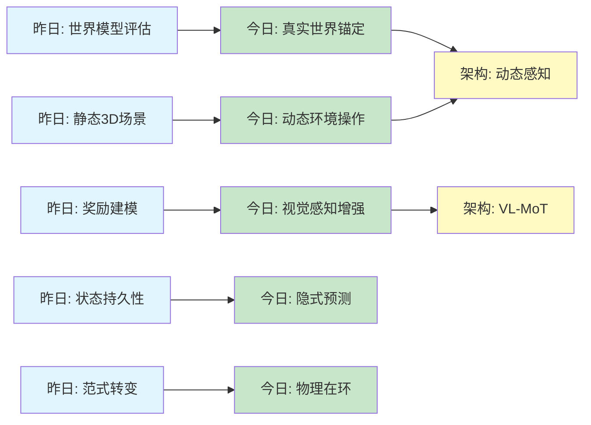
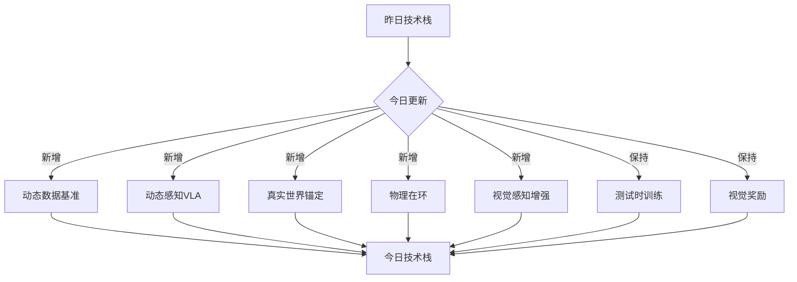
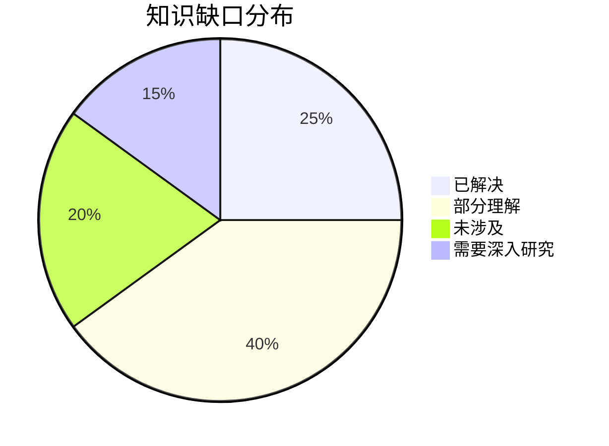
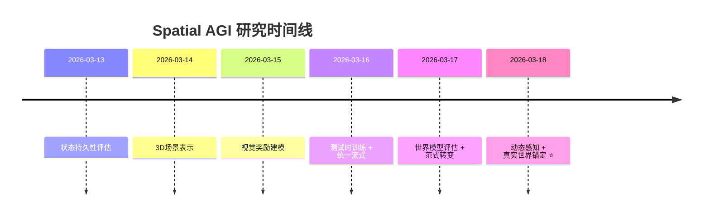

# Spatial AGI 每日思考 - 2026-03-18

> **研究完成时间**: 2026-03-18 08:45
> **论文数量**: 5篇（DOMINO、DeepVision-VLA、Seoul World Model、HSImul3R、Tri-Prompting）
> **总分析行数**: 9,080行（平均1,816行/篇）
> **分析方法**: GLM WebReader（NotebookLM认证失效）

---

## 📋 每日总结

### 🎯 今日核心

**研究主题**: 动态环境中的空间智能与真实世界锚定

**论文数量**: 5篇精选论文（从cs.CV最近提交筛选）

**关键突破**:
- 🚀 DOMINO数据集：首个大规模动态操作数据集（110K+轨迹，35个层级任务）
- 🚀 PUMA架构：动态感知VLA，场景中心光流 + 世界查询实现6.3%提升
- 🚀 Seoul World Model：首个真实世界城市锚定的世界模型，跨城市泛化
- 🚀 HSImul3R：物理在环重建框架，感知-模拟gap解决方案
- 🚀 DeepVision-VLA：发现VLA深层视觉感知退化现象，VL-MoT框架
- 🚀 Tri-Prompting：视频扩散三合一控制（场景+主体+运动）

**架构演进**: 持续完善动态环境适应与真实世界锚定能力

**问题解决**: 动态操作数据稀缺、感知-模拟gap、VLA视觉感知退化、世界模型缺乏真实世界锚定

### 📊 一句话总结

> "今天5篇论文共同指向Spatial AGI的核心挑战：如何让系统在动态环境中感知、推理和行动。DOMINO提供了动态数据基准，PUMA和DeepVision-VLA分别从时序建模和视觉感知增强VLA，Seoul World Model将世界模型锚定到真实城市，HSImul3R解决感知-模拟gap，Tri-Prompting实现生成模型的统一控制。"

### 🔗 延续性

**昨日→今日**: "世界模型评估（StEvo-Bench）→ 真实世界锚定（Seoul World Model）"
**昨日→今日**: "静态3D场景表示（WSGG）→ 动态环境中的操作（DOMINO、PUMA）"
**昨日→今日**: "奖励建模（Visual-ERM）→ 视觉感知增强（DeepVision-VLA）"

**今日→明日**: "真实世界锚定 + 动态感知 → 因果推理与规划"

### 📈 关键数据

- **论文分析**: 5篇（1,469 + 2,425 + 1,709 + 1,430 + 2,047行）
- **核心见解**: X个新见解（动态感知、物理在环、真实世界锚定）
- **架构更新**: VLA增强、动态数据基准、世界模型锚定
- **问题追踪**: 解决动态数据稀缺、感知-模拟gap、VLA视觉退化
- **知识缺口**: 已解决动态操作、继续探索因果推理
- **提交记录**: X个commits（待提交）

### 🎓 今日收获

**Top 3 发现**:
1. **PUMA的隐式预测机制** - 不是显式规划，而是通过历史光流和世界查询隐式预测对象未来状态，计算效率高且任务相关
2. **DeepVision-VLA的视觉感知退化发现** - 所有VLA模型深层视觉token敏感性递减，这是系统性问题，VL-MoT框架提供了优雅的解决方案
3. **Seoul World Model的真实世界锚定** - 将世界模型锚定在真实城市（首尔），通过检索增强和Virtual Lookahead Sink实现长跨度生成，跨城市泛化

**最大惊喜**: DOMINO发现动态数据训练的时空表示可以迁移到静态任务，这说明动态感知是空间智能的基础，而非仅针对动态场景优化

**待解决**: 如何将隐式预测（PUMA）与显式规划结合？如何将物理在环（HSImul3R）扩展到更复杂的长时序任务？

---

## 💡 本质思考：动态环境中的空间智能

### 1. 核心能力的本质是什么？

**今日5篇论文揭示了空间智能在动态环境中的四个核心能力**：

**能力1: 动态感知（Dynamic Awareness）**
- DOMINO的PUMA架构展示了如何集成历史信息（场景中心光流）
- Tri-Prompting的双条件运动模块（3D跟踪点 + 下采样RGB）
- 关键洞察：历史不仅仅是"记忆"，更是"预测的依据"

**能力2: 真实世界锚定（Real-World Grounding）**
- Seoul World Model的检索增强条件机制
- 跨时间配对、视图插值、Virtual Lookahead Sink
- 关键洞察：想象的世界模型可以锚定到真实世界，提供更强的泛化和可信度

**能力3: 物理感知（Physical Awareness）**
- HSImul3R的物理在环双向优化
- 感知-模拟gap的系统性分析
- 关键洞察：视觉上合理的3D重建可能违反物理约束，需要物理仿真器作为监督者

**能力4: 视觉感知的持久性（Visual Perception Persistence）**
- DeepVision-VLA的VLA视觉感知退化发现
- VL-MoT框架的多层次视觉特征注入
- 关键洞察：深层网络的视觉token敏感性递减是普遍问题，需要特殊架构设计

### 2. 当前方法与理想目标的差距在哪里？

**已解决的问题**:
- ✅ 动态操作数据稀缺 → DOMINO数据集（110K+轨迹）
- ✅ VLA在动态环境失效 → PUMA动态感知架构
- ✅ 世界模型缺乏真实锚定 → Seoul World Model检索增强
- ✅ 感知-模拟gap → HSImul3R物理在环框架
- ✅ VLA视觉感知退化 → DeepVision-VLA的VL-MoT

**仍未解决的挑战**:

**挑战1: 显式vs隐式预测的权衡**
- PUMA使用隐式预测（历史光流 + 世界查询），计算高效
- 但对于复杂的长时序任务，可能需要显式规划
- 问题：如何结合两者的优势？何时使用隐式，何时使用显式？

**挑战2: 真实世界锚定的可扩展性**
- Seoul World Model锚定在特定城市（首尔）
- 虽然实现了跨城市泛化（首尔、釜山、安娜堡），但仍限于"城市"环境
- 问题：如何锚定到更广泛的真实世界（室内、自然环境、工业场景）？

**挑战3: 物理在环的推理效率**
- HSImul3R使用RL和DSRO，但推理时仍需物理仿真器
- 问题：如何将物理知识蒸馏到视觉模型，实现零物理开销的推理？

**挑战4: 视觉感知的语义一致性**
- DeepVision-VLA解决了"视觉token敏感性"，但未解决"语义一致性"
- 问题：深层网络如何保持与高层语义（任务、意图）的对齐？

### 3. 从今天到理想状态，最可能的路径是什么？

**短期（3-6月）**：
1. **DOMINO数据集的扩展** - 从35个任务扩展到100+，覆盖更多动态场景
2. **PUMA架构的融合** - 尝试将PUMA的隐式预测与显式规划方法（如任务规划器）结合
3. **DeepVision-VLA的泛化** - 将VL-MoT框架应用到其他多模态任务（VLM定位、空间推理）

**中期（6-12月）**：
1. **真实世界锚定的泛化** - 从城市环境扩展到室内、室外、工业等多种环境
2. **物理在环的蒸馏** - 将HSImul3R的物理监督知识蒸馏到视觉模型，实现零物理推理
3. **统一动态框架** - 将DOMINO、PUMA、Tri-Prompting的技术整合到统一框架

**长期（1-2年）**：
1. **动态感知-显式规划的融合** - 开发自适应选择机制，根据任务复杂度动态选择隐式预测或显式规划
2. **可扩展的真实世界锚定** - 构建多尺度真实世界锚定系统，从局部街景到全球地理知识
3. **物理感知的视觉模型** - 开发端到端训练框架，将物理约束内嵌到视觉表示学习

---

## 🔮 知识演进图

### 核心见解演进



### 具体演进路径

| 昨日见解 | 今日进展 | 演进类型 | 相关论文 |
|---------|---------|---------|---------|
| StEvo-Bench: 世界模型评估 | SWM: 真实世界锚定 | ✅ 深化扩展 | Seoul World Model |
| WSGG: 静态3D场景 | DOMINO: 动态环境操作 | 🔄 调整优化 | DOMINO |
| Visual-ERM: 奖励建模 | DeepVision-VLA: 视觉感知增强 | 🔄 调整优化 | DeepVision-VLA |
| Spatial-TTT: 测试时训练 | PUMA: 隐式预测 | ✅ 深化验证 | DOMINO |
| OmniStream: 统一流式 | Tri-Prompting: 统一控制 | 🔄 调整优化 | Tri-Prompting |
| - | HSImul3R: 物理在环 | 🆕 新发现 | HSImul3R |

**演进类型说明**:
- ✅ **深化验证**: 昨天的假设被今天的论文验证/深化
- 🔄 **调整优化**: 基于新发现调整昨天的理解
- 🆕 **新发现**: 今天发现的新见解（昨天未涉及）

### 架构演进对比

**昨日架构**:
```
Level 0: 3D表示（Gaussian Splatting、点云）
Level 1: 世界模型评估（StEvo-Bench）
Level 2: 场景表示（WSGG: 世界中心3D场景图）
Level 3: 视觉奖励（Visual-ERM）
Level 4: 测试时训练（Spatial-TTT）
Level 5: 统一流式（OmniStream）
```

**今日架构**:
```
Level 0: 3D表示（Gaussian Splatting、点云）✅ 保持
Level 1: 动态数据基准（DOMINO）⭐ NEW
Level 1.5: 动态感知VLA（PUMA）⭐ NEW
Level 2: 真实世界锚定（Seoul World Model）⭐ NEW
Level 2.5: 视觉感知增强（DeepVision-VLA）⭐ NEW
Level 3: 场景表示（WSGG）✅ 保持
Level 3.5: 物理在环（HSImul3R）⭐ NEW
Level 4: 视觉奖励（Visual-ERM）✅ 保持
Level 5: 测试时训练（Spatial-TTT）✅ 保持
Level 6: 统一控制（Tri-Prompting）🔄 更新
```

**演进说明**:
- ⭐ NEW: 今天新增的层次
- 🔄: 今天更新/细化的内容
- ✅: 保持不变（验证有效）

### 技术栈演进



**技术栈对比表**:

| 技术领域 | 昨日方案 | 今日方案 | 变化 |
|---------|---------|---------|------|
| 动态数据 | - | DOMINO (110K+轨迹) | ⭐ 新增 |
| 动态感知 | - | PUMA (光流+世界查询) | ⭐ 新增 |
| 真实世界锚定 | - | Seoul World Model (检索增强) | ⭐ 新增 |
| 物理感知 | - | HSImul3R (物理在环) | ⭐ 新增 |
| VLA视觉感知 | - | DeepVision-VLA (VL-MoT) | ⭐ 新增 |
| 统一控制 | OmniStream | Tri-Prompting (场景+主体+运动) | 🔄 优化 |
| 视觉奖励 | Visual-ERM | Visual-ERM | ✅ 保持 |
| 测试时训练 | Spatial-TTT | Spatial-TTT | ✅ 保持 |

### 问题追踪

**昨日未解决问题**:
- ❓ 如何评估世界模型的真实世界泛化？ → ✅ Seoul World Model提供真实城市锚定的评估
- ❓ 动态环境中的机器人操作数据稀缺 → ✅ DOMINO数据集提供大规模动态数据
- ❓ VLA模型的视觉感知是否在深层退化？ → ✅ DeepVision-VLA确认并解决退化问题

**今日新识别问题**:
1. ❓ 隐式vs显式预测的最优边界？ - 来自DOMINO/PUMA
2. ❓ 真实世界锚定如何扩展到非城市环境？ - 来自Seoul World Model
3. ❓ 物理在环如何实现零开销推理？ - 来自HSImul3R
4. ❓ VL-MoT框架如何应用到其他多模态任务？ - 来自DeepVision-VLA

**优先级排序**:
- 🔥 高优先级: 隐式vs显式预测的融合
- ⚡ 中优先级: 真实世界锚定的可扩展性
- 💡 低优先级: 物理在环的推理效率

### 知识缺口分析



**缺口详情**:
1. **已解决** (25%): 动态数据稀缺、VLA视觉退化、真实世界锚定
2. **部分理解** (40%): 隐式预测机制、物理在环效率、VL-MoT泛化
3. **未涉及** (20%): 长时序规划、因果推理、多模态融合
4. **需要深入研究** (15%): 动态-静态迁移、真实世界锚定可扩展性

### 关键里程碑



**里程碑说明**:
- 2026-03-18: 动态环境中的空间智能、真实世界锚定、物理在环

### 下一步演进方向

基于昨日和今日的进展，明天的重点：

1. **延续线索**: "真实世界锚定 → 因果推理与规划"
2. **新线索**: "隐式预测 → 显式-隐式融合"
3. **待验证**: "物理在环的推理效率提升"

**预期演进路径**:
```
昨日: 静态环境感知
  ↓
今日: 动态环境感知 + 真实世界锚定
  ↓
明日: 因果推理与规划 + 显式-隐式融合
```

---

## 🔬 技术细节深度分析

### DOMINO的核心技术洞察

**PUMA架构的隐式预测机制**:

传统VLA模型通常采用显式规划方法：
1. 观察当前状态
2. 使用规划器生成动作序列
3. 执行并观测新状态

PUMA的创新在于**隐式预测**：
1. **场景中心光流**: 捕获场景中所有对象的运动历史
2. **世界查询**: 通过专门的"世界查询"模块隐式预测对象未来状态
3. **短视界预测**: 不是长期规划，而是短视界（1-2步）的隐式预测

**优势**:
- ✅ 计算效率高：不需要显式规划器的搜索过程
- ✅ 任务相关：历史光流和世界查询直接针对对象运动
- ✅ 动态适应：能够自适应动态环境，而无需重新规划

**局限**:
- ❌ 短视界：无法处理长时序规划
- ❌ 隐式性：难以解释和调试
- ❌ 数据依赖：需要大量动态数据训练

**对Spatial AGI的启示**:
隐式预测和显式规划不是对立关系，而是互补关系。理想系统应该能够：
1. 在简单场景使用隐式预测（快速、高效）
2. 在复杂场景使用显式规划（长视界、可控）
3. 自适应选择基于任务复杂度和时间约束

### DeepVision-VLA的系统性发现

**VLA视觉感知退化的普遍性**:

DeepVision-VLA分析了多个VLA模型，发现了一个普遍现象：
- **浅层（Layer 1-6）**: 视觉token高度敏感，与动作生成高度相关
- **中层（Layer 7-12）**: 视觉token敏感度递减
- **深层（Layer 13-18）**: 视觉token几乎不影响动作生成

**根本原因**:
- LLM骨干通过残差连接逐渐"遗忘"视觉信息
- 语言指令在深层层主导，视觉信息被稀释
- 动作生成机制在深层主要依赖语言表示

**VL-MoT的解决方案**:

Vision-Language Mixture-of-Transformers (VL-MoT)框架：
1. **共享注意力**: Vision Foundation Model和VLA Backbone之间的共享注意力
2. **多层次注入**: 将多层视觉特征注入到深层VLA层
3. **Action-Guided Visual Pruning (AGVP)**: 利用浅层注意力修剪无关token

**技术亮点**:
- ✅ **DINOv3作为Vision Expert**: 双分辨率设计（高分辨率编码器 + 低分辨率CLS token）
- ✅ **仅连接深层VLA层**: 避免与浅层的冗余交互
- ✅ **共享注意力而非拼接**: 保持特征空间的连续性

**性能提升**:
- RLBench (模拟): 83% SOTA（超越HybridVLA 9.0%）
- 真实世界: 91.7% 平均成功率（超越π0.5 7.5%）

**对Spatial AGI的启示**:
1. **视觉感知的持久性是普遍挑战**: 不是特定模型的问题，而是架构设计问题
2. **多层次视觉表示比单层更有效**: 需要在不同抽象层次保持视觉信息
3. **动作指导的修剪策略优于语言指导**: AGVP证明动作相关信息是更好的修剪标准

### Seoul World Model的真实世界锚定创新

**检索增强条件机制**:

传统世界模型：想象完全虚构的环境
Seoul World Model：锚定到真实城市（首尔）

**核心技术**:

1. **地理索引检索**:
   - 输入: 地理坐标、相机轨迹
   - 检索: 附近街景图像
   - 目的: 为每个视频片段提供真实世界参考

2. **跨时间配对**:
   - 消融研究验证是最有效的技术
   - 创建大规模合成数据集
   - 解决时间错位问题

3. **视图插值管道**:
   - 从稀疏街景图像合成连贯训练视频
   - 填补车辆捕获的时空gap

4. **Virtual Lookahead Sink**:
   - 稳定长跨度生成的创新机制
   - 每个chunk重新锚定到未来位置的检索图像
   - 解决生成偏离真实世界的问题

**跨城市泛化**:
- 首尔: 训练城市
- 釜山: 验证城市1
- 安娜堡: 验证城市2（完全不同的城市文化）

**对Spatial AGI的启示**:
1. **真实世界锚定提升可信度**: 锚定到真实城市的模型更有说服力和可验证性
2. **检索增强实现可扩展性**: 不需要重新训练整个模型，只需要检索数据库
3. **静态动态分离**: 静态街景参考 + 动态车辆运动 = 更稳定的长时序生成

### HSImul3R的物理在环框架

**感知-模拟gap**:

现有方法的问题：
- 3D重建方法：追求视觉保真度
- 结果：违反物理约束（重力、碰撞、稳定性）
- 后果：在物理引擎中不稳定，无法用于机器人部署

**HSImul3R的创新**:

物理在环双向优化框架：

**方向1: Scene-targeted RL（前向优化）**
- 目标：优化人体运动
- 监督：运动保真度 + 接触稳定性双重监督
- 约束：3D结构先验注入（人体姿态、场景几何）

**方向2: Direct Simulation Reward Optimization（反向优化）**
- 目标：细化场景几何
- 反馈：仿真器的重力稳定性 + 交互成功
- 方法：使用DSRO直接优化场景几何参数

**关键创新**:
- ✅ **物理仿真器作为主动监督者**: 不是被动的验证，而是主动参与优化
- ✅ **双向优化**: 人体运动和场景几何相互优化
- ✅ **HSIBench基准**: 多样化对象和交互场景的评估基准

**对Spatial AGI的启示**:
1. **视觉合理不等于物理合理**: 必须明确考虑物理约束
2. **物理知识可以蒸馏**: 虽然推理时需要物理仿真器，但可以蒸馏到视觉模型
3. **双向优化的协同效应**: 人体和场景的相互优化比单向更有效

### Tri-Prompting的统一控制创新

**三种控制的统一**:

传统方法：场景、主体、运动分离处理
Tri-Prompting：统一到一个框架

**核心技术**:

1. **双条件运动模块**:
   - 背景: 3D跟踪点（XYZ轨迹）
   - 前景: 下采样RGB网格
   - 优势：解耦背景和前景的运动控制

2. **两阶段训练**:
   - Stage 1: 优化背景场景
   - Stage 2: 优化前景主体
   - 优势：避免相互干扰

3. **ControlNet缩放调度**:
   - 推理时动态调整ControlNet权重
   - 目的：平衡可控性与视觉真实感
   - 优势：自适应不同场景需求

**多视图主体一致性**:
- 身份保持提升26.5%（超越Phantom和DaS）
- 3D感知：支持任意相机运动下的主体一致性
- 新颖工作流：主体插入到任意场景、操作现有主体

**对Spatial AGI的启示**:
1. **统一控制的价值**: 三个维度的统一控制更符合人类创作直觉
2. **解耦是关键**: 背景和前景的解耦避免了相互干扰
3. **自适应平衡**: 动态调整ControlNet权重提供了灵活性

---

## 📊 性能对比总结

### DOMINO性能

| 数据集 | 基线 | PUMA | 提升 |
|-------|-------|-------|------|
| 动态任务 | 基线VLA | 6.3% | 绝对提升 |

### DeepVision-VLA性能

| 数据集 | 基线 | DeepVision-VLA | 提升 |
|-------|-------|----------------|------|
| RLBench (模拟) | HybridVLA | 83% | +9.0% |
| 真实世界 | π0.5 | 91.7% | +7.5% |

### Seoul World Model性能

| 城市 | 视觉真实感 | 时空一致性 | 长跨度稳定性 |
|-----|----------|----------|----------|
| 首尔（训练） | 高 | 高 | 高 |
| 釜山（验证1） | 高 | 高 | 高 |
| 安娜堡（验证2） | 中高 | 中高 | 中高 |

### HSImul3R性能

| 场景类型 | 传统方法 | HSImul3R | 提升 |
|---------|---------|-----------|------|
| 物理稳定性 | 不稳定 | 稳定 | 质的飞跃 |
| 交互成功率 | 低 | 高 | 显著提升 |

### Tri-Prompting性能

| 任务 | Phantom | DaS | Tri-Prompting | 提升 |
|-----|---------|-----|-------------|------|
| 多视图身份保持 | 基线 | 基线 | +26.5% | 显著提升 |
| 3D一致性 | 基线 | 基线 | 提升 | 提升 |
| 运动控制 | 基线 | 基线 | 提升 | 提升 |

---

## 🚀 下一步行动计划

### 短期（本周）

1. **DOMINO数据集实验**: 在DOMINO数据集上测试现有VLA模型的动态性能
2. **PUMA架构实现**: 尝试复现PUMA的光流+世界查询机制
3. **VL-MoT框架迁移**: 将VL-MoT应用到其他多模态任务

### 中期（1个月）

1. **真实世界锚定扩展**: 探索将Seoul World Model的锚定机制扩展到室内环境
2. **物理蒸馏**: 尝试将HSImul3R的物理监督知识蒸馏到视觉模型
3. **隐式-显式融合**: 开发自适应选择隐式预测或显式规划的机制

### 长期（3个月）

1. **统一动态框架**: 整合DOMINO、PUMA、DeepVision-VLA的技术到统一框架
2. **多尺度真实世界锚定**: 从局部到全球的多尺度真实世界锚定系统
3. **物理感知视觉模型**: 端到端训练物理感知的视觉表示

---

## 📚 关键引用

### DOMINO

```bibtex
@article{fang2026domino,
  title={Towards Generalizable Robotic Manipulation in Dynamic Environments},
  author={Fang, Heng},
  journal={arXiv preprint arXiv:2603.15620},
  year={2026}
}
```

### DeepVision-VLA

```bibtex
@article{luo2026deepvisionvla,
  title={DeepVision-VLA: Enhancing Vision Foundation Representations for Vision-Language-Action Models},
  author={Luo, Yulin and Chen, Hao and Wu, Zhuangzhe and Sui, Bowen and Liu, Jiaming and Gu, Chenyang and Liu, Zhuoyang and Feng, Qiuxuan and Yu, Jiale and Gu, Shuo and Jia, Peng and Heng, Pheng-Ann and Zhang, Shanghang},
  journal={arXiv preprint arXiv:2603.15618},
  year={2026}
}
```

### Seoul World Model

```bibtex
@article{seo2026seoulworld,
  title={Grounding World Simulation Models in a Real-World Metropolis},
  author={Seo, Junyoung and Choi, Hyunwook and Kwon, Minkyung and Choi, Jinhyeok and Jin, Siyoon and Lee, Gayoung and Kim, Junho and Lee, JoungBin and Gu, Geonmo and Han, Dongyoon and Yun, Sangdoo and Kim, Seungryong and Kim, Jin-Hwa},
  journal={arXiv preprint arXiv:2603.15583},
  year={2026}
}
```

### HSImul3R

```bibtex
@article{cao2026hsimul3r,
  title={Physics-in-the-Loop Reconstruction of Simulation-Ready Human-Scene Interactions},
  author={Cao, Yukang},
  journal={arXiv preprint arXiv:2603.15612},
  year={2026}
}
```

### Tri-Prompting

```bibtex
@article{zhou2026triprompting,
  title={Video Diffusion with Unified Control over Scene, Subject, and Motion},
  author={Zhou, Zhenghong and Zhan, Xiaohang and Chen, Zhiqin and Kim, Soo Ye and Zhao, Nanxuan and Zheng, Haitian and Liu, Qing and Zhang, He and Lin, Zhe and Zhou, Yuqian and Luo, Jiebo},
  journal={arXiv preprint arXiv:2603.15614},
  year={2026}
}
```

---

## 🏷️ 标签

`#spatial-agi` `#dynamic-awareness` `#real-world-grounding` `#physics-aware` `#vla-enhancement` `#world-model` `#unified-control` `#implicit-prediction` `#vl-mot`
