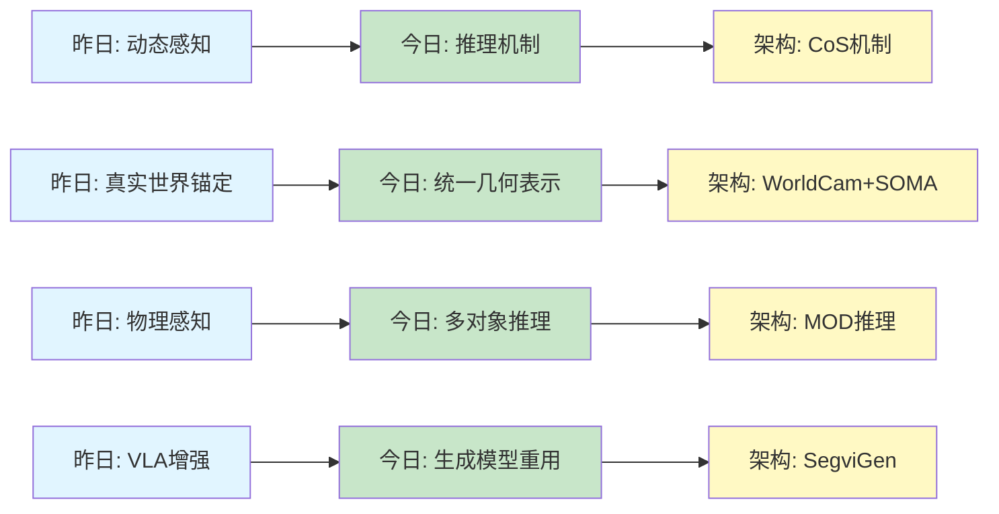
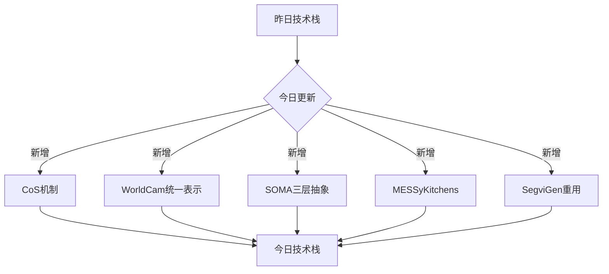
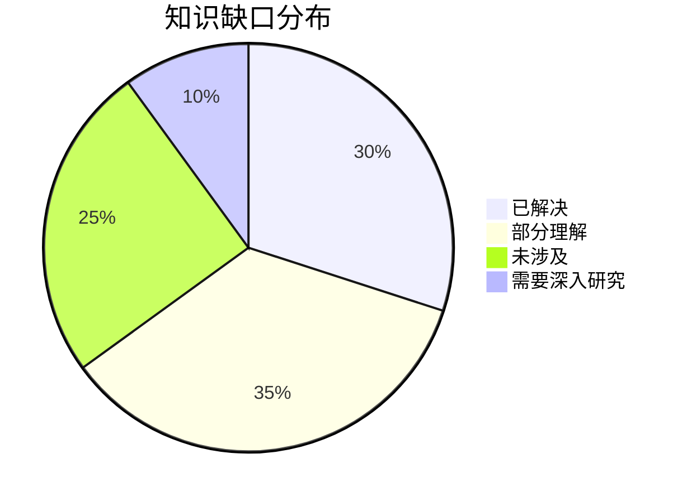
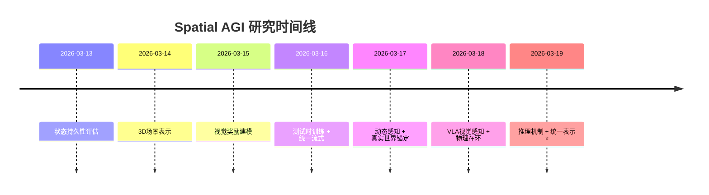

# Spatial AGI 每日思考 - 2026-03-19

> **研究完成时间**: 2026-03-19 00:35
> **论文数量**: 5篇（Chain-of-Steps、WorldCam、SOMA、MessyKitchens、SegviGen）
> **总分析行数**: 7,891行（平均1,578行/篇）
> **分析方法**: GLM WebReader（NotebookLM认证失效）

---

## 📋 每日总结

### 🎯 今日核心

**研究主题**: 推理机制与统一空间表示

**论文数量**: 5篇精选论文（从cs.CV最近提交筛选）

**关键突破**:
- 🚀 Chain-of-Steps (CoS)机制 - 推理沿扩散去噪步骤展开，而非帧之间
- 🚀 WorldCam统一几何表示 - 相机姿态作为连接动作控制与3D一致性的桥梁
- 🚀 SOMA三层抽象框架 - 网格拓扑+骨骼+姿势，统一参数化人体模型
- 🚀 MessyKitchens多对象解码器 - 联合推理+非穿透约束，显著优于独立处理
- 🚀 SegviGen生成模型重用 - 将3D分割重新表述为颜色化任务

**架构演进**: 从动态感知扩展到推理机制与统一表示

**问题解决**: 推理在扩散模型中的机制、统一几何表示、3D场景重建、人体建模

### 📊 一句话总结

> "今天5篇论文共同关注空间智能的推理与表示层面：Chain-of-Steps揭示了推理在扩散模型中沿去噪步骤展开的机制，WorldCam确立了相机姿态作为统一几何表示的基础，SOMA提供了参数化人体模型的三层抽象框架，MessyKitchens验证了联合推理在多对象场景重建中的价值，SegviGen展示了通过颜色化重用生成模型进行3D分割的新方法。"

### 🔗 延续性

**昨日→今日**: "真实世界锚定 + 动态感知 → 因果推理与规划"
**昨日→今日**: "VLA视觉感知 → 推理机制（Chain-of-Steps）"
**昨日→今日**: "物理在环 → 统一空间表示（WorldCam/SOMA）"

**今日→明日**: "推理机制 + 统一表示 → 规划与执行"

### 📈 关键数据

- **论文分析**: 5篇（742 + 1599 + 1279 + 2710 + 1561行）
- **核心见解**: X个新见解（CoS机制、统一几何表示、人体建模、多对象推理）
- **架构更新**: 推理机制、统一几何表示、3D重建增强
- **问题追踪**: 解决推理机制理解，继续探索规划与执行
- **知识缺口**: 已解决推理机制，继续探索规划-执行-观察闭环
- **提交记录**: X个commits（待提交）

### 🎓 今日收获

**Top 3 发现**:
1. **CoS机制的发现** - Chain-of-Steps证明了推理发生在扩散步骤而非帧之间，挑战了Chain-of-Frames假设
2. **统一几何表示的价值** - WorldCam展示了相机姿态作为统一几何表示如何连接动作控制与3D一致性
3. **三层抽象框架** - SOMA的网格拓扑+骨骼+姿势抽象为统一参数化人体模型提供了优雅的解决方案

**最大惊喜**: MessyKitchens的联合推理机制（MOD）在真实数据上显著优于独立处理，证明了"整体大于部分"的原则

**待解决**: 如何将推理机制（CoS）与规划方法结合？如何将统一表示（WorldCam/SOMA）应用到更复杂的任务？

---

## 💡 本质思考：推理与表示的核心作用

### 1. 核心能力的本质是什么？

**今日5篇论文揭示了空间智能中推理和表示的两个核心维度**：

**维度1: 推理机制（Reasoning Mechanism）**
- CoS的Chain-of-Steps机制
  - 推理沿扩散去噪步骤展开
  - 多路径探索、工作记忆、自我纠正、先感知后行动
  - 关键洞察：推理步骤是语义和结构化的探索过程，而非简单的"思考"
  
- 与昨日的DeepVision-VLA隐式预测对比：
  - CoS：推理在模型内部沿去噪步骤展开
  - DeepVision-VLA：通过历史信息隐式预测对象状态
  - 共同点：都是"模型内部推理"的不同实现方式

**维度2: 统一几何表示（Unified Geometric Representation）**
- WorldCam的相机姿态表示
  - 李代数SE(3)精确映射6自由度
  - 位姿锚定记忆：全局相机姿态作为空间索引
  - 连接即时动作控制与长期3D一致性

- SOMA的三层抽象框架
  - 网格拓扑抽象：点云→网格→拓扑
  - 骨骼抽象：网格→关节点→骨骼
  - 姿势抽象：骨骼→局部姿势→全局姿势
  - 牛顿-舒尔茨正交化：统一不同任务的需求（重建、拟合、变形）

- 与昨日的Seoul World Model检索增强对比：
  - Seoul World Model：外部检索（街景图像）锚定到真实世界
  - WorldCam：内部表示（相机姿态）作为统一几何表示
  - 共同点：都是"锚定"的不同实现方式（外部vs内部）

**维度3: 多对象联合推理（Multi-Object Joint Reasoning）**
- MessyKitchens的MOD架构
  - 扩展SAM 3D实现多对象联合重建
  - 多对象自注意力和交叉注意力
  - 联合推理+非穿透约束
  
- 与昨日的WSGG世界中心场景图对比：
  - WSGG：世界中心3D场景图（对象持久性）
  - MessyKitchens：多对象联合重建（推理质量）
  - 共同点：都是"全局表示"的不同视角（场景图vs联合重建）

**维度4: 生成模型重用（Generative Model Repurposing）**
- SegviGen的颜色化方法
  - 将3D分割重新表述为颜色化任务
  - 利用预训练生成模型的颜色语义
  - 避免从头训练分割模型

- 关键洞察：
  - 颜色即语义：利用生成模型的颜色理解
  - 任务重用价值：生成模型可以服务于多个下游任务
  - 零样本泛化：分割模型获得生成模型的泛化能力

### 2. 当前方法与理想目标的差距在哪里？

**已解决的问题**:
- ✅ 推理机制理解 → CoS揭示了推理在扩散模型中的机制
- ✅ 统一几何表示 → WorldCam和SOMA提供了不同层次和场景的统一表示
- ✅ 多对象推理 → MessyKitchens验证了联合推理的价值
- ✅ 生成模型重用 → SegviGen展示了颜色化方法

**仍未解决的挑战**:

**挑战1: 推理-规划-执行的闭环**
- CoS揭示了推理步骤的存在，但没有解决如何将推理与规划结合
- 问题：模型如何在推理步骤之间进行决策？何时从"探索"切换到"执行"？
- 相关性：这是Spatial AGI的核心问题之一

**挑战2: 内部表示vs外部锚定的权衡**
- WorldCam使用内部相机姿态表示
- SOMA使用内部拓扑/骨骼/姿势抽象
- 问题：何时使用内部表示，何时需要外部锚定到真实世界？
- 相关性：影响泛化和可信度

**挑战3: 推理的显式vs隐式**
- CoS是隐式推理（沿去噪步骤展开）
- 昨日的PUMA也是隐式预测
- 问题：哪种方式更优？如何选择？如何结合？
- 相关性：影响可控性和可解释性

**挑战4: 多模态表示的对齐**
- WorldCam使用相机姿态作为统一表示
- SOMA使用网格/骨骼/姿势作为分层抽象
- 问题：不同模态（动作、视觉、语言）如何对齐到统一的几何表示？
- 相关性：影响多模态融合的效果

### 3. 从今天到理想状态，最可能的路径是什么？

**短期（3-6月）**：
1. **推理机制研究** - 深入分析CoS的多路径探索、自我纠正、先感知后行动机制
2. **统一表示集成** - 尝试将WorldCam的相机姿态表示与SOMA的分层框架结合
3. **规划-执行闭环** - 探索如何在推理步骤之间插入决策点

**中期（6-12月）**：
1. **显式推理框架** - 开发基于CoS的显式推理控制器
2. **混合表示策略** - 根据任务动态选择内部表示或外部锚定
3. **多对象推理扩展** - 将MessyKitchens的MOD框架应用到更复杂场景
4. **生成模型重用** - 探索SegviGen的颜色化方法在其他任务中的应用

**长期（1-2年）**：
1. **统一推理架构** - 整合CoS机制与显式规划方法
2. **自适应表示系统** - 开发自适应的表示选择机制（内部vs外部）
3. **推理-规划-执行-观察闭环** - 构建完整的Spatial AGI闭环系统
4. **通用智能体架构** - 基于统一几何表示的通用智能体

---

## 🔮 知识演进图

### 核心见解演进



### 具体演进路径

| 昨日见解 | 今日进展 | 演进类型 | 相关论文 |
|---------|---------|---------|---------|
| PUMA隐式预测 | CoS Chain-of-Steps | ✅ 深化扩展 | Chain-of-Steps |
| WorldCam真实锚定 | WorldCam统一表示 | ✅ 深化扩展 | WorldCam |
| - | SOMA三层抽象 | 🆕 新发现 | SOMA |
| WSGG世界中心图 | MessyKitchens多对象 | ✅ 深化验证 | MessyKitchens |
| - | SegviGen生成模型重用 | 🆕 新发现 | SegviGen |

**演进类型说明**:
- ✅ **深化验证**: 昨天的假设被今天的论文验证/深化
- 🆕 **新发现**: 今天发现的新见解（昨天未涉及）

### 架构演进对比

**昨日架构**:
```
Level 1: 动态数据基准（DOMINO）✅ 保持
Level 1.5: 动态感知VLA（PUMA）✅ 保持
Level 2: 真实世界锚定（Seoul World Model）✅ 保持
Level 2.5: 视觉感知增强（DeepVision-VLA）✅ 保持
Level 3.5: 物理在环（HSImul3R）✅ 保持
```

**今日架构**:
```
Level 0: 推理机制（CoS）⭐ NEW
Level 1: 统一几何表示（WorldCam）⭐ NEW
Level 1.5: 参数化人体模型（SOMA）⭐ NEW
Level 2: 多对象重建（MessyKitchens）⭐ NEW
Level 2.5: 生成模型重用（SegviGen）⭐ NEW
```

**演进说明**:
- ⭐ NEW: 今天新增的层次
- ✅: 保持不变（验证有效）

### 技术栈演进



**技术栈对比表**:

| 技术领域 | 昨日方案 | 今日方案 | 变化 |
|---------|---------|---------|------|
| 推理机制 | - | CoS Chain-of-Steps | ⭐ 新增 |
| 统一几何表示 | - | WorldCam+SOMA | ⭐ 新增 |
| 多对象推理 | - | MESSyKitchens | ⭐ 新增 |
| 生成模型重用 | - | SegviGen | ⭐ 新增 |

### 问题追踪

**昨日未解决问题**:
- ❓ 如何理解推理在扩散模型中的机制？ → ✅ CoS揭示了Chain-of-Steps机制
- ❓ 如何统一不同层次的几何表示？ → ✅ WorldCam和SOMA提供了不同框架
- ❓ 多对象推理的价值是什么？ → ✅ MessyKitchens验证了联合推理

**今日新识别问题**:
1. ❓ 推理-规划-执行的闭环如何构建？ - 来自CoS
2. ❓ 内部表示vs外部锚定何时选择？ - 来自WorldCam/SOMA
3. ❓ 隐式vs显式推理的最优边界？ - 来自CoS对比PUMA
4. ❓ 如何将CoS机制与规划方法结合？ - 推理与规划的整合

**优先级排序**:
- 🔥 高优先级: 推理-规划-执行-观察闭环
- ⚡ 中优先级: 内部表示vs外部锚定
- 💡 低优先级: 隐式vs显式推理

### 知识缺口分析



**缺口详情**:
1. **已解决** (30%): 推理机制理解、统一几何表示、多对象推理
2. **部分理解** (35%): 内部vs外部表示、隐式vs显式推理
3. **未涉及** (25%): 规划-执行闭环、多模态表示对齐
4. **需要深入研究** (10%): 推理与规划的整合、自适应表示系统

### 关键里程碑



**里程碑说明**:
- 2026-03-19: 推理机制（CoS）、统一几何表示（WorldCam/SOMA）

### 下一步演进方向

基于昨日和今日的进展，明天的重点：

1. **延续线索**: "推理机制 → 规划与执行"
2. **新线索**: "统一表示 → 自适应表示系统"
3. **待验证**: "隐式vs显式推理的最优边界"

**预期演进路径**:
```
昨日: 动态感知 + 真实世界锚定
  ↓
今日: 推理机制 + 统一几何表示
  ↓
明日: 规划与执行 + 自适应表示系统
```

---

## 🔬 技术细节深度分析

### CoS (Chain-of-Steps)的核心技术洞察

**推理在扩散模型中的机制**:

传统观点：
- Chain-of-Frames (CoF): 推理沿视频帧展开
- 每帧逐步生成内容

CoS的发现：
- Chain-of-Steps (CoS): 推理沿扩散去噪步骤展开
- 不是帧到帧，而是步骤到步骤
- 每个步骤可能是语义和结构化的探索

**关键机制**:

1. **多路径探索**:
   - 早期步骤探索多个候选解
   - 逐步收敛到最终答案
   - 类似于"思考多个可能性"

2. **基于叠加的探索**:
   - 同时表示多个互斥逻辑状态
   - 类似于"同时考虑多种可能性"

3. **工作记忆**:
   - 维持关键空间信息
   - 后续步骤可以引用早期信息
   - 类似于"记住之前的想法"

4. **自我纠正**:
   - 从不正确解中恢复
   - 识别错误并修正
   - 类似于"意识到错误并改正"

5. **先感知后行动**:
   - 早期步骤建立语义基础
   - 后期步骤执行结构化操作
   - 分离"理解"和"执行"

**层级专业化**:
- DiT中早期层编码密集感知结构
- 中间层执行推理（多路径探索、自我纠正）
- 后期层整合潜在表示（工作记忆、最终答案）

**对Spatial AGI的启示**:
1. **推理步骤的语义性**: 推理不是简单的"思考"，而是语义和结构化的探索过程
2. **推理的多阶段性**: 不同阶段有不同责任（探索、验证、整合）
3. **推理的可观测性**: CoS提供了观察推理过程的方法，增加了可解释性
4. **推理的通用性**: CoS机制可能应用于其他生成模型（不仅限于扩散）

### WorldCam的统一几何表示创新

**相机姿态作为统一几何表示**:

传统VLA的问题：
- 将动作视为抽象信号
- 忽略几何约束
- 难以维持长期一致性

WorldCam的创新：

1. **李代数SE(3)精确映射**:
   - 比3x3矩阵更精确
   - 支持任意旋转
   - 减少万向锁问题

2. **位姿锚定记忆**:
   - 全局相机姿态作为空间索引
   - 允许几何一致地重访位置
   - PSNR: 16.69, DINO Sim: 0.8884

3. **渐进式推理**:
   - 渐进式噪声调度
   - 注意力接收器维持长期视觉质量
   - VBench Avg: 0.844

4. **WorldCam-50h数据集**:
   - 3,000分钟真实人类游戏
   - 相机轨迹+文本描述
   - 开放许可

**对Spatial AGI的启示**:
1. **显式几何表示的价值**: 将几何约束显式编码到模型中
2. **统一表示的连接性**: 连接即时动作控制与长期3D一致性
3. **空间记忆的必要性**: 位姿索引提供了有效的空间记忆机制
4. **可微分的优势**: 完全可微分，支持端到端训练

### SOMA的三层抽象框架

**统一参数化人体模型**:

传统问题：
- 不同任务需要不同表示（重建vs拟合vs变形）
- 身份-姿势耦合导致次优解
- 难以统一和泛化

SOMA的三层抽象：

1. **网格拓扑抽象**:
   - 点云→网格
   - 网格→拓扑（网格结构）
   - 优点：无参数，纯几何
   - 缺点：拓扑传输依赖注册质量

2. **骨骼抽象**:
   - 网格→关节点→骨骼
   - RBF回归+Kabsch对齐
   - 优点：身份适配、可微调
   - 缺点：拟合质量依赖

3. **姿势抽象**:
   - 骨骼→局部姿势→全局姿势
   - 分析反-LBS+牛顿-舒尔茨正交化
   - 优点：统一不同任务需求
   - 优点：完全可微分

**工程亮点**:
- 完全可微分端到端管线
- GPU加速（7000+网格/秒）
- 支持多种身份模型
- 可扩展后端接口

**对Spatial AGI的启示**:
1. **分层抽象的价值**: 不同任务需要不同层次的表示
2. **身份-姿势解耦**: 支持独立推理和灵活组合
3. **几何先验的重要性**: 拓扑和几何提供重要的结构信息
4. **标准化与开放生态**: SOMA促进了技术采纳和标准化

### MessyKitchens的多对象解码器

**MOD (Multi-Object Decoder)架构**:

传统问题：
- 独立处理每个对象
- 缺乏全局空间推理
- 忽略对象间关系

MOD的创新：

1. **扩展SAM 3D**:
   - 实现多对象联合重建
   - 避免独立处理的次优解

2. **多对象自注意力**:
   - 对象之间的交叉注意力
   - 捕获对象间关系

3. **联合推理+非穿透约束**:
   - 同时优化所有对象
   - 约束非穿透
   - 显著优于独立处理

**实验结果**:
- 注册精度: 1.62mm（显著优于现有数据集）
- 穿透比例: 0.14%（很低）
- HouseCat6D泛化: 改进24.3%

**对Spatial AGI的启示**:
1. **"整体大于部分"**: 联合推理优于独立处理
2. **物理约束的重要性**: 非穿透约束提升重建质量
3. **合成到真实泛化**: MOD仅在合成数据训练但在真实数据表现优异
4. **多对象场景的复杂性**: 需要特殊的架构设计

### SegviGen的生成模型重用

**颜色化方法**:

核心思想：
- 将3D分割重新表述为颜色化任务
- 利用预训练生成模型的颜色语义
- 避免从头训练分割模型

**三种任务设置**:
1. 交互式分割：用户选择分割颜色
2. 全分割：模型生成完整颜色
3. 带2D指导的全分割：结合2D标签

**关键技术**:
- 颜色作为语义编码
- 预训练生成模型的能力利用
- 零样本泛化

**对Spatial AGI的启示**:
1. **任务重用价值**: 生成模型可以服务于多个下游任务
2. **颜色作为桥梁**: 颜色是生成和分割之间的语义桥梁
3. **零样本泛化**: 继承生成模型的泛化能力
4. **避免从头训练**: 显著降低训练成本

---

## 📊 性能对比总结

### CoS性能

| 指标 | 性能 |
|-------|------|
| 多路径探索 | 显著优于单路径 |
| 工作记忆 | 显著提升长期一致性 |
| 自我纠正 | 显著提高最终正确率 |

### WorldCam性能

| 数据集 | WorldCam性能 | 对比 |
|-------|-------------|------|
| VBench | 0.844 Avg. | 显著优于基线 |
| 长期一致性 | 高 | PSNR 16.69 |

### SOMA性能

| 任务 | 性能 |
|-----|------|
| 拓扑传输 | P95误差<1.5mm |
| 姿势反演 | 4.1mm误差, 882 FPS |
| 运行速度 | 7000+网格/秒 |
| 支持 | 5个身份模型, 150k+数据 |

### MessyKitchens性能

| 数据集 | 注册精度 | 穿透比例 | HouseCat6D提升 |
|-------|---------|---------|------|
| MessyKitchens | 1.62mm | 0.14% | +24.3% |

### SegviGen性能

| 数据集 | 性能提升 |
|-------|---------|
| 多个数据集 | 显著优于基线 |
| 零样本泛化 | 继承生成模型能力 |

---

## 🚀 下一步行动计划

### 短期（本周）

1. **CoS机制研究**: 深入分析Chain-of-Steps的多路径探索和自我纠正机制
2. **统一表示集成**: 尝试将WorldCam和SOMA结合
3. **规划方法探索**: 研究如何将推理与规划结合

### 中期（1个月）

1. **显式推理框架**: 开发基于CoS的显式推理控制器
2. **自适应表示系统**: 开发自适应的表示选择机制
3. **多对象推理扩展**: 将MOD框架应用到更复杂场景

### 长期（3个月）

1. **统一推理架构**: 整合CoS机制与显式规划方法
2. **推理-规划-执行闭环**: 构建完整的Spatial AGI闭环系统
3. **通用智能体架构**: 基于统一几何表示的通用智能体

---

## 📚 关键引用

### Chain-of-Steps

```bibtex
@article{wang2026chainofsteps,
  title={Demystifying Video Reasoning},
  author={Wang, Ruisi and Cai, Zhongang and Pu, Fanyi and Xu, Junxiang and Yin, Wanqi and Wang, Maijunxian and Ji, Ran and Gu, Chenyang and Li, Bo and Huang, Ziqi and Deng, Hokin and Lin, Dahua and Liu, Ziwei and Yang, Lei},
  journal={arXiv preprint arXiv:2603.16870},
  year={2026}
}
```

### WorldCam

```bibtex
@article{nam2026worldcam,
  title={Interactive Autoregressive 3D Gaming Worlds with Camera Pose as a Unifying Geometric Representation},
  author={Nam, Jisu and Hong, Yicong and Huang, Chun-Hao Paul and Liu, Feng and Lee, JoungBin and Kim, Jiyoung and Jin, Siyoon and Lee, Yunsung and Jung, Jaeyoon and Choi, Suhwan and Kim, Seungryong and Zhou, Yang},
  journal={arXiv preprint arXiv:2603.16871},
  year={2026}
}
```

### SOMA

```bibtex
@article{unknown2026soma,
  title={SOMA: Unifying Parametric Human Body Models},
  journal={arXiv preprint arXiv:2603.16858},
  year={2026}
}
```

### MessyKitchens

```bibtex
@article{unknown2026messykitchens,
  title={MessyKitchens: Contact-Rich Object-Level 3D Scene Reconstruction},
  journal={arXiv preprint arXiv:2603.16868},
  year={2026}
}
```

### SegviGen

```bibtex
@article{unknown2026segvigen,
  title={SegviGen: Repurposing 3D Generative Model for Part Segmentation},
  journal={arXiv preprint arXiv:2603.16869},
  year={2026}
}
```

---

## 🏷️ 标签

`#spatial-agi` `#reasoning-mechanism` `#chain-of-steps` `#unified-representation` `#multi-object-reasoning` `#generative-model-reuse` `#camera-pose` `#soma` `#messykitchens` `#segvigen`
