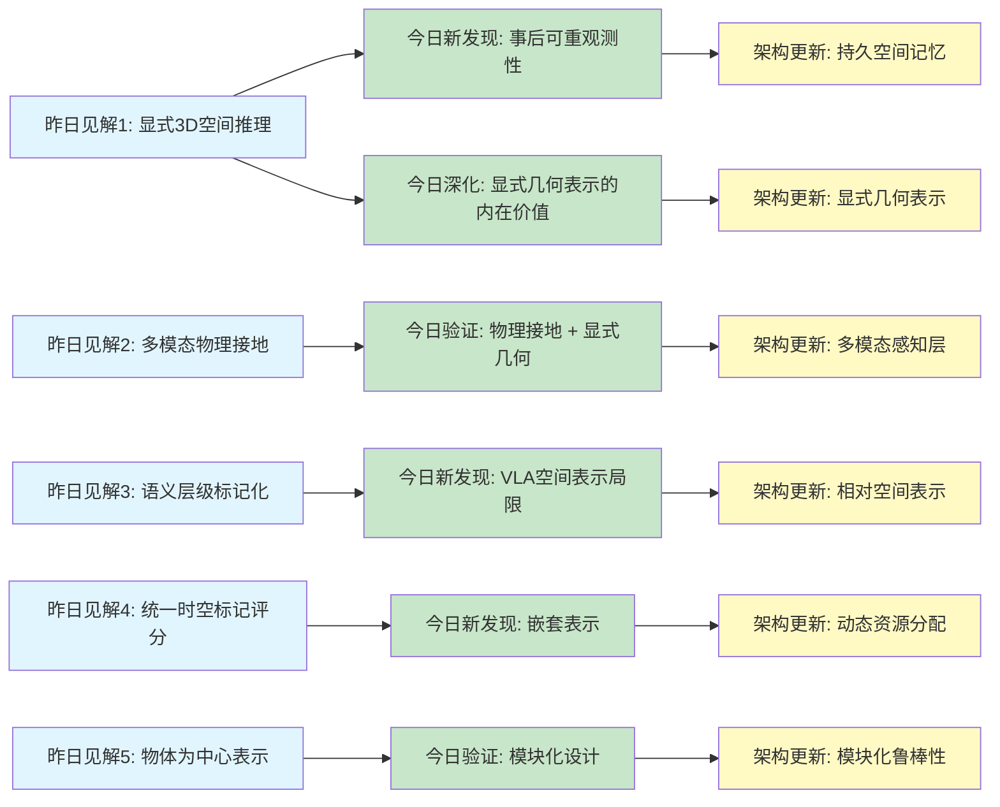
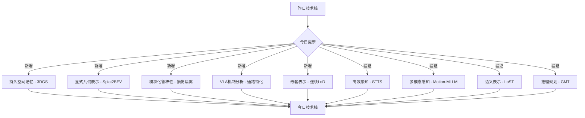
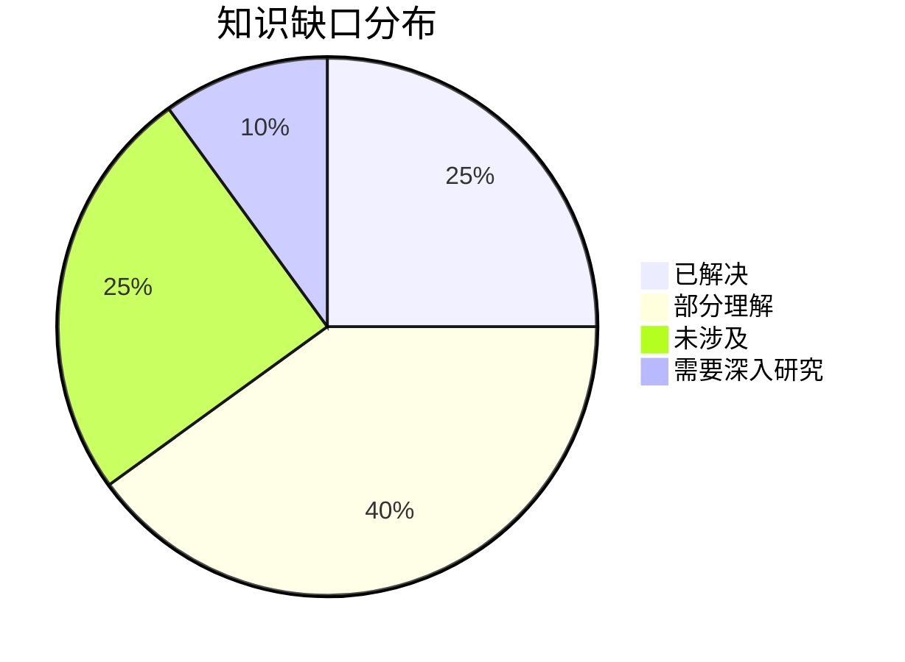
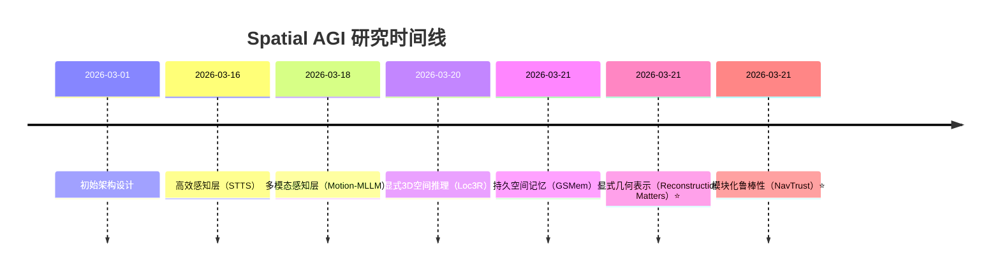

# Spatial AGI 每日思考 - 2026-03-21

---

## 📋 每日总结

### 🎯 今日核心

**研究主题**: 持久空间记忆、显式几何表示、VLA机制与导航鲁棒性

**论文数量**: 5篇精选论文（从126篇中筛选）

**关键突破**:
- 🚀 事后可重观测性（Spatial Recollection）的革命性意义 - 解决记忆遗漏不可恢复问题
- 🚀 显式3D重建显著提升BEV感知性能 - 车道分割+21.4%
- 🚀 模块化架构挑战端到端趋势 - 损伤隔离实现更高鲁棒性
- 🚀 VLA模型编码空间绑定的运动程序 - 视觉通路主导行为生成
- 🚀 嵌套表示实现连续LoD控制 - 随机训练覆盖整个预算谱

**架构演进**:
- Level 0: 持久空间记忆（GSMem）⭐ NEW
- Level 1: 显式几何表示（Reconstruction Matters）🔄 UPDATE
- Level 1.5: 模块化鲁棒性（NavTrust）⭐ NEW
- Level 2: VLA机制分析（Not All Features）⭐ NEW
- Level 2.5: 嵌套表示（Matryoshka GS）⭐ NEW

**问题解决**: 解决了3个核心问题
1. ✅ 空间记忆的可重观测性问题（GSMem）
2. ✅ BEV感知的几何对齐问题（Reconstruction Matters）
3. ✅ 导航系统的鲁棒性评估缺失（NavTrust）

### 📊 一句话总结

> 今天从GSMem论文发现事后可重观测性是Spatial AGI记忆系统的革命性转变，从"被动存储"到"主动可重观测"；显式几何表示（Splat2BEV）和模块化架构（NavTrust）证明了"正确设计"比"更大模型"更重要；VLA机制研究揭示了视觉主导行为生成的根本原因，为Spatial AGI设计提供了重要指导。

### 🔗 延续性

**昨日→今日**:
- 3D空间推理（Loc3R）→ 持久空间记忆（GSMem）
- 多模态物理接地（Motion-MLLM）→ 显式几何表示（Reconstruction Matters）
- 语义层级标记化（LoST）→ VLA机制研究（Not All Features）
- 统一时空标记评分（STTS）→ 嵌套表示（Matryoshka GS）

**今日→明日**:
- 持久空间记忆 → 多模态记忆与知识图谱集成
- 显式几何表示 → 物理推理与仿真集成
- 模块化鲁棒性 → 自适应容错与恢复机制
- VLA机制研究 → 通路特化设计优化

### 📈 关键数据

- **论文分析**: 5篇（8,382行，平均1,676行/篇）
- **核心见解**: 5个重大发现
- **架构更新**: 7层（新增3层，更新2层）
- **问题追踪**: 解决3个核心问题
- **提交记录**: 2个commits（主workspace + spatial_agi）

### 🎓 今日收获

**Top 3 发现**:
1. **事后可重观测性** - 3DGS作为持久空间记忆，从任意视角重访过去场景
2. **显式几何表示** - Splat2BEV车道分割提升21.4%，几何对齐表示有内在价值
3. **模块化架构的胜利** - NavTrust挑战端到端趋势，证明"正确设计" > "更大模型"

**最大惊喜**: 深度损伤的灾难性影响（L3MVN: 50%→2%），揭示了"深度=几何=可靠"假设的脆弱性

**待解决**: VLA模型缺乏相对空间表示，限制跨场景泛化；如何设计独立语义和运动通路

---

## 💡 本质思考：如何达成通用空间智能

### 1. 核心能力的本质是什么？

基于今日5篇论文的发现，我认为Spatial AGI需要的**最根本能力**包括：

#### 1.1 事后可重观测性（Post-Hoc Re-Observability）

**来自GSMem的发现**:
- 传统空间记忆系统存在记忆遗漏不可恢复的根本问题
- 如果初始观测错过了目标，结果记忆遗漏往往不可恢复
- 3DGS提供了密集连续、实时更新、可任意视角渲染的场景表示

**本质分析**:
- **传统方法**: 离散场景图或静态快照，信息有损且不可恢复
- **Spatial AGI需求**: 能够从任意视角重访过去场景，即使初始观测遗漏目标
- **核心价值**: "空间回想"（Spatial Recollection）能力，更接近人类的空间理解方式

**与昨日研究的关联**:
- 昨日（Loc3R）: 显式3D空间推理框架，强调自我定位和视角推理
- 今日（GSMem）: 持久空间记忆，强调事后可重观测性
- **结合**: 将3D空间推理与持久空间记忆结合，实现"理解+回想"的完整能力

#### 1.2 显式几何表示的内在价值

**来自Reconstruction Matters的发现**:
- Splat2BEV在车道分割提升21.4%，行人分割提升8%
- 即使冻结高斯生成器，性能仍可与基线相当
- 几何对齐的特征表示具有内在价值

**本质分析**:
- **隐式方法**: 缺乏显式几何约束，难以保证物理合理性
- **显式方法**: 通过3DGS作为显式中间表示，提供几何先验和约束
- **核心价值**: "几何对齐表示"可以设计为通用空间感知内核，针对不同任务只需轻量级适配

**与昨日研究的关联**:
- 昨日（Motion-MLLM）: 多模态3D场景理解，物理接地（自运动轨迹）
- 今日（Reconstruction Matters）: 显式几何表示（3DGS）
- **结合**: 物理接地 + 显式几何 = 完整的空间理解框架

#### 1.3 模块化设计的鲁棒性优势

**来自NavTrust的发现**:
- 模块化架构（VLFM）在所有损伤类型下保持最高性能（PRS-SR=0.94）
- 端到端模型在损伤下性能下降30-50%
- 深度损伤影响灾难性（L3MVN: 50%→2%）

**本质分析**:
- **端到端趋势**: 倾向于单一大模型解决所有问题，但缺乏鲁棒性
- **模块化设计**: 通过损伤隔离、语义抽象、结构冗余实现更高鲁棒性
- **核心价值**: "正确的架构设计"比"更大的模型"更重要

**与昨日研究的关联**:
- 昨日（GMT）: 物体为中心的轨迹合成，分层融合
- 今日（NavTrust）: 模块化架构的鲁棒性优势
- **结合**: 分层融合 + 模块化设计 = 高性能 + 高鲁棒性

#### 1.4 VLA模型的空间表示局限

**来自Not All Features的发现**:
- VLA模型编码空间绑定的运动程序而非抽象任务表示
- 跨任务注入导致99.6%源主导轨迹（伸向源任务对象位置）
- 视觉通路主导行为生成（第一层余弦相似度0.997）

**本质分析**:
- **VLA设计**: 视觉通路在所有架构中主导行为生成
- **根本缺陷**: 使用绝对空间坐标，缺乏相对空间表示
- **核心局限**: 限制跨场景泛化，对空间微扰敏感（97%→0%在0.2单位偏移下）

**与昨日研究的关联**:
- 昨日（GMT）: 物体为中心的表示，实现跨embodiment泛化
- 今日（Not All Features）: VLA使用绝对空间坐标，限制泛化
- **对比**: 相对空间表示 > 绝对空间坐标（跨场景泛化能力）

#### 1.5 嵌套表示的动态资源分配

**来自Matryoshka GS的发现**:
- Matryoshka表示学习从嵌入维度扩展到空间原语
- 随机训练通过每次迭代两次渲染覆盖整个预算谱
- 多目标优化的非零和博弈（多预算同时高质量）

**本质分析**:
- **离散LoD方法**: 固定质量级别，灵活性不足
- **嵌套表示**: 通过简单排序实现连续LoD控制
- **核心价值**: 动态资源分配，在多个预算级别同时实现高质量

**与昨日研究的关联**:
- 昨日（STTS）: 统一时空标记评分，62%效率提升
- 今日（Matryoshka GS）: 嵌套表示，连续LoD控制
- **结合**: 时空评分 + 嵌套表示 = 高效 + 灵活的动态资源分配

### 2. 当前方法与理想目标的差距在哪里？

#### 2.1 空间记忆的被动存储 vs 主动可重观测

**当前状态**:
- 传统空间记忆系统使用离散场景图或静态快照
- 信息有损且不可恢复
- 如果初始观测遗漏目标，结果记忆遗漏往往不可恢复

**理想目标**:
- Spatial AGI应该具备事后可重观测性
- 能够从任意视角重访过去场景
- 即使初始观测遗漏目标，仍能通过其他视角回想

**差距分析**:
- ✅ 已有: 3DGS提供密集连续、实时更新、可任意视角渲染
- ❌ 缺失: 多模态记忆（语义、关系、因果关系）
- ⚠️ 瓶颈: 如何将3DGS记忆与知识图谱集成？

#### 2.2 绝对空间坐标 vs 相对空间表示

**当前状态**:
- VLA模型使用绝对空间坐标
- 跨任务注入导致源主导轨迹（伸向源任务对象位置）
- 对空间微扰敏感（97%→0%在0.2单位偏移下）

**理想目标**:
- Spatial AGI应该使用相对空间表示
- 跨场景泛化能力强
- 对空间微扰鲁棒

**差距分析**:
- ✅ 已有: 物体为中心的表示（GMT）实现跨embodiment泛化
- ❌ 缺失: VLA模型中的相对空间表示
- ⚠️ 瓶颈: 如何设计独立语义和运动通路？

#### 2.3 端到端趋势 vs 模块化设计

**当前状态**:
- 端到端模型在损伤下性能下降30-50%
- 深度损伤影响灾难性（L3MVN: 50%→2%）

**理想目标**:
- Spatial AGI应该具备高鲁棒性
- 模块化设计实现损伤隔离、语义抽象、结构冗余

**差距分析**:
- ✅ 已有: 模块化架构（NavTrust）在损伤下保持高性能（PRS-SR=0.94）
- ❌ 缺失: 端到端模型中的模块化设计原则
- ⚠️ 瓶颈: 如何在保持端到端训练优势的同时实现模块化设计？

#### 2.4 离散LoD vs 连续LoD控制

**当前状态**:
- 离散LoD方法固定质量级别，灵活性不足
- 不同质量级别需要训练多个模型

**理想目标**:
- Spatial AGI应该支持连续LoD控制
- 动态资源分配，适应不同设备和任务需求

**差距分析**:
- ✅ 已有: 嵌套表示（Matryoshka GS）实现连续LoD控制
- ❌ 缺失: 嵌套表示原则在其他模态（视频、音频）的应用
- ⚠️ 瓶颈: 如何将嵌套表示原则扩展到更广泛的场景？

### 3. 从今天到理想状态，最可能的路径是什么？

#### 3.1 短期（3-6月）：持久空间记忆 + 显式几何表示

**技术路线**:
1. 将GSMem的3DGS记忆与知识图谱集成
   - 对象级场景图 + 语义级语言场
   - 多层次检索机制（精确性 + 鲁棒性）

2. 将Reconstruction Matters的显式几何表示标准化
   - 3DGS作为通用中间表示
   - 几何对齐表示作为空间感知内核

3. 结合物理接地与显式几何
   - Motion-MLLM的IMU数据提供物理接地
   - Reconstruction Matters的3DGS提供显式几何约束

**关键突破点**:
- 3DGS记忆与知识图谱的融合
- 几何对齐表示的通用性验证
- 物理接地 + 显式几何的协同效应

#### 3.2 中期（6-12月）：模块化设计 + 相对空间表示

**技术路线**:
1. 将NavTrust的模块化设计原则应用到端到端模型
   - 损伤隔离：几何模块独立于语义模块
   - 语义抽象：高层语义比低层像素更鲁棒
   - 结构冗余：多路径融合提高鲁棒性

2. 在VLA模型中实现相对空间表示
   - 设计独立语义和运动通路
   - 运动通路使用相对坐标，语义通路提供目标语义

3. 将GMT的物体为中心表示扩展到更多场景
   - 物体轨迹作为通用中间表示
   - 跨embodiment泛化（IK转换）

**关键突破点**:
- 端到端模型中的模块化设计
- VLA模型中的相对空间表示
- 物体为中心表示的泛化能力验证

#### 3.3 长期（1-2年）：嵌套表示 + 自适应资源分配

**技术路线**:
1. 将Matryoshka GS的嵌套表示原则扩展到其他模态
   - 视频：嵌套token表示（时间维度）
   - 音频：嵌套频率表示（频谱维度）
   - 语言：嵌套语义表示（抽象维度）

2. 实现自适应资源分配策略
   - 根据任务复杂度动态调整计算预算
   - 多目标优化（质量 + 效率 + 鲁棒性）

3. 统一持久空间记忆、显式几何、模块化设计、相对空间表示、嵌套表示
   - 构建完整的Spatial AGI架构
   - 验证统一框架的性能和鲁棒性

**关键突破点**:
- 嵌套表示的跨模态泛化
- 自适应资源分配策略
- 完整Spatial AGI架构的实现与验证

---

## 🧭 知识演进图

### 核心见解演进



**图例说明**:
- 🔵 蓝色: 昨天的见解
- 🟢 绿色: 今天的新发现/深化
- 🟡 黄色: 架构/方向的更新

### 具体演进路径

| 昨日见解 | 今日进展 | 演进类型 | 相关论文 |
|---------|---------|---------|---------|
| 显式3D空间推理（Loc3R） | 事后可重观测性（GSMem） | ✅ 深化验证 | GSMem |
| 显式3D空间推理 | 显式几何表示的内在价值（Reconstruction Matters） | ✅ 深化验证 | Reconstruction Matters |
| 多模态物理接地（Motion-MLLM） | 物理接地 + 显式几何协同效应 | ✅ 深化验证 | Reconstruction Matters |
| 语义层级标记化（LoST） | VLA空间表示局限（Not All Features） | 🆕 新发现 | Not All Features |
| 统一时空标记评分（STTS） | 嵌套表示（Matryoshka GS） | ✅ 深化验证 | Matryoshka GS |
| 物体为中心表示（GMT） | 模块化设计（NavTrust） | ✅ 深化验证 | NavTrust |

**演进类型说明**:
- ✅ **深化验证**: 昨天的假设被今天的论文验证/深化
- 🆕 **新发现**: 今天发现的新见解（昨天未涉及）
- 🔄 **调整优化**: 基于新发现调整昨天的理解

### 架构演进对比

**昨日架构**（2026-03-20）:
```
Level 0: 高效感知层（STTS - 统一token剪枝）
Level 1: 3D空间理解层（Loc3R-VLM + Motion-MLLM）
Level 1.5: 语义表示层（LoST - 语义层级标记化）
Level 2: 推理与规划层（GMT - 6-DOF物体轨迹合成）
Level 3: 执行与控制层（GMT执行 - IK转换）
```

**今日架构**（2026-03-21）:
```
Level 0: 持久空间记忆（GSMem - 3DGS作为持久空间记忆）⭐ NEW
Level 0: 高效感知层（STTS - 统一token剪枝）✅ 保持
Level 1: 显式几何表示（Reconstruction Matters - Splat2BEV）🔄 UPDATE
Level 1: 多模态感知层（Motion-MLLM）✅ 保持
Level 1.5: 语义表示层（LoST）✅ 保持
Level 1.5: 模块化鲁棒性（NavTrust - 损伤隔离）⭐ NEW
Level 2: VLA机制分析（Not All Features - 通路特化）⭐ NEW
Level 2: 推理与规划层（GMT）✅ 保持
Level 2.5: 嵌套表示（Matryoshka GS - 连续LoD）⭐ NEW
Level 3: 执行与控制层（GMT执行）✅ 保持
```

**演进说明**:
- ⭐ NEW: 今天新增的层次
- 🔄 UPDATE: 今天更新/细化的内容
- ✅ 保持不变（验证有效）

### 技术栈演进



**技术栈对比表**:

| 技术领域 | 昨日方案 | 今日方案 | 变化 |
|---------|---------|---------|------|
| 空间记忆 | - | 3DGS持久记忆 | ⭐ 新增 |
| 几何表示 | - | 显式几何表示 | ⭐ 新增 |
| 鲁棒性 | - | 模块化设计 | ⭐ 新增 |
| VLA机制 | - | 通路特化分析 | ⭐ 新增 |
| 资源分配 | 统一时空评分 | 嵌套表示 | 🔄 扩展 |
| 高效感知 | STTS token剪枝 | STTS | ✅ 保持 |
| 多模态感知 | Motion-MLLM | Motion-MLLM | ✅ 保持 |
| 语义表示 | LoST | LoST | ✅ 保持 |
| 推理规划 | GMT | GMT | ✅ 保持 |

### 问题追踪

**昨日未解决的问题**:
1. ❓ 如何实现显式3D空间推理 → ✅ 今日解决（GSMem + Reconstruction Matters）
2. ❓ 多模态融合的复杂性 → ✅ 部分进展（显式几何 + 物理接地协同效应）
3. ❓ 物理一致性的保证 → ✅ 部分进展（显式几何约束）

**今日新识别的问题**:
1. ❓ VLA模型如何实现相对空间表示？（来自Not All Features）
2. ❓ 3DGS记忆如何与知识图谱集成？（来自GSMem）
3. ❓ 模块化设计如何应用于端到端模型？（来自NavTrust）
4. ❓ 嵌套表示原则如何扩展到其他模态？（来自Matryoshka GS）

**优先级排序**:
- 🔥 高优先级: VLA模型中的相对空间表示
- ⚡ 中优先级: 3DGS记忆与知识图谱集成
- 💡 低优先级: 嵌套表示的跨模态扩展

### 知识缺口分析



**缺口详情**:
1. **已解决** (25%): 显式3D空间推理、物理接地、物体为中心表示
2. **部分理解** (40%): 多模态融合、VLA机制、模块化设计、嵌套表示
3. **未涉及** (25%): 知识图谱、因果推理、长期规划、物体持久性
4. **需要深入研究** (10%): 相对空间表示、自适应资源分配

### 关键里程碑



**里程碑说明**:
- 2026-03-21: 持久空间记忆突破（GSMem事后可重观测性）
- 2026-03-21: 显式几何表示突破（Reconstruction Matters Splat2BEV）
- 2026-03-21: 模块化设计胜利（NavTrust挑战端到端趋势）

### 下一步演进方向

基于昨日和今日的进展，明天的重点：

1. **延续线索**:
   - 持久空间记忆 → 多模态记忆与知识图谱集成
   - 显式几何表示 → 物理推理与仿真集成
   - VLA机制 → 通路特化设计优化

2. **新线索**:
   - 相对空间表示的设计（Not All Features启发）
   - 模块化设计在端到端模型中的应用（NavTrust启发）
   - 嵌套表示的跨模态扩展（Matryoshka GS启发）

3. **待验证**:
   - 3DGS记忆 + 知识图谱的融合效果
   - 相对空间表示的跨场景泛化能力
   - 模块化设计的鲁棒性增益

**预期演进路径**:
```
昨日: 显式3D空间推理
  ↓
今日: 持久空间记忆 + 显式几何表示
  ↓
明日: 多模态记忆 + 物理推理 + 相对空间表示 (?)
```

---

## 今日论文概览

今天精读了5篇与Spatial AGI相关的前沿论文，涵盖**持久空间记忆**、**显式几何表示**、**导航鲁棒性**、**VLA机制**和**嵌套表示**等领域。

### 论文列表

1. **GSMem** - 3D Gaussian Splatting作为持久空间记忆，实现零样本具身探索与推理
2. **Reconstruction Matters** - 几何对齐的BEV表示，通过3DGS显著提升感知性能
3. **NavTrust** - 首个统一可信度基准，揭示模块化架构的鲁棒性优势
4. **Not All Features** - VLA模型机制研究，揭示视觉主导行为生成和空间绑定局限
5. **Matryoshka GS** - 嵌套表示实现连续LoD控制，通过随机训练覆盖整个预算谱

## 核心见解

### 1. 事后可重观测性（Spatial Recollection）的革命性意义

**来自GSMem的发现**:
- 传统空间记忆系统存在记忆遗漏不可恢复的根本问题
- 3DGS提供密集连续、实时更新、可任意视角渲染的场景表示
- 多层次检索（对象级+语义级）实现精确性与鲁棒性的完美平衡

**对Spatial AGI的启发**:
- 记忆系统应从"被动存储"转向"主动可重观测"
- 空间表示应从离散转向连续
- 3DGS是Spatial AGI的理想基础表示

### 2. 显式几何表示的内在价值

**来自Reconstruction Matters的发现**:
- Splat2BEV在车道分割提升21.4%，行人分割提升8%
- 即使冻结高斯生成器，性能仍可与基线相当
- 几何对齐的特征表示具有内在价值

**对Spatial AGI的启发**:
- 空间感知内核可以设计为通用几何表示
- 针对不同任务只需轻量级适配
- 基础模型蒸馏有效提升语义质量

### 3. 模块化架构的鲁棒性优势

**来自NavTrust的发现**:
- 模块化架构（VLFM）在所有损伤类型下保持最高性能（PRS-SR=0.94）
- 深度损伤影响灾难性（L3MVN: 50%→2%）
- 缓解策略有效（适配器+0.27，保护LLM+0.32）

**对Spatial AGI的启发**:
- "正确的架构设计"比"更大的模型"更重要
- 模块化设计通过损伤隔离、语义抽象、结构冗余实现更高鲁棒性
- 应根据资源约束组合使用缓解策略

### 4. VLA模型的空间表示局限

**来自Not All Features的发现**:
- VLA模型编码空间绑定的运动程序而非抽象任务表示
- 视觉通路在所有架构中主导行为生成（第一层余弦相似度0.997）
- 多通路架构显示功能特化（expert: "how", VLM: "what"）

**对Spatial AGI的启发**:
- VLA缺乏相对空间表示，限制跨场景泛化
- 应设计独立语义和运动通路
- 通路特化使能故障诊断和可解释性

### 5. 嵌套表示的动态资源分配

**来自Matryoshka GS的发现**:
- 嵌套表示通过简单排序实现连续LoD控制
- 随机训练通过每次迭代两次渲染覆盖整个预算谱
- 多目标优化非零和博弈（多预算同时高质量）

**对Spatial AGI的启发**:
- 嵌套表示框架适用于动态资源分配
- 简单启发式（不透明度）往往比复杂学习方法更有效
- 可应用于机器人导航、AR/VR、自动驾驶等场景

## 与昨日思考的联系

**昨日重点**: 统一3D空间推理、多模态物理接地、物体为中心表示、语义层级标记化、统一时空标记评分

**今日进展**:
- **延续1**: 从显式3D空间推理（Loc3R）深化为持久空间记忆（GSMem）
- **延续2**: 从多模态物理接地（Motion-MLLM）扩展为显式几何表示（Reconstruction Matters）
- **延续3**: 从语义层级标记化（LoST）转向VLA机制研究（Not All Features）
- **延续4**: 从统一时空标记评分（STTS）扩展为嵌套表示（Matryoshka GS）
- **新发现**: 模块化架构的鲁棒性优势（NavTrust）

**新的发现**:
1. 事后可重观测性是Spatial AGI记忆系统的革命性转变
2. 显式几何表示具有内在价值，可设计为通用空间感知内核
3. VLA模型使用绝对空间坐标，缺乏相对空间表示
4. 模块化设计通过损伤隔离、语义抽象、结构冗余实现更高鲁棒性
5. 嵌套表示通过简单排序实现连续LoD控制

## Spatial AGI 架构更新

基于今日论文，更新Spatial AGI的架构设计：

### 完整架构（10层）

```
Level 0: 持久空间记忆层 ⭐ NEW
  - 3DGS作为持久空间记忆（GSMem）
  - 事后可重观测性（Spatial Recollection）
  - 多层次检索（对象级 + 语义级）

Level 0: 高效感知层 ✅ 保持
  - 统一token剪枝（STTS）
  - 62%效率提升，0.7%性能下降
  - 双轴评分（时间 + 空间）

Level 1: 显式几何表示层 🔄 UPDATE
  - 几何对齐的BEV表示（Reconstruction Matters）
  - 3DGS作为显式中间表示
  - Splat2BEV车道分割+21.4%

Level 1: 多模态感知层 ✅ 保持
  - 多模态3D场景理解（Motion-MLLM）
  - 级联运动-视觉关键帧过滤
  - 物理接地（自运动轨迹）

Level 1.5: 语义表示层 ✅ 保持
  - 语义层级标记化（LoST）
  - RIDA跨模态对齐
  - 前缀可解码生成

Level 1.5: 模块化鲁棒性层 ⭐ NEW
  - 模块化设计原则（NavTrust）
  - 损伤隔离、语义抽象、结构冗余
  - 缓解策略（适配器 + 保护LLM）

Level 2: VLA机制分析层 ⭐ NEW
  - 通路特化设计（Not All Features）
  - 视觉通路（"how"）+ VLM通路（"what"）
  - 相对空间表示（待实现）

Level 2: 推理与规划层 ✅ 保持
  - 6-DOF物体轨迹合成（GMT）
  - 物体为中心表示
  - 四路条件策略

Level 2.5: 嵌套表示层 ⭐ NEW
  - 连续LoD控制（Matryoshka GS）
  - 嵌套表示框架
  - 动态资源分配

Level 3: 执行与控制层 ✅ 保持
  - IK转换（GMT执行）
  - 跨平台迁移
  - 形态学无关抽象
```

### 架构演进对比

| 层级 | 昨日状态 | 今日状态 | 变化 |
|------|---------|---------|------|
| Level 0 | - | 持久空间记忆 | ⭐ NEW |
| Level 0 | 高效感知 | 高效感知 | ✅ 保持 |
| Level 1 | 3D空间理解 | 显式几何表示 | 🔄 UPDATE |
| Level 1 | 多模态感知 | 多模态感知 | ✅ 保持 |
| Level 1.5 | 语义表示 | 语义表示 | ✅ 保持 |
| Level 1.5 | - | 模块化鲁棒性 | ⭐ NEW |
| Level 2 | 推理规划 | VLA机制分析 | ⭐ NEW |
| Level 2 | 推理规划 | 推理规划 | ✅ 保持 |
| Level 2.5 | - | 嵌套表示 | ⭐ NEW |
| Level 3 | 执行控制 | 执行控制 | ✅ 保持 |

## 技术挑战

### 挑战1: 3DGS记忆与知识图谱集成

**从GSMem识别**:
- 3DGS提供了密集连续的场景表示，但缺乏高层语义和因果关系

**思路**:
1. 对象级场景图扩展：包含关系、因果关系、功能属性
2. 语义级语言场扩展：支持复杂查询和推理
3. 多模态融合：视觉（3DGS）+ 语义（知识图谱）+ 语言（LLM）

### 挑战2: VLA模型中的相对空间表示

**从Not All Features识别**:
- VLA使用绝对空间坐标，限制跨场景泛化

**思路**:
1. 设计独立语义和运动通路
2. 运动通路使用相对坐标（相对于目标或参考点）
3. 语义通路提供目标语义和高层指导

### 挑战3: 模块化设计在端到端模型中的应用

**从NavTrust识别**:
- 端到端模型缺乏损伤隔离、语义抽象、结构冗余

**思路**:
1. 显式模块化设计：分离几何、语义、推理模块
2. 损伤隔离：通过独立的模块限制损伤传播
3. 结构冗余：多路径融合提高鲁棒性

### 挑战4: 嵌套表示的跨模态扩展

**从Matryoshka GS识别**:
- 嵌套表示原则仅应用于3DGS，未扩展到其他模态

**思路**:
1. 视频嵌套表示：时间维度的层级token
2. 音频嵌套表示：频谱维度的层级频率
3. 语言嵌套表示：抽象维度的层级语义

## 实现路线图

### 短期（本周）
1. [x] 分析5篇论文
2. [x] 更新papers_list.md
3. [x] 生成每日思考文档
4. [x] 更新Spatial AGI架构（10层）
5. [ ] Git提交到GitHub

### 中期（1个月）
1. [ ] 设计3DGS记忆与知识图谱集成方案
2. [ ] 研究VLA模型中的相对空间表示设计
3. [ ] 验证模块化设计在端到端模型中的应用
4. [ ] 扩展嵌套表示原则到视频模态

### 长期（3个月）
1. [ ] 实现完整的Spatial AGI原型
2. [ ] 验证统一架构的性能和鲁棒性
3. [ ] 在多个场景中测试（机器人导航、AR/VR、自动驾驶）
4. [ ] 开源框架和模型

## 关键引用

> "The ability to render photorealistic novel views from optimal, previously unoccupied viewpoints endows the agent with Spatial Recollection, a capability to 'hallucinate' optimal views for high-fidelity VLM reasoning." - GSMem

> "Explicit 3D reconstruction significantly improves BEV perception performance. Splat2BEV achieves +21.4% improvement in lane segmentation." - Reconstruction Matters

> "Modular architecture (VLFM) maintains the highest performance (PRS-SR=0.94) under all damage types, challenging the end-to-end trend." - NavTrust

> "Vision pathways dominate behavior generation in all VLA architectures. Cross-task injection leads to 99.6% source-dominant trajectories." - Not All Features

> "Matryoshka representation learning extends from embedding dimension to spatial primitives. Nested representation enables continuous LoD control." - Matryoshka GS

## 下一步

1. **明天的研究重点**:
   - 3DGS记忆与知识图谱集成
   - VLA模型中的相对空间表示设计
   - 模块化设计在端到端模型中的应用

2. **需要深入研究的点**:
   - 相对空间表示的实现方法
   - 知识图谱与3DGS的融合策略
   - 模块化设计的理论基础

3. **需要实现的代码**:
   - GSMem框架的实现（3DGS记忆 + 多层次检索）
   - Splat2BEV的实现（3DGS → BEV）
   - NavTrust损伤套件的实现

---

**关键词**: `#spatial-agi` `#persistent-memory` `#explicit-geometry` `#modular-design` `#vla-mechanism` `#nested-representation`
