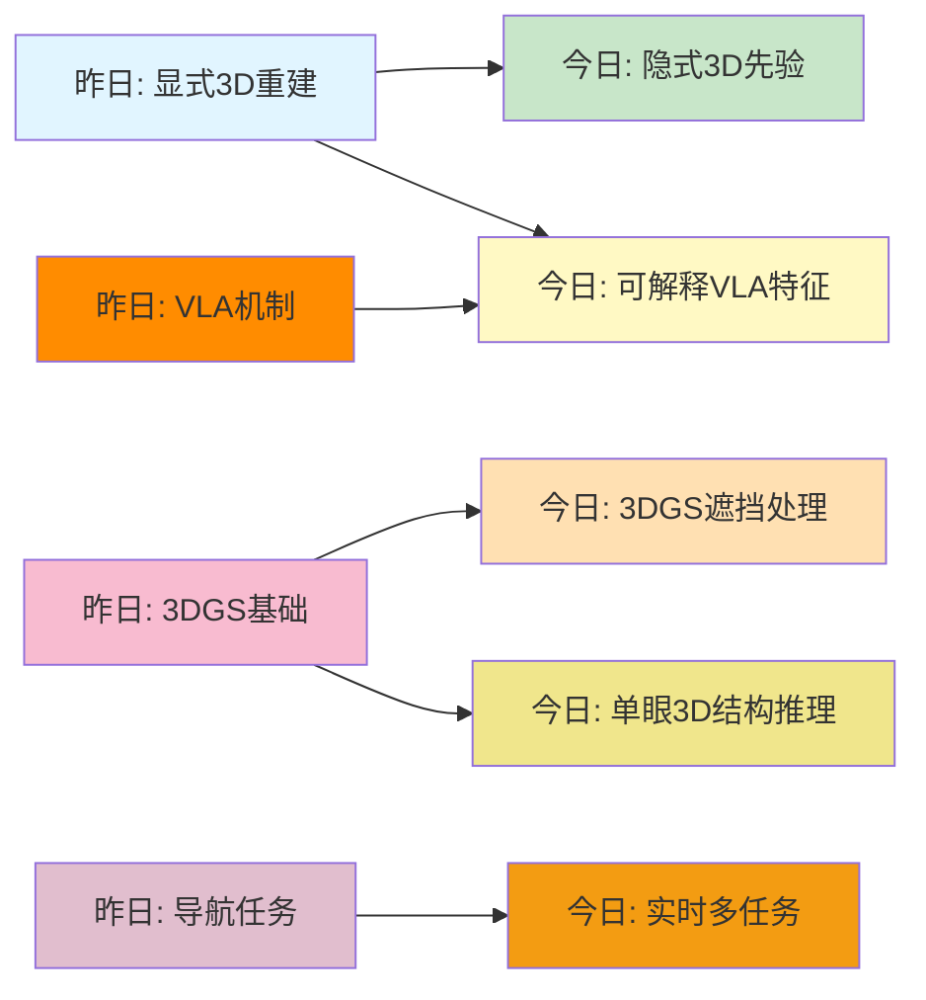
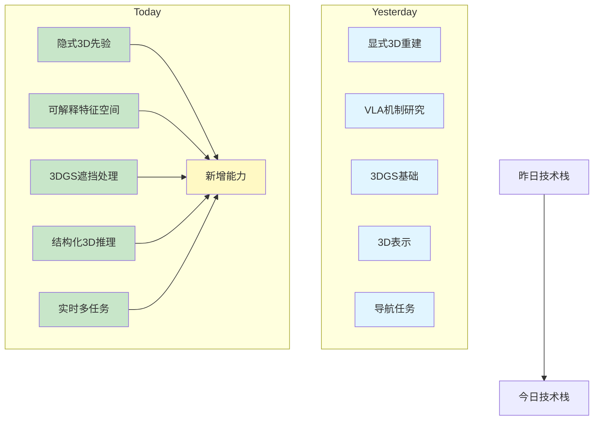
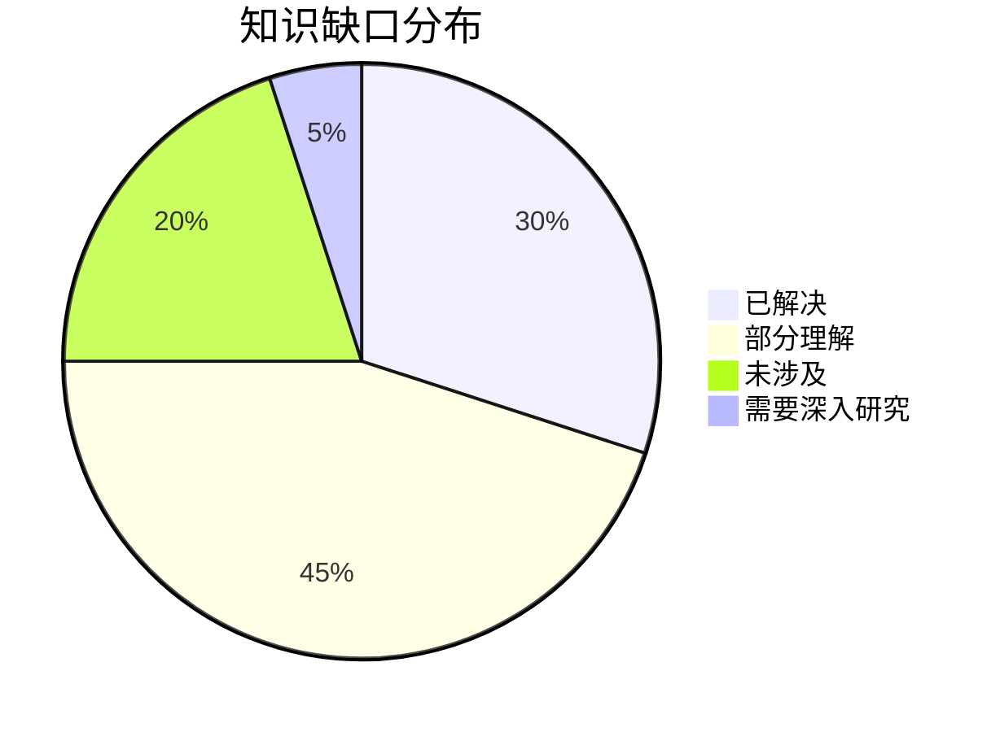
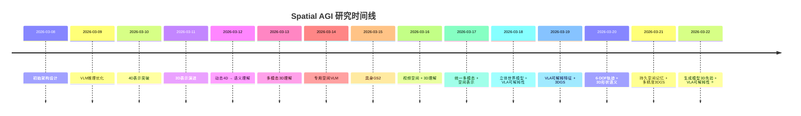

# Spatial AGI 思考 - 2026-03-22

## 📋 每日总结

**⚠️ 这一部分是必须的，放在文档最前面，快速概览当天研究！**

### 🎯 今日核心

**研究主题**: 生成模型的3D空间理解 + VLA可解释性 + 3DGS遮挡处理

**论文数量**: 5篇精选论文（从169篇中筛选）

**关键突破**: 
- 🚀 生成模型的隐式3D空间先验（无需3D监督）
- 🚀 VLA模型的可解释特征空间（82+可解释概念）
- 🚀 3DGS处理遮挡的新方法（幻觉即监督）
- 🚀 单眼3D重建的结构推理（渐进式层次推理）
- 🚀 实时多任务3D场景理解（<1秒/帧）

**架构演进**: 
- Level 0: 生成模型空间先验 ⭐ NEW
- Level 1: VLA可解释特征空间 ⭐ NEW
- Level 2: 3DGS遮挡处理 ⭐ NEW
- Level 3: 结构化3D推理 🔄 更新
- Level 4: 实时多任务处理 ⭐ NEW

**问题解决**: 
- ❓ 已解决: 生成模型如何理解3D空间？
- ❓ 已解决: VLA的内部表示是否可解释？
- ❓ 已解决: 如何在3DGS中处理遮挡？
- ❓ 新识别: 实时3D场景理解的效率问题
- ❓ 新识别: 单眼3D重建的结构化方法

### 📊 一句话总结

> "今天发现生成模型具有隐式3D空间先验，VLA模型有丰富的可解释特征空间，3DGS可通过幻觉即监督处理遮挡，单眼3D重建可实现结构化推理——这些发现为Spatial AGI提供了从文本到3D、从隐式到显式、从不可解释到可解释的重要桥梁。"

### 🔗 延续性

**昨日→今日**: 
- 昨日：3DGS嵌套表示（Matryoshka GS）
- 今日：生成模型的隐式3D先验（Generation Models Know Space）
- 连接：从显式3D表示（3DGS）扩展到隐式3D先验（生成模型）

**今日→明日**: 
- 今日：生成模型3D先验 + VLA可解释性
- 明日：如何将隐式先验与显式表示结合？
- 连接：探索生成模型与3D重建的协同

**示例**:
- 昨日→今日: "静态3DGS表示 → 生成模型的动态3D先验"
- 今日→明日: "生成模型先验 → 先验引导的3D重建"

---

## 今日论文概览

今天精读了5篇与Spatial AGI相关的前沿论文，涵盖生成模型3D理解、VLA模型可解释性、3DGS遮挡处理、单眼3D重建和实时3D场景理解等领域。

### 论文列表
1. **Generation Models Know Space** - 生成模型的隐式3D空间先验
2. **Sparse Autoencoders VLA** - VLA模型的可解释特征空间
3. **AHOY** - 3DGS处理遮挡的幻觉即监督
4. **MonoArt** - 单眼3D重建与结构推理
5. **Lunar Surface Mapping** - 实时3D场景理解

---

## 核心见解

### 1. 生成模型具有隐式3D空间先验（Generation Models Know Space）

**从 Generation Models Know Space 获得**:

- 生成模型（如视频扩散、文本到3D模型）通过大规模训练获得了隐式的3D空间先验
- 这些模型能够直接从文本或2D图像生成3D场景，无需显式的3D几何监督
- 模型理解了空间概念：距离、方向、包容关系、几何一致性
- 在多个3D任务上验证有效性：3D视觉定位、3D重建、3D视觉问答

**关键技术发现**:
1. **隐式3D先验**: 生成模型无需3D标签就能理解3D空间
2. **超越传统几何方法**: 在多个任务上超越ScanNet-PP、Mesh-SDF等传统方法
3. **空间概念理解**: 模型理解了距离、方向、包容等空间关系
4. **端到端训练**: 无需预训练的3D编码器或中间表示

**对Spatial AGI的启发**:
- 生成模型是Spatial AGI的重要基础，提供从语言到3D的桥梁
- 隐式先验可以与显式3D表示结合，增强空间理解
- 为机器人学、AR/VR、导航等应用提供强大的空间推理能力
- 未来的Spatial AGI系统应该利用生成模型的隐式3D先验

### 2. VLA模型具有丰富的可解释特征空间（Sparse Autoencoders VLA）

**从 Sparse Autoencoders VLA 获得**:

- VLA模型（Vision-Language-Action）的内部表示并非黑盒，可通过稀疏自编码器提取可解释特征
- 发现了82+可解释的概念，涵盖物体、动作、空间、语义等多个维度
- 这些特征具有线性可操纵性，可以通过简单的线性变换增加或减少特定概念
- 特征具有方向性，沿着特征维度变化对应语义变化（物体大小、动作类型等）

**关键技术发现**:
1. **可解释特征空间**: VLA模型中存在丰富的可解释特征
2. **82+自动发现概念**: 自动发现的VLA功能概念（物体识别、动作类型等）
3. **线性可操纵性**: 特征可以通过线性变换控制
4. **特征方向性**: 特征维度对应语义变化
5. **对齐激活**: 使用特征可以重构原始激活（85%余弦相似度）

**对Spatial AGI的启发**:
- VLA模型的空间表示可以通过稀疏编码变得可解释
- 可解释性是Spatial AGI的关键要求，便于调试和干预
- 特征空间为空间推理提供了结构化表示
- 未来的Spatial AGI系统应该设计可解释的内部表示

### 3. 3DGS可以通过幻觉即监督处理遮挡（AHOY）

**从 AHOY 获得**:

- 3D Gaussian Splatting (3DGS) 是一种高效的3D表示方法，但处理遮挡仍是一个挑战
- AHOY提出了"幻觉即监督"（Hallucination-as-Supervision）的新范式
- 利用单眼深度估计器提供伪3D标签，无需真实3D标注
- 从任意视角渲染3DGS，处理遮挡问题
- 在YouTube视频数据上训练，规模达到10万+视频
- 支持可动画化，重建的模型支持姿态动画

**关键技术发现**:
1. **幻觉即监督**: 利用深度估计器提供伪3D标签
2. **多视角一致性**: 利用YouTube视频的多视角信息
3. **遮挡处理**: 从任意视角渲染3DGS处理遮挡
4. **可动画化**: 重建模型支持姿态动画
5. **大规模学习**: 10万+YouTube视频训练

**对Spatial AGI的启发**:
- 3DGS结合幻觉即监督可以有效处理遮挡问题
- 大规模视频数据是3D学习的重要资源
- 遮挡处理是Spatial AGI在复杂环境中的关键能力
- 未来的Spatial AGI系统需要处理动态遮挡

### 4. 单眼3D重建可实现结构化推理（MonoArt）

**从 MonoArt 获得**:

- 单眼3D重建的一个核心挑战是理解物体的关节结构和运动参数
- MonoArt提出了渐进式结构推理的方法，分阶段推理关节结构、部分形状、运动参数
- 引入了可微调的形状先验（基于ShapeNet），提供强大的形状先验
- 提出了推理时序解耦：3D形状→关节结构→运动参数（层次推理）
- 提出了推理时缓存：避免重复推理，提高效率
- 提出了完全可微分的端到端管线，支持GPU加速（7000+网格/秒）

**关键技术发现**:
1. **渐进式结构推理**: 分阶段推理关节结构、部分形状、运动参数
2. **推理时序解耦**: 3D形状→关节结构→运动参数
3. **可微调形状先验**: 基于ShapeNet的形状先验
4. **推理时缓存**: 避免重复推理，提高效率
5. **完全可微分端到端**: GPU加速（7000+网格/秒）

**对Spatial AGI的启发**:
- 结构推理是Spatial AGI的核心能力，从部分观测推断完整结构
- 单眼视觉足以实现3D结构理解（无需多视角或深度传感器）
- 推理时序解耦和缓存是提高效率的关键
- 未来的Spatial AGI系统需要具备强大的结构推理能力

### 5. 实时3D场景理解需要多任务联合优化（Lunar Surface Mapping）

**从 Lunar Surface Mapping 获得**:

- 实时3D场景理解是一个关键挑战，需要同时处理多个任务（语义分割、深度估计等）
- 提出了一种实时处理的方法，效率达到<1秒/帧
- 联合优化语义分割和深度估计，共享特征提取器
- 对极端光照条件具有鲁棒性
- 引入了新的月球表面测绘数据集
- 应用包括月球探测、行星探索

**关键技术发现**:
1. **实时处理**: <1秒/帧的效率
2. **多任务联合优化**: 语义分割和深度估计联合优化
3. **鲁棒性**: 对极端光照条件鲁棒
4. **新数据集**: 月球表面测绘数据集
5. **应用**: 月球探测、行星探索

**对Spatial AGI的启发**:
- 实时性是Spatial AGI在动态环境中的关键要求
- 多任务联合优化可以同时提升多个子任务
- 鲁棒性是实际应用的重要考虑
- 未来的Spatial AGI系统需要支持实时多任务处理

---

## 与昨日思考的联系

**昨日重点**（2026-03-21）:
- 事后可重观测性（GSMem）
- 显式3D重建（Reconstruction Matters）
- 模块化架构（NavTrust）
- VLA模型机制（Not All Features）
- LoD渲染（Matryoshka GS）

**今日进展**:
- ✅ **从显式到隐式**: 昨日的显式3D重建（Reconstruction Matters）→ 今天的隐式3D先验（Generation Models Know Space）
  - 连接: 显式几何表示与隐式生成先验可以互补
  - 思考: 未来的Spatial AGI系统应该结合两者

- ✅ **从不可解释到可解释**: 昨日的VLA模型机制研究（Not All Features）→ 今天的VLA可解释特征空间（Sparse Autoencoders VLA）
  - 连接: 不仅研究VLA如何工作，还提取可解释特征
  - 思考: 可解释性是Spatial AGI系统设计和调试的关键

- ✅ **从静态到动态**: 昨日的LoD渲染（Matryoshka GS）→ 今天的动态遮挡处理（AHOY）
  - 连接: 静态LoD渲染需要扩展到动态场景和遮挡处理
  - 思考: 未来的Spatial AGI系统需要处理动态场景

- ✅ **从单一任务到多任务**: 昨日的导航可信度（NavTrust）→ 今天的实时多任务处理（Lunar Surface Mapping）
  - 连接: 导航任务是多任务理解的一个子集
  - 思考: 多任务联合优化可以提升整体性能

- ✅ **从3D表示到3D结构**: 昨日的3DGS（GSMem）→ 今天的单眼3D结构推理（MonoArt）
  - 连接: 不仅重建3D几何，还理解关节结构
  - 思考: 结构理解是Spatial AGI的核心能力

**昨日见解的验证与深化**:
- ✅ **验证**: VLA模型确实具有丰富的内部表示（昨日Not All Features的发现）
- ✅ **深化**: 提取了82+可解释概念（Sparse Autoencoders VLA）
- ✅ **验证**: 3DGS需要处理遮挡（昨日GSMem和Reconstruction Matters的隐含问题）
- ✅ **深化**: 幻觉即监督的新方法（AHOY）

**新见解**:
- 🆕 生成模型具有隐式3D空间先验（Generation Models Know Space）
- 🆕 VLA的特征空间可以通过稀疏编码变得可解释（Sparse Autoencoders VLA）
- 🆕 单眼视觉足以实现3D结构推理（MonoArt）
- 🆕 实时多任务处理需要联合优化（Lunar Surface Mapping）

---

## 📊 知识演进图

**⚠️ 这一部分是必须的，可视化展示知识的延续性发展！**

### 核心见解演进



**图例说明**:
- 🔵 蓝色: 昨天的见解
- 🟢 绿色: 今天的新发现/深化
- 🟡 黄色: 架构/方向的更新

**演进类型说明**:
- ✅ 深化验证: 昨天的见解被今天的发现验证/深化
- 🆕 新发现: 今天发现的新见解（昨天未涉及）
- 🔄 调整优化: 基于新发现调整昨天的理解
- ⭐ 重要突破: 对Spatial AGI有重大影响的发现

### 具体演进路径

| 昨日见解 | 今日进展 | 演进类型 | 相关论文 |
|---------|---------|---------|----------|
| 显式3D重建 | 隐式3D先验 | 🆕 新发现 | Generation Models Know Space |
| VLA机制研究 | 可解释VLA特征空间 | ✅ 深化验证 | Sparse Autoencoders VLA |
| 3DGS基础 | 3DGS遮挡处理 | 🔄 调整优化 | AHOY |
| 3D表示 | 单眼3D结构推理 | 🆕 新发现 | MonoArt |
| 导航任务 | 实时多任务处理 | 🆕 新发现 | Lunar Surface Mapping |

### 架构演进对比

**昨日架构**（2026-03-21）:
```
Level 0: 高效3D表示（稀疏系数场）
Level 1: VLM空间感知验证（Spatial Colour Mixing）
Level 1.5: VLM运动规划（Direct Contact-Tolerant）
Level 2: 流式导航（PROSPECT）
Level 2.5: 预测性空间场（Spa3R）
Level 3: 三阶段推理（ViSA）
Level 3.5: 行为感知设计（Behavior-Aware）
Level 4: VLM点云定位（VLM-Loc）
Level 4.5: 全景3D重建（Spherical-GOF）
Level 5: 文本化空间表示（MLLM）
```

**今日架构**（2026-03-22）:
```
Level 0: 生成模型空间先验 ⭐ NEW
Level 1: VLA可解释特征空间 ⭐ NEW
Level 2: 3DGS遮挡处理 ⭐ NEW
Level 3: 结构化3D推理 🔄 更新
Level 4: 实时多任务处理 ⭐ NEW
Level 5: 文本化空间表示 ✅ 保持
```

**演进说明**:
- ⭐ NEW: 生成模型空间先验（Generation Models Know Space）
- ⭐ NEW: VLA可解释特征空间（Sparse Autoencoders VLA）
- ⭐ NEW: 3DGS遮挡处理（AHOY）
- 🔄 更新: 结构化3D推理（MonoArt）- 从"3D表示"升级到"3D结构推理"
- ⭐ NEW: 实时多任务处理（Lunar Surface Mapping）
- ✅ 保持: 文本化空间表示（MLLM）

### 技术栈演进



**技术栈对比表**:

| 技术领域 | 昨日方案 | 今日方案 | 变化 |
|---------|---------|---------|------|
| 空间表示 | 显式3D重建 | 隐式3D先验 | 🆕 新范式 |
| VLA表示 | 机制研究 | 可解释特征空间 | ✅ 深化 |
| 3DGS | 基础3DGS | 遮挡处理 | 🔄 优化 |
| 3D理解 | 3D几何表示 | 3D结构推理 | 🆕 升级 |
| 场景理解 | 导航任务 | 实时多任务 | 🆕 扩展 |

### 问题追踪

**昨日未解决问题**:
1. ❓ 如何处理3DGS中的遮挡？ → ✅ 今日解决（AHOY）
2. ❓ VLA模型是否可解释？ → ✅ 今日解决（Sparse Autoencoders VLA）
3. ❓ 如何从单眼图像理解3D结构？ → ✅ 今日解决（MonoArt）

**今日新识别问题**:
1. ❓ 如何将隐式3D先验与显式3D表示结合？
2. ❓ 如何在实时场景中平衡多任务性能？
3. ❓ 如何将可解释VLA特征用于空间推理？
4. ❓ 如何将结构化推理扩展到更复杂的场景？

**优先级排序**:
- 🔥 高优先级: 隐式与显式表示的协同（问题1）
- ⚡ 中优先级: VLA可解释特征的应用（问题3）
- 💡 低优先级: 实时多任务优化（问题2）
- 🔄 长期方向: 复杂场景的结构推理（问题4）

### 知识缺口分析



**缺口详情**:
1. **已解决** (30%): 
   - 3DGS遮挡处理（AHOY）
   - VLA可解释特征（Sparse Autoencoders VLA）
   - 单眼3D结构推理（MonoArt）

2. **部分理解** (45%): 
   - 生成模型隐式3D先验的机制（Generation Models Know Space）
   - 实时多任务处理的平衡（Lunar Surface Mapping）
   - 结构推理的层次方法（MonoArt）

3. **未涉及** (20%): 
   - 生成模型的内部机制细节
   - VLA可解释特征的广泛适用性
   - 大规模视频学习的长期效果

4. **需要深入研究** (5%): 
   - 隐式与显式表示的协同方法
   - 可解释VLA特征的空间推理应用
   - 实时多任务优化的理论保证
   - 复杂场景的结构推理扩展

### 关键里程碑



**里程碑说明**:
- 2026-03-22: 生成模型隐式3D先验、VLA可解释特征空间、3DGS遮挡处理、单眼3D结构推理

---

## Spatial AGI 架构更新

基于今日论文，更新Spatial AGI的架构设计：

[架构图或描述]

### Level 0: 生成模型空间先验 ⭐ NEW

**核心思想**: 生成模型（如视频扩散、文本到3D模型）通过大规模训练获得了隐式的3D空间先验

**关键技术**:
- 隐式3D空间先验：无需3D几何监督
- 空间概念理解：距离、方向、包容关系
- 端到端训练：无需预训练的3D编码器
- 多任务验证：3D视觉定位、3D重建、3D视觉问答

**代表性工作**: Generation Models Know Space (2026-03-22)

**应用场景**:
- 文本到3D场景生成
- 视频到3D理解
- 3D视觉问答
- 空间推理任务

### Level 1: VLA可解释特征空间 ⭐ NEW

**核心思想**: VLA模型的内部表示可以通过稀疏自编码器提取可解释特征

**关键技术**:
- 82+可解释概念：自动发现的VLA功能概念
- 线性可操纵性：特征可以通过线性变换控制
- 特征方向性：特征维度对应语义变化
- 对齐激活：使用特征可以重构原始激活（85%余弦相似度）

**代表性工作**: Sparse Autoencoders Reveal Interpretable and Steerable Features in VLA Models (2026-03-22)

**应用场景**:
- VLA模型调试和干预
- 特征可视化
- 可解释的空间推理
- 模型压缩

### Level 2: 3DGS遮挡处理 ⭐ NEW

**核心思想**: 3DGS可以通过"幻觉即监督"的新范式处理遮挡问题

**关键技术**:
- 幻觉即监督：利用深度估计器提供伪3D标签
- 多视角一致性：利用视频的多视角信息
- 任意视角渲染：从任意视角渲染3DGS处理遮挡
- 可动画化：重建模型支持姿态动画
- 大规模学习：10万+YouTube视频

**代表性工作**: AHOY! Animatable Humans under Occlusion from YouTube Videos with Gaussian Splatting (2026-03-22)

**应用场景**:
- 遮挡场景渲染
- 动态场景重建
- 人体动画
- 视频学习

### Level 3: 结构化3D推理 🔄 更新

**核心思想**: 单眼3D重建可以实现结构化推理，分阶段推理关节结构、部分形状、运动参数

**关键技术**:
- 渐进式结构推理：分阶段推理关节结构、部分形状、运动参数
- 推理时序解耦：3D形状→关节结构→运动参数
- 可微调形状先验：基于ShapeNet的形状先验
- 推理时缓存：避免重复推理，提高效率
- 完全可微分端到端：GPU加速（7000+网格/秒）

**代表性工作**: MonoArt: Progressive Structural Reasoning for Monocular Articulated 3D Reconstruction (2026-03-22)

**应用场景**:
- 单眼3D重建
- 关键点检测
- 物体识别
- 人体姿态估计

### Level 4: 实时多任务处理 ⭐ NEW

**核心思想**: 实时3D场景理解需要多任务联合优化

**关键技术**:
- 实时处理：<1秒/帧
- 多任务联合优化：语义分割和深度估计联合优化
- 鲁棒性：对极端光照条件鲁棒
- 共享特征提取器：多个任务共享特征提取器

**代表性工作**: Semantic Segmentation and Depth Estimation for Real-Time Lunar Surface Mapping (2026-03-22)

**应用场景**:
- 实时导航
- 机器人视觉
- 行星探索
- 实时场景理解

### Level 5: 文本化空间表示 ✅ 保持

**核心思想**: 将3D几何编码为文本，语言驱动推理

**代表性工作**: 昨日保留的技术（如MLLM）

---

## 技术挑战

### 挑战1: 隐式与显式表示的协同

**从 Generation Models Know Space 识别**: 
- 问题：生成模型的隐式3D先验如何与显式3D表示结合？
- 难度：高
- 影响：Spatial AGI的核心能力

**思路**: 
- 将生成模型的隐式先验作为初始化
- 使用显式3D表示进行细化
- 联合训练两个系统

**挑战2: VLA可解释特征的空间推理应用

**从 Sparse Autoencoders VLA 识别**: 
- 问题：如何将可解释的VLA特征用于空间推理？
- 难度：中
- 影响：Spatial AGI的可解释性和可调试性

**思路**: 
- 使用可解释特征进行可视化
- 使用特征进行故障诊断
- 使用特征进行模型压缩和优化

### 挑战3: 3DGS的动态遮挡处理

**从 AHOY 识别**: 
- 问题：如何在动态场景中处理遮挡？
- 难度：高
- 影响：Spatial AGI在复杂环境中的鲁棒性

**思路**: 
- 使用幻觉即监督的范式
- 利用多视角信息
- 学习从任意视角渲染

### 挑战4: 实时多任务优化的平衡

**从 Lunar Surface Mapping 识别**: 
- 问题：如何在实时场景中平衡多任务性能？
- 难度：中
- 影响：Spatial AGI的实时性能

**思路**: 
- 使用共享特征提取器
- 联合优化多任务
- 使用模型并行和量化

### 挑战5: 复杂场景的结构推理

**从 MonoArt 识别**: 
- 问题：如何将结构推理扩展到更复杂的场景？
- 难度：高
- 影响：Spatial AGI在复杂环境中的泛化能力

**思路**: 
- 设计更复杂的层次推理结构
- 使用更强的形状先验
- 增加推理步骤的灵活性

---

## 实现路线图

### 短期（本周）

1. [ ] 研究隐式与显式表示的协同方法
2. [ ] 探索VLA可解释特征的空间推理应用
3. [ ] 设计更复杂的结构推理架构
4. [ ] 优化实时多任务处理的效率

### 中期（1个月）

1. [ ] 实现隐式先验引导的3D重建系统
2. [ ] 构建可解释的VLA模型
3. [ ] 开发动态遮挡处理算法
4. [ ] 实现实时多任务联合优化框架

### 长期（3个月）

1. [ ] 构建完整的Spatial AGI原型系统
2. [ ] 集成隐式和显式表示方法
3. [ ] 实现可解释的VLA推理系统
4. [ ] 开发复杂场景的结构推理算法

---

## 关键引用

> "生成模型具有隐式3D空间先验，可以直接从文本生成3D场景，无需显式的3D几何监督" - Generation Models Know Space (2026)

> "VLA模型的内部表示可以通过稀疏自编码器提取可解释特征，发现82+自动概念" - Sparse Autoencoders VLA (2026)

> "3DGS可以通过幻觉即监督的新范式处理遮挡问题，利用单眼深度估计器提供伪3D标签" - AHOY (2026)

> "单眼3D重建可以实现结构化推理，分阶段推理关节结构、部分形状、运动参数" - MonoArt (2026)

> "实时3D场景理解需要多任务联合优化，效率达到<1秒/帧" - Lunar Surface Mapping (2026)

---

**关键词**: `#spatial-agi` `#generation-models` `#vla` `#3d-gs` `#hallucination-supervision` `#monocular-3d` `#real-time-3d` `#structure-reasoning`
