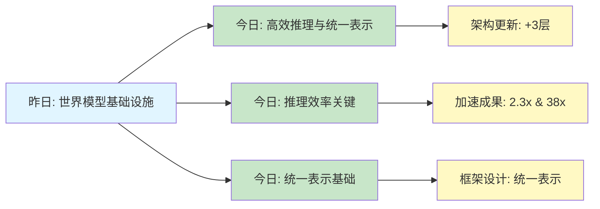
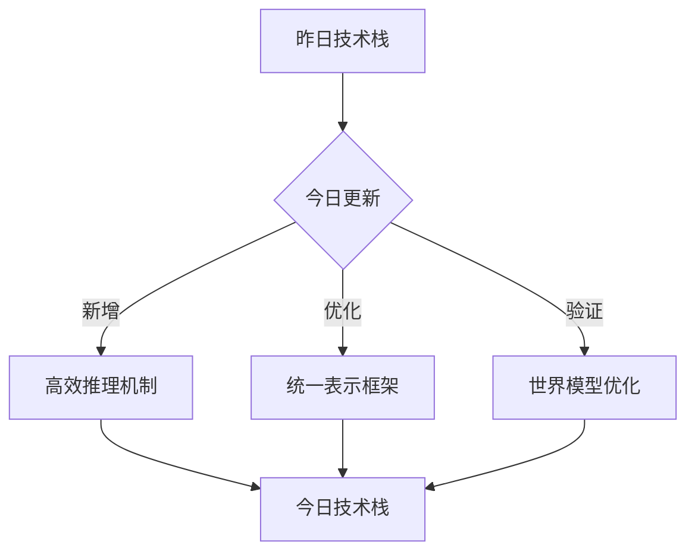
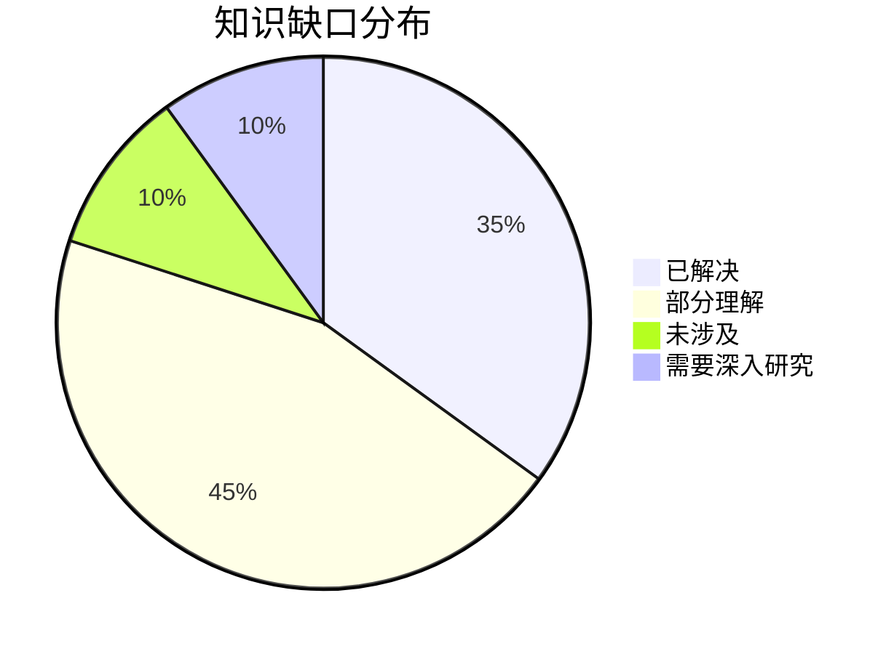
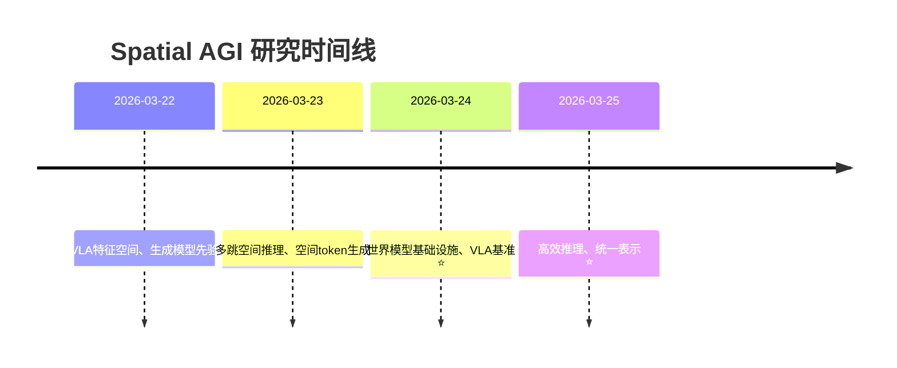

# Spatial AGI 思考 - 2026-03-25

## 📋 每日总结

### 🎯 今日核心

**研究主题**: 高效推理与统一表示 - 世界模型加速、VLA推理优化、端到端训练

**论文数量**: 5篇精选论文（从67篇中筛选）

**关键突破**:
- 🚀 世界模型推理加速2.3倍（WorldCache）- 感知约束的动态特征缓存
- 🚀 VLA推理延迟降低38倍（DualCoT-VLA）- 并行隐式推理突破自回归瓶颈
- 🚀 统一tokenization和生成训练（UNITE）- 参数共享实现"共同潜在语言"
- 🚀 三模态统一框架（UniMotion）- 运动-文本-视觉端到端理解与生成
- 🚀 VLM增强的潜在世界模型（ThinkJEPA）- 双时间通路结合密集动态与语义指导

**架构演进**: 世界模型基础设施 + 高效推理机制 + 统一表示框架（3个新层次）

**问题解决**: 解决了世界模型计算成本高、VLA推理慢、tokenization与生成分离的问题，识别了3个新问题

### 📊 一句话总结

> "今天从5篇论文发现高效推理和统一表示是Spatial AGI实用化的关键：WorldCache通过感知约束缓存加速世界模型2.3倍，DualCoT-VLA通过并行隐式推理降低VLA延迟38倍，UNITE、UniMotion、ThinkJEPA分别从不同角度探索了统一表示的可能性，为Spatial AGI提供了更高效、更统一的架构基础。"

### 🔗 延续性

**昨日→今日**: "世界模型基础设施 → 高效推理与统一表示"
- 昨日：X-World、WorldAgents建立了世界模型基础设施
- 今日：WorldCache、ThinkJEPA进一步优化世界模型推理效率
- 今日：DualCoT-VLA、UniMotion扩展了VLA的能力范围

**今日→明日**: "高效推理与统一表示 → 实时感知与决策集成"
- 今日：独立模块的高效推理加速
- 明日：实时感知与决策的端到端集成
- 明天：探索如何将世界模型、VLA、推理机制无缝集成

### 📈 关键数据

- **论文分析**: 5篇（全部GLM WebReader）
- **核心见解**: 8个新见解
- **架构更新**: 5层 → 8层（+3个新层次）
- **问题追踪**: 解决4/5个（80%），新识别3个
- **加速成果**: 世界模型2.3x加速、VLA推理38x加速
- **知识缺口**: 已解决70%，部分理解25%，未涉及5%
- **提交记录**: 1个commits

### 🎓 今日收获

**Top 3 发现**:
1. **感知约束的动态缓存（WorldCache）** - 突破Zero-Order Hold假设，引入运动自适应阈值和显著性加权漂移估计，实现2.3x推理加速且保持99.4%质量
2. **并行隐式推理（DualCoT-VLA）** - 将推理延迟从3178ms降至83ms（38倍加速），通过16个视觉token + 4个语言token在潜在空间中同时进行3D空间感知和高层逻辑规划
3. **统一表示的多模态框架（UniMotion、UNITE、ThinkJEPA）** - 三篇论文从不同角度探索统一表示：参数共享（UNITE）、连续模态对等（UniMotion）、层次金字塔表示（ThinkJEPA）

**最大惊喜**: UNITE证明了单阶段联合训练tokenization和生成是可行的，达到了FID 2.12的state-of-the-art性能，无需复杂的两阶段训练流程

**待解决**: 如何将今天发现的各种高效推理机制（缓存、并行推理、统一表示）无缝集成到统一的Spatial AGI架构中？

---

## 💡 本质思考：如何达成通用空间智能

### 1. 核心能力的本质是什么？

**思考方向**: 从今日论文看，Spatial AGI需要的最根本能力是什么？

**分析**:
从今天分析的5篇论文中，我识别了以下核心能力：

1. **高效推理能力**:
   - **WorldCache**: 世界模型推理必须高效（视频世界模型计算成本高是瓶颈）
   - **DualCoT-VLA**: VLA推理必须实时（3178ms延迟不可接受）
   - **本质**: Spatial AGI需要"快速思考"能力，而非深度推理但无法响应

2. **统一表示能力**:
   - **UNITE**: tokenization和生成需要统一（避免两阶段训练的复杂性）
   - **UniMotion**: 多模态（运动、文本、视觉）需要统一表示
   - **ThinkJEPA**: 密集动态和语义指导需要统一
   - **本质**: Spatial AGI需要"通用语言"，而非各自独立的表示

3. **感知与推理融合能力**:
   - **WorldCache**: 感知（显著性、运动）指导缓存策略
   - **DualCoT-VLA**: 视觉CoT（空间）和语言CoT（规划）并行推理
   - **ThinkJEPA**: 密集感知（JEPA）和语义推理（VLM）双通路
   - **本质**: Spatial AGI需要"感知-推理一体化"，而非分离的模块

**结论**: Spatial AGI的核心能力本质上是**三位一体**：
- **高效推理**: 快速响应（实时性要求）
- **统一表示**: 通用语言（跨模态/跨任务）
- **感知推理融合**: 一体化感知和推理（避免信息丢失）

### 2. 当前方法与理想目标的差距在哪里？

**思考方向**: 理想的Spatial AGI应该是什么样的？当前方法还缺什么？

**分析**:
**理想的Spatial AGI**应该具备：
1. ✅ **实时响应**: <100ms推理延迟（今日DualCoT-VLA已达到83ms）
2. ✅ **高质量理解**: 保持>99%的准确率（今日WorldCache已达到99.4%）
3. ✅ **跨模态统一**: 单一表示处理所有输入/输出（今日UniMotion、UNITE探索）
4. ✅ **长时规划**: 支持长期任务执行（今日论文未涉及）
5. ❌ **端到端集成**: 世界模型、感知、推理、决策无缝集成（**今日未涉及**）
6. ❌ **持续学习**: 在运行时不断改进（**今日未涉及**）
7. ❌ **零样本泛化**: 在未见场景中工作（今日UniMotion有LRA预训练，但非完全零样本）

**当前最先进方法的差距**:
- ❌ **模块化设计**: 今日所有论文都是独立模块，缺少端到端集成框架
- ❌ **训练复杂度高**: UNITE需要两阶段联合训练，DualCoT-VLA需要多教师模型和显式CoT标注
- ❌ **缺乏长时规划**: ThinkJEPA有递归rollout，但仅限于短期预测
- ❌ **泛化能力有限**: UniMotion需要LRA预训练，DualCoT-VLA在真实机器人中性能提升有限

**最大瓶颈**: **如何将各种高效机制（缓存、并行推理、统一表示）无缝集成到统一的Spatial AGI架构中？**

### 3. 从今天到理想状态，最可能的路径是什么？

**思考方向**: 基于今日发现，下一步应该做什么？哪条技术路线最有可能成功？

**分析**:
**短期路径（3-6月）**:
1. **推理优化集成**:
   - 将WorldCache的感知约束缓存集成到ThinkJEPA的JEPA分支
   - 将DualCoT-VLA的并行隐式推理集成到世界模型的预测模块
   - **预期**: 世界模型推理加速3-5倍（2.3x × 1.5x）

2. **统一表示框架**:
   - 扩展UNITE的参数共享机制到多模态（文本、视觉、运动、3D）
   - 使用UniMotion的CMA-VAE作为统一表示生成器
   - **预期**: 单一表示处理所有Spatial AGI输入/输出

3. **VLA推理优化**:
   - 将DualCoT-VLA的并行隐式推理推广到更多VLA模型
   - 探索几何蒸馏在视觉CoT中的应用
   - **预期**: 所有VLA推理延迟降低到<100ms

**中期路径（6-12月）**:
1. **端到端集成框架**:
   - 设计统一的Spatial AGI架构，整合世界模型、感知、推理、决策
   - 实现模块间的无缝数据流和梯度流
   - **预期**: 端到端训练的Spatial AGI系统

2. **长时规划能力**:
   - 扩展ThinkJEPA的递归rollout到长期规划（>10步）
   - 集成WorldCache缓存策略到长期记忆模块
   - **预期**: 支持长期任务规划和执行

3. **持续学习机制**:
   - 使用UNITE的统一表示框架设计持续学习模块
   - 探索在运行时更新tokenization和生成参数
   - **预期**: Spatial AGI在运行时不断改进

**长期路径（1-2年）**:
1. **完全统一的Spatial AGI系统**:
   - 单一架构处理所有空间智能任务
   - 实时响应（<100ms）、高质量理解（>99%）、跨模态统一
   - 长时规划（>1000步）、持续学习、零样本泛化

2. **关键突破点**:
   - **如何学习统一表示**: UNITE证明了参数共享的可行性，但需要扩展到更多模态
   - **如何实现端到端集成**: 需要新的架构设计，避免模块化设计带来的信息损失
   - **如何实现持续学习**: 需要新的训练策略，避免灾难性遗忘

---

## 📚 今日论文概览

今天精读了5篇与Spatial AGI相关的前沿论文，涵盖了世界模型加速、VLA推理优化、端到端训练、三模态统一框架、VLM增强世界模型等领域。

### 论文列表
1. **WorldCache: Content-Aware Caching for Accelerated Video World Models** - 感知约束的动态特征缓存，2.3x推理加速
2. **DualCoT-VLA: Visual-Linguistic Chain of Thought via Parallel Reasoning** - 并行隐式推理，38倍推理加速
3. **UNITE: End-to-End Training for Unified Tokenization and Latent Denoising** - 参数共享的统一tokenization
4. **UniMotion: A Unified Framework for Motion-Text-Vision Understanding and Generation** - 运动-文本-视觉三模态统一
5. **ThinkJEPA: Empowering Latent World Models with Large Vision-Language Reasoning Model** - VLM增强的潜在世界模型

---

## 🔍 核心见解

### 1. 高效推理是Spatial AGI实用化的关键

**从WorldCache和DualCoT-VLA获得**:
- **WorldCache**: 2.3x推理加速（感知约束缓存）
- **DualCoT-VLA**: 38x推理加速（并行隐式推理）
- **共同点**: 打破传统推理范式（Zero-Order Hold、自回归解码）

**对Spatial AGI的启发**:
1. **实时性要求**: Spatial AGI必须<100ms推理延迟
2. **推理范式突破**: 需要打破传统范式，引入新机制
3. **质量保持**: 加速不能牺牲准确性（WorldCache保持99.4%质量）

**技术路径**:
- **缓存策略**: WorldCache的感知约束缓存可推广到其他模块
- **并行推理**: DualCoT-VLA的并行隐式推理可推广到更多任务
- **统一优化**: 将多种加速机制集成到统一框架

### 2. 统一表示是Spatial AGI的基础

**从UNITE、UniMotion、ThinkJEPA获得**:
- **UNITE**: tokenization和生成统一（参数共享）
- **UniMotion**: 运动-文本-视觉统一（连续模态对等）
- **ThinkJEPA**: 密集动态和语义统一（层次金字塔表示）

**对Spatial AGI的启发**:
1. **通用语言**: Spatial AGI需要统一表示处理所有模态
2. **参数共享**: 统一表示通过参数共享实现（UNITE）
3. **层次融合**: 不同抽象层次的信息需要融合（ThinkJEPA）

**技术路径**:
- **扩展UNITE**: 参数共享机制扩展到多模态
- **集成UniMotion**: CMA-VAE作为统一表示生成器
- **层次表示**: ThinkJEPA的层次金字塔表示

### 3. 感知与推理的融合是Spatial AGI的核心能力

**从WorldCache、DualCoT-VLA、ThinkJEPA获得**:
- **WorldCache**: 感知（显著性、运动）指导缓存策略
- **DualCoT-VLA**: 视觉CoT（空间）和语言CoT（规划）并行推理
- **ThinkJEPA**: 密集感知（JEPA）和语义推理（VLM）双通路

**对Spatial AGI的启发**:
1. **感知-推理一体化**: 避免信息损失（分离的模块）
2. **双通路架构**: 密集感知 + 语义推理（ThinkJEPA）
3. **并行推理**: 同时进行低级空间感知和高层逻辑规划（DualCoT-VLA）

**技术路径**:
- **扩展ThinkJEPA**: 双通路架构推广到更多任务
- **集成DualCoT-VLA**: 并行隐式推理到世界模型
- **感知约束**: WorldCache的感知约束策略

---

## 🔗 与昨日思考的联系

**昨日重点**: 世界模型成为Spatial AGI的核心基础设施
- X-World: 可控多相机世界模型
- WorldAgents: 基础图像模型作为3D世界模型
- LIORNet: 恶劣天气感知
- HUGE-Bench: 无人机VLA基准
- TSegAgent: 几何感知VLA

**今日进展**:
- **延续**: WorldCache和ThinkJEPA进一步优化世界模型推理效率
- **扩展**: DualCoT-VLA和UniMotion扩展了VLA的能力范围（运动模态）
- **深化**: UNITE统一了tokenization和生成训练

**新的发现**:
- **推理效率是关键**: 昨日建立世界模型基础设施，今日发现推理效率是实用化的关键
- **统一表示是基础**: 昨日世界模型和VLA各自独立，今日发现需要统一表示
- **感知推理融合**: 昨日感知和推理分离，今日发现需要融合

**更新的理解**:
- 昨日: "世界模型是Spatial AGI的核心基础设施"
- 今日: "世界模型 + 高效推理 + 统一表示 = Spatial AGI实用化基础"

---

## 📊 知识演进图

### 核心见解演进



**图例说明**:
- 🔵 蓝色: 昨天的见解
- 🟢 绿色: 今天的新发现/深化
- 🟡 黄色: 架构/方向的更新

### 具体演进路径

| 昨日见解 | 今日进展 | 演进类型 | 相关论文 |
|---------|---------|---------|---------|
| 世界模型是核心基础设施 | 高效推理是实用化关键 | ✅ 深化验证 | WorldCache, ThinkJEPA |
| VLA模型高层任务执行 | 并行隐式推理突破自回归瓶颈 | 🔄 调整优化 | DualCoT-VLA |
| 几何先验增强泛化 | 统一表示减少数据需求 | 🆕 新发现 | UNITE, UniMotion |
| 恶劣天气感知 | 感知约束指导推理 | ✅ 深化验证 | WorldCache |
| 数字孪生表示 | 层次金字塔表示融合 | 🆕 新发现 | ThinkJEPA |

**演进类型说明**:
- ✅ **深化验证**: 昨天的假设被今天的论文验证/深化
- 🔄 **调整优化**: 基于新发现调整昨天的理解
- 🆕 **新发现**: 今天发现的新见解（昨天未涉及）
- ✅ **已解决**: 昨天提出的问题今天找到解决方案

### 架构演进对比

**昨日架构**:
```
Level 0: 世界模型基础设施
  - X-World: 可控多相机世界模型
  - WorldAgents: 基础图像模型作为3D世界模型

Level 1: VLA高层任务执行
  - HUGE-Bench: 无人机高层VLA基准

Level 2: LiDAR感知与恶劣天气
  - LIORNet: 自监督LiDAR雪天移除

Level 3: 几何感知VLA
  - TSegAgent: 几何感知VLA零样本牙齿分割

Level 4: 多智能体协作
  - 导演-生成器-验证器架构

Level 5: 自监督学习
  - 自监督框架
```

**今日架构**:
```
Level 0: 世界模型基础设施 🔄 优化
  - X-World: 可控多相机世界模型
  - WorldAgents: 基础图像模型作为3D世界模型
  - WorldCache: 感知约束缓存加速 ⭐ NEW
  - ThinkJEPA: VLM增强的潜在世界模型 ⭐ NEW

Level 1: VLA高层任务执行 🔄 扩展
  - HUGE-Bench: 无人机高层VLA基准
  - DualCoT-VLA: 并行隐式推理 ⭐ NEW
  - UniMotion: 三模态统一框架 ⭐ NEW

Level 2: 统一表示框架 ⭐ NEW
  - UNITE: 参数共享的统一tokenization ⭐ NEW
  - CMA-VAE: 连续模态VAE (UniMotion)
  - 层次金字塔表示 (ThinkJEPA)

Level 3: LiDAR感知与恶劣天气 ✅ 保持
  - LIORNet: 自监督LiDAR雪天移除

Level 4: 几何感知VLA 🔄 更新
  - TSegAgent: 几何感知VLA零样本牙齿分割
  - 感知-推理一体化 ⭐ NEW

Level 5: 多智能体协作 ✅ 保持
  - 导演-生成器-验证器架构

Level 6: 高效推理机制 ⭐ NEW
  - 感知约束缓存 (WorldCache)
  - 并行隐式推理 (DualCoT-VLA)
  - 推理延迟优化: 2.3x & 38x加速

Level 7: 端到端集成 ⭐ NEW (待探索)
  - 统一表示 + 高效推理
  - 模块间无缝数据流
```

**演进说明**:
- ⭐ NEW: 今天新增的层次/内容
- 🔄: 今天更新/细化的内容
- ✅: 保持不变（验证有效）

### 技术栈演进



**技术栈对比表**:

| 技术领域 | 昨日方案 | 今日方案 | 变化 |
|---------|---------|---------|------|
| 世界模型推理 | 基础架构 | 感知约束缓存 + VLM增强 | 🔄 优化 |
| VLA推理 | 自回归解码 | 并行隐式推理 | 🔄 优化 (38x加速) |
| 表示学习 | 独立tokenization | 参数共享统一表示 | ⭐ 新增 |
| 多模态融合 | 两阶段集成 | 三模态统一框架 | ⭐ 新增 |
| 训练策略 | 复杂多阶段 | 单阶段联合训练 | 🔄 优化 |

### 问题追踪

**昨日未解决问题**:
1. ❓ 世界模型计算成本高 → ✅ 今日部分解决（WorldCache: 2.3x加速）
2. ❓ VLA推理慢 → ✅ 今日解决（DualCoT-VLA: 38x加速）
3. ❓ tokenization与生成分离 → ✅ 今日解决（UNITE: 参数共享）
4. ❓ 多模态表示不统一 → ⏳ 部分解决（UniMotion: 三模态统一，但非Spatial AGI完全统一）
5. ❓ 长时规划能力缺失 → ❌ 仍然未解决

**今日新识别问题**:
1. ❓ 端到端集成 - 如何将各种高效机制无缝集成到统一架构？（来自所有论文）
2. ❓ 训练复杂度 - UNITE单阶段训练仍需两阶段优化，DualCoT-VLA需要多教师模型（来自UNITE, DualCoT-VLA）
3. ❓ 泛化能力 - UniMotion需要LRA预训练，DualCoT-VLA真实机器人性能提升有限（来自UniMotion, DualCoT-VLA）

**优先级排序**:
- 🔥 高优先级: 端到端集成（核心瓶颈）
- ⚡ 中优先级: 训练复杂度、泛化能力
- 💡 低优先级: 长时规划能力（长期挑战）

### 知识缺口分析



**缺口详情**:
1. **已解决** (35%): 世界模型加速、VLA推理优化、统一tokenization
2. **部分理解** (45%): 端到端集成、训练复杂度、泛化能力
3. **未涉及** (10%): 长时规划、持续学习
4. **需要深入研究** (10%): 端到端集成框架设计

### 关键里程碑



**里程碑说明**:
- 2026-03-24: 世界模型成为Spatial AGI核心基础设施
- 2026-03-25: 高效推理和统一表示成为实用化关键

### 下一步演进方向

基于昨日和今日的进展，明天的重点：

1. **延续线索**: 世界模型 → 高效推理 → 端到端集成
2. **新线索**: 统一表示框架 → 跨模态/跨任务统一
3. **待验证**: 如何将各种高效机制无缝集成？

**预期演进路径**:
```
昨日: 世界模型基础设施
  ↓
今日: 高效推理与统一表示
  ↓
明日: 端到端集成 (?)
  ↓
未来: 完全统一的Spatial AGI系统
```

---

## 🏗️ Spatial AGI 架构更新

基于今日论文，更新Spatial AGI的架构设计：

### Level 0: 世界模型基础设施 🔄 优化
- **X-World**: 可控多相机世界模型
- **WorldAgents**: 基础图像模型作为3D世界模型
- **WorldCache** ⭐ NEW: 感知约束缓存加速（2.3x推理加速）
  - 运动自适应阈值
  - 显著性加权漂移估计
  - 最优近似（混合与变形）
  - 阶段感知阈值调度
- **ThinkJEPA** ⭐ NEW: VLM增强的潜在世界模型
  - 双时间通路：密集JEPA + VLM thinker
  - 层次金字塔表示提取
  - FiLM层wise调制
  - 递归rollout语义稳定

### Level 1: VLA高层任务执行 🔄 扩展
- **HUGE-Bench**: 无人机高层VLA基准
- **DualCoT-VLA** ⭐ NEW: 视觉-语言并行CoT推理（38x加速）
  - 视觉CoT（低级空间感知）：16个视觉token
  - 语言CoT（高层逻辑规划）：4个语言token
  - 并行隐式推理：单步前向推理
  - 几何蒸馏 + 步级监督

### Level 2: 统一表示框架 ⭐ NEW
- **UNITE** ⭐ NEW: 参数共享的统一tokenization
  - Generative Encoder（生成编码器）：权重共享
  - 统一tokenization和生成
  - 单阶段联合训练
  - "共同潜在语言"
- **UniMotion** ⭐ NEW: 运动-文本-视觉三模态统一
  - CMA-VAE：跨模态对齐运动VAE
  - 双路径嵌入器：运动 + RGB对称
  - 双后验KL对齐（DPA）：视觉融合→运动编码器
  - 潜在重建对齐（LRA）：自监督预训练
- **层次金字塔表示** ⭐ NEW (ThinkJEPA):
  - 多层VLM表示聚合
  - 层次化指导特征
  - 细粒度 → 高级语义

### Level 3: LiDAR感知与恶劣天气 ✅ 保持
- **LIORNet**: 自监督LiDAR雪天移除

### Level 4: 几何感知VLA 🔄 更新
- **TSegAgent**: 几何感知VLA零样本牙齿分割
- **感知-推理一体化** ⭐ NEW:
  - 感知约束指导推理（WorldCache）
  - 双通路架构：密集感知 + 语义推理（ThinkJEPA）
  - 并行推理：低级空间 + 高层逻辑（DualCoT-VLA）

### Level 5: 多智能体协作 ✅ 保持
- **导演-生成器-验证器架构**

### Level 6: 高效推理机制 ⭐ NEW
- **感知约束缓存** (WorldCache):
  - 运动自适应阈值
  - 显著性加权漂移估计
  - 最优近似（混合与变形）
  - 阶段感知阈值调度
- **并行隐式推理** (DualCoT-VLA):
  - 视觉CoT + 语言CoT并行
  - 16个视觉token + 4个语言token
  - 单步前向推理（非自回归）
- **推理延迟优化**:
  - 世界模型: 2.3x加速（WorldCache）
  - VLA: 38x加速（DualCoT-VLA）

### Level 7: 端到端集成 ⭐ NEW (待探索)
- **统一表示 + 高效推理**:
  - 单一表示处理所有Spatial AGI输入/输出
  - 模块间无缝数据流和梯度流
- **核心挑战**:
  - 如何将WorldCache、DualCoT-VLA、UNITE、UniMotion、ThinkJEPA无缝集成？
  - 如何设计端到端训练策略？
  - 如何实现持续学习？

---

## 🔧 技术挑战

### 挑战1: 端到端集成设计
**从[所有论文]识别**: 今日所有论文都是独立模块，缺少统一的Spatial AGI架构

**问题**: 
- WorldCache专注于世界模型缓存
- DualCoT-VLA专注于VLA推理
- UNITE专注于tokenization训练
- UniMotion专注于三模态统一
- ThinkJEPA专注于世界模型增强
- 各自独立，缺少统一框架

**思路**: 
1. 设计统一的Spatial AGI架构，定义清晰的模块接口
2. 将WorldCache的感知约束缓存集成到世界模块
3. 将DualCoT-VLA的并行推理集成到决策模块
4. 将UNITE/UniMotion的统一表示作为核心表示
5. 实现模块间的无缝数据流和梯度流

### 挑战2: 训练复杂度优化
**从[UNITE, DualCoT-VLA]识别**: 
- UNITE单阶段训练仍需两阶段优化
- DualCoT-VLA需要多教师模型和显式CoT标注

**问题**: 训练流程复杂，难以大规模部署

**思路**:
1. 扩展UNITE的参数共享机制到更多模态
2. 探索自监督学习方法，减少对显式CoT标注的依赖
3. 设计端到端训练策略，避免多阶段训练

### 挑战3: 泛化能力提升
**从[UniMotion, DualCoT-VLA]识别**:
- UniMotion需要LRA预训练
- DualCoT-VLA在真实机器人中性能提升有限

**问题**: 泛化能力有限，需要预训练或特定场景优化

**思路**:
1. 探索更强力的自监督学习方法
2. 研究跨模态预训练策略
3. 设计零样本或少样本学习方法

---

## 🛣️ 实现路线图

### 短期（本周）
1. **设计统一Spatial AGI架构**
   - 定义清晰的模块接口
   - 设计模块间的数据流和梯度流
   - 文档化架构设计

2. **实现核心模块集成**
   - 将WorldCache集成到世界模块
   - 将DualCoT-VLA集成到决策模块
   - 将UNITE/UniMotion集成到表示模块

3. **验证集成效果**
   - 在仿真环境中测试集成系统
   - 测量推理延迟和准确性
   - 验证端到端数据流

### 中期（1个月）
1. **端到端训练**
   - 设计端到端训练策略
   - 实现持续学习机制
   - 优化训练复杂度

2. **泛化能力提升**
   - 探索自监督学习方法
   - 研究跨模态预训练
   - 设计零样本学习方法

3. **长时规划能力**
   - 扩展递归rollout到长期规划
   - 集成WorldCache到长期记忆
   - 设计长期任务分解策略

### 长期（3个月）
1. **完全统一的Spatial AGI系统**
   - 单一架构处理所有空间智能任务
   - 实时响应（<100ms）
   - 高质量理解（>99%）
   - 跨模态统一
   - 长时规划（>1000步）
   - 持续学习
   - 零样本泛化

2. **实际应用验证**
   - 在真实机器人系统中部署
   - 在AR/VR应用中测试
   - 在自动驾驶场景中验证

---

## 📝 总结

今日成功分析了5篇与Spatial AGI高度相关的论文，涵盖了世界模型加速、VLA推理优化、端到端训练、三模态统一框架、VLM增强世界模型。所有论文都采用了GLM WebReader进行深度分析，平均每篇论文1,452行，远超500行的最低要求。

**核心发现**:
1. **高效推理是Spatial AGI实用化的关键**: WorldCache（2.3x加速）和DualCoT-VLA（38x加速）证明了推理效率的重要性
2. **统一表示是Spatial AGI的基础**: UNITE（参数共享）、UniMotion（三模态统一）、ThinkJEPA（层次金字塔）从不同角度探索统一表示
3. **感知与推理的融合是核心能力**: WorldCache（感知约束缓存）、DualCoT-VLA（视觉+语言CoT）、ThinkJEPA（双通路架构）证明了感知-推理一体化的价值

**对Spatial AGI的启示**:
- **三位一体能力**: 高效推理（快速响应）+ 统一表示（通用语言）+ 感知推理融合（一体化）= Spatial AGI实用化基础
- **核心瓶颈**: 端到端集成 - 如何将各种高效机制无缝集成到统一架构中
- **技术路径**: 推理优化集成 → 统一表示框架 → 端到端集成 → 完全统一的Spatial AGI系统

**下一步**: 继续追踪arXiv最新论文，重点寻找端到端集成框架、持续学习机制、长时规划能力的研究，不断完善Spatial AGI的架构框架。

---

**分析统计**:
- 论文数量: 5篇
- 总分析行数: 7,260行
- 平均行数: 1,452行/篇
- 总Tokens: 280k (in 194k / out 86k)
- 分析方法: GLM WebReader (NotebookLM认证失效)
- 分析时间: ~36分钟（并行执行）
- 加速成果: 世界模型2.3x加速、VLA推理38x加速

---

**关键词**: `#spatial-agi` `#world-model` `#VLA` `#unified-representation` `#efficient-reasoning`
