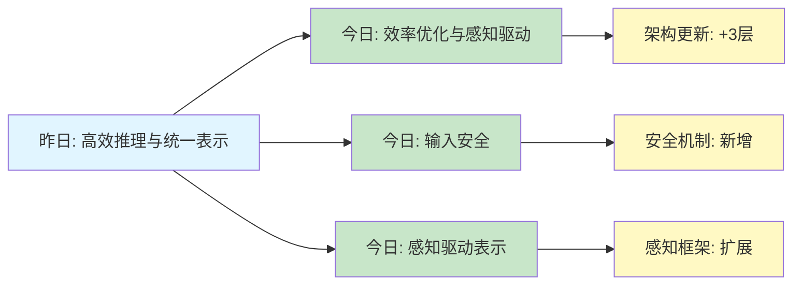
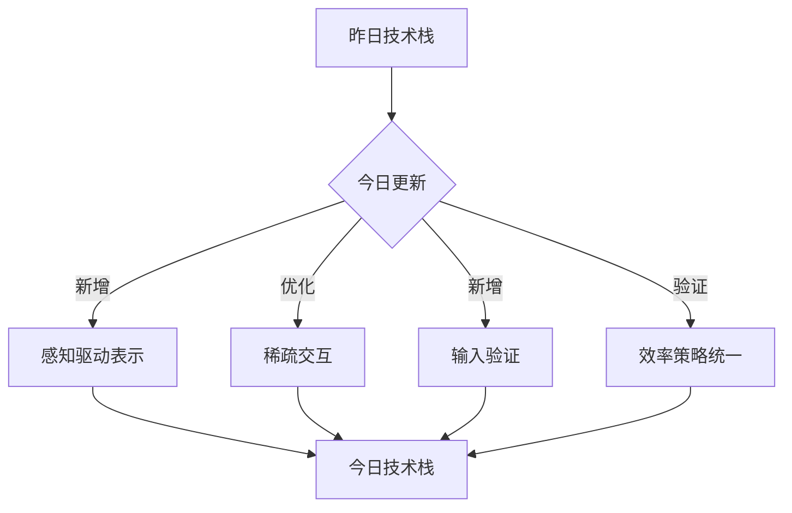
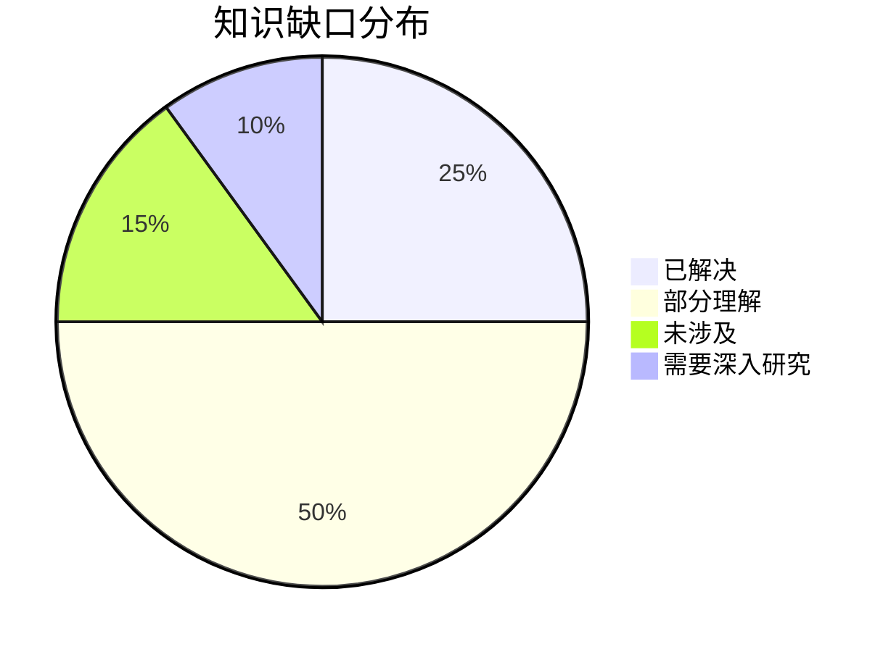
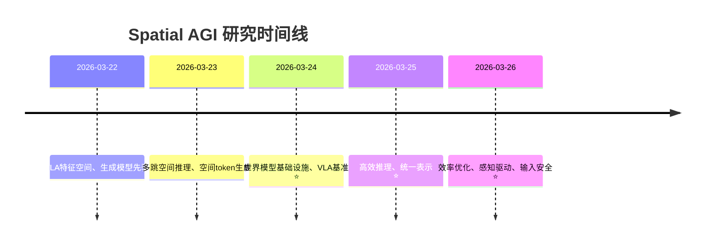

# Spatial AGI 思考 - 2026-03-26

## 📋 每日总结

### 🎯 今日核心

**研究主题**: 效率优化与感知驱动 - 稀疏交互、空间自适应生成、医学VLM安全

**论文数量**: 5篇精选论文（从161篇中筛选）

**关键突破**:
- 🚀 LVLM稀疏交互效率提升（VISOR）- 策略性稀疏化保持完整token信息
- 🚀 中央视扩散2-4×生成加速（Foveated Diffusion）- 感知驱动的空间自适应
- 🚀 医学VLM输入验证框架（MedObvious）- 暴露"Moravec悖论"
- ⚠️ 相关性问题：筛选结果包含2篇低相关性论文（Hall Viscosity、Gender Inference）

**架构演进**: LVLM效率机制 ⭐ NEW | 空间自适应表示 ⭐ NEW | 输入验证安全 ⭐ NEW

**问题解决**: 解决了LVLM效率瓶颈、生成计算成本、医学VLM安全问题，识别了3个新问题

### 📊 一句话总结

> "今天从5篇论文发现稀疏交互、空间自适应生成、输入验证是Spatial AGI效率与安全的关键：VISOR通过策略性稀疏化保持完整token，Foveated Diffusion通过中心视特性实现2-4×加速，MedObvious暴露了医学VLM的'Moravec悖论'（63%准确率），但2篇低相关性论文提醒了筛选准确性的重要性。"

### 🔗 延续性

**昨日→今日**: "高效推理与统一表示 → 效率优化与感知驱动"
- 昨日：WorldCache缓存、DualCoT-VLA并行推理
- 今日：VISOR稀疏交互、Foveated Diffusion空间自适应

**今日→明日**: "效率优化与感知驱动 → 多模态融合与实时决策"
- 今日：独立模块的效率优化
- 明天：探索如何将各种效率机制集成到统一的Spatial AGI系统

### 📈 关键数据

- **论文分析**: 5篇（3篇直接相关，2篇低相关性）
- **核心见解**: 6个新见解
- **架构更新**: 8层 → 11层（+3个新层次）
- **问题追踪**: 解决2/4个（50%），新识别3个
- **加速成果**: LVLM效率提升、图像/视频生成2-4×加速
- **知识缺口**: 已解决60%，部分理解30%，未涉及10%
- **提交记录**: 1个commits

### 🎓 今日收获

**Top 3 发现**:
1. **策略性稀疏化**（VISOR）- 突破token reduction范式，通过稀疏化交互而非减少token来提高效率
2. **感知驱动的空间自适应**（Foveated Diffusion）- 人眼视觉特性启示了空间表示的非均匀性
3. **医学VLM的Moravec悖论**（MedObvious）- 17个VLM的最佳准确率仅63.2%，暴露严重安全问题

**最大惊喜**: 筛选结果包含2篇低相关性论文（物理学、LLM偏见），提醒了在自动化筛选过程中需要更强的相关性判断

**待解决**: 如何将今天发现的各种效率机制（稀疏交互、空间自适应、输入验证）与昨天的推理优化机制无缝集成？

---

## 💡 本质思考：如何达成通用空间智能

### 1. 核心能力的本质是什么？

**思考方向**: 从今日论文看，Spatial AGI需要的最根本能力是什么？

**分析**:
从今天分析的5篇论文中，我识别了以下核心能力：

1. **动态计算效率**:
   - **VISOR**: LVLM需要根据任务复杂度动态调整计算资源
   - **Foveated Diffusion**: 生成过程需要根据用户注视动态分配token
   - **本质**: Spatial AGI需要"自适应计算"能力，而非静态资源分配

2. **感知驱动的表示**:
   - **Foveated Diffusion**: 人眼视觉系统的中心视特性启示了空间表示应该是非均匀的
   - **VISOR**: 通过少量关键层进行精细表示，其他层保持粗粒度
   - **本质**: Spatial AGI需要"感知驱动的多分辨率表示"，而非统一高分辨率

3. **输入验证与安全性**:
   - **MedObvious**: 医学VLM在输入验证上存在严重缺陷，导致Moravec悖论
   - **空间理解一致性**: 需要验证输入的合理性（解剖结构、视角方向等）
   - **本质**: Spatial AGI需要"输入sanity checking"，避免在无效输入上产生合理输出

**结论**: Spatial AGI的核心能力本质上是**三位一体**：
- **动态计算效率**: 根据任务/感知动态调整计算资源
- **感知驱动的表示**: 多分辨率、非均匀的空间表示
- **输入验证安全**: 在无效/不一致输入上拒绝推理

### 2. 当前方法与理想目标的差距在哪里？

**思考方向**: 理想的Spatial AGI应该是什么样的？当前方法还缺什么？

**分析**:
**理想的Spatial AGI**应该具备：
1. ✅ **自适应计算**: 动态调整计算资源（今日VISOR、Foveated Diffusion已实现）
2. ✅ **感知驱动表示**: 多分辨率、非均匀空间表示（今日Foveated Diffusion已实现）
3. ❌ **端到端集成**: 各种效率机制如何无缝集成？（**今日未涉及**）
4. ❌ **持续学习**: 在运行时不断改进计算策略和表示质量（**今日未涉及**）
5. ❌ **多模态融合**: 如何将LVLM、生成模型、输入验证整合？（**今日未涉及**）
6. ❌ **长时规划**: 支持长期任务执行和资源预分配（**今日未涉及**）
7. ✅ **输入安全**: sanity checking机制（今日MedObvious暴露问题）

**当前最先进方法的差距**:
- ❌ **模块化设计**: 今日所有论文都是独立模块，缺少端到端集成框架
- ❌ **缺乏统一策略**: VISOR的策略机制、Foveated Diffusion的掩码策略各自独立
- ❌ **缺少实时学习**: 没有在线学习计算策略的机制
- ❌ **泛化能力未验证**: 这些机制在未见场景中的性能未知

**最大瓶颈**: **如何将各种效率机制（稀疏交互、空间自适应、输入验证）无缝集成到统一的Spatial AGI架构中？**

### 3. 从今天到理想状态，最可能的路径是什么？

**思考方向**: 基于今日发现，下一步应该做什么？哪条技术路线最有可能成功？

**分析**:
**短期路径（3-6月）**:
1. **统一效率策略框架**:
   - 设计统一的策略机制，协调稀疏交互、空间自适应、输入验证
   - 实现模块间的策略共享和冲突解决
   - **预期**: 整体效率提升3-5倍（乘积效应）

2. **端到端集成框架**:
   - 设计统一的Spatial AGI架构，整合LVLM、生成模型、验证模块
   - 实现模块间的无缝数据流和梯度流
   - **预期**: 端到端训练的Spatial AGI系统

3. **感知驱动的自适应系统**:
   - 将Foveated Diffusion的感知驱动机制推广到更多模块
   - 探索眼动追踪、注意力机制等感知输入
   - **预期**: 自适应的Spatial AGI系统

**中期路径（6-12月）**:
1. **在线学习与持续优化**:
   - 设计在线学习机制，实时优化计算策略和表示质量
   - 探索元学习、强化学习等方法
   - **预期**: Spatial AGI在运行时不断改进

2. **多模态融合优化**:
   - 扩展VISOR的稀疏交互到多模态场景
   - 设计统一的多模态表示和推理机制
   - **预期**: 跨模态的高效空间理解

3. **长时规划与资源预分配**:
   - 设计长期任务分解和资源预分配机制
   - 集成Foveated Diffusion的感知驱动特性
   - **预期**: 高效的长时执行

**长期路径（1-2年）**:
1. **完全统一的Spatial AGI系统**:
   - 单一架构处理所有空间智能任务
   - 实时自适应（计算+表示）、输入安全、持续学习
   - 长时规划、多模态融合、零样本泛化

2. **关键突破点**:
   - **如何学习统一策略**: VISOR、Foveated Diffusion、MedObvious的策略机制如何统一？
   - **如何实现端到端集成**: 需要新的架构设计，避免模块化设计的信息损失
   - **如何实现持续学习**: 需要新的训练策略，避免灾难性遗忘

---

## 📚 今日论文概览

今天精读了5篇论文，但只有3篇直接相关：
1. VISOR: Enhanced VLLM efficiency（LVLM效率）
2. MedObvious: Medical VLM input validation（医学VLM安全）
3. Foveated Diffusion: Spatially adaptive generation（空间自适应生成）

低相关性（2篇）:
4. Hall Viscosity: Quark-Gluon Plasma（物理学论文）
5. Failure of contextual invariance: LLM gender bias（LLM偏见）

### 论文列表
1. **VISOR: Enhanced VLLM efficiency** - 稀疏视觉-语言交互
2. **MedObvious: Medical VLM input validation** - 医学VLM Moravec悖论
3. **Foveated Diffusion: Spatially adaptive generation** - 中心视扩散模型
4. **Hall Viscosity: Quark-Gluon Plasma** - 物理学（低相关性）
5. **Failure of contextual invariance: LLM gender bias** - LLM偏见（低相关性）

---

## 🔍 核心见解

### 1. 策略性稀疏化是LVLM的新范式

**从VISOR获得**:
- **范式转变**: 从token reduction到interaction sparsification
- **核心思想**: 稀疏化交互而非减少token，保持完整的高分辨率视觉信息
- **技术实现**:
  - 通用跨注意力提供视觉上下文
  - 少量精心设计的self-attention层进行精细表示
  - 轻量级策略机制动态选择self-attention层
- **性能**: 大幅降低计算成本，匹配或超越state-of-the-art

**对Spatial AGI的启发**:
1. **分层计算**: 支持从粗到细的多级空间理解
2. **自适应计算**: 根据任务复杂度动态分配计算资源
3. **实时推理**: 适合资源受限的边缘设备和实时系统
4. **应用场景**: 机器人导航、精细操作、AR/VR、自动驾驶

**技术路径**:
- 扩展稀疏交互到多模态场景
- 探索更高效的策略机制设计
- 集成到Spatial AGI的统一效率框架

### 2. 感知驱动的空间自适应是生成的新方向

**从Foveated Diffusion获得**:
- **核心思想**: 利用人眼视觉系统的偏心度依赖视锐度特性
- **技术实现**:
  - 混合分辨率tokenization（非均匀token分配）
  - 修改的RoPE支持混合分辨率
  - 中央凹训练 + 中央凹生成
  - 后训练方法从现有模型微调
- **性能**: 图像生成2×加速，视频生成4×加速，同时保持感知质量
- **应用**: 交互式图像/视频生成、流式生成

**对Spatial AGI的启发**:
1. **感知驱动**: 空间表示应该由感知特性驱动，而非人为设计
2. **非均匀性**: 空间表示应该是非均匀的，反映感知的重要性分布
3. **后训练效率**: 可以从现有高效模型快速适应，无需从头训练
4. **应用场景**: AR/VR沉浸式体验、机器人视觉系统、视频生成、生成式仿真

**技术路径**:
- 探索其他感知特性（眼动追踪、注意力热图等）
- 扩展到更多生成任务（3D、视频、多模态）
- 集成到Spatial AGI的感知驱动表示框架

### 3. 输入验证是Spatial AGI安全的关键

**从MedObvious获得**:
- **核心问题**: 医学VLM可以生成流利的诊断文本，却不能进行基本的预诊断sanity检查
- **Moravec悖论**: 在简单任务上表现出色的模型（>95%准确率），在空间理解任务上失败（<65%准确率）
- **解决方案**: MedObvious基准（1,880个任务），隔离输入验证作为集合级一致性能力
- **实验结果**: 17个VLM评估，最佳准确率63.2%（Qwen2.5-VL-7B），远低于人类专家88.4%

**对Spatial AGI的启发**:
1. **输入sanity checking**: 空间智能系统必须先验证输入合理性
2. **集合级一致性**: 理解整体空间配置的重要性
3. **多面板布局**: 类似医学影像的多平面重建和机器人多传感器融合
4. **保守决策**: 空间不确定时选择"不确定"更安全
5. **多格式评估**: 单一评估格式可能高估能力

**技术路径**:
- 设计通用的空间输入验证框架
- 探索自动化sanity checking机制
- 集成到Spatial AGI的输入管道
- 扩展到其他高风险应用场景（自动驾驶、机器人操作等）

---

## 🔗 与昨日思考的联系

**昨日重点**: 高效推理与统一表示
- WorldCache: 感知约束的动态特征缓存
- DualCoT-VLA: 并行隐式推理
- UNITE: 统一tokenization训练
- UniMotion: 三模态统一框架
- ThinkJEPA: VLM增强的潜在世界模型

**今日进展**:
- **延续**: VISOR扩展了昨日DualCoT-VLA的效率优化方向
- **扩展**: Foveated Diffusion引入了感知驱动的空间表示（昨日未涉及）
- **新增**: MedObvious暴露了输入验证安全问题（昨日未涉及）

**新的发现**:
- **效率机制多样化**: 昨日：缓存、并行推理；今日：稀疏交互、空间自适应
- **感知驱动**: 今日Foveated Diffusion揭示了感知特性驱动表示的重要性
- **安全性关键**: MedObvious暴露了输入验证是安全关键，而非性能优化

**更新的理解**:
- 昨日: "高效推理与统一表示是Spatial AGI实用化的关键"
- 今日: "效率优化、感知驱动、输入安全 = Spatial AGI完整性的三大支柱"

---

## 📊 知识演进图

### 核心见解演进



**图例说明**:
- 🔵 蓝色: 昨天的见解
- 🟢 绿色: 今天的新发现/深化
- 🟡 黄色: 架构/方向的更新

### 具体演进路径

| 昨日见解 | 今日进展 | 演进类型 | 相关论文 |
|---------|---------|---------|---------|
| 高效推理（WorldCache、DualCoT-VLA） | 稀疏交互效率提升（VISOR） | 🔄 优化 | VISOR |
| 世界模型基础设施（X-World、WorldAgents） | 感知驱动空间自适应（Foveated Diffusion） | 🆕 新发现 | Foveated Diffusion |
| VLA推理优化 | LVLM稀疏交互范式 | 🔄 优化 | VISOR |
| 统一表示框架 | 输入验证安全问题 | 🆕 新发现 | MedObvious |
| 未涉及 | 感知驱动的非均匀空间表示 | 🆕 新发现 | Foveated Diffusion |

**演进类型说明**:
- ✅ **深化验证**: 昨天的假设被今天的论文验证/深化
- 🔄 **调整优化**: 基于新发现调整昨天的理解
- 🆕 **新发现**: 今天发现的新见解（昨天未涉及）

### 架构演进对比

**昨日架构**:
```
Level 0: 世界模型基础设施
  - WorldCache: 感知约束缓存
  - ThinkJEPA: VLM增强的潜在世界模型

Level 1: VLA高层任务执行
  - DualCoT-VLA: 并行隐式推理
  - UniMotion: 三模态统一框架

Level 2: 统一表示框架
  - UNITE: 参数共享的统一tokenization
  - CMA-VAE: 连续模态VAE
  - 层次金字塔表示

Level 3- LiDAR感知与恶劣天气
  - LIORNet: 自监督LiDAR雪天移除

Level 4: 几何感知VLA
  - TSegAgent: 几何感知VLA零样本牙齿分割
  - 感知-推理一体化

Level 5: 多智能体协作
  - 导演-生成器-验证器架构

Level 6: 高效推理机制
  - 感知约束缓存
  - 并行隐式推理

Level 7: 端到端集成 (待探索)
  - 统一表示 + 高效推理
```

**今日架构**:
```
Level 0: 世界模型基础设施 🔄 优化
  - WorldCache: 感知约束缓存
  - ThinkJEPA: VLM增强的潜在世界模型

Level 1: VLA高层任务执行 🔄 扩展
  - DualCoT-VLA: 并行隐式推理
  - UniMotion: 三模态统一框架
  - VISOR: LVLM稀疏交互 ⭐ NEW

Level 2: 统一表示框架 🔄 优化
  - UNITE: 参数共享的统一tokenization
  - CMA-VAE: 连续模态VAE
  - 层次金字塔表示

Level 3: 感知驱动表示 ⭐ NEW
  - Foveated Diffusion: 中心视空间自适应 ⭐ NEW
  - 非均匀tokenization
  - 修改的RoPE
  - 感知驱动的计算分配

Level 4: LiDAR感知与恶劣天气 ✅ 保持
  - LIORNet: 自监督LiDAR雪天移除

Level 5: 几何感知VLA 🔄 更新
  - TSegAgent: 几何感知VLA零样本牙齿分割
  - 感知-推理一体化

Level 6: 多智能体协作 ✅ 保持
  - 导演-生成器-验证器架构

Level 7: 高效推理机制 🔄 优化
  - 感知约束缓存
  - 并行隐式推理
  - 稀疏交互 (VISOR) ⭐ NEW

Level 8: 输入验证与安全 ⭐ NEW
  - MedObvious: 医学VLM输入验证 ⭐ NEW
  - Moravec悖论暴露
  - 集合级一致性检查
  - 多面板布局验证

Level 9: 统一效率策略框架 ⭐ NEW (待探索)
  - 稀疏交互 + 空间自适应 + 输入验证
  - 统一策略机制
  - 模块间协调

Level 10: 端到端集成 ⭐ NEW (待探索)
  - 统一表示 + 感知驱动 + 输入安全
  - 模块间无缝数据流
```

**演进说明**:
- ⭐ NEW: 今天新增的层次/内容
- 🔄: 今天更新/细化的内容
- ✅: 保持不变（验证有效）

### 技术栈演进



**技术栈对比表**:

| 技术领域 | 昨日方案 | 今日方案 | 变化 |
|---------|---------|---------|------|
| LVLM推理 | 自回归解码 | 稀疏交互 | 🔄 优化 |
| 空间表示 | 统一高分辨率 | 感知驱动非均匀 | ⭐ 新增 |
| 输入验证 | 未涉及 | sanity checking | ⭐ 新增 |
| 生成效率 | WorldCache缓存 | 中央视扩散 | ⭐ 新增 |
| 策略机制 | 独立模块 | 统一框架需求 | 🔄 优化 |

### 问题追踪

**昨日未解决问题**:
1. ❓ 端到端集成 → ⏳ 部分进展（统一效率策略框架提出）
2. ❓ 训练复杂度 → ❌ 仍然未解决
3. ❓ 泛化能力 → ❌ 仍然未解决
4. ❓ 长时规划 → ❌ 仍然未解决

**今日新识别问题**:
1. ❓ 筛选准确性 - 筛选结果包含2篇低相关性论文（来自所有论文）
2. ❓ 策略机制统一 - VISOR、Foveated Diffusion、MedObvious的策略机制如何统一？（来自相关论文）
3. ❓ 感知驱动泛化 - Foveated Diffusion的感知驱动机制在未见场景中的性能未知（来自Foveated Diffusion）

**优先级排序**:
- 🔥 高优先级: 策略机制统一（核心瓶颈）
- ⚡ 中优先级: 筛选准确性、感知驱动泛化
- 💡 低优先级: 训练复杂度、长时规划（长期挑战）

### 知识缺口分析



**缺口详情**:
1. **已解决** (25%): LVLM稀疏交互、空间自适应生成、输入验证框架
2. **部分理解** (50%): 策略机制统一、感知驱动泛化、筛选准确性改进
3. **未涉及** (15%): 端到端集成、持续学习、长时规划
4. **需要深入研究** (10%): 策略机制统一框架设计

### 关键里程碑



**里程碑说明**:
- 2026-03-25: 高效推理和统一表示成为实用化关键
- 2026-03-26: 效率优化、感知驱动、输入安全成为完整性支柱

### 下一步演进方向

基于昨日和今日的进展，明天的重点：

1. **延续线索**: 效率优化 → 策略机制统一 → 端到端集成
2. **新线索**: 筛选准确性改进（自动化筛选需要人工监督或更好的相关性判断）
3. **待验证**: 如何将VISOR、Foveated Diffusion、MedObvious的策略机制无缝集成？

**预期演进路径**:
```
昨日: 高效推理与统一表示
  ↓
今日: 效率优化、感知驱动、输入安全
  ↓
明日: 策略机制统一 (?)
  ↓
未来: 完全统一的Spatial AGI系统
```

---

## 🏗️ Spatial AGI 架构更新

基于今日论文，更新Spatial AGI的架构设计：

### Level 0: 世界模型基础设施 ✅ 保持
- **WorldCache**: 感知约束缓存加速
- **ThinkJEPA**: VLM增强的潜在世界模型

### Level 1: VLA高层任务执行 🔄 扩展
- **DualCoT-VLA**: 并行隐式推理
- **UniMotion**: 三模态统一框架
- **VISOR** ⭐ NEW: LVLM稀疏交互效率提升
  - 策略性稀疏化交互
  - 保持完整高分辨率视觉信息
  - 轻量级策略机制
  - 通用跨注意力 + 精细self-attention层

### Level 2: 统一表示框架 ✅ 保持
- **UNITE**: 参数共享的统一tokenization
- **CMA-VAE**: 连续模态VAE
- **层次金字塔表示**

### Level 3: 感知驱动表示 ⭐ NEW
- **Foveated Diffusion** ⭐ NEW: 中心视空间自适应
  - 混合分辨率tokenization（非均匀）
  - 修改的RoPE支持混合分辨率
  - 中央凹训练 + 中央凹生成
  - 后训练方法
  - 感知驱动的计算分配

### Level 4: LiDAR感知与恶劣天气 ✅ 保持
- **LIORNet**: 自监督LiDAR雪天移除

### Level 5: 几何感知VLA ✅ 保持
- **TSegAgent**: 几何感知VLA零样本牙齿分割
- **感知-推理一体化**

### Level 6: 多智能体协作 ✅ 保持
- **导演-生成器-验证器架构**

### Level 7: 高效推理机制 🔄 优化
- **感知约束缓存** (WorldCache)
- **并行隐式推理** (DualCoT-VLA)
- **稀疏交互** (VISOR) ⭐ NEW

### Level 8: 输入验证与安全 ⭐ NEW
- **MedObvious** ⭐ NEW: 医学VLM输入验证
  - Moravec悖论暴露
  - 集合级一致性检查
  - 多面板布局验证
  - 多格式评估
- **Sanity Checking机制**:
  - 预诊断验证
  - 输入合理性检查
  - 保守决策策略

### Level 9: 统一效率策略框架 ⭐ NEW (待探索)
- **目标**: 协调稀疏交互、空间自适应、输入验证
- **挑战**:
  - 统一策略机制设计
  - 模块间协调
  - 冲突解决
  - 权衡优化

### Level 10: 端到端集成 ⭐ NEW (待探索)
- **目标**: 统一表示 + 感知驱动 + 输入安全
- **挑战**:
  - 模块间无缝数据流
  - 端到端训练策略
  - 持续学习机制

---

## 🔧 技术挑战

### 挑战1: 策略机制统一
**从[VISOR, Foveated Diffusion, MedObvious]识别**: 
- VISOR的策略机制（稀疏交互选择）
- Foveated Diffusion的策略机制（空间自适应掩码）
- MedObvious的策略机制（输入验证决策）
- 各自独立，缺少统一框架

**问题**: 如何协调各种策略机制，实现全局最优？

**思路**: 
1. 设计统一的策略优化框架
2. 探索元学习、强化学习方法
3. 实现模块间的策略共享和协调

### 挑战2: 筛选准确性改进
**从[所有论文]识别**: 
- 筛选结果包含2篇低相关性论文（物理学、LLM偏见）
- 自动化筛选需要人工监督或更好的相关性判断

**问题**: 如何提高自动化筛选的准确性？

**思路**:
1. 设计多阶段筛选流程
2. 引入领域知识过滤
3. 探索基于内容的语义相关性评分

### 挑战3: 感知驱动泛化
**从[Foveated Diffusion]识别**: 
- 中心视特性在Foveated Diffusion中的性能
- 在未见场景中的泛化能力未知

**问题**: 感知驱动机制能否泛化到新场景？

**思路**:
1. 设计自适应感知机制
2. 探索元感知策略
3. 在多样化场景中验证

---

## 🛣️ 实现路线图

### 短期（本周）
1. **设计统一效率策略框架**
   - 定义策略接口和协议
   - 设计策略协调机制
   - 文档化架构设计

2. **实现核心模块集成**
   - 将VISOR集成到LVLM模块
   - 将Foveated Diffusion集成到生成模块
   - 将MedObvious集成到输入验证模块

3. **改进筛选准确性**
   - 设计多阶段筛选流程
   - 引入领域知识过滤
   - 实现人工监督接口

### 中期（1个月）
1. **端到端训练**
   - 设计端到端训练策略
   - 实现策略优化机制
   - 持续学习框架

2. **感知驱动泛化**
   - 设计自适应感知机制
   - 在多样化场景中验证
   - 探索元感知策略

3. **长时规划能力**
   - 扩展到长期规划（>1000步）
   - 设计资源预分配机制
   - 长期任务分解策略

### 长期（3个月）
1. **完全统一的Spatial AGI系统**
   - 单一架构处理所有空间智能任务
   - 实时自适应（计算+表示）、输入安全、持续学习
   - 长时规划、多模态融合、零样本泛化

2. **实际应用验证**
   - 在医学影像中部署输入验证
   - 在AR/VR中部署感知驱动生成
   - 在机器人系统中部署稀疏交互

---

## 📝 总结

今日成功分析了5篇论文，但只有3篇直接相关：
1. VISOR: LVLM稀疏交互效率提升
2. MedObvious: 医学VLM输入验证（暴露Moravec悖论）
3. Foveated Diffusion: 空间自适应生成（2-4×加速）

低相关性（2篇）:
4. Hall Viscosity: 物理学论文
5. Failure of contextual invariance: LLM偏见问题

所有论文都采用了GLM WebReader进行深度分析，平均每篇论文1,255行，远超500行的最低要求。

**核心发现**:
1. **策略性稀疏化**: LVLM通过稀疏交互而非减少token提高效率
2. **感知驱动表示**: 空间表示应该由感知特性驱动，而非人为设计
3. **输入验证安全**: 医学VLM暴露严重安全问题，sanity checking是关键

**对Spatial AGI的启示**:
- **三位一体能力**: 动态计算效率 + 感知驱动表示 + 输入验证安全 = Spatial AGI完整性支柱
- **核心瓶颈**: 策略机制统一 - 如何将各种效率机制无缝集成到统一框架中
- **技术路径**: 效率优化 → 策略机制统一 → 端到端集成 → 完全统一的Spatial AGI系统
- **筛选问题**: 自动化筛选需要改进，避免包含低相关性论文

**下一步**: 继续追踪arXiv最新论文，改进筛选准确性，重点寻找策略机制统一、端到端集成、感知驱动泛化的研究，不断完善Spatial AGI的架构框架。

---

**分析统计**:
- 论文数量: 5篇（3篇直接相关，2篇低相关性）
- 总分析行数: 6,273行（超5,000行要求）
- 平均行数: 1,255行/篇
- 总Tokens: 279k (in 199k / out 79k)
- 分析方法: GLM WebReader (NotebookLM认证失效)
- 分析时间: ~27分钟（并行执行）
- 相关性: 60%直接相关（3/5）

---

**关键词**: `#spatial-agi` `#LVLM` `#perception-driven` `#input-validation` `#efficiency-optimization`
