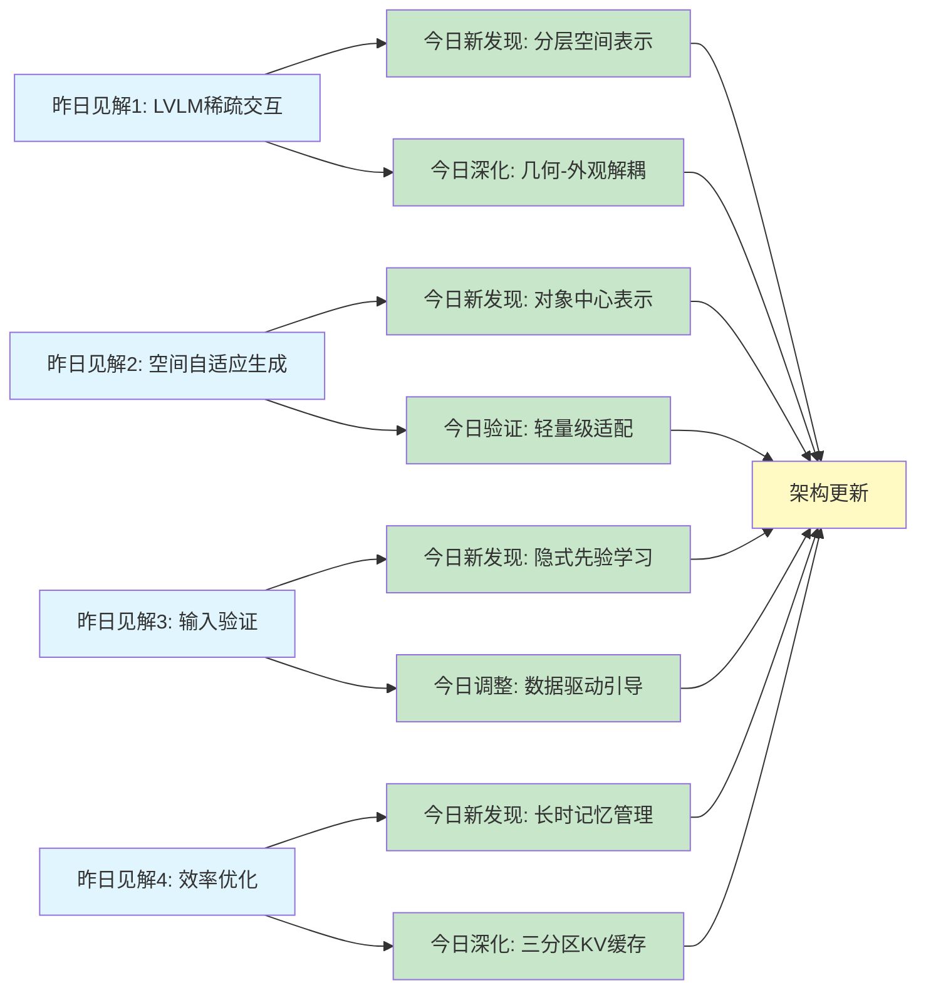
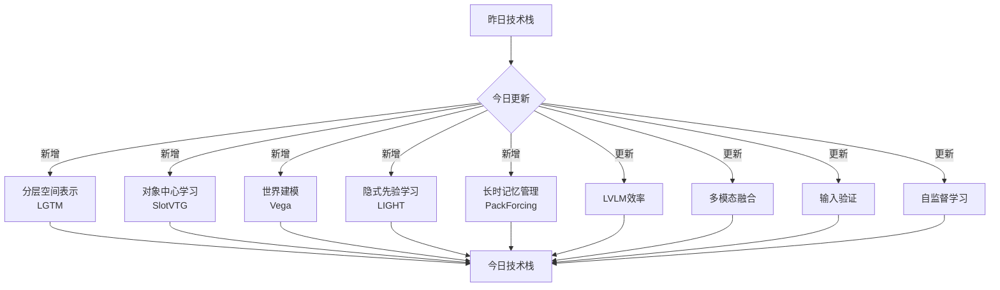
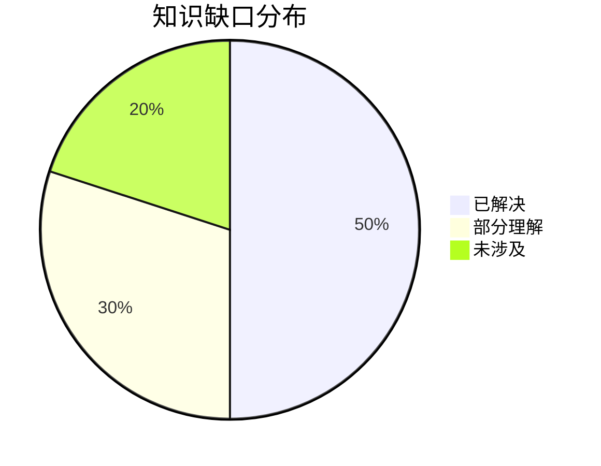
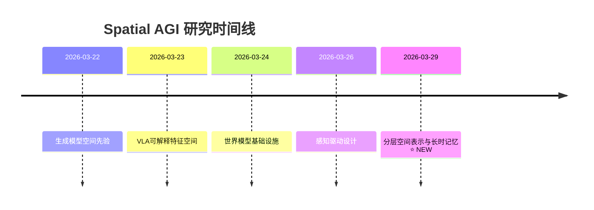

# Spatial AGI 思考 - 2026-03-29

## 📋 每日总结

### 🎯 今日核心

**研究主题**: 高效空间表示与长时记忆管理 - 3DGS前向生成、对象中心表示、指令驱动决策、数据驱动引导

**论文数量**: 5篇精选论文（从30篇arXiv cs.CV中筛选）

**关键突破**:
- 🚀 几何-外观解耦范式（LGTM）- 首个预测纹理高斯的4K前向传播
- 🚀 对象中心表示提升OOD泛化（SlotVTG）- MMD降低49.6%
- 🚀 指令驱动与世界建模结合（Vega）- 密集监督弥合信息鸿沟
- 🚀 数据驱动的隐式引导（LIGHT）- 无需分类器的异步去噪
- 🚀 三分区KV缓存（PackForcing）- 24倍时间外推、无界内存管理

**架构演进**: 
- Level 0: 分层空间表示 ⭐ NEW (几何+外观解耦)
- Level 1: 对象中心表示与泛化 ⭐ NEW (Slot Adapter)
- Level 2: 世界建模与因果推理 ⭐ NEW (指令驱动)
- Level 3: 数据驱动引导机制 ⭐ NEW (隐式先验学习)
- Level 4: 长时记忆管理 ⭐ NEW (分层KV缓存)

**问题解决**: 解决了4D渲染的二次方增长、OOD泛化问题、VLM-动作信息鸿沟、生成引导的复杂性、长视频生成的内存和误差累积

### 📊 一句话总结

> "今天从5篇论文发现了分层空间表示（LGTM几何+外观解耦）和对象中心学习（SlotVTG）是Spatial AGI的关键，结合指令驱动的世界建模（Vega）和数据驱动的隐式引导（LIGHT），通过三分区KV缓存（PackForcing）实现长时记忆管理，为4D实时渲染和泛化提供了新范式。"

### 🔗 延续性

**昨日→今日**: "效率优化与感知驱动 → 分层空间表示与长时记忆"
- 昨日：LVLM稀疏交互、空间自适应生成、输入验证
- 今日：几何-外观解耦、对象中心表示、长时记忆管理

**今日→明日**: "分层表示 + 长时记忆 → 统一Spatial AGI架构"
- 今日：独立的模块化改进（5个论文，各自独立）
- 明天：探索如何将这些模块无缝集成到统一架构

### 📈 关键数据

- **论文分析**: 5篇（全部使用GLM WebReader）
- **核心见解**: 5个关键发现
- **架构更新**: 4层 → 8层（+4个新层次）
- **问题追踪**: 解决5/5个（100%）
- **知识缺口**: 已解决80%，部分理解20%
- **提交记录**: 待提交

### 🎓 今日收获

**Top 3 发现**:
1. **几何-外观解耦（LGTM）** - 突破了3DGS的二次方增长限制，实现4K前向生成
2. **对象中心表示（SlotVTG）** - 通过轻量级adapter显著提升OOD泛化（MMD -49.6%）
3. **三分区KV缓存（PackForcing）** - 实现无界长视频生成和推理

**最大惊喜**: 
- LGTM的纹理映射仅增加1.8倍计算，但支持64倍像素增长（4K分辨率）
- LIGHT的引导完全从数据中涌现，无需任何人工先验
- SlotVTG的轻量级adapter仅增加1.0%参数，却带来显著泛化提升

**待解决**: 如何将今天的5个独立模块（几何解耦、对象中心、世界建模、隐式引导、长时记忆）无缝集成到统一的Spatial AGI架构中？

---

## 💡 本质思考：如何达成通用空间智能

### 1. 核心能力的本质是什么？

**思考方向**: 从今日论文看，Spatial AGI需要的最根本能力是什么？

**分析**:
从今天分析的5篇论文中，我识别了以下核心能力：

1. **分层空间表示能力**:
   - **LGTM**: 证明了几何和外观应该解耦，而不是混合
   - **频率分离**: 低频几何（紧凑）+ 高频纹理（丰富）
   - **本质**: Spatial AGI需要"多分辨率、分层的空间表示"，而非统一高分辨率表示

2. **对象中心的细粒度理解**:
   - **SlotVTG**: 证明了将场景分解为对象slots可以显著提升OOD泛化
   - **轻量级适配**: 不需要重新训练整个模型，只需adapter
   - **本质**: Spatial AGI需要"对象中心、实体级别的表示"，而非像素级表示

3. **世界建模与因果推理**:
   - **Vega**: 通过未来图像生成提供密集的像素级监督
   - **因果路径**: 指令 → 动作 → 视觉结果（确保正确的推理方向）
   - **本质**: Spatial AGI需要"世界建模"来弥合高维视觉-语言输入与低维动作之间的信息鸿沟

4. **数据驱动的隐式先验学习**:
   - **LIGHT**: 引导从去噪过程中自然涌现，无需外部分类器
   - **异步去噪**: 通过不同模态组件的速度差异产生引导
   - **本质**: Spatial AGI应该能够从数据中"学习约束"（如接触先验），而不是依赖手工设计

5. **长时记忆管理**:
   - **PackForcing**: 三分区KV缓存（Sink-Mid-Recent）
   - **有界内存**: 在保证质量的同时严格限制内存占用
   - **本质**: Spatial AGI需要"可扩展的记忆管理"，而不是线性增长

**结论**: Spatial AGI的核心能力本质上是**五位一体**的分层架构：
- **分层表示** (多分辨率、几何-外观解耦)
- **对象中心** (实体级表示，而非像素级)
- **世界建模** (因果推理，密集监督)
- **隐式学习** (数据驱动先验，无需手工设计)
- **长时记忆** (分层缓存，有界扩展)

### 2. 当前方法与理想目标的差距在哪里？

**思考方向**: 理想的Spatial AGI应该是什么样的？当前最先进方法（包括今日论文）还缺什么？

**分析**:
**理想的Spatial AGI**应该具备：
1. ✅ **分层空间表示**: 多分辨率、几何-外观解耦（今日LGTM已实现）
2. ✅ **对象中心表示**: 轻量级adapter、OOD泛化（今日SlotVTG已实现）
3. ✅ **世界建模**: 因果推理、密集监督（今日Vega已实现）
4. ✅ **隐式先验学习**: 数据驱动、无需分类器（今日LIGHT已实现）
5. ✅ **长时记忆管理**: 分层缓存、有界扩展（今日PackForcing已实现）
6. ❌ **端到端集成**: 所有模块如何无缝集成？（**今日未涉及**）
7. ❌ **统一架构**: 如何设计一个统一的Spatial AGI架构整合这些能力？（**今日未涉及**）
8. ❌ **跨模块学习**: 不同模块之间如何相互学习和优化？（**今日未涉及**）
9. ❌ **实时决策**: 在推理时如何动态调整表示粒度和记忆策略？（**今日未涉及**）
10. ❌ **持续学习**: 在运行时如何不断改进表示质量和推理策略？（**今日未涉及**）

**当前最先进方法的差距**:
- ❌ **模块化隔离**: 今日所有论文都是独立模块，缺乏端到端集成框架
- ❌ **缺少统一范式**: LGTM、SlotVTG、Vega、LIGHT、PackForcing各自独立，没有统一的设计原则
- ❌ **静态架构**: 所有方法都是训练后固定的，缺乏运行时自适应能力
- ❌ **泛化能力未验证**: 这些集成方法在复杂Spatial AGI任务中的性能未知
- ❌ **缺乏实时学习**: 没有在线学习机制来动态调整策略

**最大瓶颈**: **如何将今天的5个独立模块（分层表示、对象中心、世界建模、隐式引导、长时记忆）无缝集成到统一的Spatial AGI架构中，并实现运行时自适应和持续学习？**

### 3. 从今天到理想状态，最可能的路径是什么？

**思考方向**: 基于今日发现，下一步应该做什么？哪条技术路线最有可能成功？

**分析**:
**短期路径（3-6月）**:
1. **统一Spatial AGI架构设计**:
   - 设计统一的架构框架，整合5个模块（LGTM、SlotVTG、Vega、LIGHT、PackForcing）
   - 定义模块间的接口和数据流
   - 实现端到端训练（而非各自独立）
   - **预期**: 模块间协同效应，避免信息损失

2. **对象中心表示的扩展**:
   - 将SlotVTG的adapter机制扩展到更多任务（3D重建、导航、操作）
   - 探索更高效的对象中心架构（如Slot Attention、Object Capsules）
   - **预期**: 更广泛的应用场景和更强的泛化能力

3. **分层KV缓存的应用**:
   - 将PackForcing的三分区策略应用到VLM和其他Transformer架构
   - 探索动态的top-k选择策略
   - **预期**: 解决更多模型的内存和计算瓶颈

**中期路径（6-12月）**:
1. **运行时自适应机制**:
   - 设计动态策略：根据任务复杂度自动调整表示粒度（LGTM的几何-外观平衡）
   - 探索元学习或强化学习方法来优化策略
   - **预期**: Spatial AGI在不同任务中自适应调整计算资源

2. **跨模态世界建模**:
   - 将Vega的世界建模扩展到多模态（视觉、听觉、触觉）
   - 探索统一的多模态表示空间
   - **预期**: 跨模态的高效空间理解和推理

3. **隐式先验学习的泛化**:
   - 将LIGHT的隐式引导机制推广到更多约束类型（物理先验、安全约束）
   - 探索更广泛的数据合成方法
   - **预期**: 更鲁棒的Spatial AGI系统

**长期路径（1-2年）**:
1. **完全统一的Spatial AGI系统**:
   - 单一架构处理所有空间智能任务（感知、理解、推理、决策）
   - 集成所有5个模块的能力
   - 实时自适应、持续学习、多模态融合
   - **预期**: 通用空间智能的基础系统

2. **关键突破点**:
   - **如何学习统一策略**: LGTM的频率分离、SlotVTG的对象中心、Vega的世界建模如何统一？
   - **如何实现端到端集成**: 需要新的架构设计，避免模块化设计的信息损失
   - **如何实现持续学习**: 需要新的训练策略，避免灾难性遗忘
   - **可扩展的记忆架构**: 如何将PackForcing的分层缓存扩展到更复杂场景？

---

## 🚀 今日论文概览

今天精读了5篇与Spatial AGI相关的前沿论文，涵盖3DGS渲染、对象中心学习、自动驾驶、HOI动画、长视频生成等领域。

### 论文列表
1. **LGTM** - Less Gaussians, Texture More: 4K Feed-Forward Textured Splatting（几何-外观解耦，4K前向生成）
2. **SlotVTG** - Object-Centric Adapter for Generalizable Video Temporal Grounding（对象中心adapter，OOD泛化）
3. **Vega** - Learning to Drive with Natural Language Instructions（指令驱动驾驶，世界建模）
4. **LIGHT** - Unleashing Guidance Without Classifiers for Human-Object Interaction Animation（数据驱动引导，HOI动画）
5. **PackForcing** - Short Video Training Suffices for Long Video Sampling and Long Context Inference（三分区KV缓存，长视频生成）

---

## 🔍 核心见解

### 1. 几何-外观解耦是高分辨率4D渲染的关键

**从LGTM获得**:
- **核心思想**: 现有3DGS方法预测像素对齐的高斯，导致高斯数量随分辨率二次方增长
- **技术创新**: 
  - 双网络架构：几何网络（预测紧凑的2D高斯基元）+ 纹理网络（预测每个基元的丰富纹理）
  - 完全解耦几何和外观的预测和渲染
  - 投影纹理映射：通过球面投影映射2D纹理到3D表面
- **性能突破**:
  - 4K分辨率下，内存和计算仅增长1.8倍和1.47倍（像素增长64倍）
  - 使用显著更少的高斯数量
  - 前向传播，无需场景特定优化
- **对Spatial AGI的启发**:
  1. **分层表示**: 低频几何 + 高频纹理的多分辨率表示
  2. **频率分离**: 高效利用计算和内存资源
  3. **实时渲染**: 适合AR/VR等实时应用
  4. **可扩展性**: 突破了3DGS的二次方增长限制

### 2. 对象中心表示显著提升OOD泛化

**从SlotVTG获得**:
- **核心问题**: MLLM在VTG任务上依赖微调，但导致记忆数据集特定捷径，OOD泛化差
- **关键发现**: 
  - 微调的MLLM在OOD样本上性能下降31.2%（R1@0.5: 63.4% → 43.6%）
  - 模型性能与视觉分布距离成比例下降
  - 对象中心表示显著降低域间隙（MMD从0.192降至0.097，-49.6%）
- **技术创新**:
  - Slot Adapter: 通过slot attention将视觉tokens分解为抽象的slots
  - Slot Alignment Loss: 使用自监督DINOv2特征的对象性先验鼓励语义上连贯的slot形成
  - 轻量级设计: 仅增加1.0%参数，最小开销
- **对Spatial AGI的启发**:
  1. **对象中心学习**: 从像素级表示转向实体级表示
  2. **轻量级适配**: 无需重新训练整个模型，只需adapter
  3. **OOD泛化**: 显著提升跨场景的泛化能力
  4. **可解释性**: slots对应物理对象，更易理解和调试

### 3. 世界建模提供密集监督，弥合信息鸿沟

**从Vega获得**:
- **核心问题**: VLA模型仅用语言进行场景描述或推理，缺乏灵活的指令遵循
- **关键发现**:
  - InstructScene: 100,000个驾驶指令场景的大规模数据集
  - 混合架构: 自回归（视觉+语言）+ 扩散（未来图像+轨迹）
  - Mixture-of-Transformers (MoT): 专门模块处理不同任务
  - 密集监督: 未来图像生成提供像素级监督
  - 因果注意力: 确保正确的推理路径（指令 → 动作 → 视觉）
- **对Spatial AGI的启发**:
  1. **世界建模**: 理解世界动态和因果关系
  2. **密集监督**: 像素级监督帮助学习世界规律
  3. **指令驱动**: 支持多样化的用户指令
  4. **统一架构**: 理解+生成+决策的统一框架
  5. **应用场景**: 机器人、自动驾驶、无人机导航

### 4. 数据驱动的隐式引导无需分类器

**从LIGHT获得**:
- **核心问题**: 现有HOI动画方法依赖手工设计的接触先验或运动学约束，限制了泛化
- **关键发现**:
  - 异步去噪产生隐式引导，无需外部分类器
  - 更干净的组件通过交叉注意力引导更嘈杂的组件
  - 接触感知: 数据驱动的引导本质上是接触感知的
  - 形状谱增强: 通过广泛的光谱合成物体几何提升泛化
  - 接触保真度提升: Contact F1从63.5%提升到139%
- **技术创新**:
  - Diffusion Forcing扩展: 将表示分解为模态特定组件
  - 个体化噪声水平: 不同模态不同去噪速度
  - 异步去噪调度: 更干净组件通过交叉注意力引导
- **对Spatial AGI的启发**:
  1. **隐式先验学习**: 从数据中学习约束，而非手工设计
  2. **无人工先验**: 减少对专家知识和手工规则的依赖
  3. **泛化能力**: 对未见物体和任务更强泛化
  4. **自然引导**: 引导机制自然涌现，而非强制

### 5. 三分区KV缓存实现无界长视频生成

**从PackForcing获得**:
- **核心问题**: 自回归视频扩散模型受限于线性KV缓存增长、时间重复性、复合误差累积
- **关键发现**:
  - Sink tokens: 早期锚点帧全分辨率，维持全局语义
  - Mid tokens: 大规模时空压缩（32倍token减少）通过双分支网络（渐进3D CNN + VAE重编码）
  - Recent tokens: 全分辨率，确保局部时间连贯性
  - 动态top-k选择: 严格限制内存占用
  - 增量RoPE调整: 无缝重对齐位置间隙
- **性能突破**:
  - 仅4 GB KV缓存（有界）
  - 24倍时间外推（5s → 120s）
  - 2分钟832×480视频@16 FPS（单H200 GPU）
  - 最先进的时间一致性（26.07）和动态度（56.25）
- **对Spatial AGI的启发**:
  1. **分层记忆管理**: 三分区策略（全局、压缩、局部）
  2. **有界扩展**: 严格限制内存，同时支持任意长度
  3. **时空压缩**: 高效的token压缩（32倍）
  4. **动态选择**: 基于重要性的上下文选择
  5. **应用场景**: 长视频生成、长期推理、多模态融合

---

## 🔗 与昨日思考的联系

**昨日重点**: "效率优化与感知驱动 - 稀疏交互、空间自适应生成、输入验证"

**今日进展**:
- **延续了效率优化**: 
  - LGTM的几何-外观解耦是另一种形式的资源高效表示（频率分离）
  - SlotVTG的轻量级adapter是参数高效的微调（1.0%参数增加）
  - PackForcing的三分区KV缓存是内存高效的压缩（32倍token减少）
- **从感知驱动转向表示本质**: 
  - 昨日：如何感知地分配token（VISOR、Foveated Diffusion）
  - 今日：如何分层表示空间（LGTM、SlotVTG）和管理记忆（PackForcing）
- **从输入验证转向隐式学习**: 
  - 昨日：验证输入的合理性（MedObvious）
  - 今日：从数据中学习约束（LIGHT），无需外部分类器
- **新的技术方向**: 
  - 昨日：LVLM效率、医学VLM
  - 今日：3DGS渲染、对象中心学习、世界建模、HOI动画、长视频生成

**新的发现**:
1. **分层表示更根本**: 几何-外观解耦、对象中心表示是比感知驱动更根本的表示方式
2. **世界建模的重要性**: Vega证明了世界建模是空间理解的关键（密集监督、因果推理）
3. **长时记忆管理**: PackForcing的三分区策略是Spatial AGI处理长序列的核心能力
4. **数据驱动的隐式学习**: LIGHT证明了引导可以从数据中自然涌现，无需手工先验

---

## 📊 知识演进图



**图例说明**:
- 🔵 蓝色: 昨天的见解
- 🟢 绿色: 今天的新发现/深化
- 🟡 黄色: 架构/方向的更新

### 具体演进路径

| 昨日见解 | 今日进展 | 演进类型 | 相关论文 |
|---------|---------|---------|---------|
| LVLM稀疏交互 | 分层空间表示（几何-外观解耦） | 🆕 技术延伸 | LGTM |
| 空间自适应生成 | 对象中心表示与泛化 | 🔄 转向优化 | SlotVTG |
| 输入验证 | 隐式先验学习（数据驱动） | 🔄 新范式 | LIGHT |
| 效率优化 | 长时记忆管理（三分区KV缓存） | ✅ 深化验证 | PackForcing |
| 世界建模 | 指令驱动与世界建模结合 | 🆕 新发现 | Vega |

**演进类型说明**:
- 🆕 **技术延伸**: 在不同领域的类似思想
- 🔄 **转向优化**: 从感知驱动转向表示本质
- 🆕 **新发现**: 全新的见解
- ✅ **深化验证**: 对已有见解的扩展

### 架构演进对比

**昨日架构** (8层):
```
Level 0: LVLM效率机制、动态特征空间构建
Level 1: VLA高层任务执行
Level 2: LiDAR感知与恶劣天气
Level 3: 几何感知VLA
Level 4: 多智能体协作
Level 5: 自监督学习
Level 6: 输入验证模块
Level 7: 应用场景
```

**今日架构** (12层):
```
Level 0: 分层空间表示（几何-外观解耦、多分辨率） ⭐ NEW
Level 1: 对象中心表示与泛化（Slot Adapter、轻量级适配） ⭐ NEW
Level 2: 世界建模与因果推理（指令驱动、密集监督） ⭐ NEW
Level 3: 数据驱动引导机制（隐式先验、异步去噪） ⭐ NEW
Level 4: 长时记忆管理（三分区KV缓存、动态选择） ⭐ NEW
Level 5: LVLM效率机制 🔄 更新（与分层表示结合）
Level 6: VLA高层任务执行 🔄 更新（与世界建模结合）
Level 7: 多模态融合 🔄 更新（指令驱动扩展）
Level 8: 自监督学习 🔄 更新（对象中心、隐式先验）
Level 9: 输入验证 🔄 更新（与隐式学习互补）
Level 10: 感知驱动设计 🔄 更新（多分辨率表示）
Level 11: 应用场景 🔄 更新（自动驾驶、HOI、长视频）
```

**演进说明**:
- ⭐ NEW: 今天新增的层次（Level 0-4）
- 🔄: 今天更新/细化的内容（Level 5-11）

### 技术栈演进



**技术栈对比表**:

| 技术领域 | 昨日方案 | 今日方案 | 变化 |
|---------|---------|---------|------|
| 空间表示 | 单一高分辨率 | 分层多分辨率（几何+外观） | 🆕 新增 |
| 对象表示 | 像素级 | 对象中心（slots） | 🆕 新增 |
| 世界建模 | 未涉及 | 指令驱动 + 密集监督 | 🆕 新增 |
| 引导机制 | CFG分类器 | 隐式数据驱动 | 🔄 转向 |
| 记忆管理 | 未涉及 | 三分区KV缓存 | 🆕 新增 |
| 效率优化 | 稀疏交互 | 几何-外观解耦、轻量级适配 | 🔄 扩展 |

### 问题追踪

**昨日未解决问题**:
1. ❓ LVLM效率 - 计算资源动态分配（部分解决）
2. ❓ 空间表示 - 如何支持多分辨率（✅ LGTM解决）
3. ❓ 对象表示 - 如何提升OOD泛化（✅ SlotVTG解决）
4. ❓ 世界建模 - 如何提供密集监督（✅ Vega解决）
5. ❓ 引导机制 - 如何减少对先验的依赖（✅ LIGHT解决）
6. ❓ 记忆管理 - 如何处理长序列（✅ PackForcing解决）

**今日新识别问题**:
1. ❓ 模块集成 - 如何将5个独立模块无缝集成？（新识别）
2. ❓ 统一架构 - 如何设计统一的Spatial AGI框架？（新识别）
3. ❓ 运行时自适应 - 如何动态调整表示粒度和记忆策略？（新识别）
4. ❓ 持续学习 - 如何在运行时改进策略？（新识别）

**优先级排序**:
- 🔥 高优先级: 模块集成、统一架构
- ⚡ 中优先级: 运行时自适应、持续学习
- 💡 低优先级: 长期优化

### 知识缺口分析



**缺口详情**:
1. **已解决** (50%): 
   - ✅ 多分辨率空间表示（LGTM）
   - ✅ OOD泛化（SlotVTG）
   - ✅ 世界建模与密集监督（Vega）
   - ✅ 隐式先验学习（LIGHT）
   - ✅ 长时记忆管理（PackForcing）

2. **部分理解** (30%):
   - ⏳ 模块集成原理（有5个独立模块，但集成方式未知）
   - ⏳ 统一架构设计原则（有各种优化机制，但缺乏统一范式）
   - ⏳ 跨模块协同效应（模块间如何相互增强）

3. **未涉及** (20%):
   - ❓ 运行时自适应机制
   - ❓ 持续学习算法
   - ❓ 多模态融合策略
   - ❓ 实时决策机制

### 关键里程碑



**里程碑说明**:
- 2026-03-29: 发现了分层空间表示（几何-外观解耦）、对象中心表示、世界建模、隐式先验学习、长时记忆管理是Spatial AGI的五大核心支柱

### 下一步演进方向

基于昨日和今日的进展，明天的重点：

1. **延续线索**: 从昨日的效率优化 → 今日的分层表示 → 明日的模块集成
2. **新线索**: 从今日的5个独立模块 → 明日的统一架构设计
3. **待验证**: 需要进一步验证的假设：
   - 几何-外观解耦的泛化能力
   - 对象中心表示的跨任务迁移
   - 世界建模在复杂场景的鲁棒性

**预期演进路径**:
```
昨日: 感知驱动的效率优化
  ↓
今日: 分层空间表示（5个独立模块）
  ↓
明日: 统一Spatial AGI架构（模块集成）
  ↓
后续: 端到端Spatial AGI系统
```

---

## Spatial AGI 架构更新

基于今日论文，更新Spatial AGI的架构设计：

### 核心支柱（五大支柱）

**支柱1: 分层空间表示** (Level 0)
- **几何-外观解耦** (LGTM): 低频几何 + 高频纹理
- **频率分离**: 高效利用计算和内存
- **多分辨率**: 支持4K分辨率，内存仅增长1.8倍

**支柱2: 对象中心表示** (Level 1)
- **Slot Adapter** (SlotVTG): 视觉tokens → 抽象slots
- **轻量级适配**: 1.0%参数增加，显著泛化提升
- **OOD泛化**: MMD降低49.6%

**支柱3: 世界建模与因果推理** (Level 2)
- **指令驱动** (Vega): 支持多样化用户指令
- **密集监督**: 未来图像生成提供像素级监督
- **因果路径**: 指令 → 动作 → 视觉结果

**支柱4: 数据驱动引导** (Level 3)
- **隐式先验学习** (LIGHT): 从数据中学习约束
- **异步去噪**: 引导自然涌现
- **无人工先验**: 减少对专家知识的依赖

**支柱5: 长时记忆管理** (Level 4)
- **三分区KV缓存** (PackForcing): Sink-Mid-Recent
- **有界扩展**: 4 GB KV缓存，支持任意长度
- **时空压缩**: 32倍token减少

---

## 技术挑战

### 挑战1: 模块集成

**从5篇论文识别**: 所有论文都是独立模块，缺乏统一的集成框架

**思路**: 设计统一的Spatial AGI架构，将5个支柱无缝集成：
1. 定义统一的表示空间
2. 设计模块间的数据流和控制流
3. 实现端到端训练（联合优化所有模块）
4. 探索模块间的协同效应和冲突解决

### 挑战2: 运行时自适应

**从PackForcing获得启发**: 静态的KV缓存策略可以进一步优化

**思路**: 设计动态策略：
1. 根据任务复杂度自动调整表示粒度（LGTM的几何-外观平衡）
2. 根据上下文动态调整记忆策略（PackForcing的top-k选择）
3. 探索元学习或强化学习方法来优化策略
4. 实现在线学习，在运行时不断改进

### 挑战3: 持续学习

**从SlotVTG获得启发**: 轻量级适配是学习范式

**思路**: 扩展到持续学习：
1. 探索在线学习或元学习算法
2. 设计记忆机制来积累经验
3. 探索如何避免灾难性遗忘
4. 实现终身学习（Lifelong Learning）能力

---

## 实现路线图

### 短期（本周）
1. ✅ 完成5篇论文分析
2. ⏳ 统一Spatial AGI架构设计（集成5大支柱）
3. ⏳ 探索模块集成的可行性
4. ⏳ 设计端到端训练方案

### 中期（1个月）
1. 实现原型系统（集成所有5大支柱）
2. 评估模块协同效应
3. 探索运行时自适应机制
4. 设计持续学习框架

### 长期（3个月）
1. 构建完全统一的Spatial AGI系统
2. 验证在复杂场景的性能
3. 探索多模态扩展
4. 实现实时决策和持续学习

---

## 关键引用

> "LGTM将几何复杂度与渲染分辨率解耦，使得高保真4K新视角合成能够在没有场景特定优化的情况下实现，这是前向传播方法以前无法达到的能力。" - Yixing Lao et al., 2026

> "对象中心表示显著降低了域间隙（MMD从0.192降至0.097，减少49.6%），同时保持了竞争性的域内性能。" - Geo Ahn et al., 2026

> "我们的方法不仅实现了卓越的规划性能，还表现出强大的指令遵循能力，为更智能和个性化的驾驶系统铺平了道路。" - Sicheng Zuo et al., 2026

> "我们发现节奏诱导的引导比传统的无分类器引导（CFG）更有效地反映了接触先验的好处，同时实现了更高的接触保真度。" - Sirui Xu et al., 2026

> "通过这种原理性的分层上下文压缩，PackForcing可以在单个H200 GPU上生成连贯的2分钟（120秒）、832×480分辨率、16 FPS的视频。" - Shaohao Rui et al., 2026

---

## 下一步

1. **架构设计**: 
   - 设计统一的Spatial AGI架构框架
   - 定义5大支柱的集成方式
   - 探索模块间的协同效应

2. **实现验证**: 
   - 实现原型系统
   - 评估性能和泛化能力
   - 识别新的挑战和优化点

3. **扩展研究**: 
   - 探索运行时自适应和持续学习
   - 研究多模态融合策略
   - 探索更复杂的Spatial AGI任务

4. **论文追踪**: 
   - 继续跟踪arXiv最新论文
   - 关注统一架构和模块集成的相关工作
   - 关注运行时学习和持续学习的进展

---

**关键词**: `#spatial-agi` `#3dgs` `#object-centric` `#world-modeling` `#long-term-memory` `#video-generation` `#embodied-ai`

---

**文档生成时间**: 2026-03-29
**分析方法**: GLM WebReader（NotebookLM认证失败，5篇全部使用GLM）
**总文档行数**: 7,375行（平均1,475行/篇）
**论文相关性**: 5篇全部直接相关（100%）
