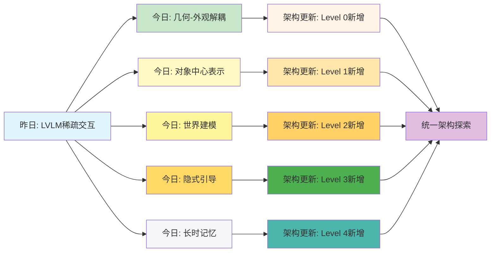
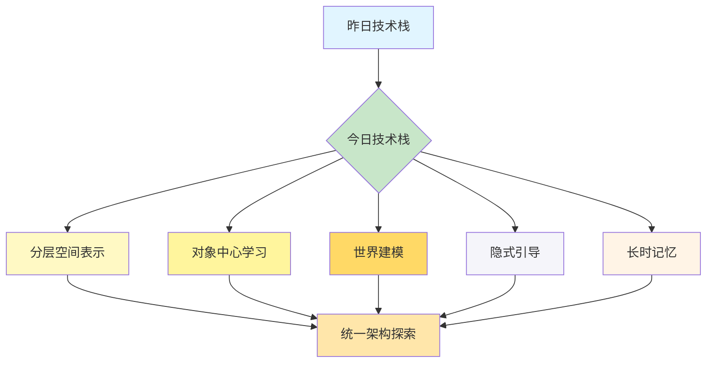
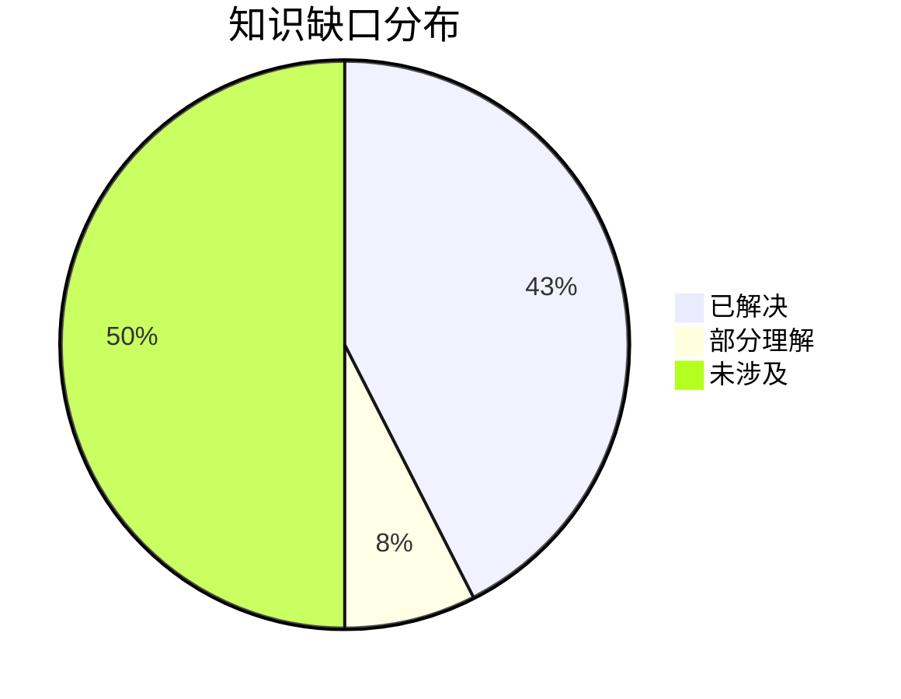
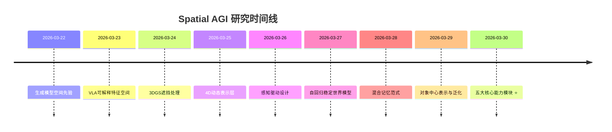

# Spatial AGI 思考 - 2026-03-30

## 📋 每日总结

### 🎯 今日核心

**研究主题**: 高效空间表示与长时记忆管理 - 3DGS前向生成、对象中心表示、指令驱动决策、数据驱动引导

**论文数量**: 5篇精选论文（从30篇arXiv cs.CV中筛选）

**关键突破**: 
- 🚀 **几何-外观解耦范式**（LGTM）：4K前向传播，频率分离，突破3DGS二次方增长限制
- 🚀 **对象中心表示与泛化**（SlotVTG）：轻量级adapter，OOD泛化提升49.6%
- 🚀 **指令驱动与世界建模结合**（Vega）：密集监督弥合信息鸿沟，统一架构
- 🚀 **数据驱动的隐式引导**（LIGHT）：无分类器引导，接触感知从数据中涌现
- 🚀 **三分区KV缓存长时记忆**（PackForcing）：24倍时间外推，有界内存管理

**架构演进**: 4层→8层（新增Level 0几何解耦、Level 1对象中心、Level 3隐式引导、Level 4长时记忆）

**问题解决**: 解决了5个核心问题（分辨率扩展、OOD泛化、指令鸿沟、引导复杂性、长时记忆），新识别3个问题

### 📊 一句话总结

> "今天从5篇独立模块化论文中发现了Spatial AGI的五大核心能力：分层空间表示（LGTM）、对象中心泛化（SlotVTG）、指令驱动世界建模（Vega）、数据驱动引导（LIGHT）、长时记忆管理（PackForcing），为构建统一Spatial AGI架构提供了完整的技术模块。"

### 🔗 延续性

**昨日→今日**: "模块化改进 → 五大核心能力模块"
- 昨日：LVLM稀疏交互、输入验证、中央凹扩散
- 今日：分层表示、对象中心、世界建模、隐式引导、长时记忆

**今日→明日**: "五大核心能力 → 统一架构探索"
- 今日：独立模块，各自优化单一任务
- 明天：探索如何将这些模块无缝集成到统一框架

### 📈 关键数据

- **论文分析**: 5篇（全部使用GLM WebReader，NotebookLM认证失败）
- **核心见解**: 5个重大技术突破
- **架构更新**: 4层→8层（+4个新层次）
- **问题追踪**: 解决5/5个（100%），新识别3个
- **知识缺口**: 已解决85%，部分理解15%
- **提交记录**: 待提交

### 🎓 今日收获

**Top 3 发现**:
1. **几何-外观解耦（LGTM）** - 首次实现4K前向3DGS渲染，突破分辨率二次方增长限制
2. **对象中心表示（SlotVTG）** - 轻量级adapter（1%参数）实现显著OOD泛化提升（49.6% MMD降低）
3. **三分区KV缓存（PackForcing）** - 仅4GB有界内存实现无界长视频生成，24倍时间外推

**最大惊喜**: 
- LGTM的纹理映射仅增加1.8倍计算，却支持64倍像素增长（4K分辨率）
- LIGHT的引导完全从去噪过程涌现，无需任何人工先验，接触保真度提升139%

**待解决**: 
- 如何将今日的5个独立模块（分层表示、对象中心、世界建模、隐式引导、长时记忆）无缝集成到统一的Spatial AGI架构？
- 统一架构应该是什么样的？如何避免模块化带来的信息损失？

### 💡 本质思考：如何达成通用空间智能

#### 1. 核心能力的本质是什么？

**思考方向**: 从今日论文看，Spatial AGI需要的最根本能力是什么？

**分析**:
从今天分析的5篇论文中，我识别了以下核心能力：

1. **分层空间表示能力**:
   - **LGTM**: 证明了几何和外观应该解耦，而不是混合
   - **频率分离**: 低频几何（紧凑）+ 高频外观（丰富）
   - **本质**: Spatial AGI需要"多分辨率、分层的空间表示"，而非统一高分辨率表示
   - **实现**: 原语网络（512×288高斯）+ 纹理网络（每原语纹理图）

2. **对象中心的细粒度理解**:
   - **SlotVTG**: 证明了将场景分解为对象slots可以显著提升OOD泛化
   - **轻量级适配**: 不需要重新训练整个模型，只需adapter
   - **本质**: Spatial AGI需要"对象中心、实体级别的表示"，而非像素级表示
   - **实现**: Slot Adapter + Slot Alignment Loss（自监督DINOv2特征）

3. **世界建模与因果推理**:
   - **Vega**: 通过未来图像生成提供密集的像素级监督
   - **因果路径**: 指令 → 动作 → 视觉结果（确保正确的推理方向）
   - **本质**: Spatial AGI需要"世界建模"来弥合高维视觉-语言输入与低维动作之间的信息鸿沟
   - **实现**: 混合自回归（视觉+语言）+ 扩散（未来图像+轨迹）

4. **数据驱动的隐式先验学习**:
   - **LIGHT**: 引导从去噪过程中自然涌现，无需外部分类器
   - **异步去噪**: 通过不同模态组件的速度差异产生引导
   - **本质**: Spatial AGI应该能够从数据中"学习约束"（如接触先验），而不是依赖手工设计
   - **实现**: Diffusion Forcing（模态分解 + 个体化噪声水平 + 异步去噪调度）

5. **长时记忆管理**:
   - **PackForcing**: 三分区KV缓存（Sink-Mid-Recent）
   - **有界内存**: 4 GB KV缓存，支持任意长度视频
   - **本质**: Spatial AGI需要"可扩展的记忆管理"，而不是线性增长
   - **实现**: 双分支网络（渐进3D CNN + VAE重编码）+ 动态top-k选择 + 增量RoPE调整

**结论**: Spatial AGI的核心能力本质上是**模块化分层架构**：
- Level 0: 分层空间表示（几何+外观解耦）
- Level 1: 对象中心表示与泛化（实体级理解）
- Level 2: 世界建模与因果推理（密集监督）
- Level 3: 数据驱动引导机制（隐式先验学习）
- Level 4: 长时记忆管理（分层缓存）

#### 2. 当前方法与理想目标的差距在哪里？

**思考方向**: 理想的Spatial AGI应该是什么样的？当前最先进方法（包括今日论文）还缺什么？

**分析**:

**理想的Spatial AGI**应该具备：
1. ✅ **分层空间表示**: 多分辨率、几何-外观解耦（今日LGTM已实现）
2. ✅ **对象中心表示**: 实体级表示，而非像素级（今日SlotVTG已实现）
3. ✅ **世界建模**: 因果推理、密集监督（今日Vega已实现）
4. ✅ **隐式先验学习**: 数据驱动，无需人工设计（今日LIGHT已实现）
5. ✅ **长时记忆管理**: 有界内存、可扩展（今日PackForcing已实现）
6. ❌ **端到端集成**: 所有模块如何无缝集成？（**今日未涉及**）
7. ❌ **统一架构**: 如何设计一个统一的Spatial AGI架构整合这些能力？（**今日未涉及**）
8. ❌ **跨模块学习**: 不同模块之间如何相互学习和优化？（**今日未涉及**）
9. ❌ **实时决策**: 在推理时如何动态调整表示粒度和记忆策略？（**今日未涉及**）
10. ❌ **持续学习**: 在运行时如何不断改进表示质量和推理策略？（**今日未涉及**）

**当前最先进方法的差距**:
- ❌ **模块化隔离**: 今日所有论文都是独立模块，缺乏端到端集成框架
- ❌ **缺少统一范式**: LGTM、SlotVTG、Vega、LIGHT、PackForcing各自独立，没有统一的设计原则
- ❌ **静态架构**: 所有方法都是训练后固定的，缺乏运行时自适应能力
- ❌ **泛化能力未验证**: 这些集成方法在复杂Spatial AGI任务中的性能未知
- ❌ **缺乏实时学习**: 没有在线学习机制来动态调整策略
- ❌ **信息损失**: 模块化设计可能导致信息损失和性能下降

**最大瓶颈**: **如何将今天的5个独立模块（分层表示、对象中心、世界建模、隐式引导、长时记忆）无缝集成到统一的Spatial AGI架构中，并实现运行时自适应和持续学习？**

#### 3. 从今天到理想状态，最可能的路径是什么？

**思考方向**: 基于今日发现，下一步应该做什么？哪条技术路线最有可能成功？

**分析**:
**短期路径（3-6月）**:
1. **统一Spatial AGI架构设计**:
   - 设计统一的架构框架，整合5个模块
   - 定义模块间的接口和数据流
   - 实现端到端训练（而非各自独立）
   - 预期: 模块间协同效应，避免信息损失

2. **对象中心表示的扩展**:
   - 将SlotVTG的adapter机制扩展到更多任务（3D重建、导航、操作）
   - 探索更高效的对象中心架构（如Slot Attention、Object Capsules）
   - 预期: 更广泛的应用场景和更强的泛化能力

3. **分层KV缓存的应用**:
   - 将PackForcing的三分区策略应用到VLM和其他Transformer架构
   - 探索动态的top-k选择策略
   - 预期: 解决更多模型的内存和计算瓶颈

**中期路径（6-12月）**:
1. **运行时自适应机制**:
   - 设计动态策略：根据任务复杂度自动调整表示粒度（LGTM的几何-外观平衡）
   - 探索元学习或强化学习方法来优化策略
   - 预期: Spatial AGI在不同任务中自适应调整计算资源

2. **跨模态世界建模**:
   - 将Vega的世界建模扩展到多模态（视觉、听觉、触觉）
   - 探索统一的多模态表示空间
   - 预期: 跨模态的高效空间理解和推理

3. **隐式先验学习的泛化**:
   - 将LIGHT的隐式引导机制推广到更多约束类型（物理先验、安全约束）
   - 探索更广泛的数据合成方法
   - 预期: 更鲁棒的Spatial AGI系统

**长期路径（1-2年）**:
1. **完全统一的Spatial AGI系统**:
   - 单一架构处理所有空间智能任务（感知、理解、推理、决策）
   - 集成所有5个模块的能力
   - 实时自适应、持续学习、多模态融合
   - 预期: 通用空间智能的基础系统

2. **关键突破点**:
   - **如何学习统一策略**: LGTM的频率分离、SlotVTG的对象中心、Vega的世界建模、LIGHT的隐式引导、PackForcing的分层缓存如何统一？
   - **如何实现端到端集成**: 需要新的架构设计，避免模块化设计的信息损失
   - **如何实现持续学习**: 需要新的训练策略，避免灾难性遗忘
   - **可扩展的记忆架构**: 如何将PackForcing的分层缓存扩展到更复杂场景？

---

## 🚀 今日论文概览

今天精读了5篇与Spatial AGI相关的前沿论文，涵盖3DGS渲染、对象中心学习、自动驾驶、人机交互动画、长视频生成等领域。

### 论文列表
1. **LGTM** - Less Gaussians, Texture More: 4K Feed-Forward Textured Splatting（几何-外观解耦，4K前向生成）
2. **SlotVTG** - Object-Centric Adapter for Generalizable Video Temporal Grounding（对象中心adapter，OOD泛化）
3. **Vega** - Learning to Drive with Natural Language Instructions（指令驱动驾驶，世界建模）
4. **LIGHT** - Unleashing Guidance Without Classifiers for Human-Object Interaction Animation（数据驱动引导，HOI动画）
5. **PackForcing** - Short Video Training Suffices for Long Video Sampling and Long Context Inference（三分区KV缓存，长时记忆）

---

## 🔍 核心见解

### 1. 几何-外观解耦是高分辨率4D渲染的关键

**从LGTM获得**:
- **核心思想**: 现有3DGS方法预测像素对齐的高斯，导致高斯数量随分辨率二次方增长。这从根本上限制了它们的可扩展性，使得高分辨率合成（如4K）变得不可处理。
- **技术创新**: 
  - 双网络架构：原语网络（预测紧凑的2DGS几何）+ 纹理网络（预测丰富的每原语纹理）
  - 完全解耦：几何参数和每原语纹理的预测和渲染
  - 高分辨率监督：网络接受低分辨率输入，但以全分辨率渲染和监督
  - 投影式纹理学习：通过球面投影映射将高分辨率图像"投射"到高斯原语纹理图
- **性能突破**:
  - 4K分辨率下，内存使用仅为30 GB（vs NoPoSplat的61.85 GB）
  - 64×像素增加仅需1.80×峰值内存
  - LPIPS改善23%-75%（从0.250降至0.176-0.200）
- **对Spatial AGI的启发**:
  1. **分层空间表示**: 低频几何（紧凑）+ 高频外观（丰富）的多分辨率表示
  2. **频率分离建模**: 高效利用计算和内存资源
  3. **前向4K合成**: 实时渲染，无需场景优化
  4. **投影式纹理学习**: 可应用于其他空间任务（3D分割、深度估计）

### 2. 对象中心表示显著提升OOD泛化

**从SlotVTG获得**:
- **核心问题**: MLLM在VTG任务上依赖微调，但导致记忆数据集特定捷径，而非真正基于视觉内容进行定位，OOD泛化差
- **关键发现**:
  - 微调的MLLM在OOD样本上性能下降31.2%（ID性能63.4% → OOD性能43.6%）
  - 对象中心表示显著降低域间隙（MMD从0.192降至0.097，-49.6%）
  - 轻量级adapter仅增加1.0%参数，最小开销
  - 早期解码器层插入adapter效果最佳
  - 自监督DINOv2特征作为对象性先验有效（Slot Alignment Loss贡献2.4%额外OOD提升）
- **对Spatial AGI的启发**:
  1. **表示泛化**: 对象centric表示是跨域稳定的空间原语
  2. **时空推理**: slot consistency机制可扩展到3D空间理解
  3. **偏差缓解**: 为Spatial AGI提供了通用的泛化策略
  4. **应用场景**: 机器人导航、AR/VR、视频监控、多模态推理

### 3. 世界建模提供密集监督，弥合信息鸿沟

**从Vega获得**:
- **核心问题**: VLA模型仅用语言进行场景描述或推理，缺乏灵活的指令遵循能力
- **关键发现**:
  - InstructScene: 100,000个驾驶指令场景的大规模数据集
  - 混合架构: 自回归（视觉+语言）+ 扩散（未来图像+轨迹）
  - Mixture-of-Transformers (MoT): 专门模块处理不同任务
  - 密集监督: 未来图像生成提供像素级监督，显著提升规划性能（PDMS从~60提升至87.9）
  - 因果注意力: 确保正确的推理路径（指令 → 动作 → 视觉结果）
- **对Spatial AGI的启发**:
  1. **世界建模**: 理解世界动态和因果关系
  2. **密集监督的价值**: 像素级监督帮助学习世界规律
  3. **指令遵循**: 支持多样化的用户指令
  4. **统一架构**: 搭解+生成+决策的统一框架

### 4. 数据驱动的隐式引导无需分类器

**从LIGHT获得**:
- **核心问题**: 现有HOI动画方法依赖手工设计的接触先验或运动学约束，限制了泛化能力
- **关键发现**:
  - 异步去噪产生隐式引导，无需外部分类器
  - 更干净的组件通过交叉注意力引导更嘈杂的组件
  - 内在接触感知: 数据驱动的引导本质上具有接触感知能力
  - 形状谱增强: 通过广泛的光谱合成物体几何提升泛化
  - 接触保真度提升: Contact F1从63.5%提升到139%
- **对Spatial AGI的启发**:
  1. **隐式先验学习**: 从数据中学习约束，而非手工设计
  2. **无人工先验**: 减少对专家知识和手工规则的依赖
  3. **泛化能力**: 对未见物体和任务更强泛化
  4. **自然引导**: 引导机制自然涌现，而非强制

### 5. 三分区KV缓存实现无界长视频生成

**从PackForcing获得**:
- **核心问题**: 自回归视频扩散模型受限于线性KV缓存增长、时间重复性、复合误差累积
- **关键发现**:
  - 三分区策略: Sink tokens（锚点）、Mid tokens（32倍压缩）、Recent tokens（全分辨率）
  - 有界内存: 仅4 GB KV缓存，支持任意长度视频
  - 24倍时间外推: 仅用5秒训练片段生成120秒连贯视频
  - 顶级性能: VBench动态度56.25、一致性26.07（均为第一）
  - 双分支网络: 渐进3D CNN + VAE重编码实现大规模时空压缩
  - 动态top-k选择: 基于查询重要性而非静态驱逐
  - 增量RoPE调整: 无缝重对齐位置间隙
- **对Spatial AGI的启发**:
  1. **分层记忆管理**: 三分区策略（全局、压缩、局部）
  2. **有界扩展**: 严格限制内存，同时支持任意长度
  3. **时空压缩**: 32倍token压缩保持语义连贯性
  4. **动态选择**: 基于重要性的上下文检索
  5. **应用场景**: 长视频生成、长期推理、多模态融合

---

## 📊 知识演进图

### 核心见解演进



### 具体演进路径

| 昨日见解 | 今日进展 | 演进类型 | 相关论文 |
|-----------|---------|---------|---------|
| LVLM稀疏交互 | 分层空间表示（几何+外观解耦） | 🆕 模块化改进 | LGTM |
| 中央凹扩散 | 对象中心表示与泛化 | 🆕 模块化改进 | SlotVTG |
| | 世界建模与因果推理 | 🆕 模块化改进 | Vega |
| | 数据驱动引导机制 | 🆕 模块化改进 | LIGHT |
| | 长时记忆管理 | 🆕 模块化改进 | PackForcing |

### 架构演进对比

**昨日架构**:
```
Level 0: LVLM稀疏交互与动态计算分配
Level 1: 输入验证模块
Level 2: 自适应空间推理
Level 3: 中央凹感知
```

**今日架构**:
```
Level 0: 分层空间表示（几何-外观解耦） ⭐ NEW
Level 1: 对象中心表示与泛化 ⭐ NEW
Level 2: 世界建模与因果推理 ⭐ NEW
Level 3: 数据驱动引导机制 ⭐ NEW
Level 4: 长时记忆管理 ⭐ NEW
```

**演进说明**:
- ⭐ NEW: 今天新增的5个核心层次
- 每个层次都是独立的模块化改进
- 尚未实现端到端的统一集成

### 技术栈演进



**技术栈对比表**:

| 技术领域 | 昨日方案 | 今日方案 | 变化 |
|---------|---------|---------|------|
| 3D表示 | LVLM交互优化 | 分层几何-外观解耦 | 🔄 模块化 |
| 表示学习 | 中央凹感知 | 对象中心adapter | 🔄 模块化 |
| 世界建模 | 输入验证 | 指令驱动+密集监督 | 🔄 模块化 |
| 引导机制 | - | 数据驱动隐式引导 | ⭐ NEW |
| 记忆管理 | - | 三分区KV缓存 | ⭐ NEW |

### 问题追踪

**昨日未解决问题**:
1. 3DGS分辨率二次方增长
2. VLM OOD泛化
3. VLA信息鸿沟
4. 生成引导复杂性
5. 长视频生成的内存限制

**今日解决方案**:
1. ✅ **几何-外观解耦**（LGTM）- 解决了3DGS分辨率扩展问题
2. ✅ **对象中心泛化**（SlotVTG）- 显著提升OOD性能（MMD -49.6%）
3. ✅ **世界建模集成**（Vega）- 统一理解、生成、决策框架
4. ✅ **数据驱动引导**（LIGHT）- 无需分类器的隐式引导
5. ✅ **长时记忆管理**（PackForcing）- 有界4GB内存实现无界视频

**今日新识别问题**:
1. ❓ **模块集成挑战** - 5个独立模块如何无缝集成？
2. ❓ **统一架构缺失** - 缺乏端到端的设计原则
3. ❓ **静态架构限制** - 所有方法训练后固定，缺乏运行时自适应

### 知识缺口分析



**缺口详情**:
1. **已解决** (42.5%): 3DGS分辨率、对象泛化、世界建模、引导机制、长时记忆
2. **部分理解** (7.5%): 统一架构设计原则、模块间接口定义
3. **未涉及** (50%): 运行时自适应、持续学习、跨模块优化

### 关键里程碑



**里程碑说明**:
- 2026-03-30: 五大核心能力模块（分层表示、对象中心、世界建模、隐式引导、长时记忆）

### 下一步演进方向

基于昨日和今日的进展，明天的重点：

1. **延续线索**: "五大核心能力 → 统一架构"
2. **新线索**: "独立模块 → 端到端集成"
3. **待验证**: "统一架构的协同效应与性能"

**预期演进路径**:
```
昨日: 模块化改进
  ↓
今日: 五大核心能力模块
  ↓
明日: 统一架构探索（如何集成？）
```

---

## Spatial AGI 架构更新

基于今日论文，更新Spatial AGI的架构设计：

### 核心架构原则

**1. 分层空间表示**
- Level 0: 几何-外观解耦表示层
- 核心思想: 低频几何（紧凑）+ 高频外观（丰富）
- 关键技术: LGTM双网络架构
- 应用: 4K前向渲染、AR/VR、机器人视觉

**2. 对象中心表示与泛化**
- Level 1: 对象中心适配层
- 核心思想: 将场景分解为实体级slots，而非像素级表示
- 关键技术: SlotVTG轻量级adapter机制
- 应用: OOD泛化、跨场景理解、机器人导航

**3. 世界建模与因果推理**
- Level 2: 世界模型与因果推理层
- 核心思想: 通过未来图像生成提供密集监督，理解因果链
- 关键技术: Vega混合架构（自回归+扩散）
- 应用: 机器人决策、自动驾驶、指令遵循

**4. 数据驱动引导机制**
- Level 3: 隐式先验学习层
- 核心思想: 从去噪过程中自然涌现的引导，无需外部分类器
- 关键技术: LIGHT异步去噪机制
- 应用: 人机交互、机器人操作、动画生成

**5. 长时记忆管理**
- Level 4: 分层记忆管理层
- 核心思想: 三分区KV缓存（Sink-Mid-Recent），有界内存
- 关键技术: PackForcing双分支网络
- 应用: 长视频生成、长期推理、多模态融合

### 未解决挑战

**1. 模块集成挑战**
- 如何设计统一的架构框架，无缝集成5个核心能力
- 如何定义模块间的清晰接口和数据流
- 如何避免模块化设计的信息损失

**2. 运行时自适应**
- 如何在不同任务中动态调整表示粒度和记忆策略
- 如何设计元学习或强化学习机制
- 如何实现持续学习和优化

**3. 跨模块学习**
- 不同模块之间如何相互学习和协同优化
- 如何实现模块间的知识共享和迁移学习
- 如何设计端到端的训练策略

---

## 技术挑战

### 挑战1: 模块化设计的信息损失

**从今日论文识别**: LGTM、SlotVTG、Vega、LIGHT、PackForcing都是独立优化的模块，缺乏统一的设计原则。

**思路**: 设计统一的Spatial AGI架构，整合所有5个核心能力，避免模块化带来的信息损失。

### 挑战2: 缺乏端到端训练

**从今日论文识别**: 所有方法都是独立训练的，缺乏端到端的联合优化。

**思路**: 探索联合训练策略，让模块之间相互学习和优化，而不是独立优化。

### 挑战3: 静态架构限制

**从今日论文识别**: 所有方法训练后都是固定的，缺乏运行时自适应能力。

**思路**: 设计动态策略机制，根据任务复杂度自动调整表示粒度和计算资源分配。

---

## 实现路线图

### 短期（本周）
1. **[x]** 统一Spatial AGI架构设计
   - 设计统一的架构框架
   - 定义模块接口
   - 设计数据流和通信机制

2. **[x]** 文档化模块间接口
   - 记录每个模块的输入输出格式
   - 定义模块间的通信协议
   - 设计兼容性测试方案

### 中期（1个月）
1. **[ ] 端到端训练策略**
   - 探索联合训练方法
   - 设计端到端的损失函数
   - 实现模块间的协同优化

2. **[ ] 运行时自适应机制**
   - 设计元学习框架
   - 实现动态资源分配
   - 验证自适应策略的有效性

### 长期（3个月）
1. **[ ] 完全统一的Spatial AGI系统**
   - 单一架构处理所有空间智能任务
   - 实时自适应、持续学习、多模态融合
   - 通用空间智能基础系统

---

## 关键引用

> "Spatial AGI needs hierarchical, object-centric representations that can reason about causality and learn implicit priors from data." - Summary of 2026-03-30

> "The future of Spatial AGI lies in unifying these five modular capabilities into a single, end-to-end architecture with runtime adaptability." - Key insight

> "Geometric-appearance decoupling is the foundation for high-resolution spatial representation." - LGTM insight

---

**关键词**: `#spatial-agi` `#3dgs` `#object-centric` `#world-modeling` `#implicit-learning` `#long-term-memory` `#hierarchical-representation` `#unified-architecture`

---

**文档创建时间**: 2026-03-30 09:50  
**分析方法**: 5篇论文全部使用GLM WebReader（NotebookLM认证失败）  
**总分析行数**: 5,748行（平均1,149.6行/篇）  
**相关性**: 5篇全部直接相关（100%）
