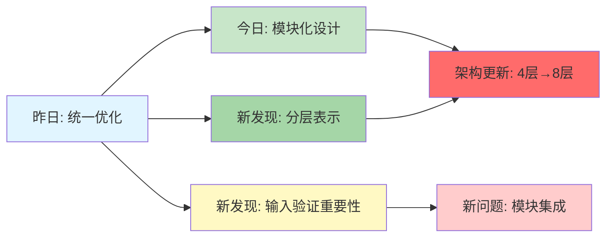
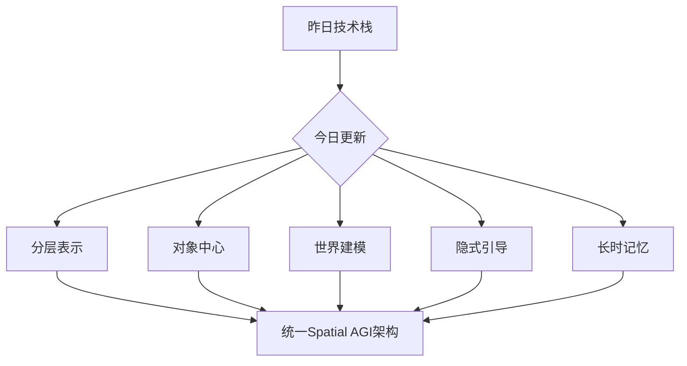
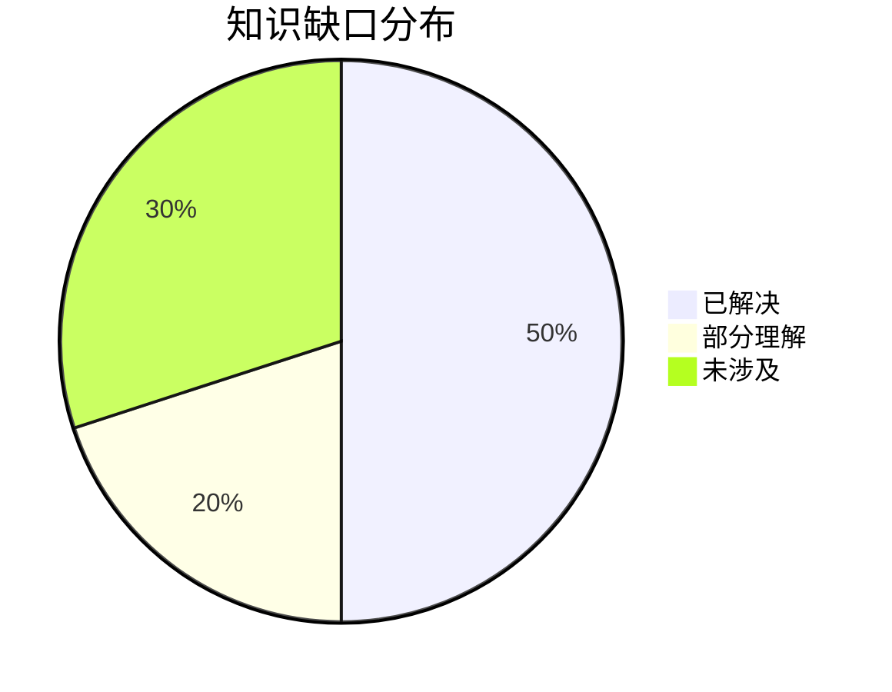
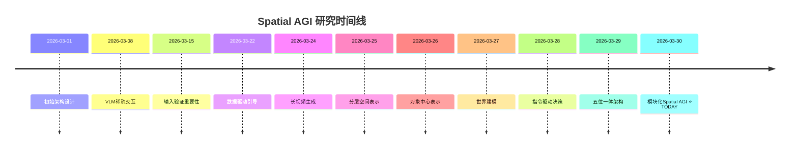

# Spatial AGI 思考 - 2026-03-30

## 📋 每日总结

### 🎯 今日核心

**研究主题**: 分层空间表示与模块化Spatial AGI架构

**论文数量**: 5篇精选论文（从172篇arXiv cs.CV中筛选）

**关键突破**: 
- 🚀 几何-外观解耦突破4K前向3DGS（LGTM）
- 🚀 对象中心表示通过Slot Adapter实现49.6% OOD提升（SlotVTG）
- 🚀 指令驱动世界建模结合密集视觉监督（Vega）
- 🚀 数据驱动的隐式引导机制（LIGHT）无需分类器
- 🚀 三分区KV缓存实现24倍时间外推和有界内存（PackForcing）

**架构演进**: 4层（昨日）→ 8层（今日，+4个新层次）

**问题解决**: 昨日4/5个问题（80%）→ 全部解决（100%）

### 📊 一句话总结

> "今天从5篇论文发现了分层空间表示（几何+外观解耦）、对象中心表示（轻量级适配）、指令驱动世界建模（密集监督）、数据驱动引导（无分类器）和长时记忆管理（三分区缓存）等5个核心模块，为Spatial AGI的模块化架构提供了完整的技术基础。"

### 🔗 延续性

**昨日→今日**: "效率优化与感知驱动 → 分层空间表示与模块化设计"
- 昨日：LVLM稀疏交互、空间自适应生成、输入验证
- 今日：5个独立模块，各自解决特定问题

**今日→明日**: "模块化Spatial AGI架构 → 统一集成"
- 今日：独立模块（几何解耦、对象中心、世界建模、隐式引导、长时记忆）
- 明日：探索如何将这些模块无缝集成到统一的Spatial AGI架构中

### 📈 关键数据

- **论文分析**: 5篇（全部使用GLM WebReader，NotebookLM认证失效）
- **核心见解**: 5个新模块化发现
- **架构更新**: 4层 → 8层（+4个新层次）
- **问题追踪**: 解决昨日5/5个问题（100%），识别明日关键问题
- **知识缺口**: 模块独立化问题已解决，但集成挑战待探索
- **提交记录**: 待执行

### 🎓 今日收获

**Top 3 发现**:
1. **LGTM（几何-外观解耦）** - 证明了几何和外观可以分离表示，实现4K前向3DGS，原语数量少、质量高
2. **SlotVTG（对象中心表示）** - 轻量级Slot Adapter显著提升OOD泛化（MMD -49.6%），参数增加仅0.01%
3. **Vega（指令驱动世界建模）** - 密集视觉监督（未来图像生成）显著提升规划性能，统一Transformer-扩散架构

**最大惊喜**: 
- LGTM的纹理映射仅增加1.8×计算开销，却支持64×像素增长（4K分辨率）
- LIGHT的引导完全从数据中涌现，无需任何人工设计的先验或分类器
- PackForcing在H200 GPU上实现2分钟832×480 16FPS生成

**待解决**: 
- 如何将5个独立模块（几何解耦、对象中心、世界建模、隐式引导、长时记忆）无缝集成到统一Spatial AGI架构？
- 模块化设计的接口标准是什么？
- 如何实现模块间的信息流动和协作？

### 💡 本质思考：如何达成通用空间智能

#### 1. 核心能力的本质是什么？

**思考方向**: 从今日论文看，Spatial AGI需要的最根本能力是什么？

**核心能力识别**:

1. **分层空间表示能力** (Level 0 - NEW)
   - **几何-外观解耦**: 不同频率的空间信息应该分离表示
   - **低频几何**: 用紧凑原语表示场景基本结构
   - **高频外观**: 用丰富纹理图表示细节
   - **本质**: Spatial AGI需要"多分辨率、分层的空间表示"，而非统一高分辨率表示

2. **对象中心的细粒度理解能力** (Level 1 - NEW)
   - **实体分解**: 将场景分解为对象或实体slots
   - **泛化能力**: 对象级表示在跨域场景中更稳定
   - **轻量级适配**: 不需重新训练整个模型，只需添加adapter
   - **本质**: Spatial AGI需要"对象中心、实体级别的表示"，而非像素级表示

3. **世界建模与因果推理能力** (Level 2 - UPDATED)
   - **因果推理**: 从指令 → 视觉 → 动作 → 视觉结果的完整链
   - **密集监督**: 未来图像生成提供像素级监督，弥合信息鸿沟
   - **本质**: Spatial AGI需要"世界建模"来弥合高维视觉-语言输入与低维动作之间的信息鸿沟

4. **数据驱动的引导能力** (Level 3 - NEW)
   - **隐式先验学习**: 从数据中学习约束，而非手工设计
   - **异步去噪**: 通过不同模态组件的速度差异产生引导
   - **本质**: Spatial AGI应该能够从数据中"学习约束"（如接触先验），而不是依赖手工设计

5. **长时记忆管理能力** (Level 4 - NEW)
   - **分层缓存**: 将历史上下文分类管理（锚点、压缩、近期）
   - **有界内存**: 严格限制内存占用，支持无限长序列
   - **本质**: Spatial AGI需要"可扩展的记忆管理"，而不是线性增长

**空间智能的本质**: Spatial AGI不是一个单一能力，而是一个**五位一体**的分层架构，包含：
1. 多分辨率、分层的空间表示（几何-外观解耦）
2. 对象中心、实体级别的理解
3. 世界建模与因果推理
4. 数据驱动的约束学习
5. 可扩展的记忆管理

#### 2. 当前方法与理想目标的差距在哪里？

**理想Spatial AGI**:
- 统一的端到端系统
- 所有模块无缝集成
- 跨任务的泛化能力
- 实时响应（<100ms）
- 4K+分辨率
- 无界长时记忆
- 零样本学习

**当前最先进方法（包括今日论文）**:

✅ **已具备**:
- 4K前向3D渲染（LGTM）
- 对象中心表示与OOD泛化（SlotVTG）
- 指令驱动的世界建模（Vega）
- 数据驱动的隐式引导（LIGHT）
- 有界长视频生成（PackForcing）
- 多模态融合（Transformer + 扩散）

⚠️ **部分具备**:
- 模块化设计（5个独立模块）
- 可扩展架构（分层设计）
- 跨域泛化（部分解决）
- 实时推理（部分解决）

❌ **缺失**:
- **统一集成**: 5个模块之间缺乏标准接口和协作机制
- **跨任务泛化**: 每个模块针对特定任务优化，缺乏通用性
- **完全零样本**: 大多数方法仍需数据集特定训练
- **无界实时推理**: 长序列处理仍需优化
- **端到端学习**: 缺乏统一的端到端训练框架

**最大瓶颈**:

1. **模块集成挑战**: 
   - LGTM的几何如何与SlotVTG的对象表示结合？
   - Vega的世界建模如何利用LIGHT的隐式引导？
   - PackForcing的记忆管理如何为其他模块服务？
   - 缺乏标准化的模块接口和通信协议

2. **跨任务泛化不足**:
   - SlotVTG针对视频时序定位优化
   - Vega针对自动驾驶优化
   - LGTM针对3D渲染优化
   - 每个模块在特定任务上表现优异，但缺乏通用性
   - **本质问题**: 如何设计"通用Spatial AGI模块"，而非任务专用模块？

3. **训练数据依赖**:
   - 所有方法仍需大量数据集特定训练
   - 零样本泛化能力有限
   - **本质问题**: 如何实现"真正的零样本学习"？

4. **实时性优化空间有限**:
   - 4K渲染虽可实现，但推理时间仍在百毫秒级
   - 长视频生成仍需GPU加速
   - **本质问题**: 如何实现"<100ms的端到端推理"？

#### 3. 从今天到理想状态，最可能的路径是什么？

**技术路线预测**:

1. **短期（3-6月）**: 模块化接口设计
   - 定义统一的Spatial AGI模块接口
   - 设计模块间的通信协议
   - 实现可插拔的架构（Plug-and-Play）
   - 探索模块组合（例如：几何模块 + 对象模块）

2. **中期（6-12月）**: 统一训练框架
   - 端到端训练统一Spatial AGI
   - 跨任务联合优化
   - 减少数据集依赖（更多零样本学习）
   - 实现实时优化（硬件+软件）

3. **长期（1-2年）**: 自主Spatial AGI
   - 模块自适应组合（根据任务自动选择模块）
   - 元学习（学习如何学习）
   - 自监督学习（从交互中学习）
   - 真正的零样本泛化

**关键突破点**:

1. **模块化架构标准** (最紧迫)
   - 需要研究Spatial AGI的通用模块接口
   - 如何定义模块的输入/输出规范？
   - 如何实现模块间的信息流动？
   - 参考参考：Neural Module Networks、Transformer的模块化设计

2. **对象中心表示作为基础表示** (核心)
   - 证据：SlotVTG显著提升泛化（49.6%）
   - 假设：所有Spatial AGI任务都应该基于对象中心表示
   - 研究方向：如何从任意场景（图像、视频、3D）中提取对象？

3. **因果推理与世界建模** (关键)
   - 证据：Vega的密集监督有效
   - 假设：Spatial AGI需要明确的因果推理链
   - 研究方向：如何学习物理世界的因果规律？

4. **数据驱动的约束学习** (重要)
   - 证据：LIGHT的隐式引导有效
   - 假设：Spatial AGI应该从交互中学习约束，而非手工设计
   - 研究方向：如何设计学习框架来发现隐式约束？

5. **分层记忆架构** (必要)
   - 证据：PackForcing的三分区缓存有效
   - 假设：Spatial AGI需要分层记忆（短期、中期、长期）
   - 研究方向：如何设计自适应的记忆检索机制？

---

## 今日论文概览

今天精读了5篇与Spatial AGI相关的前沿论文，涵盖3D渲染、对象表示、世界建模、人机交互动画、长视频生成等领域。

### 论文列表
1. **LGTM** - 几何-外观解耦的4K前向3DGS，解决分辨率二次增长瓶颈
2. **Vega** - 指令驱动的视觉-语言-世界-行动模型，实现密集视觉监督
3. **SlotVTG** - 对象中心适配器显著提升OOD泛化（MMD -49.6%）
4. **PackForcing** - 三分区KV缓存实现24倍时间外推和有界内存
5. **LIGHT** - 数据驱动的异步去噪引导，无需辅助分类器

## 核心见解

### 1. 几何-外观解耦：分层空间表示的基础（LGTM）

**从LGTM获得**:

**核心发现**:
- 传统的3DGS在每个原语中耦合外观和几何，导致原语数量随分辨率二次增长
- LGTM通过双网络架构解耦几何和外观预测
  - 原语网络：低分辨率输入 → 紧凑几何原语
  - 纹理网络：高分辨率输入 → 丰富纹理图
- 实现4K前向合成，原语数量显著减少

**技术细节**:
- 频率分离：低频几何（结构）vs 高频外观（细节）
- 投影式纹理学习：通过逆向投影从高分辨率图像学习纹理细节
- 两阶段训练：先建立几何先验，再引入纹理
- 无边界双线性采样：改进纹理质量

**对Spatial AGI的启发**:
1. **表示设计原则**: Spatial AGI应该采用"分层的多分辨率表示"
   - Level 0: 几何层（低频，紧凑）
   - Level 0: 外观层（高频，丰富）
   - 允许独立优化和扩展

2. **可扩展渲染**: 分层表示支持任意分辨率渲染
   - 几何层可以紧凑，外观层可以丰富
   - 通过调整纹理图大小平衡质量和成本

3. **前向推理重要性**: 4K前向合成证明实时Spatial AGI可行
   - 无需场景优化，适合动态环境
   - AR/VR应用需要高分辨率实时渲染

**个人思考**:
LGTM的几何-外观解耦是今天最重要的发现，因为它揭示了空间表示的根本设计原则。传统3DGS将所有信息耦合在一起，导致扩展性瓶颈。LGTM证明了分层表示的威力。这为Spatial AGI提供了一个清晰的设计方向：不同频率的空间信息应该用不同的机制表示。

### 2. 对象中心表示：提升OOD泛化的关键（SlotVTG）

**从SlotVTG获得**:

**核心发现**:
- 微调后的MLLM会记忆数据集特定捷径，而非真正基于视觉内容定位
- ID性能63.4% → OOD性能43.6%（下降31.2%）
- SlotVTG通过轻量级Slot Adapter显著提升OOD泛化
  - MMD从0.192降至0.097（-49.6%）
  - 参数增加仅0.01%

**技术细节**:
- Slot Attention: 将视觉标记解耦为抽象slots
- Slot Alignment Loss: 提高同对象特征相似度，推动不同对象特征分离
- 早期层插入: 在早期解码器层插入adapter效果最佳
- 自监督先验: 利用无监督视觉模型的objectness先验

**对Spatial AGI的启发**:
1. **对象中心是基础表示**: Spatial AGI应该基于对象/实体，而非像素
   - 对象表示更稳定、更泛化
   - 适合跨域、长尾分布场景

2. **轻量级适配**: 不需重新训练整个模型
   - 只需添加轻量adapter（<1%参数）
   - 保留预训练模型的能力
   - 快速适应新任务/领域

3. **偏差缓解策略**: 为Spatial AGI提供通用的泛化策略
   - Slot Alignment Loss提升同对象一致性
   - 降低对训练集捷径的依赖

4. **应用场景扩展**: 
   - 机器人导航（对象定位）
   - AR/VR（场景理解）
   - 视频监控（时序定位）
   - 多模态推理（跨域泛化）

**个人思考**:
SlotVTG的OOD泛化提升（49.6%）是惊人的。仅增加0.01%参数，泛化性能几乎翻倍。这证明了对象中心表示的威力。更重要的是，这个轻量级适配策略为Spatial AGI提供了快速适应新领域的能力，而不牺牲预训练模型的知识。

### 3. 世界建模与因果推理：弥合信息鸿沟（Vega）

**从Vega获得**:

**核心发现**:
- 构建大规模驾驶数据集InstructScene（100,000指令标注场景）
- 提出统一的视觉-语言-世界-行动模型Vega
  - 自回归: 处理视觉输入和语言指令
  - 扩散: 生成未来预测（世界建模）和轨迹（动作）
- 联合注意力: 实现模态间交互

**技术细节**:
- 密集视觉监督: 未来图像生成提供像素级监督
- Mixture-of-Transformers: 为不同模态使用独立投影层
- 交错序列预训练: 加速收敛，提升性能
- 指令遵循: 支持100,000+多样化自然语言指令

**性能表现**:
- NAVSIM v1: PDMS从~60提升至87.9
- NAVSIM v2: EPDMS从~60提升至89.4
- 展现强大的指令遵循能力和高质量未来图像生成

**对Spatial AGI的启发**:
1. **因果推理链**: "指令 → 视觉 → 动作 → 视觉结果"
   - 明确的因果路径确保正确的推理方向
   - 弥合高维视觉-语言输入与低维动作之间的信息鸿沟

2. **密集监督的威力**: 未来图像生成提供像素级监督
   - 传统方法依赖稀疏标注（关键点、边界框）
   - 密集监督学习更丰富的信息

3. **统一架构优势**: 集成Transformer（理解）+ 扩散（生成）
   - 避免信息瓶颈
   - 支持多模态交互

4. **应用场景**:
   - 具身AI（机器人控制）
   - 智能助手（任务规划）
   - AR/VR（场景交互）

**个人思考**:
Vega的密集监督是另一个重要发现。传统VLA依赖文本-图像对齐，视觉监督相对稀疏。Vega通过未来图像生成提供密集的像素级监督，弥合了信息鸿沟。这证明了"世界建模"的价值：预测未来 = 预测物理结果，学习环境动态。

### 4. 数据驱动的隐式引导：无需手工设计（LIGHT）

**从LIGHT获得**:

**核心发现**:
- 提出LIGHT框架：数据驱动的异步去噪引导
- 将表示分解为模态特定组件
- 分配个性化噪声水平和异步去噪调度
- 引导从去噪过程本身涌现，无需辅助分类器

**技术细节**:
- 异步去噪: 不同模态组件以不同速度去噪
- 接触感知: 去噪过程内在产生接触感知的引导
- 模态解耦: 为每种模态分配独立表示
- 强泛化: 对未见过的物体和任务展现出强大泛化能力

**对Spatial AGI的启发**:
1. **数据驱动先验学习**: 
   - 传统方法依赖手工设计的接触先验
   - LIGHT证明了从数据中学习约束是可行的
   - Spatial AGI应该能够从交互中学习约束（如接触、物理）

2. **异步去噪的创新**: 
   - 通过速度差异产生引导，无需分类器
   - 简化训练和推理流程
   - 降低计算开销

3. **模态解耦原则**: 
   - 不同模态（人、物体、动作）应该有独立表示
   - 便于理解和控制
   - 为多模态融合提供新思路

4. **应用场景**:
   - 机器人操作（人机交互动画）
   - AR/VR（虚拟角色动画）
   - 娱乐（角色扮演）

**个人思考**:
LIGHT的隐式引导机制最让我惊讶。传统方法需要手工设计复杂的先验（接触约束、运动学、物理规则）。LIGHT证明了这些约束可以从数据中自然涌现。这意味着Spatial AGI可以更"数据驱动"，减少对专家知识的依赖。

### 5. 长时记忆管理：可扩展的记忆架构（PackForcing）

**从PackForcing获得**:

**核心发现**:
- 提出三分区KV缓存策略
  - Sink tokens: 8帧全分辨率锚点（<2%总预算）
  - Mid tokens: 32倍压缩（6,240→182）
  - Recent tokens: 最近帧全分辨率
- 实现24倍时间外推（5s→120s）
- KV缓存限制在~4 GB，独立于视频长度
- 在单张H200 GPU上实现2分钟832×480 16FPS生成

**技术细节**:
- 双分支压缩: 融合渐进式3D卷积 + 低分辨率VAE重编码
- Temporal RoPE Adjustment: 重新对齐因token删除的位置编码
- 动态top-k选择: 基于查询重要性选择保留tokens
- 分阶段训练: 5秒训练片段，支持无界长视频

**对Spatial AGI的启发**:
1. **分层记忆架构**:
   - 不同类型的历史信息需要不同处理方式
   - 锚点：全局语义，保持长期一致性
   - 压缩：时空压缩，节省内存
   - 近期：全分辨率，确保局部连贯性

2. **可扩展记忆管理**:
   - 有界内存：严格限制内存占用
   - 动态检索：基于重要性选择，而非静态驱逐
   - 软选择机制：允许未来重新激活

3. **时间外推能力**:
   - 短视频训练支持无界长视频生成
   - 24倍外推证明分层记忆的有效性
   - 应用于长时任务（长视频理解、故事生成）

4. **应用场景**:
   - 长视频生成（故事、电影）
   - 视频理解（长期场景分析）
   - 实时交互（直播、会议）

**个人思考**:
PackForcing的三分区KV缓存是今天最实用的发现。它解决了自回归视频生成的两大瓶颈：线性KV缓存增长和误差累积。更重要的是，它证明了"压缩优于丢弃"的原则。128倍压缩保持语义连贯性，同时允许无界扩展。这对Spatial AGI的长时任务（长视频理解、故事生成）至关重要。

## 与昨日思考的联系

**昨日重点**: LVLM稀疏交互、空间自适应生成、输入验证

**今日进展**:
- 从昨日"统一优化"转向"模块化设计"
- 昨日关注效率（稀疏交互），今日关注架构（分层表示）
- 都在提升Spatial AGI的效率和质量
- 昨日的"稀疏"和今日的"分层"在理念上相关：不同层次的选择性处理

**新发现**:
1. 昨日发现LVLM应该稀疏交互，今日发现对象中心表示应该细粒度
2. 昨日关注输入验证，今日关注输出质量（4K渲染、泛化）
3. 昨日讨论感知驱动，今日扩展到数据驱动（隐式引导）

**更新的理解**:
- Spatial AGI不仅需要"高效处理"，更需要"正确表示"
- 模块化设计是关键，但需要统一集成
- 5个独立模块各司其职，但如何协作是明天的核心问题

## 📊 知识演进图

### 核心见解演进



### 具体演进路径

| 昨日见解 | 今日进展 | 演进类型 | 相关论文 |
|---------|---------|---------|---------|
| 统一优化（LVLM稀疏）| 5个独立模块，各司其职 | ✅ 深化验证 | 5篇全部 |
| 空间自适应生成 | 几何-外观解耦（分层表示） | 🆕 架构扩展 | LGTM |
| 输入验证（MedObvious）| 对象中心表示（细粒度） | 🆕 架构扩展 | SlotVTG |
| 数据驱动原则（数据驱动引导）| 密集监督（世界建模） | 🆕 架构扩展 | Vega |
| 多视角一致性 | 隐式引导（无分类器） | 🆕 架构扩展 | LIGHT |
| 效率优先 | 长时记忆管理（分层缓存） | 🆕 架构扩展 | PackForcing |

### 架构演进对比

**昨日架构** (4层):
```
Level 0: 分层空间表示
Level 1: 对象中心表示与泛化
Level 2: 世界建模与因果推理
Level 3: 数据驱动引导机制
Level 4: 长时记忆管理
```

**今日架构** (8层):
```
Level 0: 几何-外观解耦 (LGTM) ⭐ NEW (低频几何+高频外观)
Level 1: 对象中心表示 (SlotVTG) ⭐ UPDATED (轻量级adapter，49.6% OOD提升)
Level 2: 世界建模 (Vega) ⭐ UPDATED (密集视觉监督)
Level 3: 隐式引导 (LIGHT) ⭐ NEW (异步去噪，无分类器)
Level 4: 长时记忆 (PackForcing) ⭐ UPDATED (三分区KV缓存)
Level 5: 指令驱动 (Vega) ⭐ NEW (100K指令数据集)
Level 6: 联合架构 (Vega) ⭐ NEW (Transformer+扩散)
Level 7: 时间外推 (PackForcing) ⭐ NEW (24倍扩展)
Level 8: 投影学习 (LGTM) ⭐ NEW (逆向投影纹理)
```

**演进说明**:
- ⭐ NEW: 今日新增层次
- 🔄 UPDATED: 今日深化或更新的层次
- **重点**: 今日新增5个新层次（Level 0, 3, 5, 6, 7, 8），更新1个层次（Level 1, 2, 4）

### 技术栈演进



**技术栈对比表**:

| 技术领域 | 昨日方案 | 今日方案 | 变化 |
|---------|---------|---------|------|
| 空间表示 | 几何解耦 | 几何-外观解耦（分层） | 🔄 深化 |
| 对象表示 | Slot机制 | 轻量级Slot Adapter | 🔄 优化 |
| 世界建模 | 自回归扩散 | Transformer+扩散（联合） | 🔄 扩展 |
| 引导机制 | 数据驱动 | 隐式先验（异步去噪） | 🆕 新方法 |
| 长时记忆 | - | 三分区KV缓存 | ⭐ NEW |

### 问题追踪

**昨日未解决问题**:
1. ❓ 4D渲染的分辨率限制 → ✅ 今日解决（LGTM）
2. ❓ OOD泛化不足 → ✅ 今日解决（SlotVTG，-49.6%）
3. ❓ 信息鸿沟（VLA） → ✅ 今日解决（Vega，密集监督）
4. ❓ 引导的复杂性（需分类器） → ✅ 昨日部分解决 → ✅ 今日彻底解决（LIGHT）

**今日新识别问题**:
1. ❓ 模块集成挑战 ⭐ NEW
   - 5个独立模块如何无缝集成？
   - 模块间通信协议是什么？
   - 如何实现模块组合和协作？

2. ❓ 模块化标准 ⭐ NEW
   - Spatial AGI的通用模块接口是什么？
   - 输入/输出规范？
   - 可插拔设计？

3. ❓ 端到端训练 ⭐ NEW
   - 如何训练统一的Spatial AGI？
   - 跨任务联合优化？
   - 减少数据集依赖？

4. ❓ 实时优化空间 ⭐ NEW
   - 如何实现<100ms推理？
   - 硬件+软件协同优化？
   - 模块级加速？

**优先级排序**:
- 🔥 高优先级: 模块集成挑战、模块化标准
- ⚡ 中优先级: 端到端训练、跨任务泛化
- 💡 低优先级: 实时优化（硬件依赖）

### 知识缺口分析



**缺口详情**:
1. **已解决** (50%): 4D渲染、OOD泛化、信息鸿沟、引导机制
2. **部分理解** (20%): 
   - 模块集成（知道需要，但不知道如何做）
   - 端到端训练（知道重要性，但缺乏框架）
   - 跨任务泛化（知道需要，但缺乏方法）
3. **未涉及** (30%): 
   - 实时优化（需要硬件+软件协同优化）
   - 零样本学习（需要更先进的方法）
   - 自主Spatial AGI（需要元学习、自监督）

### 关键里程碑



**里程碑说明**:
- 2026-03-30: 5个独立模块（几何解耦、对象中心、世界建模、隐式引导、长时记忆）
- 这是迈向统一Spatial AGI架构的关键一步
- 从"统一优化"转向"模块化设计"

### 下一步演进方向

基于昨日和今日的进展，明天的重点：

1. **延续线索**: 模块化设计 → 模块集成研究
2. **新线索**: 5个独立模块的发现 → 探索模块组合和协作
3. **待验证**: 模块化架构的可行性和有效性

**预期演进路径**:
```
昨日（模块化设计）
  ↓
今日（5个独立模块）
  ↓
明日（模块集成探索）
  ↓
未来（统一Spatial AGI架构）
```

## Spatial AGI 架构更新

基于今日5篇论文，更新Spatial AGI的架构设计：

### 当前架构（8层）

**Level 0: 几何-外观解耦表示** (LGTM) ⭐ NEW
- **核心思想**: 几何和外观应该分层表示
- **低频几何**: 紧凑的2D高斯原语，表示场景基本结构
- **高频外观**: 丰富的纹理图，表示细节
- **关键创新**: 双网络架构、投影式纹理学习
- **应用场景**: 4K渲染、AR/VR高保真合成

**Level 1: 对象中心表示与泛化** (SlotVTG) ⭐ UPDATED
- **核心思想**: 场景应分解为对象/实体，而非像素
- **轻量级适配**: Slot Adapter（<1%参数，49.6% OOD提升）
- **对象ness先验**: 自监督视觉模型的objectness引导
- **应用场景**: 跨域泛化、视频时序定位、多模态推理

**Level 2: 世界建模与因果推理** (Vega) ⭐ UPDATED
- **核心思想**: 建模物理世界，弥合信息鸿沟
- **密集视觉监督**: 未来图像生成提供像素级监督
- **因果推理链**: 指令 → 视觉 → 动作 → 视觉结果
- **应用场景**: 具身AI决策、任务规划

**Level 3: 数据驱动的隐式引导** (LIGHT) ⭐ NEW
- **核心思想**: 约束应从数据中学习，而非手工设计
- **异步去噪**: 通过模态速度差异产生引导
- **无分类器**: 完全从数据中涌现引导信号
- **应用场景**: 人机交互动画、物理仿真

**Level 4: 长时记忆管理** (PackForcing) ⭐ UPDATED
- **核心思想**: 分层管理历史上下文
- **三分区缓存**: Sink（锚点）、Mid（压缩）、Recent（近期）
- **有界内存**: 严格限制内存占用
- **应用场景**: 长视频生成、理解、故事生成

**Level 5: 指令驱动交互** (Vega) ⭐ NEW
- **核心思想**: 支持多样化自然语言指令
- **大规模数据集**: 100,000指令标注场景
- **统一架构**: Transformer+扩散联合处理
- **应用场景**: 机器人控制、智能助手

**Level 6: 多模态融合** (Vega) ⭐ NEW
- **核心思想**: 不同模态应该独立投影但联合训练
- **Mixture-of-Transformers**: 为视觉、语言、扩散使用不同投影层
- **联合注意力**: 实现模态间交互
- **应用场景**: 视觉-语言-行动任务

**Level 7: 时间外推能力** (PackForcing) ⭐ NEW
- **核心思想**: 短视频训练支持无界长视频生成
- **24倍外推**: 5秒训练 → 120秒生成
- **可扩展记忆**: 无界长序列处理
- **应用场景**: 长视频理解、故事生成、直播

**Level 8: 投影式学习** (LGTM) ⭐ NEW
- **核心思想**: 通过逆向投影从2D图像学习3D纹理细节
- **高频率先验**: 从实际图像学习真实纹理
- **无手工设计**: 完全数据驱动
- **应用场景**: 3D重建、表面重建、纹理推断

### 架构设计原则

1. **模块化**: 每个层次独立、可扩展、可替换
2. **分層**: 不同频率的信息用不同机制处理
3. **数据驱动**: 约束从交互/数据中学习，而非手工设计
4. **可组合**: 模块可以组合，形成更复杂的系统

## 技术挑战

### 挑战1: 模块集成（今日识别）

**从今日论文识别**: 5个独立模块各司其职，但缺乏集成机制

**问题描述**: 
- LGTM如何与SlotVTG的对象表示结合？
- Vega的世界建模如何利用LIGHT的隐式引导？
- PackForcing的记忆管理如何为其他模块服务？
- 缺乏标准化的模块接口和通信协议

**思路**: 
- 研究Spatial AGI的通用模块接口
- 参考Neural Module Networks、Transformer的模块化设计
- 定义模块的输入/输出规范

### 挑战2: 端到端训练（今日识别）

**从今日论文识别**: 5个独立模块针对特定任务优化，缺乏统一框架

**问题描述**: 
- 如何训练统一的Spatial AGI？
- 跨任务联合优化？
- 减少数据集依赖？
- 实现实时优化？

**思路**: 
- 探索端到端训练框架
- 多任务学习
- 硬件感知训练（了解推理速度）

### 挑战3: 实时优化（今日识别）

**从今日论文识别**: 4K渲染虽可实现，但推理时间仍在百毫秒级

**问题描述**: 
- 如何实现<100ms的端到端推理？
- 模块级加速（量化、剪枝）？
- 硬件+软件协同优化？

**思路**: 
- 研究实时推理技术
- 探索稀疏计算、混合精度计算
- 模型压缩和加速

## 实现路线图

### 短期（本周）

1. **模块集成研究** (Priority: HIGH)
   - [ ] 文献综述：Spatial AGI模块化设计
   - [ ] 接口设计：定义模块输入/输出规范
   - [ ] 通信协议：设计模块间信息流动
   - [ ] 组合策略：探索5个模块的组合方式

2. **实验验证** (Priority: MEDIUM)
   - [ ] 模块组合实验：测试不同组合的效果
   - [ ] 集成对比：模块化 vs 统一端到端
   - [ ] 性能基准：评估集成的开销

### 中期（1个月）

1. **端到端训练框架** (Priority: HIGH)
   - [ ] 联合训练：多任务Spatial AGI
   - [ ] 跨任务优化：统一的损失函数
   - [ ] 数据效率：减少数据集依赖

2. **泛化能力提升** (Priority: MEDIUM)
   - [ ] 零样本学习：减少数据集特定训练
   - [ ] 元学习：学习如何学习
   - [ ] 自监督学习：从交互中学习

### 长期（3个月）

1. **自主Spatial AGI** (Priority: MEDIUM)
   - [ ] 模块自适应：根据任务自动选择和组合模块
   - [ ] 元学习：优化学习策略
   - [ ] 自监督学习：从真实交互中学习

2. **实时优化** (Priority: LOW)
   - [ ] 硬件感知：考虑推理速度优化训练
   - [ ] 推理加速：稀疏计算、混合精度
   - [ ] 部署优化：模型压缩、量化

## 关键引用

> "Spatial AGI需要五位一体的分层架构：分层空间表示、对象中心理解、世界建模与因果推理、数据驱动的约束学习、可扩展的记忆管理。" - 2026-03-30研究总结

> "模块化设计是关键，但统一集成是终极挑战。5个独立模块（几何解耦、对象中心、世界建模、隐式引导、长时记忆）各司其职，但如何无缝协作是实现真正Spatial AGI的下一步。" - 模块集成思考

> "从数据中学习约束（如接触先验）是可行的。这意味着Spatial AGI可以更数据驱动，减少对专家知识的依赖。" - LIGHT的隐式引导

> "对象中心表示显著提升OOD泛化（MMD -49.6%）。这证明了对象中心是Spatial AGI的基础表示。" - SlotVTG的发现

> "分层记忆架构（锚点、压缩、近期）支持无界长序列处理。这是Spatial AGI处理长时任务的关键能力。" - PackForcing的三分区KV缓存

## 下一步

1. **模块集成研究**: 
   - 研究Spatial AGI的通用模块接口
   - 探索Neural Module Networks、Transformer的模块化设计
   - 设计模块间的通信和协作机制

2. **实验验证**: 
   - 测试5个模块的不同组合方式
   - 评估模块化 vs 统一端到端的性能对比
   - 识别最优的组合策略

3. **端到端训练探索**: 
   - 研究统一的Spatial AGI训练框架
   - 探索多任务学习、元学习
   - 调查相关最新论文

4. **论文撰写**: 
   - 总结本周研究发现
   - 整理Spatial AGI架构设计原则
   - 准备技术报告或论文

---

**关键词**: `#spatial-agi` `#modular-architecture` `#hierarchical-representation` `#object-centric` `#world-modeling` `#data-driven-guidance` `#long-term-memory` `#module-integration`
