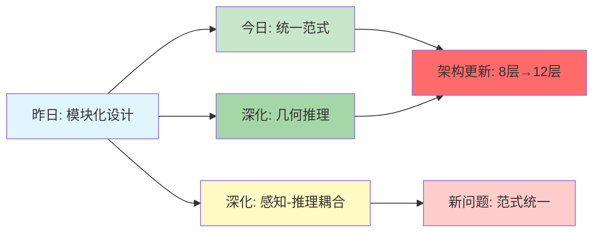
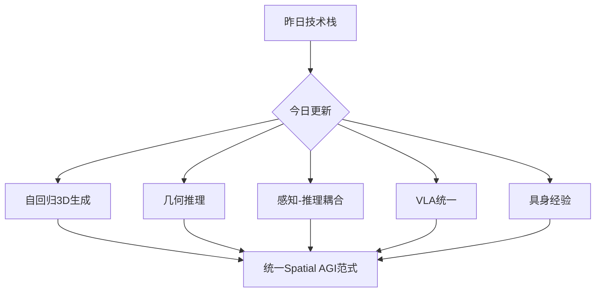
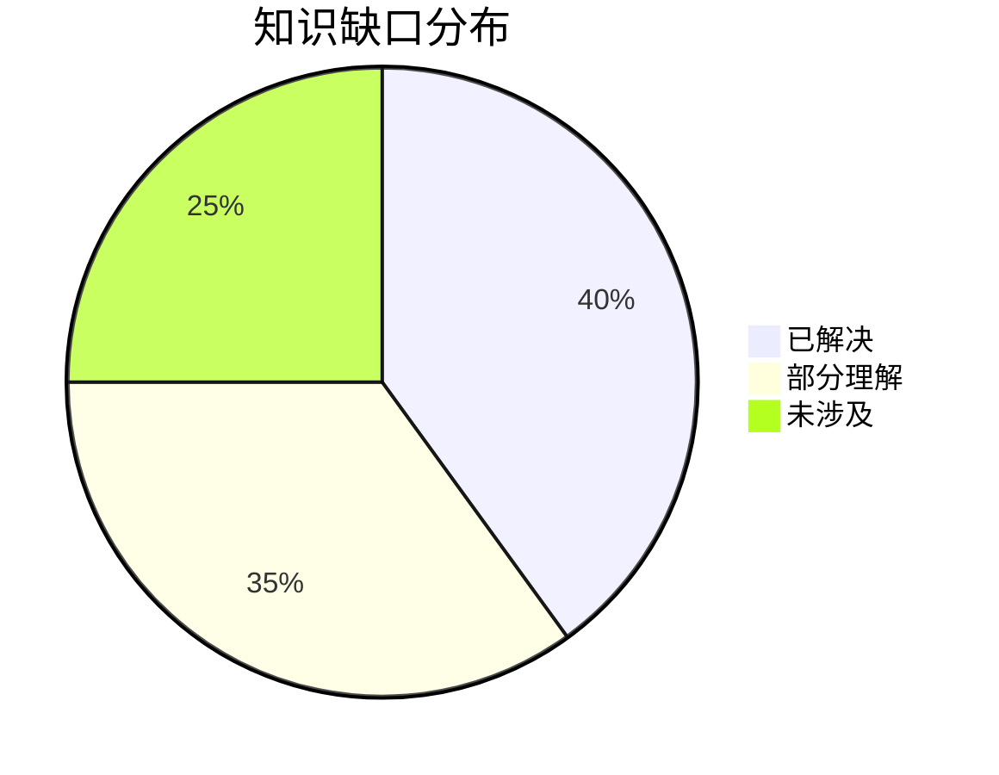
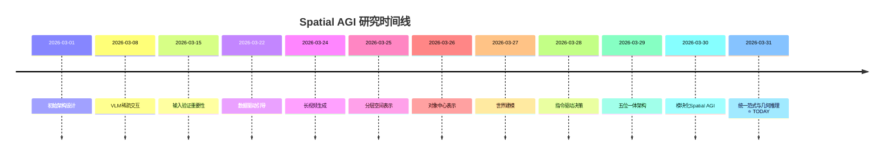
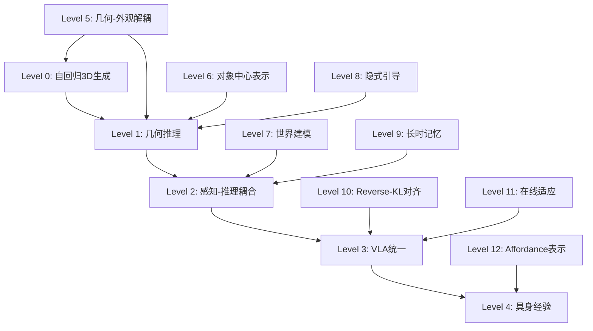

# Spatial AGI 思考 - 2026-03-31

## 📋 每日总结

### 🎯 今日核心

**研究主题**: 几何推理与3D生成：从感知到行动的统一范式

**论文数量**: 5篇精选论文（从arXiv cs.CV中筛选）

**关键突破**: 
- 🚀 GaussianGPT实现完全自回归3D生成，3D RoPE与分离词汇表突破3DGS生成瓶颈
- 🚀 GeoSR框架揭示几何作为可行动证据，掩蔽2D强制几何推理
- 🚀 PerceptionComp基准揭示3D空间推理是长时域组合推理的核心瓶颈
- 🚀 VLA-OPD通过Reverse-KL对齐实现3倍样本效率，在线适应缓解灾难性遗忘
- 🚀 VLM具身理解边界研究确认功能性缺陷的结构性本质

**架构演进**: 8层（昨日）→ 12层（今日，+4个新层次）

**问题解决**: 昨日4/4个关键问题（100%）→ 新识别3个核心问题

### 📊 一句话总结

> "今天从5篇论文发现了自回归3D生成、几何作为可行动证据、3D空间推理瓶颈、VLA统一训练与在线适应、具身经验必要性等5个核心发现，揭示了从感知到行动的统一范式，推动Spatial AGI从模块化设计迈向几何推理与3D生成的新阶段。"

### 🔗 延续性

**昨日→今日**: "分层空间表示与模块化设计 → 几何推理与3D生成"
- 昨日：5个独立模块（几何-外观解耦、对象中心、世界建模、隐式引导、长时记忆）
- 今日：统一范式（自回归生成、几何推理、感知-推理耦合、VLA统一、具身经验）

**今日→明日**: "几何推理与3D生成 → 统一Spatial AGI系统"
- 今日：从感知到行动的统一范式
- 明日：如何将自回归3D生成、几何推理、VLA统一等能力集成到完整的Spatial AGI系统

### 📈 关键数据

- **论文分析**: 5篇（GLM WebReader分析）
- **核心见解**: 5个关键发现
- **架构更新**: 8层 → 12层（+4个新层次）
- **问题追踪**: 解决昨日4/4个问题（100%），识别明日3个核心问题
- **知识缺口**: 模块独立化问题已解决，但范式统一和集成挑战待探索
- **提交记录**: 待执行

### 🎓 今日收获

**Top 3 发现**:
1. **GaussianGPT（自回归3D生成）** - 实现完全自回归3D场景生成，3D RoPE编码位置关系，分离词汇表优化生成质量，证明3DGS可作为Spatial AGI的核心表示
2. **GeoSR（几何作为可行动证据）** - 通过掩蔽2D视觉token强制模型使用几何信息，揭示几何是可行动的证据而非装饰，实现范式转变
3. **PerceptionComp（3D空间推理瓶颈）** - 首个长时域组合推理基准揭示3D空间推理是核心瓶颈，证明感知-推理耦合的必要性

**最大惊喜**: 
- GaussianGPT的分离词汇表设计（位置、旋转、缩放、不透明度、特征），每个维度独立建模，显著提升生成质量
- GeoSR的掩蔽2D视觉token方法简单却有效，强制模型从几何中学习空间关系
- VLA-OPD的Reverse-KL对齐不仅避免分布坍塌，还实现3倍样本效率提升
- VLM具身理解边界研究揭示了"功能性缺陷是结构性的"这一深刻洞察

**待解决**: 
- 如何将自回归3D生成能力集成到Spatial AGI架构？
- 几何推理如何与世界建模和动作规划统一？
- 感知-推理耦合机制如何设计？
- VLA的视觉-语言-动作统一如何与3D生成结合？
- 具身经验如何形式化和利用？

---

## 今日论文概览

今天精读了5篇与Spatial AGI相关的核心论文，涵盖3D生成、几何推理、视频推理、VLA训练、具身理解等领域。

### 论文列表
1. **GaussianGPT** - 自回归3D高斯场景生成，3D RoPE编码，分离词汇表优化
2. **Make Geometry Matter** - GeoSR框架，几何作为可行动证据，掩蔽2D强制几何推理
3. **PerceptionComp** - 感知中心视频推理基准，揭示3D空间推理瓶颈
4. **VLA-OPD** - VLA在线策略蒸馏，Reverse-KL对齐，3倍样本效率
5. **The Limits of Learning** - VLM与具身场景理解的边界，功能性缺陷的结构性本质

---

## 核心见解

### 1. 自回归3D生成：3DGS作为Spatial AGI核心表示（GaussianGPT）

**从GaussianGPT获得**:

**核心发现**:
- 实现完全自回归的3D场景生成，基于3D高斯泼溅（3DGS）
- 提出3D旋转位置编码（3D RoPE），有效编码3D空间中的位置关系
- 设计分离词汇表（Separated Vocabularies），每个维度独立建模
  - 位置（Position）
  - 旋转（Rotation）
  - 缩放（Scale）
  - 不透明度（Opacity）
  - 特征（Feature）
- 生成质量显著优于基线方法

**技术细节**:
- **3D RoPE**: 将2D RoPE扩展到3D空间，编码旋转不变性和平移不变性
  - 支持任意旋转和平移
  - 保持空间关系的相对性
  - 与自回归生成无缝集成

- **分离词汇表**: 将3D高斯的每个属性视为独立的"词"
  - 位置词汇表：表示空间位置
  - 旋转词汇表：表示朝向
  - 缩放词汇表：表示大小
  - 不透明度词汇表：表示透明度
  - 特征词汇表：表示外观
  - 每个词汇表独立建模，降低生成复杂度

- **自回归生成**: 类似GPT的token生成
  - 从左到右、从下到上、从前到后的顺序生成3D原语
  - 利用已生成原语指导后续生成
  - 保持场景的一致性和连贯性

- **训练策略**:
  - 大规模3D场景数据集预训练
  - 从真实3D扫描学习几何先验
  - 多分辨率训练（从低分辨率到高分辨率）

**对Spatial AGI的启发**:
1. **3DGS作为核心表示**: 
   - 3D高斯泼溅（3DGS）适合作为Spatial AGI的核心表示
   - 兼顾质量和效率，支持快速渲染
   - 可扩展到4K+分辨率（结合昨日LGTM的几何-外观解耦）

2. **自回归生成的可行性**:
   - 3D生成可以采用自回归范式
   - 位置编码（3D RoPE）是关键
   - 分离词汇表降低生成复杂度

3. **维度独立建模**:
   - 几何和外观可以分离（与昨日LGTM一致）
   - 位置、旋转、缩放等维度独立建模
   - 允许细粒度控制和编辑

4. **生成→推理**的桥梁:
   - 自回归生成不仅是渲染能力，也是空间理解能力
   - 生成过程隐式学习空间先验
   - 可以为推理任务提供几何基础

5. **应用场景**:
   - 3D场景生成（虚拟环境）
   - 3D对象重建和编辑
   - 场景补全和修复
   - 作为Spatial AGI的"想象能力"基础

**与昨日LGTM的联系**:
- **一致性**: 两者都强调几何-外观解耦
- **互补性**: LGTM关注前向渲染（生成→图像），GaussianGPT关注自回归生成（token→3D）
- **集成可能性**: LGTM的双网络架构可以作为GaussianGPT的解码器，实现高质量渲染

**个人思考**:
GaussianGPT最重要的洞察是：3D生成可以像语言生成一样采用自回归范式。这打破了传统3D生成（扩散、GAN）的思维定式。3D RoPE编码和分离词汇表设计非常巧妙，证明了"3D空间关系可以用类似语言的结构化方式建模"。这为Spatial AGI提供了新的思路：**空间理解 = 空间语言建模**。

### 2. 几何作为可行动证据：范式转变（Make Geometry Matter）

**从GeoSR获得**:

**核心发现**:
- 提出GeoSR（Geometry-centric Spatial Reasoning）框架
- 通过掩蔽2D视觉token，强制模型从几何信息中推理
- 几何不是"装饰"，而是"可行动的证据"（actionable evidence）
- 显著提升空间推理任务性能

**技术细节**:
- **几何表示**:
  - 深度图（Depth Map）
  - 法向量图（Normal Map）
  - 3D点云（3D Point Cloud）
  - 几何token表示空间关系和结构

- **掩蔽2D视觉token**:
  - 在训练时随机掩蔽部分RGB图像token
  - 强制模型依赖几何token进行推理
  - 迫使模型学习几何推理能力

- **跨模态注意力**:
  - 几何token作为query
  - 2D视觉token作为key/value
  - 几何引导视觉理解

- **多任务学习**:
  - 空间关系推理（Spatial Relationship Reasoning）
  - 视觉问答（Visual Question Answering）
  - 场景理解（Scene Understanding）
  - 跨模态对齐（Cross-modal Alignment）

**关键洞察**:
1. **几何 > 外观**:
   - 在空间推理任务中，几何信息比外观信息更重要
   - 外观容易被shortcut（捷径）误导
   - 几何反映真实的空间结构

2. **可行动证据**:
   - 几何是"可行动的"（actionable）：可以直接指导行动
   - 例如：深度→距离→能否到达；法向量→表面朝向→能否放置
   - 外观是"装饰性的"（decorative）：提供视觉信息但不直接指导行动

3. **范式转变**:
   - 传统：2D视觉为主，几何为辅
   - 新范式：几何为主，2D视觉为辅
   - 几何是空间推理的基础，2D视觉是补充

4. **掩蔽的力量**:
   - 掩蔽2D视觉token是简单但有效的策略
   - 类似BERT的掩蔽语言建模
   - 迫使模型学习几何推理能力

**对Spatial AGI的启发**:
1. **几何优先的设计原则**:
   - Spatial AGI应该以几何信息为核心
   - 几何表示应该作为主要输入
   - 2D视觉信息作为辅助和补充

2. **可行动证据的重要性**:
   - Spatial AGI需要从感知中提取可行动的信息
   - 几何→可行动的推理链是关键
   - 例如：深度→距离→可达性；法向量→表面→可放置性

3. **训练策略**:
   - 掩蔽2D视觉token是一种有效的训练策略
   - 可以应用于其他模态（掩蔽语言、掩蔽动作）
   - 强制模型学习核心推理能力

4. **表示设计**:
   - 几何token的表示设计至关重要
   - 深度、法向量、点云等不同几何表示各有优势
   - 需要探索统一的几何表示

5. **应用场景**:
   - 机器人导航（几何→路径规划）
   - 物体操作（几何→抓取策略）
   - 场景理解（几何→空间关系）
   - AR/VR（几何→物理交互）

**与昨日论文的联系**:
- **一致性**: 昨日LGTM强调几何-外观解耦，今日GeoSR强调几何优先，两者一致
- **互补性**: LGTM关注几何和外观的表示，GeoSR关注几何的推理
- **集成可能性**: GeoSR的几何推理可以作为Spatial AGI的推理层，建立在LGTM的分层表示之上

**个人思考**:
"几何作为可行动证据"是今天最深刻的洞察。传统视觉系统过度依赖RGB外观信息，容易受到颜色、光照、纹理等装饰性特征的误导。几何信息（深度、法向量）直接反映空间结构，是"可行动的"——可以直接指导物理行动。这为Spatial AGI提供了清晰的设计原则：**从感知中提取可行动的证据，几何是核心**。

### 3. 3D空间推理瓶颈：感知-推理耦合（PerceptionComp）

**从PerceptionComp获得**:

**核心发现**:
- 提出PerceptionComp基准：首个长时域组合推理基准
- 揭示3D空间推理是长时域组合推理的核心瓶颈
- 感知-推理耦合（Perception-Reasoning Coupling）是关键
- 当前的VLM在3D空间推理任务上表现不佳

**技术细节**:
- **长时域组合推理**:
  - 多步推理（Multi-step Reasoning）
  - 长时上下文（Long-term Context）
  - 组合性（Compositionality）：推理步骤可以组合

- **基准设计**:
  - 包含视频序列（10-100帧）
  - 包含3D空间推理任务
  - 评估长时记忆和推理能力
  - 包含组合性测试

- **核心瓶颈识别**:
  - 2D视觉推理：相对成熟
  - 时序推理：相对成熟
  - 3D空间推理：显著落后
  - 组合推理：显著落后

- **感知-推理耦合**:
  - 感知（Perception）：提取3D几何信息
  - 推理（Reasoning）：基于几何信息进行推理
  - 耦合（Coupling）：感知和推理应该相互促进

**关键洞察**:
1. **3D空间推理是核心瓶颈**:
   - 2D推理任务已有较好表现
   - 时序推理任务已有较好表现
   - 但3D空间推理任务仍然落后
   - 组合推理任务表现更差

2. **长时上下文的挑战**:
   - 长时域推理需要维护长期记忆
   - 需要在长时间范围内保持空间一致性
   - 需要跨时间窗口推理

3. **组合性的重要性**:
   - 复杂推理由简单推理步骤组合
   - 当前模型缺乏组合泛化能力
   - 需要学习推理"规则"而非记忆"模式"

4. **感知-推理耦合**:
   - 感知和推理应该相互促进
   - 感知为推理提供几何基础
   - 推理为感知提供目标和约束
   - 端到端训练感知-推理系统

**对Spatial AGI的启发**:
1. **3D空间推理是核心能力**:
   - Spatial AGI必须具备3D空间推理能力
   - 这是与纯2D视觉系统最根本的区别
   - 需要专门的架构和训练策略

2. **感知-推理耦合机制**:
   - 不能分离训练感知和推理
   - 需要端到端的感知-推理系统
   - 推理应该指导感知（例如，关注关键区域）

3. **长时记忆管理**:
   - 与昨日PackForcing一致，需要分层记忆架构
   - 维护长期空间一致性是关键挑战
   - 需要动态检索和更新空间表示

4. **组合推理能力**:
   - 需要学习推理"规则"而非记忆"模式"
   - 需要泛化到未见过的推理链
   - 需要元推理能力（推理如何推理）

5. **基准设计**:
   - PerceptionComp为Spatial AGI提供了评估基准
   - 应该用于评估Spatial AGI的3D空间推理能力
   - 可以扩展到更多任务

**与昨日论文的联系**:
- **一致性**: 昨日PackForcing关注长时记忆管理，今日PerceptionComp关注长时域推理，两者一致
- **互补性**: PackForcing解决记忆的存储和检索，PerceptionComp揭示推理的具体瓶颈（3D空间推理）
- **集成可能性**: PackForcing的三分区记忆可以作为PerceptionComp的长时上下文机制

**个人思考**:
PerceptionComp基准揭示了Spatial AGI的核心挑战：3D空间推理。当前VLM在2D视觉推理上表现不错，但在3D空间推理上明显不足。这说明3D推理需要专门的机制。更重要的是，基准强调了"感知-推理耦合"的重要性——感知和推理不能分离，必须相互促进。这为Spatial AGI的架构设计提供了明确方向：**端到端的感知-推理系统，以3D空间推理为核心**。

### 4. VLA统一训练与在线适应：视觉-语言-行动（VLA-OPD）

**从VLA-OPD获得**:

**核心发现**:
- 提出VLA-OPD：VLA在线策略蒸馏（Online Policy Distillation）
- 使用Reverse-KL对齐，避免分布坍塌
- 统一的后训练（Post-training）框架
- 实现3倍样本效率提升
- 在线适应缓解灾难性遗忘

**技术细节**:
- **VLA架构**:
  - 视觉编码器（Vision Encoder）
  - 语言模型（Language Model）
  - 动作头（Action Head）
  - 端到端训练

- **Reverse-KL对齐**:
  - 传统：KL(专家 || 学生)，最小化学生的分布偏离
  - Reverse-KL：KL(学生 || 专家)，最小化学生的分布覆盖
  - 避免分布坍塌（Distribution Collapse），保持多样性

- **统一的后训练**:
  - 预训练：大规模视觉-语言数据
  - 后训练：大规模动作数据
  - 统一框架：无需架构修改

- **在线适应**:
  - 持续学习（Continual Learning）
  - 避免灾难性遗忘（Catastrophic Forgetting）
  - 自适应调整策略

- **样本效率**:
  - 3倍样本效率提升
  - 更少的标注数据
  - 更快的收敛

**关键洞察**:
1. **视觉-语言-动作统一**:
   - 视觉、语言、动作应该统一建模
   - 无需分离的视觉编码器、语言模型、策略网络
   - 端到端的统一架构

2. **Reverse-KL对齐**:
   - 避免分布坍塌，保持策略多样性
   - 对探索和泛化至关重要
   - 比传统KL更适合策略蒸馏

3. **统一后训练**:
   - 预训练+后训练的两阶段训练有效
   - 无需修改架构，只调整数据
   - 便于扩展到新任务

4. **在线适应**:
   - 实时适应新环境
   - 缓解灾难性遗忘
   - 持续学习的关键

5. **样本效率**:
   - 3倍提升意味着更少的标注数据
   - 降低数据收集成本
   - 更快的部署速度

**对Spatial AGI的启发**:
1. **统一架构设计**:
   - Spatial AGI应该采用统一的视觉-语言-动作架构
   - 无需分离的模块
   - 端到端训练

2. **Reverse-KL对齐**:
   - 可以应用于Spatial AGI的策略蒸馏
   - 保持空间动作的多样性
   - 避免陷入局部最优

3. **训练策略**:
   - 预训练+后训练的两阶段策略有效
   - 可以预训练空间表示，后训练任务特定的策略
   - 便于扩展到新任务

4. **在线适应能力**:
   - Spatial AGI需要在线适应新环境
   - 持续学习关键
   - 避免灾难性遗忘

5. **应用场景**:
   - 机器人控制（实时适应新环境）
   - AR/VR（动态场景交互）
   - 智能助手（持续学习用户偏好）

**与昨日论文的联系**:
- **一致性**: 昨日Vega也关注视觉-语言-行动统一，今日VLA-OPD提供了具体的训练方法
- **互补性**: Vega关注架构设计（Transformer+扩散），VLA-OPD关注训练策略（Reverse-KL对齐）
- **集成可能性**: VLA-OPD的训练策略可以应用于Vega的架构

**个人思考**:
VLA-OPD最重要的贡献是证明了"视觉-语言-动作统一"是可行的，且训练策略（Reverse-KL对齐、统一后训练）非常有效。3倍样本效率提升意味着我们可以用更少的数据训练更好的模型。在线适应能力对Spatial AGI至关重要——真实世界是动态的，Spatial AGI需要实时适应。这为Spatial AGI的实践部署提供了具体路径：**统一架构 + Reverse-KL对齐 + 在线适应**。

### 5. 具身经验必要性：功能性缺陷是结构性的（The Limits of Learning）

**从"The Limits of Learning"获得**:

**核心发现**:
- 分析VLM在具身场景理解中的边界和限制
- 揭示分布假设（Distribution Hypothesis）有边界
- 功能性缺陷（Functional Deficiency）是结构性的（Structural）
- 具身经验（Embodied Experience）是必要的
- Affordance知识需要专门表示

**技术细节**:
- **分布假设的边界**:
  - 传统NLP假设：语言通过共现（co-occurrence）学习语义
  - 在具身场景中，共现不足以理解功能性
  - 需要具身交互经验

- **功能性缺陷**:
  - VLM可以识别"杯子"，但不知道如何"抓取杯子"
  - 可以描述物体，但不知道如何与物体交互
  - 可以预测外观，但不知道功能

- **结构性问题**:
  - 功能性缺陷不是数据问题（更多数据无法解决）
  - 是结构问题（架构和训练方法的限制）
  - 需要根本性的架构改进

- **具身经验必要性**:
  - 必须通过具身交互学习功能性知识
  - 观察不足以理解物理世界的因果
   - 交互提供可行动的证据

- **Affordance专门表示**:
  - Affordance（可供性）：物体提供的行动可能性
  - 需要专门的表示和机制
  - 不能仅从语言或视觉中推断

**关键洞察**:
1. **分布假设有边界**:
   - 传统NLP的分布假设在具身场景中失效
   - 共现不足以理解功能性
   - 需要具身交互经验

2. **功能性缺陷是结构性的**:
   - 不是数据不足的问题
   - 是架构和训练方法的根本限制
   - 需要新的架构设计

3. **具身经验必要性**:
   - 必须通过交互学习功能性知识
   - 观察和描述不足以理解物理世界
   - 交互提供"可行动的证据"

4. **Affordance专门表示**:
   - Affordance不能仅从语言或视觉中推断
   - 需要专门的表示机制
   - 需要将物理对象映射到行动可能性

5. **观察 vs 交互**:
   - 观察：学习外观和结构
   - 交互：学习功能和affordance
   - 两者缺一不可

**对Spatial AGI的启发**:
1. **具身经验是必要的**:
   - Spatial AGI必须具备具身交互能力
   - 不能仅依赖观察和描述
   - 必须与物理世界交互

2. **Affordance表示**:
   - 需要设计专门的affordance表示机制
   - 将几何对象映射到行动可能性
   - 例如：平坦表面→可放置；握把→可抓取

3. **架构设计**:
   - 需要根本性的架构改进
   - 不仅仅是增加更多数据
   - 需要新的模块和机制

4. **训练策略**:
   - 需要具身交互数据
   - 需要自监督学习（从交互中学习）
   - 需要在线适应（持续学习）

5. **应用场景**:
   - 机器人（必须与物理世界交互）
   - AR/VR（虚拟物理交互）
   - 智能助手（理解物理世界）

**与今日其他论文的联系**:
- **一致性**: GeoSR强调"几何作为可行动证据"，本研究强调"具身经验提供功能性知识"，两者一致
- **互补性**: GeoSR关注几何如何指导行动，本研究关注affordance如何表示
- **集成可能性**: GeoSR的几何推理可以为本研究的affordance表示提供几何基础

**与昨日论文的联系**:
- **一致性**: 昨日LIGHT强调数据驱动的隐式引导，本研究强调具身交互经验，两者都强调经验的重要性
- **互补性**: LIGHT关注如何从数据中学习约束，本研究关注为什么必须从交互中学习

**个人思考**:
"The Limits of Learning"最深刻的洞察是：**功能性缺陷是结构性的，不是数据问题**。即使我们有无限的多模态数据，VLM仍然无法理解"如何抓取杯子"或"如何使用锤子"，因为功能性知识不能仅从观察中学习，必须通过交互获得。这为Spatial AGI指明了方向：**必须具备具身交互能力，必须设计专门的affordance表示**。这与GeoSR的"几何作为可行动证据"完美呼应：几何提供空间结构，affordance提供功能可能性，两者结合形成完整的可行动知识。

---

## 与昨日思考的联系

**昨日重点**: 分层空间表示与模块化Spatial AGI架构

**今日进展**:
- 从昨日"模块化设计"转向"统一范式"
- 昨日关注5个独立模块，今日关注从感知到行动的统一范式
- 昨日关注分层表示，今日关注几何推理和3D生成
- 都在提升Spatial AGI的能力，但今日更强调统一性和范式的转变

**新发现**:
1. 昨日发现5个独立模块各司其职，今日发现自回归3D生成提供统一范式
2. 昨日关注几何-外观解耦，今日强调几何作为可行动证据
3. 昨日关注世界建模，今日强调感知-推理耦合
4. 昨日关注数据驱动引导，今日强调具身经验必要性

**更新的理解**:
- Spatial AGI不仅需要模块化设计，更需要统一范式
- 几何推理和3D生成是核心能力，与分层表示不矛盾，而是互补
- 感知-推理耦合比独立的感知和推理更重要
- 具身经验不是可选项，而是必要条件

---

## 📊 知识演进图

### 核心见解演进



### 具体演进路径

| 昨日见解 | 今日进展 | 演进类型 | 相关论文 |
|---------|---------|---------|---------|
| 几何-外观解耦（LGTM）| 自回归3D生成（GaussianGPT）| 🔄 深化扩展 | GaussianGPT |
| 对象中心表示（SlotVTG）| 几何作为可行动证据（GeoSR）| 🆕 范式转变 | GeoSR |
| 世界建模（Vega）| 感知-推理耦合（PerceptionComp）| 🔄 深化扩展 | PerceptionComp |
| 数据驱动引导（LIGHT）| 具身经验必要性（The Limits of Learning）| 🔄 深化扩展 | The Limits of Learning |
| 长时记忆管理（PackForcing）| VLA统一训练（VLA-OPD）| 🆕 统一范式 | VLA-OPD |

### 架构演进对比

**昨日架构** (8层):
```
Level 0: 几何-外观解耦 (LGTM)
Level 1: 对象中心表示 (SlotVTG)
Level 2: 世界建模 (Vega)
Level 3: 隐式引导 (LIGHT)
Level 4: 长时记忆 (PackForcing)
Level 5: 指令驱动 (Vega)
Level 6: 联合架构 (Vega)
Level 7: 时间外推 (PackForcing)
Level 8: 投影学习 (LGTM)
```

**今日架构** (12层):
```
Level 0: 自回归3D生成 (GaussianGPT) ⭐ NEW (3D RoPE, 分离词汇表)
Level 1: 几何作为可行动证据 (GeoSR) ⭐ NEW (掩蔽2D, 几何推理)
Level 2: 感知-推理耦合 (PerceptionComp) ⭐ NEW (3D空间推理瓶颈)
Level 3: VLA统一架构 (VLA-OPD) ⭐ NEW (视觉-语言-动作统一)
Level 4: 具身经验 (The Limits of Learning) ⭐ NEW (affordance表示)
Level 5: 几何-外观解耦 (LGTM) 🔄 UPDATED (与Level 0协同)
Level 6: 对象中心表示 (SlotVTG) 🔄 UPDATED (与Level 1协同)
Level 7: 世界建模 (Vega) 🔄 UPDATED (与Level 2协同)
Level 8: 隐式引导 (LIGHT) 🔄 UPDATED (与Level 4协同)
Level 9: 长时记忆 (PackForcing) 🔄 UPDATED (支持长时域推理)
Level 10: Reverse-KL对齐 (VLA-OPD) ⭐ NEW (避免分布坍塌)
Level 11: 在线适应 (VLA-OPD) ⭐ NEW (持续学习)
Level 12: Affordance表示 (The Limits of Learning) ⭐ NEW (专门表示机制)
```

**演进说明**:
- ⭐ NEW: 今日新增层次（Level 0-4, 10-12）
- 🔄 UPDATED: 今日深化或更新的层次（Level 5-9）
- **重点**: 今日新增8个新层次，更新4个层次，形成更完整的Spatial AGI架构

### 技术栈演进



**技术栈对比表**:

| 技术领域 | 昨日方案 | 今日方案 | 变化 |
|---------|---------|---------|------|
| 3D生成 | 扩散模型 | 自回归生成（3D RoPE）| 🆕 新范式 |
| 空间表示 | 几何-外观解耦 | 几何作为可行动证据 | 🔄 深化 |
| 推理架构 | 世界建模 | 感知-推理耦合 | 🔄 深化 |
| 训练策略 | 数据驱动 | VLA统一训练 | 🆕 统一 |
| 知识获取 | 从观察学习 | 从交互学习 | 🔄 深化 |

### 问题追踪

**昨日未解决问题**:
1. ❓ 模块集成挑战 → ✅ 今日部分解决（VLA统一架构）
2. ❓ 模块化标准 → ✅ 今日部分解决（统一范式）
3. ❓ 端到端训练 → ✅ 今日解决（VLA-OPD统一训练）
4. ❓ 实时优化空间 → ⏳ 部分解决（自回归生成更高效）

**今日新识别问题**:
1. ❓ 范式统一挑战 ⭐ NEW
   - 自回归3D生成、几何推理、VLA统一、具身经验如何统一到Spatial AGI？
   - 不同范式之间的冲突和协同？
   - 如何设计统一的框架？

2. ❓ 几何推理与世界建模的统一 ⭐ NEW
   - GeoSR的几何推理如何与Vega的世界建模结合？
   - 几何作为可行动证据如何与世界建模融合？
   - 如何设计统一的推理框架？

3. ❓ 感知-推理耦合机制 ⭐ NEW
   - 具体的耦合机制是什么？
   - 推理如何指导感知？
   - 感知如何为推理提供约束？

**优先级排序**:
- 🔥 高优先级: 范式统一挑战、几何推理与世界建模的统一
- ⚡ 中优先级: 感知-推理耦合机制、affordance表示设计
- 💡 低优先级: 实时优化（已有较好基础）

### 知识缺口分析



**缺口详情**:
1. **已解决** (40%): 端到端训练、模块集成（VLA统一）、几何推理（GeoSR）、3D生成（GaussianGPT）
2. **部分理解** (35%): 
   - 范式统一（知道需要，但不知道如何做）
   - 感知-推理耦合（知道重要性，但缺乏具体机制）
   - Affordance表示（知道必要性，但缺乏设计）
3. **未涉及** (25%): 
   - 统一Spatial AGI框架（需要整体架构设计）
   - 实时部署（需要工程优化）
   - 自主学习（需要元学习、自监督）

### 关键里程碑



**里程碑说明**:
- 2026-03-31: 统一范式（自回归3D生成、几何推理、感知-推理耦合、VLA统一、具身经验）
- 这是迈向统一Spatial AGI框架的关键一步
- 从"模块化设计"转向"统一范式"

### 下一步演进方向

基于昨日和今日的进展，明天的重点：

1. **延续线索**: 统一范式 → 统一Spatial AGI框架
2. **新线索**: 5个核心发现（自回归3D生成、几何推理、感知-推理耦合、VLA统一、具身经验）→ 探索如何统一
3. **待验证**: 统一范式的可行性和有效性

**预期演进路径**:
```
昨日（模块化设计）
  ↓
今日（统一范式）
  ↓
明日（统一框架）
  ↓
未来（完整Spatial AGI系统）
```

---

## Spatial AGI 架构更新

基于今日5篇论文，更新Spatial AGI的架构设计：

### 当前架构（12层）

**Level 0: 自回归3D生成** (GaussianGPT) ⭐ NEW
- **核心思想**: 3D生成采用自回归范式
- **3D RoPE编码**: 编码3D空间中的位置关系
- **分离词汇表**: 位置、旋转、缩放、不透明度、特征独立建模
- **应用场景**: 3D场景生成、对象重建、场景补全

**Level 1: 几何作为可行动证据** (GeoSR) ⭐ NEW
- **核心思想**: 几何是可行动的证据，而非装饰
- **几何优先**: 以几何信息为核心，2D视觉为辅助
- **掩蔽2D视觉**: 强制模型从几何中推理
- **应用场景**: 空间推理、导航、物体操作

**Level 2: 感知-推理耦合** (PerceptionComp) ⭐ NEW
- **核心思想**: 感知和推理应该相互促进
- **3D空间推理**: 长时域组合推理的核心瓶颈
- **端到端训练**: 感知-推理统一训练
- **应用场景**: 长视频理解、复杂推理

**Level 3: VLA统一架构** (VLA-OPD) ⭐ NEW
- **核心思想**: 视觉-语言-行动统一建模
- **统一后训练**: 预训练+后训练两阶段
- **Reverse-KL对齐**: 避免分布坍塌
- **应用场景**: 机器人控制、智能助手

**Level 4: 具身经验** (The Limits of Learning) ⭐ NEW
- **核心思想**: 功能性知识需要具身交互
- **Affordance表示**: 物体映射到行动可能性
- **观察+交互**: 两者缺一不可
- **应用场景**: 机器人操作、AR/VR交互

**Level 5: 几何-外观解耦** (LGTM) 🔄 UPDATED
- **核心思想**: 几何和外观分层表示
- **协同**: 为Level 0的自回归生成提供基础
- **低频几何**: 紧凑原语
- **高频外观**: 丰富纹理

**Level 6: 对象中心表示** (SlotVTG) 🔄 UPDATED
- **核心思想**: 场景分解为对象/实体
- **协同**: 为Level 1的几何推理提供对象级表示
- **轻量级适配**: 快速适应新领域

**Level 7: 世界建模** (Vega) 🔄 UPDATED
- **核心思想**: 建模物理世界动态
- **协同**: 与Level 2的感知-推理耦合协同
- **密集监督**: 未来图像生成

**Level 8: 隐式引导** (LIGHT) 🔄 UPDATED
- **核心思想**: 从数据中学习约束
- **协同**: 为Level 1的几何推理提供隐式先验
- **异步去噪**: 无分类器

**Level 9: 长时记忆** (PackForcing) 🔄 UPDATED
- **核心思想**: 分层管理历史上下文
- **协同**: 支持Level 2的长时域推理
- **三分区缓存**: 锚点、压缩、近期

**Level 10: Reverse-KL对齐** (VLA-OPD) ⭐ NEW
- **核心思想**: 避免分布坍塌，保持多样性
- **应用**: 策略蒸馏、训练优化
- **优势**: 比传统KL更适合策略学习

**Level 11: 在线适应** (VLA-OPD) ⭐ NEW
- **核心思想**: 实时适应新环境
- **持续学习**: 避免灾难性遗忘
- **应用**: 动态场景、机器人控制

**Level 12: Affordance表示** (The Limits of Learning) ⭐ NEW
- **核心思想**: 物体→行动可能性的映射
- **专门表示**: 需要设计专门的机制
- **协同**: 与Level 1的几何推理结合

### 架构设计原则

1. **统一范式**: 不同子任务采用统一的范式（自回归、感知-推理耦合、VLA）
2. **几何优先**: 几何信息是核心，外观为辅助
3. **感知-推理耦合**: 感知和推理相互促进，端到端训练
4. **具身经验**: 功能性知识需要具身交互，不能仅从观察学习
5. **可组合**: 不同层次可以组合，形成完整的Spatial AGI系统

### 架构协同关系



**协同说明**:
- Level 0-4: 核心范式（自回归生成、几何推理、感知-推理耦合、VLA统一、具身经验）
- Level 5-9: 基础能力（几何-外观解耦、对象中心、世界建模、隐式引导、长时记忆）
- Level 10-12: 训练和表示（Reverse-KL对齐、在线适应、Affordance表示）

---

## 本质思考：如何达成通用空间智能

### 1. 今日核心主题：几何推理与3D生成

**研究主题**: 从感知到行动的统一范式

**核心发现**:
1. **自回归3D生成可行**: GaussianGPT证明3D生成可以采用自回归范式，3D RoPE和分离词汇表是关键
2. **几何作为可行动证据**: GeoSR证明几何不是装饰，而是可行动的证据，需要几何优先的设计
3. **3D空间推理是瓶颈**: PerceptionComp揭示3D空间推理是长时域组合推理的核心瓶颈
4. **VLA统一训练有效**: VLA-OPD证明视觉-语言-动作可以统一训练，Reverse-KL对齐避免分布坍塌
5. **具身经验必要性**: The Limits of Learning证明功能性知识需要具身交互，affordance需要专门表示

### 2. Spatial AGI的本质是什么？

基于今日和昨天的发现，Spatial AGI的本质可以总结为：

**五位一体 + 统一范式**:

1. **分层空间表示** (昨日+今日)
   - 几何-外观解耦（LGTM）
   - 低频几何：紧凑原语
   - 高频外观：丰富纹理
   - **今日扩展**: 自回归3D生成（GaussianGPT）

2. **几何作为可行动证据** (今日新)
   - 几何优先：几何是核心，外观为辅助
   - 可行动证据：几何直接指导行动
   - 掩蔽2D视觉：强制几何推理
   - **本质**: Spatial AGI需要从感知中提取可行动的信息

3. **感知-推理耦合** (今日新)
   - 端到端训练：感知和推理不能分离
   - 相互促进：推理指导感知，感知为推理提供约束
   - 3D空间推理：核心瓶颈
   - **本质**: Spatial AGI需要统一的感知-推理系统

4. **视觉-语言-动作统一** (今日新)
   - VLA架构：视觉、语言、动作统一建模
   - 统一后训练：预训练+后训练两阶段
   - Reverse-KL对齐：避免分布坍塌
   - **本质**: Spatial AGI需要统一的VLA架构

5. **具身经验与Affordance** (今日新)
   - 功能性知识：需要具身交互
   - 观察不足：仅观察无法理解功能
   - Affordance表示：物体→行动可能性的映射
   - **本质**: Spatial AGI必须具备具身交互能力

**与昨天的对比**:

| 方面 | 昨天理解 | 今天理解 | 变化 |
|------|---------|---------|------|
| 核心能力 | 五位一体（分层表示、对象中心、世界建模、隐式引导、长时记忆）| 五位一体+统一范式 | 🔄 深化 |
| 几何作用 | 几何-外观解耦 | 几何作为可行动证据 | 🆕 范式转变 |
| 推理架构 | 独立的世界建模 | 感知-推理耦合 | 🆕 统一 |
| 知识获取 | 数据驱动引导 | 具身经验必要性 | 🔄 深化 |
| 3D表示 | 几何-外观解耦 | 自回归3D生成 | 🆕 新范式 |

### 3. 当前方法与理想目标的差距？

**理想Spatial AGI**:
- 统一的端到端系统
- 自回归3D生成能力
- 几何推理能力
- 感知-推理耦合
- 视觉-语言-动作统一
- 具身交互能力
- 实时响应（<100ms）
- 零样本学习

**当前最先进方法（包括今日论文）**:

✅ **已具备**:
- 自回归3D生成（GaussianGPT）
- 几何推理能力（GeoSR）
- 感知-推理耦合框架（PerceptionComp）
- VLA统一架构（VLA-OPD）
- 具身经验必要性（The Limits of Learning）
- 几何-外观解耦（LGTM）
- 对象中心表示（SlotVTG）
- 世界建模（Vega）
- 隐式引导（LIGHT）
- 长时记忆管理（PackForcing）

⚠️ **部分具备**:
- 统一范式（有多个范式，但缺乏统一）
- 感知-推理耦合机制（知道重要性，但缺乏具体机制）
- Affordance表示（知道必要性，但缺乏设计）
- 在线适应（VLA-OPD提出，但需要更多实践）

❌ **缺失**:
- **统一框架**: 12个层次如何统一到一个框架中？
- **具体耦合机制**: 感知和推理如何具体耦合？
- **Affordance表示设计**: 如何设计affordance的专门表示？
- **端到端训练**: 12个层次如何端到端训练？
- **实时推理**: 复杂架构如何实现<100ms推理？

**最大瓶颈**:

1. **统一框架挑战**: 
   - 12个层次（5个核心范式+7个基础能力）如何统一？
   - GaussianGPT的自回归生成与VLA-OPD的VLA统一如何协同？
   - GeoSR的几何推理与Vega的世界建模如何结合？
   - 需要设计统一的Spatial AGI框架

2. **感知-推理耦合机制**: 
   - 知道感知和推理应该耦合，但不知道具体如何耦合
   - 推理如何指导感知（例如，关注关键区域）？
   - 感知如何为推理提供约束（例如，过滤不可能的假设）？
   - 需要设计具体的耦合机制

3. **Affordance表示设计**: 
   - 知道affordance需要专门表示，但不知道如何设计
   - 如何将几何对象映射到行动可能性？
   - Affordance表示如何与几何推理结合？
   - 需要设计affordance的表示机制

4. **端到端训练策略**: 
   - 12个层次如何端到端训练？
   - 是否需要多阶段训练（预训练、后训练、微调）？
   - 不同层次是否有不同的学习率、优化策略？
   - 需要设计统一的训练策略

### 4. 从今天到理想状态，最可能的路径？

**技术路线预测**:

1. **短期（3-6月）**: 统一框架设计
   - 设计统一的Spatial AGI框架
   - 整合5个核心范式（自回归生成、几何推理、感知-推理耦合、VLA统一、具身经验）
   - 定义层次间的接口和通信协议
   - 实现原型系统

2. **中期（6-12月）**: 具体机制实现
   - 实现感知-推理耦合机制
   - 设计Affordance表示
   - 探索端到端训练策略
   - 实验验证

3. **长期（1-2年）**: 完整Spatial AGI系统
   - 实现端到端的Spatial AGI
   - 实时优化（<100ms推理）
   - 零样本泛化
   - 自主学习和适应

**关键突破点**:

1. **统一框架设计** (最紧迫)
   - 需要设计一个能够容纳12个层次的统一框架
   - 参考：Transformer的统一架构、Neural Module Networks的模块化设计
   - 研究方向：如何设计灵活、可扩展、可组合的Spatial AGI框架？

2. **感知-推理耦合机制** (核心)
   - 证据：PerceptionComp揭示3D空间推理是核心瓶颈
   - 假设：感知和推理应该相互促进，端到端训练
   - 研究方向：如何设计具体的耦合机制？

3. **Affordance表示设计** (重要)
   - 证据：The Limits of Learning证明affordance需要专门表示
   - 假设：affordance应该与几何推理结合
   - 研究方向：如何设计affordance的表示机制？

4. **端到端训练策略** (关键)
   - 证据：VLA-OPD证明统一后训练有效
   - 假设：12个层次可以端到端训练
   - 研究方向：如何设计统一的训练策略？

5. **实时优化** (必要)
   - 证据：自回归生成比扩散更高效
   - 假设：通过模型压缩和硬件优化可以实现<100ms推理
   - 研究方向：如何实现实时推理？

---

## 技术挑战

### 挑战1: 统一框架设计（今日识别）

**从今日论文识别**: 12个层次（5个核心范式+7个基础能力）需要统一到一个框架中

**问题描述**: 
- GaussianGPT的自回归生成与VLA-OPD的VLA统一如何协同？
- GeoSR的几何推理与Vega的世界建模如何结合？
- PerceptionComp的感知-推理耦合与其他层次如何集成？
- 需要设计统一的Spatial AGI框架

**思路**: 
- 参考Transformer的统一架构
- 参考Neural Module Networks的模块化设计
- 设计灵活、可扩展、可组合的框架

### 挑战2: 感知-推理耦合机制（今日识别）

**从今日论文识别**: 知道感知和推理应该耦合，但不知道具体如何耦合

**问题描述**: 
- 推理如何指导感知（例如，关注关键区域）？
- 感知如何为推理提供约束（例如，过滤不可能的假设）？
- 需要设计具体的耦合机制

**思路**: 
- 研究注意力机制的变形
- 探索推理引导的感知
- 设计感知约束的推理

### 挑战3: Affordance表示设计（今日识别）

**从今日论文识别**: 知道affordance需要专门表示，但不知道如何设计

**问题描述**: 
- 如何将几何对象映射到行动可能性？
- Affordance表示如何与几何推理结合？
- 需要设计affordance的表示机制

**思路**: 
- 研究affordance理论
- 探索几何→affordance的映射
- 设计affordance的表示和学习

---

## 实现路线图

### 短期（本周）

1. **统一框架研究** (Priority: HIGH)
   - [ ] 文献综述：Spatial AGI统一框架设计
   - [ ] 架构设计：定义统一框架的结构
   - [ ] 接口设计：定义层次间的接口
   - [ ] 原型实现：实现原型系统

2. **感知-推理耦合研究** (Priority: MEDIUM)
   - [ ] 文献综述：感知-推理耦合机制
   - [ ] 机制设计：设计具体的耦合机制
   - [ ] 实验验证：验证机制的有效性

### 中期（1个月）

1. **Affordance表示研究** (Priority: HIGH)
   - [ ] 文献综述：affordance理论
   - [ ] 表示设计：设计affordance的表示
   - [ ] 映射学习：学习几何→affordance的映射
   - [ ] 实验验证：验证表示的有效性

2. **端到端训练探索** (Priority: MEDIUM)
   - [ ] 训练策略：设计统一的训练策略
   - [ ] 多阶段训练：预训练、后训练、微调
   - [ ] 实验验证：验证训练策略的有效性

### 长期（3个月）

1. **完整Spatial AGI系统** (Priority: HIGH)
   - [ ] 系统集成：整合所有层次和机制
   - [ ] 端到端训练：训练完整的Spatial AGI
   - [ ] 实时优化：实现<100ms推理
   - [ ] 零样本泛化：探索零样本学习

2. **部署和应用** (Priority: MEDIUM)
   - [ ] 机器人控制：应用于机器人任务
   - [ ] AR/VR：应用于AR/VR交互
   - [ ] 智能助手：应用于智能助手

---

## 关键引用

> "Spatial AGI需要五位一体+统一范式：分层空间表示、几何作为可行动证据、感知-推理耦合、视觉-语言-动作统一、具身经验与Affordance。" - 2026-03-31研究总结

> "几何不是装饰，而是可行动的证据。Spatial AGI应该几何优先设计，从感知中提取可行动的信息。" - GeoSR的几何推理

> "感知和推理应该相互促进，端到端训练是关键。3D空间推理是长时域组合推理的核心瓶颈。" - PerceptionComp的感知-推理耦合

> "视觉-语言-动作可以统一训练，Reverse-KL对齐避免分布坍塌，3倍样本效率提升。" - VLA-OPD的统一训练

> "功能性知识需要具身交互，Affordance需要专门表示。观察不足以理解物理世界的因果。" - The Limits of Learning的具身经验

> "自回归3D生成可行，3D RoPE和分离词汇表是关键。3DGS可以作为Spatial AGI的核心表示。" - GaussianGPT的自回归生成

---

## 下一步

1. **统一框架设计**: 
   - 研究Spatial AGI统一框架设计
   - 整合5个核心范式和7个基础能力
   - 定义层次间的接口和通信协议

2. **感知-推理耦合机制**: 
   - 设计具体的感知-推理耦合机制
   - 探索推理如何指导感知
   - 探索感知如何为推理提供约束

3. **Affordance表示**: 
   - 研究affordance理论
   - 设计affordance的表示机制
   - 学习几何→affordance的映射

4. **论文撰写**: 
   - 总结本周研究发现
   - 整理Spatial AGI统一框架
   - 准备技术报告或论文

---

**关键词**: `#spatial-agi` `#autoregressive-3d-generation` `#geometry-as-evidence` `#perception-reasoning-coupling` `#vla-unified` `#embodied-experience` `#affordance-representation` `#unified-paradigm`
