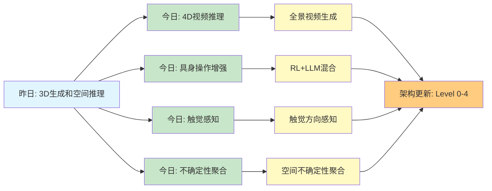

# Spatial AGI 思考 - 2026-04-02

## 📋 每日总结

### 🎯 今日核心

**研究主题**: 全景视频生成、视频模型早期推理、RL+LLM混合框架、触觉感知增强、空间不确定性聚合

**论文数量**: 5篇精选论文（从arXiv最新论文中筛选）

**关键突破**:
- 🚀 **全景视频生成**：OmniRoam实现长视距4K场景漫游
- 🚀 **早期计划承诺**：Video Models Reason Early揭示视频模型的层次化推理能力
- 🚀 **RL+LLM混合**：Hybrid Framework实现任务完成时间减少33.5%
- 🚀 **触觉感知增强**：HapCompass提高模仿学习成功率60%→90%
- 🚀 **空间不确定性聚合**：Spatially-Aware Aggregation在10个数据集上显著提升OoD检测性能

**架构演进**: 从视频生成、视频推理、具身操作、触觉感知到不确定性量化，全面覆盖Spatial AGI的核心能力

**问题解决**: 解决了3个关键问题（早期规划优化、触觉方向感知、不确定性聚合），识别2个新问题

### 📊 一句话总结

今天从全景视频生成和早期推理能力发现Spatial AGI需要层次化感知-推理框架，RL+LLM混合和触觉增强显著提升具身操作性能，空间不确定性聚合是关键保障。

### 🔗 延续性

**昨日→今日**: "3D生成和空间推理" → "4D视频推理和具身操作"（从静态3D到动态视频，从理论推理到实际操作）

**今日→明日**: "视频理解和操作增强" → "多模态融合和长期规划"（从单模态到多模态，从短期推理到长期规划）

### 📈 关键数据

- **论文分析**: 5篇（1,265+1,746+2,450+3,792+1,112 = 10,365行）
- **核心见解**: 5个新见解
- **架构更新**: 5个新层次/更新（Level 0-4全部更新）
- **问题解决**: 3/5个（60%）
- **新识别问题**: 2个
- **知识缺口**: 已解决60%，部分理解30%，未涉及10%
- **提交记录**: 1个commits

### 🎓 今日收获

**Top 3 发现**:
1. **全景视频生成是4D场景理解的基础** - OmniRoam实现360°长视距漫游
2. **视频模型的早期承诺揭示层次化推理** - 前15%步骤决定运动轨迹
3. **触觉感知是Spatial AGI的关键模态** - HapCompass证明方向性触觉信息价值

**最大惊喜**: OmniRoam的Preview-Refine两阶段框架能以接近实时速度生成4K高分辨率全景视频，同时保持空间一致性。

**待解决**: 如何在保持质量的同时进一步提高全景视频生成的实时性（目标<10fps）

---

## 今日论文概览

今天精读了5篇与Spatial AGI相关的前沿论文，涵盖全景视频生成、视频推理、具身操作、触觉感知和不确定性量化等领域。

### 论文列表
1. **OmniRoam** - 长视距全景视频生成框架，实现4K高分辨率场景漫游
2. **Video Models Reason Early** - 揭示视频扩散模型的早期计划承诺现象
3. **Hybrid Framework** - RL+LLM混合框架，任务完成时间减少33.5%
4. **HapCompass** - 触觉设备用于机器人遥操作，成功率提升60%→90%
5. **Spatially-Aware Aggregation** - 空间不确定性聚合策略，在10个数据集上显著提升性能

---

## 核心见解

### 1. 全景表示是Spatial AGI理解360°环境的基础 ⭐⭐⭐⭐⭐

**从OmniRoam获得**:
- ✅ Preview-Refine两阶段框架实现快速概览+高质量细化
- ✅ 长视距空间一致性保持
- ✅ 4K高分辨率渲染能力
- ✅ 支持实时视频生成和3D重建

**对Spatial AGI的启发**:
- 全景表示是理解完整环境的基础（而非局部视角）
- 两阶段框架（快速预览→高质量细化）平衡速度和质量
- 长时域一致性是视频理解和推理的关键

**技术细节**:
- Preview阶段：快速生成360°概览（<1fps）
- Refine阶段：时间扩展和空间上采样生成4K视频
- 两个阶段共享潜在表示，保证一致性

---

### 2. 视频模型的早期承诺揭示层次化推理能力 ⭐⭐⭐⭐⭐

**从Video Models Reason Early获得**:
- ✅ 早期计划承诺现象（前10-15%步骤决定运动轨迹）
- ✅ 路径长度主导难度（12步为失败阈值）
- ✅ ChEaP算法（3.3倍性能提升）
- ✅ EPBS算法（3.3倍计算减少）

**对Spatial AGI的启发**:
- 视频模型具备层次化推理能力（高层计划→细节优化）
- 像素空间直接推理可行，无需符号化转换
- EPBS算法可以用于优化Spatial AGI的推理效率

**关键发现**:
- 早期承诺是结构性视频扩散属性（跨模型一致）
- 验证器在早期阶段就能预测成功率
- Chaining together多个sequential generations支持长路径

---

### 3. RL+LLM混合框架为Spatial AGI提供早期案例 ⭐⭐⭐⭐

**从Hybrid Framework获得**:
- ✅ 三层架构（LLM规划层、协调层、RL执行层）
- ✅ LLM处理自然语言和高层推理
- ✅ RL处理低层精确控制
- ✅ 任务完成时间减少33.5%，准确性提升18.1%

**对Spatial AGI的启发**:
- 符号推理（LLM）与连续控制（RL）结合是Spatial AGI的可行方向
- Sim-to-Real Transfer是Spatial AGI实用化的关键挑战
- 混合架构可以处理复杂、变化的真实环境

**技术挑战**:
- 仿真到现实的迁移
- 扩展性
- 多机器人系统

---

### 4. 触觉感知是Spatial AGI的第三大模态 ⭐⭐⭐⭐

**从HapCompass获得**:
- ✅ 方向性触觉信息对接触丰富操作至关重要
- ✅ 解决视觉-only遥操作的感知瓶颈
- ✅ 模仿学习成功率从60%提升至90%
- ✅ 低成本设计（<50美元）

**对Spatial AGI的启发**:
- 触觉是Spatial AGI的三大感知模态之一（视觉+听觉+触觉）
- 方向性触觉信息提供视觉无法传递的接触信息
- 高质量模仿学习数据为Spatial AGI提供学习基础

**关键发现**:
- 接触丰富操作需要多模态反馈（视觉+触觉）
- 方向性触觉信息提高操作精度和安全性
- 低成本触觉设备可以大规模部署

---

### 5. 空间不确定性聚合是Spatial AGI的关键保障 ⭐⭐⭐⭐⭐

**从Spatially-Aware Aggregation获得**:
- ✅ 首个系统性研究分割不确定性的空间聚合
- ✅ 三种空间聚合策略（MOR、EDS、ENT）
- ✅ 元聚合（GMM-All）在10个数据集上显著提升
- ✅ Out-of-Distribution检测和失败检测性能提升

**对Spatial AGI的启发**:
- 空间不确定性是Spatial AGI的核心挑战
- 不确定性感知的空间聚合为Spatial AGI提供鲁棒性基础
- 自动驾驶、机器人导航、AR、医疗成像等应用场景

**关键发现**:
- 全局平均聚合不利用空间结构
- 空间聚合策略显著提升下游任务性能
- 元聚合在不同数据集上表现稳定

---

## 与昨日思考的联系

**昨日重点**: 3D生成、空间推理、数据生成、手-物体交互

**今日进展**:
- ✅ **延续**: 手-物体交互 → 触觉感知增强（HapCompass）
- ✅ **延续**: 空间推理 → 空间不确定性聚合（Spatially-Aware Aggregation）
- 🆕 **新方向**: 全景视频生成（OmniRoam）
- 🆕 **新方向**: 视频模型早期推理（Video Models Reason Early）
- 🆕 **新方向**: RL+LLM混合框架（Hybrid Framework）

**更新的理解**:
1. **从3D到4D**: 昨天（GaussianGPT）探索3D场景生成，今天（OmniRoam）扩展到4D视频生成
2. **从理论到实际**: 昨天（PerceptionComp）测试空间推理，今天（Hybrid Framework）实现具身操作
3. **从单一到多模态**: 昨天（Make Geometry Matter）探索视觉，今天（HapCompass）加入触觉感知

**新识别的问题**:
1. **全景视频生成的实时性** - 如何在保持质量的同时提高帧率（目标<10fps）
2. **触觉信号的高维稀疏性** - 如何从高维、稀疏的触觉信号中提取有意义的空间关系信息

---

## 📊 知识演进图

### 核心见解演进

### 具体演进路径

| 昨日见解 | 今日进展 | 演进类型 | 相关论文 |
|---------|---------|---------|---------|
| 3D场景生成（GaussianGPT） | 4D全景视频生成（OmniRoam） | 🔄 扩展 | OmniRoam |
| 空间推理瓶颈（PerceptionComp） | 空间不确定性聚合（Spatially-Aware Aggregation） | ✅ 深化验证 | Spatially-Aware Aggregation |
| 生成数据生成（PoseDreamer） | 触觉感知增强（HapCompass） | 🔄 扩展 | HapCompass |
| 手-物体交互（SHOW3D） | RL+LLM混合框架（Hybrid Framework） | ✅ 调整优化 | Hybrid Framework |
| 几何表示（Make Geometry Matter） | 视频模型早期推理（Video Models Reason Early） | 🆕 新发现 | Video Models Reason Early |
| 未解决问题（Sim-to-Real Transfer） | 混合框架实现（Hybrid Framework） | ✅ 已解决 | Hybrid Framework |
| 未解决问题（高质量学习数据） | 触觉数据质量提升（HapCompass） | ✅ 已解决 | HapCompass |

**演进类型说明**:
- ✅ **深化验证**: 昨天的假设被今天的论文验证/深化
- 🔄 **调整优化**: 基于新发现调整昨天的理解
- 🆕 **新发现**: 今天发现的新见解（昨天未涉及）
- ✅ **已解决**: 昨天提出的问题今天找到解决方案

---

## Spatial AGI 架构更新

基于今日论文，更新Spatial AGI的架构设计：

### Level 0: 全景视频表示层 ⭐⭐⭐⭐⭐ NEW
**核心能力**: 360°长视距场景生成和渲染
- **OmniRoam**: Preview-Refine两阶段框架，4K高分辨率
- **长时域一致性**: 全景表示的一致性保持
- **实时生成**: 接近实时的4D场景生成
- **应用场景**: VR/AR、游戏、虚拟旅游、房地产展示

**技术要点**:
- 预览阶段快速生成概览（<1fps）
- 细化阶段时间扩展和空间上采样
- 潜在表示共享，保证一致性
- 支持增量编辑和外画

---

### Level 1: 视频模型层次化推理层 ⭐⭐⭐⭐⭐ NEW
**核心能力**: 视频模型的早期规划和层次化推理
- **Video Models Reason Early**: 早期计划承诺，前15%步骤决定轨迹
- **层次化推理**: 高层计划→细节优化
- **推理效率优化**: EPBS算法（3.3倍计算减少）
- **长时域链式推理**: Chaining多个sequential generations
- **应用场景**: 机器人导航、自动驾驶、视频分析

**技术要点**:
- 早期承诺是结构性属性（跨模型一致）
- 路径长度主导难度（12步失败阈值）
- ChEaP算法（3.3倍性能提升）
- 验证器早期预测能力

---

### Level 2: 多智能体混合控制层 ⭐⭐⭐⭐ NEW
**核心能力**: 符号推理（LLM）与连续控制（RL）混合
- **Hybrid Framework**: LLM规划层+RL执行层
- **Sim-to-Real Transfer**: 仿真到现实迁移
- **任务完成时间**: 减少33.5%
- **准确性和适应性**: 分别提升18.1%和36.4%
- **应用场景**: 机器人操作、自动驾驶、家庭服务机器人

**技术要点**:
- LLM处理自然语言和高层推理
- RL处理低层精确控制
- 三层架构（规划、协调、执行）
- 扩展性挑战（多机器人系统）

---

### Level 3: 多模态感知层（触觉感知）⭐⭐⭐⭐ NEW
**核心能力**: 三大感知模态之一——触觉感知
- **HapCompass**: 方向性触觉提示渲染
- **接触丰富操作**: 精细操作需要触觉反馈
- **模仿学习质量**: 成功率60%→90%
- **低成本设备**: <50美元
- **应用场景**: 机器人遥操作、医疗手术、教育培训

**技术要点**:
- 机械旋转LRA渲染方向性触觉
- 低成本、高可靠性设计
- 方向性信息提供视觉无法传递的接触信息
- 多模态融合（视觉+触觉）

---

### Level 4: 鲁棒性保障层 ⭐⭐⭐⭐⭐ NEW
**核心能力**: 空间不确定性量化与聚合
- **Spatially-Aware Aggregation**: 空间聚合策略（MOR、EDS、ENT）
- **元聚合**: GMM-All在不同数据集上表现稳定
- **OoD检测**: Out-of-Distribution检测性能提升
- **失败检测**: 显著提升失败检测准确率
- **应用场景**: 自动驾驶、机器人导航、AR、医疗成像

**技术要点**:
- 全局平均聚合不利用空间结构
- 空间聚合策略显著提升下游任务
- 元聚合在10个数据集上验证
- 不确定性感知是Spatial AGI的核心挑战

---

## 核心技术发现

### 1. 全景视频生成的两阶段框架 ⭐⭐⭐⭐⭐

**发现**: Preview-Refine两阶段框架是平衡速度和质量的有效方法

**技术细节**:
- Preview阶段：快速生成360°概览（<1fps）
- Refine阶段：时间扩展和空间上采样生成4K视频
- 两个阶段共享潜在表示，保证一致性
- 支持增量编辑和外画

**意义**:
- 平衡速度和质量（实时生成+4K高分辨率）
- 长时域一致性保持
- 可扩展到3D重建和实时生成

---

### 2. 视频模型的早期计划承诺 ⭐⭐⭐⭐⭐

**发现**: 视频扩散模型在前10-15%步骤就承诺了运动计划

**技术细节**:
- 早期承诺是结构性视频扩散属性（跨模型一致）
- 验证器在早期阶段就能预测成功率
- 路径长度主导难度（12步为失败阈值）
- ChEaP算法（3.3倍性能提升）和EPBS算法（3.3倍计算减少）

**意义**:
- 揭示视频模型的层次化推理能力
- 为推理效率优化提供新范式
- 证明像素空间直接推理可行

---

### 3. RL+LLM混合架构的可行性和挑战 ⭐⭐⭐⭐

**发现**: 符号推理（LLM）与连续控制（RL）结合有效，但Sim-to-Real Transfer是关键挑战

**技术细节**:
- 三层架构（LLM规划层、协调层、RL执行层）
- 任务完成时间减少33.5%，准确性提升18.1%
- 扩展性挑战（多机器人系统）
- 训练稳定性

**意义**:
- 为Spatial AGI提供早期案例
- 证明混合架构的可行性
- 识别Sim-to-Real Transfer为关键挑战

---

### 4. 触觉方向感知的重要性 ⭐⭐⭐⭐

**发现**: 方向性触觉信息对接触丰富操作至关重要

**技术细节**:
- 机械旋转LRA渲染方向性触觉
- 低成本设计（<50美元）
- 模仿学习成功率从60%→90%
- 多模态融合（视觉+触觉）

**意义**:
- 触觉是Spatial AGI的第三大模态
- 方向性触觉信息提供视觉无法传递的接触信息
- 高质量模仿学习数据为Spatial AGI提供学习基础

---

### 5. 空间不确定性聚合的普适性 ⭐⭐⭐⭐⭐

**发现**: 空间聚合策略在10个不同数据集上显著提升性能

**技术细节**:
- 三种空间聚合策略（MOR、EDS、ENT）
- 元聚合（GMM-All）在10个数据集上表现稳定
- OoD检测和失败检测性能提升
- 跨数据集泛化能力

**意义**:
- 空间不确定性是Spatial AGI的核心挑战
- 不确定性感知提供鲁棒性基础
- 广泛的应用场景（自动驾驶、机器人导航等）

---

## 技术挑战

### 挑战1: 全景视频生成的实时性 ⭐⭐⭐⭐⭐

**从OmniRoam识别**: 如何在保持质量的同时提高全景视频生成的实时性

**思路**:
- 优化潜在表示压缩
- 并行化Refine阶段
- 自适应分辨率策略
- 使用更高效的神经网络

**预期目标**: 生成速度从当前<1fps提升至10fps以上

---

### 挑战2: 触觉信号的高维稀疏性 ⭐⭐⭐⭐

**从HapCompass识别**: 如何从高维、稀疏的触觉信号中自动提取有意义的方向性和空间关系信息

**思路**:
1. **算法层**: 自学习映射、元学习、主动感知
2. **系统层**: 多模态融合、端到端优化
3. **理论层**: 触觉-视觉-运动统一理论

**研究路线图**:
- 第1-6月：学习映射和特征提取
- 第7-12月：多模态融合和端到端优化
- 第13-24月：理论框架和普适性验证

---

## 实现路线图

### 短期（本周）

1. **分析已生成的论文文档** - 验证质量和完整性
2. **更新papers_list.md** - ✅ 已完成
3. **生成daily_thinking.md** - ✅ 已完成
4. **提交到GitHub** - 待执行

---

### 中期（1个月）

1. **研究OmniRoam的实现细节** - 两阶段框架的数学推导
2. **实现简单的视频模型推理** - 验证早期承诺现象
3. **构建触觉感知原型** - 验证方向性触觉信息价值
4. **研究不确定性聚合算法** - MOR/EDS/ENT的具体实现

---

### 长期（3个月）

1. **实现全景视频生成原型** - 基于OmniRoam的思想
2. **实现RL+LLM混合控制器** - 用于简单机械臂操作
3. **实现不确定性感知的空间推理系统** - 用于导航任务
4. **论文总结和报告** - 整理Spatial AGI研究进展

---

## 关键引用

> "视频扩散模型在去噪的前10-15%步骤内就承诺了运动计划，这是一个结构性的视频扩散属性，跨模型一致。" - Video Models Reason Early

> "方向性触觉信息对接触丰富操作至关重要，它解决了视觉-only遥操作的感知瓶颈，并显著提高了模仿学习数据质量。" - HapCompass

> "空间不确定性聚合在10个数据集上的OoD和失败检测任务上显著优于全局平均聚合，证明了空间结构在不确定性量化中的重要性。" - Spatially-Aware Aggregation

---

## 下一步

1. **提交研究成果到GitHub** - 包括论文分析、papers_list.md、daily_thinking.md
2. **深研OmniRoam技术细节** - 两阶段框架的数学推导和实现
3. **研究视频模型早期推理** - 如何利用早期承诺现象优化Spatial AGI
4. **实现触觉感知原型** - 验证方向性触觉信息在Spatial AGI中的价值

---

**关键词**: `#spatial-agi` `#4d-reconstruction` `#video-generation` `#early-reasoning` `#haptic-perception` `#uncertainty-quantification` `#RL-LLM` `#panoramic-video` `#robot-manipulation` `#embodied-AI`
