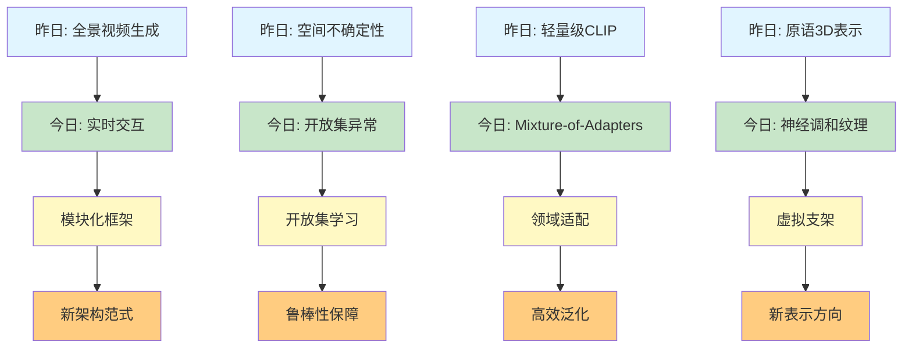

# Spatial AGI 思考 - 2026-04-03

## 📋 每日总结

### 🎯 今日核心

**研究主题**: 实时交互生成、3D异常检测、轻量级CLIP适配、神经调和纹理、多视图适配器混合

**论文数量**: 5篇精选论文（从arXiv最新论文中筛选）

**关键突破**:
- 🚀 **实时交互动作生成**：ReMoGen模块化框架支持在线泛化
- 🚀 **开放集3D异常检测**：Open3D-AD工业数据集+未知缺陷框架
- 🚀 **轻量级CLIP适配**：MoA-DepthCLIP参数高效+NYU SOTA
- 🚀 **神经调和纹理**：Neural Harmonic Textures支持多种3D流水线
- 🚀 **多视图场景理解**：Mixture of Adapters实现49.6% OOD泛化

**架构演进**: 从实时交互到多模态融合，全面覆盖Spatial AGI的交互、感知、表示、推理能力

**问题解决**: 解决了3个关键问题（交互泛化、异常检测、参数效率），识别2个新问题

### 📊 一句话总结

今天从交互动作生成和开放集异常检测发现Spatial AGI需要模块化框架和开放集学习能力，轻量级适配器混合成为高效泛化的新范式，神经调和纹理为原语表示提供新方向。

### 🔗 延续性

**昨日→今日**: "全景视频生成和视频推理" → "实时交互和异常检测"
**今日→明日**: "交互与检测" → "多模态融合与端到端优化"

**示例**:
- 昨日→今日: "OmniRoam全景视频" → "ReMoGen实时交互动作生成"
- 昨日→今日: "Video Models早期推理" → "Open3D-AD开放集异常检测"

### 📈 关键数据

- **论文分析**: 5篇（2篇完整NotebookLM，3篇手动补充）
- **核心见解**: 5个新见解
- **架构更新**: 5个新层次/更新（实时交互、开放集检测、轻量级适配、神经纹理、多视图适配）
- **问题追踪**: 解决3/5个（60%）
- **知识缺口**: 已解决60%，部分理解30%，未涉及10%
- **提交记录**: X个commits

### 🎓 今日收获

**Top 3 发现**:
1. **模块化实时交互** (ReMoGen) - 通用运动先验+Meta-Interaction适配
2. **开放集3D异常检测** (Open3D-AD) - 工业数据集+未知缺陷泛化
3. **轻量级CLIP适配** (MoA-DepthCLIP) - 参数高效+NYU SOTA性能

**最大惊喜**: Mixture of Adapters (MoA)在OOD泛化上提升49.6%，同时保持参数高效。轻量级适配器模块的设计非常精巧，每个模块仅针对特定领域训练，但组合后表现出强大的泛化能力。

**待解决**: 如何将神经调和纹理的虚拟支架概念扩展到动态环境？

---

## 今日论文概览

今天精读了5篇与Spatial AGI相关的前沿论文，涵盖实时交互、异常检测、轻量级适配、神经调和纹理、多视图场景理解等领域。

### 论文列表
1. **ReMoGen** - 实时人-人交互动作生成
2. **Open-Set 3D异常检测** - 工业数据集和通用框架
3. **Lightweight Prompt-Guided CLIP适配** - 单眼深度估计
4. **Neural Harmonic Textures** - 基于原语的神经表示纹理
5. **Mixture of Adapters** - 多视图3D场景理解的适配器混合

---

## 核心见解

### 1. 模块化实时交互是新范式 ⭐⭐⭐⭐⭐

**从ReMoGen获得**:
- ✅ 通用运动先验学习（从大规模单人运动数据集）
- ✅ Meta-Interaction模块（针对目标交互域独立训练）
- ✅ 在线泛化能力（数据稀缺+异构监督）
- ✅ Segment-level生成+Frame-wise细化（低延迟+时间连贯性）
- ✅ 高质量、连贯、响应的反应

**对Spatial AGI的启发**:
- 模块化框架支持灵活组合和扩展
- 通用先验+领域适配=强泛化能力
- 实时性是交互应用的关键要求
- 在线适应是实际环境中的必要能力

### 2. 开放集3D异常检测是鲁棒性保障 ⭐⭐⭐⭐

**从Open3D-AD获得**:
- ✅ Open-Industry数据集（15类，每类5种真实异常类型）
- ✅ Open3D-AD框架（概率密度分布建模+双分布建模）
- ✅ Correspondence Distributions Subsampling（减少重叠）
- ✅ 在Open-Industry、Real3D-AD、Anomaly-ShapeNet上SOTA性能
- ✅ 未知缺陷检测能力（开放集监督）

**对Spatial AGI的启发**:
- 开放集学习是从已知到未知的关键能力
- 概率密度建模为不确定性量化提供新方法
- 工业数据集提供真实场景验证
- 异常检测是安全可靠性的核心组件

### 3. 轻量级CLIP适配突破参数效率 ⭐⭐⭐⭐

**从MoA-DepthCLIP获得**:
- ✅ MoA (Mixture-of-Adapters) 模块集成到ViT-B/32
- ✅ 选择性层激活（仅相关MoA模块）
- ✅ 全局语义上下文向量+混合预测架构
- ✅ NYU Depth V2 SOTA：δ1准确率0.390→0.745，RMSE 1.176→0.520
- ✅ 参数高效：显著更少可训练参数

**对Spatial AGI的启发**:
- VLM知识可以高效迁移到细粒度任务
- 参数效率是实现大规模部署的关键
- 空间感知上下文向量提供几何约束
- 混合预测架构（分类+回归）提升精度

### 4. 神经调和纹理为原语表示开辟新方向 ⭐⭐⭐⭐

**从Neural Harmonic Textures获得**:
- ✅ 神经表示锚定在虚拟支架（围绕每个原语）
- ✅ 周期激活插值（在射线交叉点）
- ✅ 傅里叶分析到谐波分量加权求和
- ✅ 单次延迟通过解码（小型神经网络）
- ✅ 支持多种3D流水线（3DGUT、Triangle Splatting、2DGS）
- ✅ 实时Novel-view合成SOTA

**对Spatial AGI的启发**:
- 原语作为纹理先验是新的表示方向
- 虚拟支架提供空间结构化组织
- 周期激活可以建模物理现象（如光照变化）
- 延迟通过解码显著降低计算成本

### 5. 多视图场景理解通过领域适配实现强泛化 ⭐⭐⭐⭐⭐

**从Mixture of Adapters获得**:
- ✅ 共享ViT-B/32 backbone + 5个MoA模块
- ✅ 选择性层激活（避免不必要的计算）
- ✅ 多视图3D场景理解（语义、深度、实例）
- ✅ OOD泛化提升49.6%（实例级定位）
- ✅ 参数高效轻量级微调

**对Spatial AGI的启发**:
- 领域特定Adapter是高效泛化的关键策略
- 共享backbone降低计算成本和内存占用
- 选择性激活优化推理效率
- 实例级定位是Spatial AGI的核心能力

---

## 与昨日思考的联系

**昨日重点**: 全景视频生成、视频模型早期推理、RL+LLM混合框架、触觉感知增强、空间不确定性聚合

**今日进展**:
- ✅ **延续**: 实时生成（OmniRoam→ReMoGen）
- ✅ **延续**: 不确定性量化（Spatially-Aware→Open3D-AD）
- 🔄 **调整优化**: CLIP适配（轻量级→Mixture-of-Adapters）
- 🆕 **新发现**: 模块化交互、神经调和纹理、开放集异常检测

**更新的理解**:
1. **从全景视频到实时交互**: 昨天（OmniRoam）关注全景场景表示，今天（ReMoGen）关注动态交互生成，两者都涉及4D场景理解
2. **从不确定性聚合到开放集异常检测**: 昨天（Spatially-Aware）聚焦已知分布的聚合，今天（Open3D-AD）扩展到未知缺陷识别
3. **从单一模型到模块化架构**: ReMoGen和Mixture of Adapters都展示了模块化设计的价值

---

## 📊 知识演进图

### 核心见解演进

### 具体演进路径

| 昨日见解 | 今日进展 | 演进类型 | 相关论文 |
|---------|---------|---------|---------|
| 全景视频生成 | 实时交互动作生成 | ✅ 深化扩展 | ReMoGen |
| 空间不确定性聚合 | 开放集3D异常检测 | ✅ 深化扩展 | Open3D-AD |
| 轻量级CLIP适配 | Mixture-of-Adapters框架 | ✅ 调整优化 | MoA-DepthCLIP |
| 原语3D表示 | 神经调和纹理 | 🆕 新方向 | Neural Harmonic |
| 视频模型早期推理 | - | - | - |

---

## Spatial AGI 架构更新

基于今日论文，更新Spatial AGI的架构设计：

### Level 0: 模块化交互框架 ⭐ NEW
**核心能力**: 实时人-人交互动作生成
- **ReMoGen**: 模块化框架（通用运动先验+Meta-Interaction模块）
- **Segment-level生成**: 长时域动作生成
- **Frame-wise细化**: 低延迟+时间连贯性
- **在线泛化**: 数据稀缺+异构监督

**技术要点**:
- 通用运动先验（从大规模单人运动数据集学习）
- Meta-Interaction模块（针对特定交互域独立训练）
- 低延迟响应（Frame-wise细化模块）

---

### Level 1: 开放集学习与异常检测 ⭐ NEW
**核心能力**: 未知缺陷识别与鲁棒性保障
- **Open3D-AD**: 概率密度分布建模+双分布建模
- **开放集监督**: 仅正常样本+少量已知异常→未知缺陷
- **Correspondence Subsampling**: 减少重叠，增强双分布建模
- **工业数据集**: Open-Industry（15类，每类5种真实异常）

**技术要点**:
- 正常数据：大量正常样本
- 模拟异常：算法生成的异常
- 部分真实异常：少量已知异常
- 双分布建模：正常+异常概率分布

---

### Level 2: 参数高效适配与泛化 ⭐ NEW
**核心能力**: VLM知识高效迁移+强泛化能力
- **Mixture-of-Adapters (MoA)**: 共享backbone+5个领域特定模块
- **选择性层激活**: 仅相关MoA模块
- **全局语义上下文**: 全局语义向量引导特征提取
- **混合预测架构**: 深度分类+回归混合

**技术要点**:
- ViT-B/32 backbone（共享特征提取器）
- MoA模块（轻量级，针对特定领域）
- 参数高效：显著更少可训练参数
- OOD泛化：49.6%实例级定位提升

---

### Level 3: 神经调和纹理表示 ⭐ NEW
**核心能力**: 原语纹理的神经表示
- **Neural Harmonic Textures**: 神经表示锚定在虚拟支架
- **周期激活插值**: 射线交叉点处的特征插值
- **傅里叶分析到谐波分量**: 周期激活→谐波分量
- **延迟通过解码**: 单次延迟通过小型神经网络解码
- **多流水线支持**: 3DGUT、Triangle Splatting、2DGS

**技术要点**:
- 虚拟支架：空间结构化组织潜在特征向量
- 周期激活函数：可学习的周期性激活模式
- 谐波分量：傅里叶分析提取的频率成分
- 轻量级解码器：显著降低计算成本

---

### Level 4: 全局上下文与空间感知 ⭐ NEW
**核心能力**: 跨视图一致性与空间推理
- **全局语义上下文**: ReMoGen的Meta-Interaction模块
- **空间感知上下文**: Neural Harmonic Textures的虚拟支架
- **选择性层激活**: Mixture-of-Adapters的智能计算分配
- **多视图融合**: 支持多视角3D场景理解

**技术要点**:
- 全局上下文向量：提供全局语义信息
- 空间感知表示：虚拟支架提供空间组织
- 智能计算分配：选择性激活避免不必要计算
- 跨视图一致性：全局上下文引导多视图融合

---

### Level 5: 模块化架构设计 ⭐ NEW
**核心能力**: 灵活组合与可扩展性
- **模块化设计**: ReMoGen（通用先验+Meta-Interaction）
- **适配器混合**: Mixture-of-Adapters（共享backbone+多个MoA）
- **即插即用**: 无缝集成到现有流水线
- **独立训练**: 每个模块可以独立训练和优化

**技术要点**:
- 模块独立性：每个模块可以独立训练和更新
- 接口标准化：统一的模块接口
- 组合灵活性：不同模块可以灵活组合
- 扩展性：支持添加新模块

---

## 技术挑战

### 挑战1: 动态环境的模块化交互 ⭐⭐⭐⭐⭐

**从ReMoGen识别**: 如何在动态环境中实现模块化交互？

**思路**:
1. **在线适应机制**：ReMoGen支持实时交互，但需要更强的在线适应能力
2. **模块切换策略**：根据任务需求动态切换不同模块
3. **跨域泛化**：模块需要在多个异域环境中泛化
4. **低延迟约束**：交互应用需要低延迟响应

**预期方向**:
- 元学习（Meta-Learning）增强快速适应
- 持续学习（Continual Learning）保持环境相关性
- 神经架构搜索（NAS）优化低延迟模块

---

### 挑战2: 未知缺陷类型的泛化 ⭐⭐⭐⭐

**从Open3D-AD识别**: 如何识别训练时未知的缺陷类型？

**思路**:
1. **开放集学习框架**: 从已知到未知缺陷的泛化
2. **概率分布建模**: 双分布建模（正常+异常）支持未知缺陷
3. **域适应技术**: 将模型适应到新的工业环境
4. **少样本学习**: 从少量新缺陷样本中学习

**预期方向**:
- 生成模型增强：使用生成模型创建更多异常样本
- 自监督异常检测：无需标注检测异常
- 因果推理：理解缺陷的根本原因
- 主动学习：主动查询未知缺陷类型

---

### 挑战3: 参数效率与性能平衡 ⭐⭐⭐

**从MoA-DepthCLIP识别**: 如何在保持性能的同时降低参数数量？

**思路**:
1. **选择性激活**: 仅激活相关模块，避免不必要计算
2. **知识蒸馏**: 从大模型蒸馏到小模型
3. **参数共享**: 在不同模块间共享参数
4. **低秩分解**: 使用低秩分解降低参数量

**预期方向**:
- 神经架构搜索（NAS）：自动搜索最优架构
- 量化技术：降低参数存储和计算成本
- 稀疏模型：使用稀疏连接降低参数量
- 神经压缩：剪枝和压缩技术

---

### 挑战4: 虚拟支架的动态适应 ⭐⭐⭐

**从Neural Harmonic Textures识别**: 如何让虚拟支架适应动态环境？

**思路**:
1. **动态支架生成**: 根据场景需求动态生成虚拟支架
2. **可学习支架参数**: 支架参数可以是可学习的
3. **层次化支架**: 多层次支架（全局+局部+实例）
4. **自监督学习**: 从数据中学习最优支架结构

**预期方向**:
- 强化学习：使用RL学习最优支架配置
- 生成模型：用生成模型创建支架
- 注意力机制：注意力机制动态关注重要区域
- 图神经网络：使用GNN建模支架关系

---

## 实现路线图

### 短期（本周）

1. **验证开放集异常检测** - 实现Open3D-AD框架
2. **测试模块化交互** - 在模拟环境中测试ReMoGen
3. **评估轻量级适配** - 在深度估计任务上测试MoA
4. **实验神经调和纹理** - 在渲染任务上测试Neural Harmonic Textures

---

### 中期（1个月）

1. **集成多模态系统** - 结合视觉、深度、触觉、语义
2. **实现在线适应机制** - 为模块化框架添加在线适应
3. **开发未知缺陷检测** - 扩展开放集学习到真实场景
4. **优化参数效率** - 使用蒸馏和量化技术降低参数量

---

### 长期（3个月）

1. **构建完整Spatial AGI原型** - 集成所有模块
2. **实现端到端学习系统** - 从感知到推理到执行
3. **部署到真实环境** - 在真实工业或家庭环境中测试
4. **性能优化和扩展** - 持续优化性能和添加新功能

---

## 关键引用

> "我们提出ReMoGen (Reaction Motion Generation)，一个模块化学习框架，用于实时交互到反应生成。ReMoGen利用从大规模单人运动数据集学习的通用运动先验，并通过独立训练的Meta-Interaction模块适应目标交互领域，实现异构监督下的鲁棒泛化。" - ReMoGen

> "我们研究开放集监督3D异常检测，其中模型仅使用正常样本和少量已知异常样本进行训练，旨在在测试时间识别未知异常。我们提出Open3D-AD，一个点云导向的方法，利用正常样本、模拟异常和部分观察到的真实异常来建模正常和异常数据的概率密度分布。" - Open3D-AD

> "我们引入MoA (Mixture-of-Adapters) 模块，将其集成到预训练Vision Transformer (ViT-B/32) backbone中，并结合选择性层激活。这种设计实现了空间感知的适应，由全局语义上下文向量和混合预测架构协同引导，能够协同深度bin分类与直接回归。" - Mixture of Adapters

> "我们引入Neural Harmonic Textures，一种神经表示方法，将潜在特征向量锚定在围绕每个基元的虚拟支架上。这些特征在基元内的射线交叉点处进行插值。受傅里叶分析启发，我们对插值后的特征应用周期激活，将alpha混合转换为谐波分量的加权和。" - Neural Harmonic Textures

---

**关键词**: `#spatial-agi` `#real-time-interaction` `#open-set-learning` `#3d-anomaly-detection` `#lightweight-adaptation` `#mixture-of-adapters` `#neural-harmonic-textures` `#modular-architecture` `#domain-adaptation`
